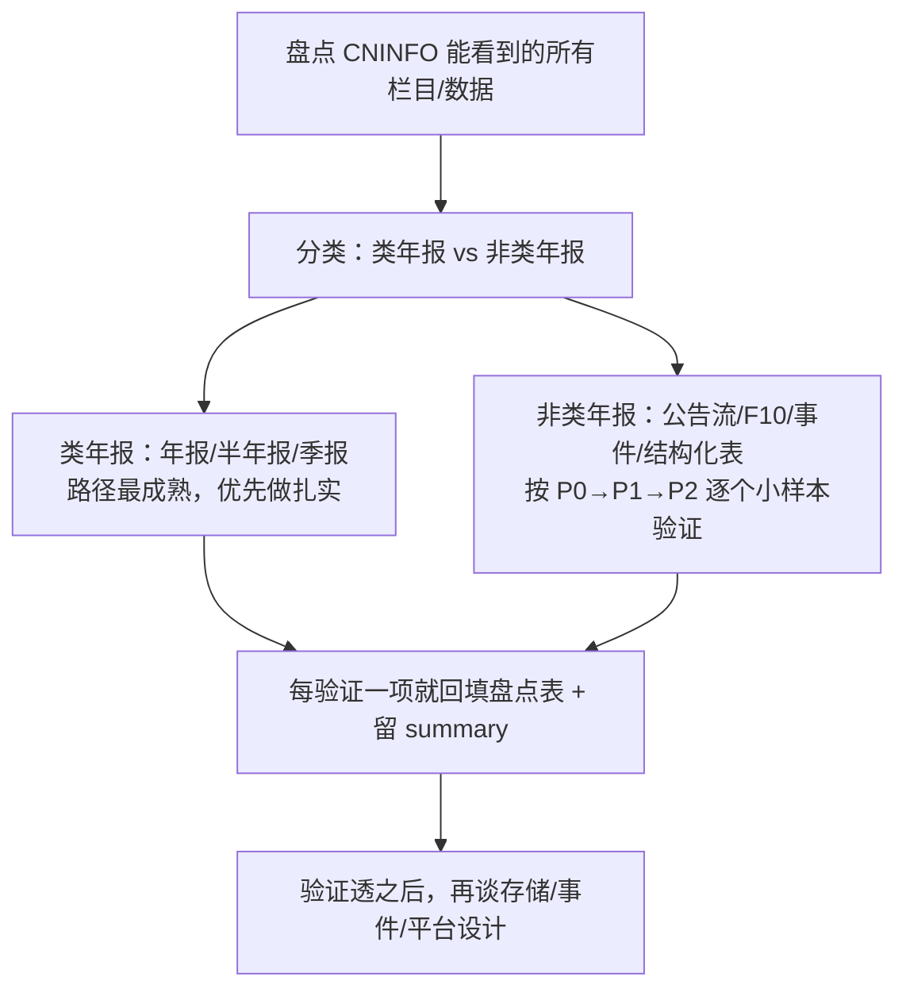

# 当前进展：CNINFO 数据源能力研究（类年报优先）

_最后更新：2026-07-02_

> **本文件说明「现在具体在做什么」。** 仓库整体导航见 [PROJECT_MAP.md](PROJECT_MAP.md)；产品大方向见 [ROADMAP.md](ROADMAP.md)；已完成成果见 [CHANGELOG.md](CHANGELOG.md)。

---

## 当前阶段（一句话）

系统盘点**巨潮资讯网（CNINFO）到底能稳定拿到哪些数据**：先把「类年报（定期报告：年报 / 半年报 / 季报）」这条最成熟的路径做扎实，再按优先级逐个研究其他数据。

---

## 为什么把方向收回到这里

上一阶段的文档一度把重心放在「动态平台架构设计 + PostgreSQL / MinIO / MongoDB 三层存储」。但那是在**数据源本身还没验证透之前，就先去设计数据库**，属于超前，也让项目显得发散。

所以现在**把轨道拉回到最前置、最该先回答的问题**：CNINFO 各栏目的数据，到底哪些能稳定、可追溯地拿到？拿不到的卡在哪？只有把这层摸清楚，后面的存储/事件/平台设计才有依据。

工作逻辑：**盘点 → 分类 → 先啃类年报 → 再逐个研究其他栏目。**

---

## 现在已有（基础）

| 项目 | 现状 |
|---|---|
| 盘点主表 | [plans/cninfo_data_source_value_inventory.md](plans/cninfo_data_source_value_inventory.md)：CNINFO 栏目盘点 + 数据类型分类 + P0/P1/P2 优先级 + 验证记录模板 |
| P0 小样本验证 | 最新公告、公告 PDF 元数据、个股 F10 已完成（Issue #81–#84），结论为部分可用（`testing / partial`） |
| 类年报验证 | 年报 / 半年报 / 季报检索机制已跑通（`lab/validate_cninfo_report_announcements.py`），并能从标题解析 `report_period` |
| 历史底座（冻结） | 2024 全市场年报抽取 + SQLite 入库已完成，作为背景保留，当前不再推进（详见 [PROJECT_MAP.md](PROJECT_MAP.md) Era B） |

---

## 当前正在做

- 以 [plans/cninfo_data_source_value_inventory.md](plans/cninfo_data_source_value_inventory.md) 为**唯一事实来源**，把每个 CNINFO 栏目的验证结论回填到状态列。
- 把「类年报」做扎实：年报 / 半年报 / 季报检索已通，字段可得性统计口径已修正（只计非空且非 `unknown`）。
- 逐项记录字段可得性、成功率、失败原因，产物统一放 `outputs/validation/`。

---

## 下一步准备怎么做

| 步骤 | 内容 |
|---|---|
| 1 | 类年报扩展：把同样「定期 + 标题稳定 + 有 PDF」的类型（如业绩预告 / 业绩快报）纳入同一检索机制验证 |
| 2 | 非类年报逐项：按盘点表 P0 → P1 → P2，对公告流 / F10 / 风险 / 分红 / 股东等栏目做小样本验证 |
| 3 | 每验证完一个栏目：更新盘点表状态 + 留 summary，明确 `candidate`/`testing`/`partial` |
| 4 | 全部摸清后，再回头谈存储结构与事件表设计（当前暂缓） |

---

## 当前不做什么

- **不**接 PostgreSQL / MinIO / MongoDB；验证结果只作为未来设计依据。
- **不**继续推进「动态平台架构 / 三层存储」详细设计（[plans/storage_schema_design_plan.md](plans/storage_schema_design_plan.md)、[plans/dynamic_data_platform_plan.md](plans/dynamic_data_platform_plan.md) **暂缓**，保留作参考）。
- **不**改动 Era A（通用采集框架）/ Era B（2024 年报底座）的代码。
- **不**做大规模抓取；**不**绕过登录 / 验证码 / 付费 / 权限；请求之间 sleep。
- **不**把未验证栏目写成「长期稳定可用」；`recommended_status` 不写 `verified`。

### 三条关键边界

1. **先验证数据源，再设计数据库。** 存储/事件/平台设计在数据源验证透之前一律暂缓。
2. **数据源逐项走「候选 → 小样本验证 → 部分可用/已验证」。** 未验证不写「长期稳定可用」。
3. **当前只在 Era C 范围内改动**（见 [PROJECT_MAP.md](PROJECT_MAP.md)），不碰冻结的两代代码。

---

## 老师可以看哪里

| 想了解 | 看这里 |
|---|---|
| 仓库整体结构、每个文件属于哪条线 | [PROJECT_MAP.md](PROJECT_MAP.md) |
| 现在具体在做什么、下一步 | 本文件 |
| CNINFO 栏目盘点与分类、优先级 | [plans/cninfo_data_source_value_inventory.md](plans/cninfo_data_source_value_inventory.md) |
| CNINFO 验证的实际产物 | [outputs/validation/](outputs/validation/) |
| 产品大方向、分几个阶段 | [ROADMAP.md](ROADMAP.md) |
| 已经完成了什么 | [CHANGELOG.md](CHANGELOG.md) |
| 2024 年报底座质量详情（历史，冻结） | [stage3_quality_followup_summary.md](outputs/generalization/full_market_2024/stage3_quality_followup_summary.md) |

---

## 本阶段完成标准

- CNINFO 主要栏目（至少全部 P0 + 类年报）都有小样本验证记录：字段可得性、成功率、失败原因、`recommended_status`。
- 盘点表 [cninfo_data_source_value_inventory.md](plans/cninfo_data_source_value_inventory.md) 状态列更新到最新。
- 不改动冻结的两代代码，不接任何数据库。

---

## 术语表

| 术语 | 含义 |
|---|---|
| CNINFO | 巨潮资讯网，A 股法定信息披露来源 |
| 类年报 / 定期报告 | 年报 / 半年报 / 季报等定期披露、标题模式稳定、带 PDF 的文档 |
| P0 / P1 / P2 | 验证优先级（见盘点表第 9 节） |
| `recommended_status` | 数据源验证结论：`candidate` / `testing` / `partial` / `verified`（当前不写 `verified`） |
| `report_period` | 报告期，如 `2024`、`2025H1`、`2025Q1` |
| Era A / B / C | 仓库三代方向（见 [PROJECT_MAP.md](PROJECT_MAP.md)）：通用采集框架 / 2024 年报底座 / CNINFO 能力研究 |
| `full_market_2024` | 2024 年全 A 股年报抽取运行（Era B，冻结） |
| `Playwright` | 浏览器自动化框架，用于 JS 渲染页面 |
| `SQLite` / `PostgreSQL` / `MinIO` / `MongoDB` | 数据库/存储候选，当前均不接入 |

---

## 附录：2024 数据底座关键数字（Era B 历史，冻结）

点击展开：full_market_2024 指标（历史记录，当前不再推进）

### 非金融公司（工业类 11 字段）

| 指标 | 数值 |
|---|---:|
| 严格审计 `usable`（核心指标） | 9.43 / 11 |
| 自动合理性分数 | 10.67 / 11 |
| `rnd_investment` 找到率 | 94.2% |

### 抽取规模

| 指标 | 数值 |
|---|---:|
| 公司全集 | 6124 |
| 成功抽取 | 5707 |
| 未找到公告 | 417 |
| 技术错误 | 0 |
| `SQLite` 字段记录 | 62,890 |

> 以上为历史底座数字，作为背景保留。当前阶段聚焦 CNINFO 数据源能力研究，不再更新这些指标。

