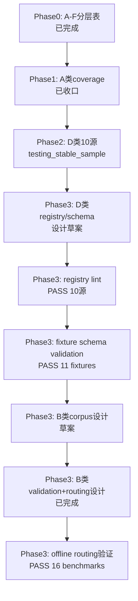

# 当前进展：CNINFO 数据源 A–F 分层验证（Phase 1 已收口 · Phase 2 已收口）

_最后更新：2026-07-09_

> **本文件说明「现在具体在做什么」。** 仓库整体导航见 [PROJECT_MAP.md](PROJECT_MAP.md)；**A–F 分层与验证口径权威文档**见 [plans/cninfo_data_source_layered_inventory.md](plans/cninfo_data_source_layered_inventory.md)；产品大方向见 [ROADMAP.md](ROADMAP.md)。

---

## 当前阶段（一句话）

**Era C Phase 1（A 类）已收口**。**Phase 2 D 类已收口**。**Phase 3 B 类** corpus + live metadata v1 已打通。**Phase 4 C 类** **863 snapshot 已生成**；**状态 `SNAPSHOT_GENERATED_QA_REVIEW`**；**Phase 3 batch 500 harvest dry-run 已执行**（**500** 家 · **3500** HTTP · gate **PASS**）；**Phase 3 approval flag 扩展已完成**（`--approve-phase3-batch-500-harvest` · test **10/10 PASS**）；**Live approval plan 已完成**（gate **`READY_FOR_APPROVAL`**）；**Live harvest 未执行**；**显式批准仍待用户**；**Snapshot 未启动**；**C-class 未整体完成**；**下一步：等待用户显式批准 Phase 3 batch 500 live harvest**；**无 verified**；**不入库**。

---

## Phase 1 A 类收口摘要

| 项 | 结果 |
|----|------|
| P1 effective coverage | **749/796 = 94.10%** |
| 二轮 audit found pass | **97.5%** |
| **recommended_status** | **testing / usable candidate** |
| 完整总结 | [cninfo_report_phase1_final_summary.md](outputs/validation/cninfo_report_phase1_final_summary.md) |
| Later improvement | BSE residual — 不阻塞 Phase 2 |

---

## Phase 3 D 类设计（已收口）

| 项 | 状态 |
|----|------|
| Source Registry 设计 | [cninfo_d_class_source_registry_design.md](plans/cninfo_d_class_source_registry_design.md) |
| Schema Draft | [cninfo_d_class_schema_draft.md](plans/cninfo_d_class_schema_draft.md) |
| Ingestion Status Model | [cninfo_d_class_ingestion_status_model.md](plans/cninfo_d_class_ingestion_status_model.md) |
| **Source → Schema 映射审查** | [cninfo_d_class_source_to_schema_mapping_review.md](plans/cninfo_d_class_source_to_schema_mapping_review.md) |
| **Registry YAML draft** | [config/cninfo_d_class_source_registry_draft.yaml](config/cninfo_d_class_source_registry_draft.yaml) · [notes](plans/cninfo_d_class_source_registry_draft_notes.md) |
| **JSON Schema draft** | [schemas/d_class/](schemas/d_class/) · [notes](plans/cninfo_d_class_json_schema_draft_notes.md) |
| **Registry lint 设计** | [cninfo_d_class_registry_lint_design.md](plans/cninfo_d_class_registry_lint_design.md) · 脚本草案 `lab/lint_cninfo_d_class_registry.py`（23 规则 R001–R023） |
| **Schema validation plan** | [cninfo_d_class_schema_validation_plan.md](plans/cninfo_d_class_schema_validation_plan.md) |
| **Fixtures + mapper + validation v1** | `fixtures/d_class/`（11）· `lab/cninfo_d_class_mappers.py` · `lab/validate_cninfo_d_class_schema.py` · [summary](outputs/validation/cninfo_d_class_schema_validation_summary.md) |
| 性质 | **设计草案**；不入库、不写 migration、不写 verified |

---

## Phase 3 B 类 Corpus 设计（进行中）

| 项 | 状态 |
|----|------|
| **Corpus 设计** | [cninfo_b_class_corpus_design.md](plans/cninfo_b_class_corpus_design.md) |
| **Document Model** | [cninfo_b_class_document_model_draft.md](plans/cninfo_b_class_document_model_draft.md) |
| **B vs D 边界** | [cninfo_b_vs_d_class_boundary.md](plans/cninfo_b_vs_d_class_boundary.md) |
| **Source Registry 设计** | [cninfo_b_class_source_registry_design.md](plans/cninfo_b_class_source_registry_design.md) |
| **Registry YAML draft** | [config/cninfo_b_class_source_registry_draft.yaml](config/cninfo_b_class_source_registry_draft.yaml) · [notes](plans/cninfo_b_class_source_registry_draft_notes.md) |
| **Validation 设计** | [cninfo_b_class_validation_design.md](plans/cninfo_b_class_validation_design.md) |
| **Category routing** | [cninfo_b_class_category_routing_rules.md](plans/cninfo_b_class_category_routing_rules.md) · [cninfo_announcement_categories.yaml](config/cninfo_announcement_categories.yaml) |
| **Routing validation** | `lab/validate_cninfo_b_class_category_routing.py` · [routing summary](outputs/validation/cninfo_b_class_category_routing_summary.md)（16 benchmark PASS） |
| **Document seed** | `lab/seed_cninfo_b_class_document_fixtures.py` · [fixtures](fixtures/b_class/document/periodic_report_document_fixtures.jsonl)（20 条 metadata）· [seed summary](outputs/validation/cninfo_b_class_document_seed_summary.md) |
| **JSON Schema** | [schemas/b_class/](schemas/b_class/)（8 逻辑表 draft-07）· [notes](plans/cninfo_b_class_json_schema_draft_notes.md) |
| **Schema validation** | `lab/validate_cninfo_b_class_document_schema.py` · [summary](outputs/validation/cninfo_b_class_document_schema_validation_summary.md)（20/20 PASS） |
| **Raw file seed** | `lab/seed_cninfo_b_class_raw_file_fixtures.py` · [fixtures](fixtures/b_class/raw_file/periodic_report_raw_file_fixtures.jsonl)（20 条） |
| **Raw file validation** | `lab/validate_cninfo_b_class_raw_file_schema.py` · [summary](outputs/validation/cninfo_b_class_raw_file_schema_validation_summary.md)（20/20 PASS） |
| **Parser / chunker plan** | [parser plan](plans/cninfo_b_class_parser_chunker_plan.md) · [chunking](plans/cninfo_b_class_chunking_strategy.md) · [parse quality](plans/cninfo_b_class_parse_quality_model.md) |
| **Non-periodic seed** | `lab/seed_cninfo_b_class_non_periodic_document_fixtures.py` · [fixtures](fixtures/b_class/document/non_periodic_document_fixtures.jsonl)（13 条）· [summary](outputs/validation/cninfo_b_class_non_periodic_document_schema_validation_summary.md) |
| **Parse run dry-run** | `lab/seed_cninfo_b_class_parse_run_dry_run_fixtures.py` · [fixtures](fixtures/b_class/parse_run/document_parse_run_dry_run_fixtures.jsonl)（33 条）· [summary](outputs/validation/cninfo_b_class_parse_run_schema_validation_summary.md) |
| **Registry lint** | `lab/lint_cninfo_b_class_registry.py` · [design](plans/cninfo_b_class_registry_lint_design.md) · [summary](outputs/validation/cninfo_b_class_registry_lint_summary.md)（23 rules PASS） |
| **Retrieval validation 设计** | [corpus design](plans/cninfo_b_class_corpus_retrieval_validation_design.md) · [dry-run summary](outputs/validation/cninfo_b_class_corpus_retrieval_dry_run_summary.md) · [live summary](outputs/validation/cninfo_b_class_corpus_retrieval_live_summary.md) · [intake template](plans/cninfo_b_class_ready_case_intake_template.md) · [review checklist](plans/cninfo_b_class_ready_case_review_checklist.md) |
| **Retrieval ready + live v1** | **5** ready（4 known-document + 1 guard）；live **5/5 pass**（`LIVE_PASS`）；`query_executed=5` |
| **Guard audit** | `periodic_guard_002` **ready**；2025-03-27~2025-04-02；29 条摘要未误入 `periodic_report` |
| 性质 | 仅 metadata retrieval；**PDF 未下载/解析**；**未写 verified**；18 条 placeholder 未请求 |

---

## Phase 4 C 类 F10 / Company Profile（设计启动）

| 项 | 状态 |
|----|------|
| **Source discovery 设计** | [cninfo_c_class_f10_source_discovery_design.md](plans/cninfo_c_class_f10_source_discovery_design.md) |
| **Profile data model** | [cninfo_c_class_profile_data_model_draft.md](plans/cninfo_c_class_profile_data_model_draft.md) |
| **C / B / D 边界** | [cninfo_c_vs_b_vs_d_boundary.md](plans/cninfo_c_vs_b_vs_d_boundary.md) |
| **Candidate YAML** | [config/cninfo_c_class_source_candidates.yaml](config/cninfo_c_class_source_candidates.yaml)（**P1 + P2-A backfill v1**：**6** 源 `testing` + endpoint；**4** 源仍 `candidate`） |
| **JSON Schema** | [schemas/c_class/](schemas/c_class/)（**7** 逻辑表 draft-07，含 `c_company_security_profile`）· [notes](plans/cninfo_c_class_json_schema_draft_notes.md) |
| **Registry lint** | [design](plans/cninfo_c_class_registry_lint_design.md) · `lab/lint_cninfo_c_class_registry.py` · [summary](outputs/validation/cninfo_c_class_registry_lint_summary.md)（**14 rules PASS**） |
| **Live validation v1** | `lab/validate_cninfo_c_class_live_sources.py` · [summary](outputs/validation/cninfo_c_class_live_source_validation_summary.md)（**LIVE_PASS**） |
| **Basic profile mapper** | `lab/cninfo_c_class_mappers.py` · `lab/seed_cninfo_c_class_basic_profile_fixtures.py` · [mapper summary](outputs/validation/cninfo_c_class_basic_profile_mapper_summary.md) · [schema validation](outputs/validation/cninfo_c_class_basic_profile_schema_validation_summary.md)（**2/2 PASS**） |
| **Security profile mapper** | `map_company_security_profile()` · `lab/seed_cninfo_c_class_security_profile_fixtures.py` · [mapper summary](outputs/validation/cninfo_c_class_security_profile_mapper_summary.md) · [schema validation](outputs/validation/cninfo_c_class_security_profile_schema_validation_summary.md)（**3/3 PASS**） |
| **Executive profile mapper** | `map_company_executive_profile()` · `lab/seed_cninfo_c_class_executive_profile_fixtures.py` · [mapper summary](outputs/validation/cninfo_c_class_executive_profile_mapper_summary.md) · [schema validation](outputs/validation/cninfo_c_class_executive_profile_schema_validation_summary.md)（**6/6 PASS**） |
| **Share capital profile mapper** | `map_company_share_capital_profile()` · `lab/seed_cninfo_c_class_share_capital_profile_fixtures.py` · [mapper summary](outputs/validation/cninfo_c_class_share_capital_profile_mapper_summary.md) · [schema validation](outputs/validation/cninfo_c_class_share_capital_profile_schema_validation_summary.md)（**6/6 PASS**） |
| **Shareholder profile mapper** | `map_company_shareholder_profile()` · `lab/seed_cninfo_c_class_shareholder_profile_fixtures.py` · [mapper summary](outputs/validation/cninfo_c_class_shareholder_profile_mapper_summary.md) · [schema validation](outputs/validation/cninfo_c_class_shareholder_profile_schema_validation_summary.md)（**12/12 PASS**） |
| **P2-A mapper completion** | [cninfo_c_class_p2a_mapper_completion_summary.md](plans/cninfo_c_class_p2a_mapper_completion_summary.md) — P2-A 四源链路收口（testing / prototype） |
| **C-class status consolidation** | [cninfo_c_class_status_consolidation_summary.md](plans/cninfo_c_class_status_consolidation_summary.md) — 10 源总表（**6 testing · 4 candidate**） |
| **P2-B probe** | [P2-B plan](plans/cninfo_c_class_p2b_probe_plan.md) · [probe records](fixtures/c_class/probe/records/c_class_p2b_probe_records.yaml) · [source decision table](plans/cninfo_c_class_p2b_source_decision_table.md)（discovery **closed**） |
| **30 smoke（active）** | `lab/validate_cninfo_c_class_scale_smoke.py` · [active sample](lab/eval_companies_c_class_smoke_30_active.yaml) · [active summary](outputs/validation/cninfo_c_class_scale_smoke_30_active_summary.md)（**LIVE_PARTIAL** · pass=177 · blocked/429=0） |
| **200 smoke 计划** | [cninfo_c_class_scale_smoke_200_plan.md](plans/cninfo_c_class_scale_smoke_200_plan.md)（计划 only · 不直接跑 live） |
| **200 active 样本 + dry-run** | [eval_companies_c_class_smoke_200_active.yaml](lab/eval_companies_c_class_smoke_200_active.yaml)（**195** 家）· [dry-run summary](outputs/validation/cninfo_c_class_scale_smoke_200_active_summary.md) |
| **1000-like non-BSE live + diagnosis** | [candidate](lab/eval_companies_c_class_smoke_1000_non_bse_candidate.yaml)（**889**）· [live report](outputs/validation/cninfo_c_class_smoke_1000_non_bse_live_report.csv) · [diagnosis](outputs/validation/cninfo_c_class_smoke_1000_non_bse_diagnosis.md) |
| **Targeted retry live** | [partial 62](lab/eval_companies_c_class_retry_889_partial_fail_retry.yaml) · [live summary](outputs/validation/cninfo_c_class_retry_889_partial_fail_live_summary.md) · **LIVE_PARTIAL**（pass=300 fail=72） |
| **Source status decision** | [cninfo_c_class_source_status_decision.md](plans/cninfo_c_class_source_status_decision.md) |
| **Stable 200 non-BSE** | [sample](lab/eval_companies_c_class_stable_200_non_bse.yaml) · [live summary](outputs/validation/cninfo_c_class_stable_200_live_summary.md) · [diagnosis](outputs/validation/cninfo_c_class_stable_200_diagnosis.md)（**LIVE_PARTIAL**） |
| **Universe split（195）** | [split plan](plans/cninfo_c_class_universe_split_and_sample_cleaning_plan.md) · non-BSE **172** · BSE-920 **12** · legacy **8** · abnormal **3** |
| **30 smoke（含退市样本）** | [30 summary](outputs/validation/cninfo_c_class_scale_smoke_30_summary.md)（`LIVE_PARTIAL` · 退市拖累） |
| **P2 DevTools probe** | [P2 plan](plans/cninfo_c_class_p2_probe_plan.md) · [P2 probe records](fixtures/c_class/probe/records/c_class_p2_probe_records.yaml)（**12/12**） · [P2-A backfill decision](plans/cninfo_c_class_p2a_yaml_backfill_decision.md) · [P2-A live validation](outputs/validation/cninfo_c_class_p2a_live_source_validation_summary.md)（**LIVE_PASS 12/12**） |
| **Known-company fixtures** | [fixtures/c_class/known_company_profile_fixtures.jsonl](fixtures/c_class/known_company_profile_fixtures.jsonl)（**12** 条；600000 / 300001 / 688001） |
| **Schema validation** | `lab/validate_cninfo_c_class_profile_schema.py` · [summary](outputs/validation/cninfo_c_class_profile_schema_validation_summary.md)（**12/12 PASS**） |
| **DevTools probe plan** | [probe plan](plans/cninfo_c_class_devtools_probe_plan.md) · [checklist](plans/cninfo_c_class_probe_checklist.md) · [record template](fixtures/c_class/probe/c_class_probe_record_template.yaml) |
| **P1 probe records** | [c_class_p1_probe_records.yaml](fixtures/c_class/probe/records/c_class_p1_probe_records.yaml)（**9** 条 · basic+security 已填 · industry observed）· [P1 execution notes](plans/cninfo_c_class_p1_probe_execution_notes.md) |
| **P1 probe review** | [probe review](plans/cninfo_c_class_p1_probe_review.md) · [YAML backfill decision](plans/cninfo_c_class_p1_yaml_backfill_decision.md) · [field mapping draft](plans/cninfo_c_class_basic_profile_field_mapping_draft.md) |
| **既有 P0 参考** | `lab/validate_cninfo_f10_company_profile.py`（本阶段不扩跑） |
| **863 full harvest** | `lab/harvest_cninfo_c_class.py` · [full summary](outputs/validation/cninfo_c_class_harvest_full_summary.md) · **PASS_WITH_RESUME**（863 · 6041/8630） |
| **Harvest 离线 QA** | `lab/review_cninfo_c_class_full_harvest_qa.py` · [qa review](outputs/validation/cninfo_c_class_full_harvest_qa_review.md) · **PASS_WITH_CAVEAT** |
| **QA flag triage** | `lab/triage_cninfo_c_class_full_harvest_qa_flags.py` · [triage](outputs/validation/cninfo_c_class_full_harvest_qa_flag_triage.md) · **PASS_WITH_CAVEAT_REVIEW_QUEUE_READY** |
| **dividend parser patch** | `lab/cninfo_c_class_mappers.py` · `parse_dividend_f007v()` · fixture **10/10 PASS** |
| **dividend 离线 re-map** | `lab/remap_cninfo_c_class_dividend_history_offline.py` · [remap summary](outputs/validation/cninfo_c_class_dividend_history_remap_summary.md) · needs_review **80→12** |
| **Open issues & closure** | [cninfo_c_class_open_issues_closure_plan.md](plans/cninfo_c_class_open_issues_closure_plan.md) · **HARVEST_COMPLETED_QA_ONGOING** · **9 open issues** |
| **QA queue closure plan** | [cninfo_c_class_qa_review_queue_closure_plan.md](plans/cninfo_c_class_qa_review_queue_closure_plan.md) · [closure CSV](outputs/validation/cninfo_c_class_qa_review_queue_closure_plan.csv)（**72** flags · P0=6 / P1=12 / P2=54） |
| **QA queue closure classification** | [closure summary](outputs/validation/cninfo_c_class_qa_review_queue_closure_summary.md) · [classification CSV](outputs/validation/cninfo_c_class_qa_review_queue_closure_classification.csv) · **gate PASS**（accepted=60 · manual=10 · follow-up=2） |
| **review_later 复判** | [reclassification report](outputs/validation/cninfo_c_class_review_later_field_reclassification.md) · [CSV](outputs/validation/cninfo_c_class_review_later_field_reclassification.csv)（**31** 字段 · promote=10 · keep=13） |
| **review_later promotion plan** | [promotion plan](outputs/validation/cninfo_c_class_review_later_promotion_plan.md) · [CSV](outputs/validation/cninfo_c_class_review_later_promotion_plan.csv)（**10** candidates · ready=9 · mapper_patch=1） |
| **promotion candidate approval** | [approval summary](outputs/validation/cninfo_c_class_review_later_promotion_candidate_approval.md) · [CSV](outputs/validation/cninfo_c_class_review_later_promotion_candidate_approval.csv) · **gate PASS**（**9** approved_as_candidate） |
| **Field & Quality Consolidation Batch** | [batch summary](outputs/validation/cninfo_c_class_field_quality_consolidation_batch_summary.md) · [establishment_date remap](outputs/validation/cninfo_c_class_establishment_date_remap_summary.md) · [after-patch approval](outputs/validation/cninfo_c_class_review_later_promotion_candidate_approval_after_patch.md) · [raw_only policy](outputs/validation/cninfo_c_class_raw_only_field_policy_review.md) · [quality rules draft](plans/cninfo_c_class_product_quality_rules_draft.md) |
| **Field Freeze Review** | [freeze summary](outputs/validation/cninfo_c_class_field_freeze_summary.md) · [final catalog](outputs/validation/cninfo_c_class_final_field_catalog.csv) · [freeze v1](plans/cninfo_c_class_field_freeze_v1.md) · [profile matrix](outputs/validation/cninfo_c_class_company_profile_coverage_matrix.csv) |
| **Field Inventory Promotion** | [promotion summary](outputs/validation/cninfo_c_class_field_inventory_promotion_summary.md) · [promotion check](outputs/validation/cninfo_c_class_field_inventory_promotion_check.csv) · **normalized_core=74** |
| **Company Snapshot Planning** | [architecture plan](plans/cninfo_c_class_company_snapshot_architecture_plan.md) · [field mapping](outputs/validation/cninfo_c_class_company_snapshot_field_mapping.csv) · [planning summary](outputs/validation/cninfo_c_class_company_snapshot_planning_summary.md) |
| **Snapshot Builder Prototype** | [builder](../lab/build_cninfo_c_class_company_snapshot.py) · [demo 688750](outputs/snapshot/cninfo_c_class/company_snapshot_demo/688750.json) · [demo summary](outputs/validation/cninfo_c_class_snapshot_builder_demo_summary.md) |
| **Snapshot Smoke 10** | [smoke sample](lab/eval_companies_c_class_snapshot_smoke_10.yaml) · [runner](lab/run_cninfo_c_class_snapshot_smoke_10.py) · [smoke outputs](outputs/snapshot/cninfo_c_class/smoke/) · [report](outputs/validation/cninfo_c_class_snapshot_smoke_10_report.csv) · [summary](outputs/validation/cninfo_c_class_snapshot_smoke_10_summary.md) · **gate PASS_WITH_CAVEAT** |
| **Snapshot Full Batch Planning** | [full batch plan](plans/cninfo_c_class_snapshot_full_batch_plan.md) · [planning summary](outputs/validation/cninfo_c_class_snapshot_full_batch_planning_summary.md) · **863** 家 · **gate PASS_WITH_CAVEAT** |
| **Snapshot Full Batch Runner** | [batch runner](lab/build_cninfo_c_class_snapshot_batch.py) · [test](lab/test_cninfo_c_class_snapshot_batch_runner.py) · [dry-run summary](outputs/validation/cninfo_c_class_snapshot_batch_dryrun_summary.md) · test **5/5 PASS** |
| **Snapshot Full Execution Approval** | [approval checklist](plans/cninfo_c_class_snapshot_full_execution_approval_checklist.md) · [approval summary](outputs/validation/cninfo_c_class_snapshot_full_execution_approval_summary.md) · gate **READY_FOR_APPROVAL** |
| **Snapshot Full Batch** | [full snapshots](outputs/snapshot/cninfo_c_class/full/) · **863** JSON · status **complete_with_caveat=863** |
| **Snapshot Full QA Review** | [review script](lab/review_cninfo_c_class_snapshot_full_quality.py) · [quality summary](outputs/validation/cninfo_c_class_snapshot_full_quality_summary.md) · [module coverage](outputs/validation/cninfo_c_class_snapshot_full_module_coverage.csv) · test **5/5 PASS** |
| **Full Market Expansion Planning** | [registry plan](plans/cninfo_c_class_full_market_universe_registry_plan.md) · [universe design](outputs/validation/cninfo_c_class_full_market_universe_design.md) · [BSE strategy](plans/cninfo_c_class_bse_expansion_strategy.md) · [hold policy](plans/cninfo_c_class_hold_company_policy.md) · [harvest architecture](plans/cninfo_c_class_full_market_harvest_architecture.md) · [expansion summary](outputs/validation/cninfo_c_class_full_market_expansion_planning_summary.md) |
| 性质 | **863 snapshot 已生成 · QA review 完成 · 全市场扩展规划完成**；状态 **`SNAPSHOT_GENERATED_QA_REVIEW`** · 不入库 · 不写 verified |

---

## Phase 2 D 类（已收口）

| 项 | 状态 |
|----|------|
| **已验证 source** | **10**（P1 五 + P2 五） |
| **testing_stable_sample** | **10** |
| **blocked** | **0** |
| **schema_changed** | **0** |
| **verified** | **0** |
| **candidate 待探测** | **2**（ipo_query、szse_calendar） |
| **Phase 2 总总结** | [cninfo_table_sources_phase2_current_final_summary.md](outputs/validation/cninfo_table_sources_phase2_current_final_summary.md) |
| Priority-1 分源 | [cninfo_table_sources_priority1_summary.md](outputs/validation/cninfo_table_sources_priority1_summary.md) |
| Priority-2 分源 | [cninfo_table_sources_priority2_current_summary.md](outputs/validation/cninfo_table_sources_priority2_current_summary.md) |
| P1 稳定性 | [cninfo_table_sources_multidate_stability_summary.md](outputs/validation/cninfo_table_sources_multidate_stability_summary.md) |
| P2 稳定性 | [cninfo_table_sources_priority2_stability_summary.md](outputs/validation/cninfo_table_sources_priority2_stability_summary.md) |
| 配置 / 脚本 | [config/cninfo_table_sources.yaml](config/cninfo_table_sources.yaml)、`lab/validate_cninfo_table_sources*.py` |

---

## 下一步

| 步骤 | 内容 |
|------|------|
| 1 | ~~Phase 2 十源验证 + 稳定性~~ → **已收口** |
| 2 | ~~D 类 registry / schema / status model 设计草案~~ → **已完成** |
| 3 | ~~Source → Schema 映射审查~~ → **已完成** |
| 4 | ~~Registry YAML draft（10 源）~~ → **已完成** |
| 5 | ~~JSON Schema draft（10 逻辑表）~~ → **已完成** |
| 6 | ~~registry lint / schema validation plan 设计~~ → **已完成**（lint PASS） |
| 7 | ~~fixtures + mapper + schema validation v1~~ → **已完成**（11 fixture PASS） |
| 8 | ~~B 类 corpus / document model / B-D 边界设计~~ → **已完成** |
| 9 | ~~B 类 document_corpus source registry~~ → **已完成**（4 source YAML draft） |
| 10 | ~~B 类 validation 口径 + category routing 配置~~ → **已完成** |
| 11 | ~~B 类 offline title routing 脚本 + benchmark~~ → **已完成**（16/16 PASS） |
| 12 | ~~Phase 1 found → B 类 document metadata fixtures~~ → **已完成**（20 条） |
| 13 | ~~B 类 JSON Schema + document fixture validation~~ → **已完成**（20/20 PASS） |
| 14 | ~~B 类 raw_file fixture seed + schema validation~~ → **已完成**（20/20 PASS） |
| 15 | ~~B 类 parser / chunker / parse quality 设计~~ → **已完成** |
| 16 | ~~B 类 non-periodic document fixture seed~~ → **已完成**（13 条，schema 13/13 PASS） |
| 17 | ~~B 类 parse_run dry-run fixture + schema validation~~ → **已完成**（33/33 PASS） |
| 18 | ~~B 类 registry lint~~ → **已完成**（23 rules PASS） |
| 19 | ~~B 类 corpus retrieval validation 小样本设计~~ → **已完成**（design_only fixtures） |
| 20 | ~~B 类 retrieval ready-case 机制 + selector~~ → **已完成**（21 placeholder，ready=0） |
| 21 | ~~B 类 ready-case intake 模板 + 审核 checklist~~ → **已完成** |
| 22 | ~~B 类 corpus retrieval 脚本骨架（dry-run）~~ → **已完成**（NO_READY_CASES） |
| 23 | ~~第一批真实 known-document 草稿填入 placeholder case（3 条）~~ → **已完成** |
| 24 | ~~人工 checklist review → 3 条改 `case_status: ready` → selector → dry-run 复跑~~ → **已完成** |
| 25 | ~~B 类 corpus retrieval live metadata v1（3 ready case）~~ → **已完成** |
| 26 | ~~补第 4 条 ready（board_resolution）+ periodic_guard 草稿~~ → **已完成** |
| 27 | ~~periodic_guard_002 补 date 窗 → ready → guard live audit~~ → **已完成**（5/5 LIVE_PASS） |
| 28 | ~~C 类 F10 / company profile source discovery 设计草案~~ → **已完成** |
| 29 | ~~C 类 company profile JSON Schema draft（6 schema）~~ → **已完成** |
| 30 | ~~C 类 registry lint + known-company fixture schema validation~~ → **已完成**（12 rules PASS · 12/12 fixture PASS） |
| 31 | ~~C 类 DevTools probe plan + checklist + record template~~ → **已完成** |
| 32 | ~~C 类 P1 probe record 文件（3×3 矩阵）~~ → **已完成**（9 条 pending，未实际 probe） |
| 33 | 人工 DevTools probe P1（basic → security → industry）→ 填写 probe records | **已完成**（basic 2/3 + security 3/3） |
| 34 | ~~C 类 P1 probe review + YAML 回填决策文档~~ → **已完成** |
| 35 | ~~C 类 P1 YAML backfill v1（basic + security）~~ → **已完成**；lint PASS |
| 36 | ~~建立 C 类 known-company live validation v1~~ → **LIVE_PASS**（600000 预期已对齐） |
| 37 | ~~C 类 basic_profile mapper draft + fixture schema validation~~ → **已完成**（2 fixtures · 2/2 PASS） |
| 38 | ~~C 类 security_profile mapper draft + fixture schema validation~~ → **已完成**（3 fixtures · 3/3 PASS） |
| 39 | ~~C 类 P2 DevTools probe plan + records 初始化~~ → **已完成**（12 条 pending） |
| 40 | ~~C 类 P2 executive_profile 人工 DevTools probe~~ → **已完成**（3/3 `endpoint_found`） |
| 41 | ~~C 类 P2 share_capital + shareholders 人工 DevTools probe~~ → **已完成**（9/9 `endpoint_found`；P2-A **12/12**） |
| 42 | ~~C 类 P2-A YAML backfill decision 起草~~ → **已完成** |
| 43 | ~~C 类 P2-A YAML backfill v1 + registry lint~~ → **已完成**（6 源 `testing` · lint PASS） |
| 44 | ~~C 类 P2-A live validation v1~~ → **LIVE_PASS**（12/12） |
| 45 | ~~C 类 executive_profile mapper draft + fixture schema validation~~ → **已完成**（6 fixtures · 6/6 PASS） |
| 46 | ~~C 类 share_capital_profile mapper draft + fixture schema validation~~ → **已完成**（6 fixtures · 6/6 PASS） |
| 47 | ~~C 类 shareholder_profile mapper draft + fixture schema validation~~ → **已完成**（12 fixtures · 12/12 PASS） |
| 48 | ~~C 类 P2-A mapper completion summary~~ → **已完成** |
| 49 | ~~C 类 status consolidation summary~~ → **已完成** |
| 50 | ~~C 类 P2-B probe plan + records 初始化~~ → **已完成** |
| 51 | ~~C 类 P2-B dividend_financing manual probe~~ → **3/3 `endpoint_found`**（`getCompanyHisDividend`） |
| 52 | ~~C 类 P2-B contact_profile 600000 probe~~ → **derived_candidate_from_basic_profile** |
| 53 | ~~C 类 P2-B contact_profile 3/3 derived~~ → **已完成** |
| 54 | ~~C 类 P2-B business_scope 3/3 derived~~ → **已完成** |
| 55 | ~~C 类 P2-B industry_profile derived recheck~~ → **3/3 derived** |
| 56 | ~~C 类 P2-B source decision table~~ → **已完成** |
| 57 | ~~C 类 30-company smoke（含退市样本）~~ → **LIVE_PARTIAL**（[summary](outputs/validation/cninfo_c_class_scale_smoke_30_summary.md) · 退市拖累） |
| 58 | ~~C 类 30-company smoke（active-only）~~ → **完成**（[active summary](outputs/validation/cninfo_c_class_scale_smoke_30_active_summary.md)） |
| 59 | dividend_history YAML backfill → **GO（仅决策）** · caveat historical dividend only · **暂不执行** |
| 60 | 扩至 200 家 → **CONDITIONAL YES** · [200 plan](plans/cninfo_c_class_scale_smoke_200_plan.md) |
| 61 | ~~active 200 样本派生 + dry-run checkpoint~~ → **PASS**（195 · 1365 skipped · [summary](outputs/validation/cninfo_c_class_scale_smoke_200_active_summary.md)） |
| 62 | ~~shareholder empty_but_valid + security observe-only 口径~~ → **已文档化**（[200 plan](plans/cninfo_c_class_scale_smoke_200_plan.md) §6–§7 · §7af） |
| 63 | ~~200 live smoke~~ → **LIVE_PARTIAL**（195 · [summary](outputs/validation/cninfo_c_class_scale_smoke_200_active_summary.md)） |
| 64 | ~~BSE failure diagnosis~~ → **完成**（[diagnosis](outputs/validation/cninfo_c_class_scale_smoke_200_bse_diagnosis.md)） |
| 65 | ~~universe split + sample cleaning~~ → **完成**（[split plan](plans/cninfo_c_class_universe_split_and_sample_cleaning_plan.md)） |
| 66 | ~~从 `eval_companies_1000` 离线派生 non-BSE ~1000 候选 + dry-run~~ → **完成** |
| 67 | ~~non-BSE 1000-like live~~ → **LIVE_PARTIAL**（[diagnosis](outputs/validation/cninfo_c_class_smoke_1000_non_bse_diagnosis.md)） |
| 68 | ~~targeted retry 样本派生 + dry-run~~ → **完成** |
| 69 | ~~partial-fail targeted retry live~~ → **LIVE_PARTIAL**（62 · [summary](outputs/validation/cninfo_c_class_retry_889_partial_fail_live_summary.md)） |
| 70 | ~~C-class source status decision~~ → **完成** |
| 71 | ~~stable 200 non-BSE 样本设计 + dry-run~~ → **完成**（[plan](plans/cninfo_c_class_stable_200_sample_plan.md)） |
| 72 | ~~stable 200 live v1~~ → **LIVE_PARTIAL**（[v1 diagnosis](outputs/validation/cninfo_c_class_stable_200_diagnosis.md)） |
| 73 | ~~stable 200 rerun（新版 runner）~~ → **LIVE_PASS**（[decision](plans/cninfo_c_class_stable_200_live_pass_decision.md)） |
| 74 | ~~12 家 six-fail retry live~~ → **LIVE_PASS**（[summary](outputs/validation/cninfo_c_class_retry_stable_200_six_fail_12_live_summary.md)） |
| 75 | ~~stable 200 v2~~ → **取消**（不需要） |
| 76 | ~~889 non-BSE rerun plan + dry-run~~ → **完成**（[plan](plans/cninfo_c_class_889_non_bse_rerun_plan.md) · **DRY_RUN_ONLY** 6223） |
| 77 | ~~889 non-BSE rerun live~~ → **LIVE_PARTIAL**（[diagnosis](outputs/validation/cninfo_c_class_889_non_bse_rerun_diagnosis.md)） |
| 78 | ~~partial-fail targeted retry 样本设计（~41 家）~~ → **完成**（[retry plan](plans/cninfo_c_class_889_rerun_retry_plan.md) · dry-run **287**） |
| 79 | ~~26 家 all6 hold 子集标注~~ → **完成**（`eval_companies_c_class_889_rerun_all6_hold.yaml`） |
| 80 | ~~partial-fail targeted retry live~~ → **LIVE_PARTIAL**（[live summary](outputs/validation/cninfo_c_class_889_rerun_partial_fail_retry_live_summary.md) · pass=237 fail=9） |
| 81 | ~~post-retry decision~~ → **完成**（[decision](plans/cninfo_c_class_889_post_retry_decision.md)） |
| 82 | ~~C-class field inventory~~ → **完成**（[inventory](plans/cninfo_c_class_field_inventory.md) · **120** 字段） |
| 83 | ~~C-class harvest planning~~ → **完成**（[harvest plan](plans/cninfo_c_class_harvest_plan.md) · 863 家） |
| 84 | ~~harvest runner dry-run~~ → **PASS**（[summary](outputs/validation/cninfo_c_class_harvest_dryrun_summary.md) · 863 · 6041） |
| 85 | ~~dividend_history mapper spec~~ → **完成**（[mapping](plans/cninfo_c_class_dividend_history_mapping.md) · normalized_core=9） |
| 86 | ~~dividend_history mapper 代码~~ → **完成**（`lab/cninfo_c_class_mappers.py` · fixture test **5/5 PASS** · [summary](outputs/validation/cninfo_c_class_dividend_history_mapper_test_summary.md)） |
| 87 | ~~harvest runner dry-run validation~~ → **PASS**（[validation summary](outputs/validation/cninfo_c_class_harvest_dryrun_validation_summary.md) · mapper 6/6 connected · CNINFO=0） |
| 88 | ~~harvest live runner smoke~~ → **PASS**（10 家 · [smoke summary](outputs/validation/cninfo_c_class_harvest_smoke_summary.md)） |
| 89 | ~~863 full harvest approval plan~~ → **完成**（[execution plan](plans/cninfo_c_class_full_harvest_863_execution_plan.md)） |
| 90 | ~~harvest runner 安全控制~~ → **完成**（`--approve-full-harvest` · `--resume` · [safety test](outputs/validation/cninfo_c_class_harvest_runner_safety_test_summary.md) **5/5**） |
| 91 | ~~863 full harvest 执行~~ → **PASS_WITH_RESUME**（[full summary](outputs/validation/cninfo_c_class_harvest_full_summary.md) · 863 · 6041/8630） |
| 92 | ~~863 full harvest 离线 QA~~ → **PASS_WITH_CAVEAT**（[qa review](outputs/validation/cninfo_c_class_full_harvest_qa_review.md) · flags=137） |
| 93 | ~~QA flag triage~~ → **PASS_WITH_CAVEAT_REVIEW_QUEUE_READY**（[triage](outputs/validation/cninfo_c_class_full_harvest_qa_flag_triage.md)） |
| 94 | ~~dividend F007V parser patch~~ → **完成**（`10股派X元` · fixture 10/10） |
| 95 | ~~dividend_history 离线 re-map~~ → **完成**（needs_review **80→12** · [remap](outputs/validation/cninfo_c_class_dividend_history_remap_summary.md)） |
| 96 | ~~open issues & closure plan~~ → **完成**（[closure plan](plans/cninfo_c_class_open_issues_closure_plan.md) · **9 open issues**） |
| 97 | ~~QA review queue closure planning~~ → **完成**（[qa closure plan](plans/cninfo_c_class_qa_review_queue_closure_plan.md) · 72 flags） |
| 98 | ~~执行 QA queue closure classification~~ → **完成**（[closure summary](outputs/validation/cninfo_c_class_qa_review_queue_closure_summary.md) · gate PASS） |
| 99 | ~~review_later 31 字段复判~~ → **完成**（[reclassification](outputs/validation/cninfo_c_class_review_later_field_reclassification.md) · promote=10） |
| 100 | ~~review_later promotion planning~~ → **完成**（[promotion plan](outputs/validation/cninfo_c_class_review_later_promotion_plan.md) · ready=9） |
| 101 | ~~promotion candidate approval~~ → **完成**（[approval](outputs/validation/cninfo_c_class_review_later_promotion_candidate_approval.md) · 9 approved · gate PASS） |
| 102 | ~~mapper patch planning~~（establishment_date）→ **完成**（[patch plan](outputs/validation/cninfo_c_class_establishment_date_mapper_patch_plan.md) · PLANNED_NOT_IMPLEMENTED） |
| 103 | ~~raw_only 25 字段政策~~ → **完成**（[policy review](outputs/validation/cninfo_c_class_raw_only_field_policy_review.md)） |
| 104 | ~~product quality rules draft~~ → **完成**（[rules draft](plans/cninfo_c_class_product_quality_rules_draft.md)） |
| 105 | ~~establishment_date mapper patch implementation~~ → **完成**（[remap summary](outputs/validation/cninfo_c_class_establishment_date_remap_summary.md) · 863 parsed · [after-patch approval](outputs/validation/cninfo_c_class_review_later_promotion_candidate_approval_after_patch.md)） |
| 106 | ~~C-class Field Freeze Review~~ → **完成**（[freeze summary](outputs/validation/cninfo_c_class_field_freeze_summary.md) · [final catalog](outputs/validation/cninfo_c_class_final_field_catalog.csv) · **120** 字段） |
| 107 | ~~field inventory 升格执行~~ → **完成**（[promotion summary](outputs/validation/cninfo_c_class_field_inventory_promotion_summary.md) · **10** promoted · normalized_core=**74**） |
| 108 | ~~company_snapshot planning~~ → **完成**（[architecture plan](plans/cninfo_c_class_company_snapshot_architecture_plan.md) · **18** 模块 · **120** 行映射） |
| 109 | ~~snapshot builder prototype~~ → **demo 完成**（[688750 snapshot](outputs/snapshot/cninfo_c_class/company_snapshot_demo/688750.json) · gate PASS） |
| 110 | ~~snapshot smoke 10 家 batch~~ → **完成**（[smoke summary](outputs/validation/cninfo_c_class_snapshot_smoke_10_summary.md) · **10** 家 · gate **PASS_WITH_CAVEAT**） |
| 111 | ~~863-wide snapshot batch 规划~~ → **完成**（[full batch plan](plans/cninfo_c_class_snapshot_full_batch_plan.md) · gate **PASS_WITH_CAVEAT**） |
| 112 | ~~full batch runner 实现（dry-run）~~ → **完成**（[dry-run summary](outputs/validation/cninfo_c_class_snapshot_batch_dryrun_summary.md) · test **5/5 PASS**） |
| 113 | ~~full batch 执行批准 checklist~~ → **完成**（[approval checklist](plans/cninfo_c_class_snapshot_full_execution_approval_checklist.md) · gate **READY_FOR_APPROVAL**） |
| 114 | ~~full batch 执行~~ → **完成**（863 JSON · complete_with_caveat=863） |
| 115 | ~~full snapshot QA review~~ → **完成**（[quality summary](outputs/validation/cninfo_c_class_snapshot_full_quality_summary.md) · test **5/5 PASS**） |
| 116 | ~~full market expansion planning~~ → **完成**（[expansion summary](outputs/validation/cninfo_c_class_full_market_expansion_planning_summary.md)） |
| 117 | ~~company registry draft design~~ → **完成**（[registry design](plans/cninfo_c_class_company_registry_design.md) · [lineage design](outputs/validation/cninfo_c_class_company_registry_lineage_design.md) · [registry readiness matrix](outputs/validation/cninfo_c_class_registry_readiness_matrix.csv) · gate **READY_FOR_SCHEMA_APPROVAL**） |
| 118 | ~~company registry schema approval~~ → **完成**（[schema approval checklist](plans/cninfo_c_class_company_registry_schema_approval_checklist.md) · [schema approval summary](outputs/validation/cninfo_c_class_registry_schema_approval_summary.md) · gate **PASS**） |
| 119 | ~~registry candidate derivation design~~ → **完成**（[derivation design](plans/cninfo_c_class_registry_derivation_design.md) · [derivation mapping](outputs/validation/cninfo_c_class_registry_derivation_mapping.csv) · [derivation summary](outputs/validation/cninfo_c_class_registry_derivation_summary.md)） |
| 120 | ~~registry candidate generator 实现~~ → **完成**（[generator](lab/derive_cninfo_c_class_company_registry_candidate.py) · [candidate draft](outputs/validation/cninfo_c_class_company_registry_candidate_draft.csv) · [candidate summary](outputs/validation/cninfo_c_class_company_registry_candidate_summary.md) · test **5/5 PASS**） |
| 121 | ~~registry candidate QA review~~ → **完成**（[QA script](lab/review_cninfo_c_class_registry_candidate_quality.py) · [quality report](outputs/validation/cninfo_c_class_registry_candidate_quality_report.csv) · [quality summary](outputs/validation/cninfo_c_class_registry_candidate_quality_summary.md) · gate **PASS_WITH_CAVEAT**） |
| 122 | ~~registry conflict triage design~~ → **完成**（[triage design](plans/cninfo_c_class_registry_conflict_triage_design.md) · [triage CSV](outputs/validation/cninfo_c_class_registry_conflict_triage.csv) · [resolution policy](plans/cninfo_c_class_registry_conflict_resolution_policy.md) · gate **READY_FOR_CANONICAL_APPROVAL**） |
| 123 | ~~canonical identity approval design~~ → **完成**（[approval design](plans/cninfo_c_class_registry_canonical_identity_approval.md) · [approval CSV](outputs/validation/cninfo_c_class_registry_canonical_identity_approval.csv) · [approval summary](outputs/validation/cninfo_c_class_registry_canonical_identity_approval_summary.md) · gate **READY_FOR_MANUAL_SIGNOFF**） |
| 124 | ~~registry identity review queue 生成~~ → **完成**（[review queue](outputs/validation/cninfo_c_class_registry_identity_review_queue.csv) · [review folder](outputs/validation/registry_identity_review/) · [queue summary](outputs/validation/cninfo_c_class_registry_identity_review_queue_summary.md)） |
| 125 | ~~registry conflict fast triage~~ → **完成**（[fast triage summary](outputs/validation/cninfo_c_class_registry_conflict_fast_triage_summary.md) · actionable **259** · remaining manual **9**） |
| 126 | ~~registry rename history signoff~~ → **完成**（[rename signoff CSV](outputs/validation/cninfo_c_class_registry_rename_history_signoff.csv) · [rename signoff summary](outputs/validation/cninfo_c_class_registry_rename_history_signoff_summary.md) · gate **PASS** · 10 approved · 5 manual · **无 merge**） |
| 127 | ~~BSE legacy + duplicate identity signoff~~ → **完成**（[BSE signoff](outputs/validation/cninfo_c_class_registry_bse_legacy_mapping_signoff.csv) · [duplicate signoff](outputs/validation/cninfo_c_class_registry_duplicate_identity_signoff.csv) · [identity signoff summary](outputs/validation/cninfo_c_class_registry_identity_signoff_summary.md) · gate **PASS** · **无 merge**） |
| 128 | ~~registry identity decision ledger 合并~~ → **完成**（[decision ledger](outputs/validation/cninfo_c_class_registry_identity_decision_ledger.csv) · [ledger summary](outputs/validation/cninfo_c_class_registry_identity_decision_ledger_summary.md) · gate **PASS** · **267** decisions · **无 merge**） |
| 129 | ~~registry product decision review~~ → **完成**（[product decision review](plans/cninfo_c_class_registry_product_decision_review.md) · [product decision summary](outputs/validation/cninfo_c_class_registry_product_decision_summary.md) · gate **PASS_WITH_CAVEAT** · implementation **deferred**） |
| 130 | ~~full-market expansion execution readiness 评估~~ → **完成**（[readiness review](plans/cninfo_c_class_full_market_expansion_readiness_review.md) · [readiness matrix](outputs/validation/cninfo_c_class_full_market_expansion_readiness_matrix.csv) · [readiness summary](outputs/validation/cninfo_c_class_full_market_expansion_readiness_summary.md) · gate **PASS_WITH_CAVEAT** · execution **deferred**） |
| 131 | ~~universe reconciliation + phased execution planning~~ → **完成**（[reconciliation plan](plans/cninfo_c_class_full_market_universe_reconciliation_plan.md) · [reconciliation matrix](outputs/validation/cninfo_c_class_full_market_universe_reconciliation_matrix.csv) · [phased execution plan](plans/cninfo_c_class_full_market_phased_execution_plan.md) · execution **deferred**） |
| 132 | ~~Phase 0 offline reconciliation script build~~ → **完成**（[reconcile script](lab/reconcile_cninfo_c_class_full_market_universe.py) · [result CSV](outputs/validation/cninfo_c_class_full_market_universe_reconciliation_result.csv) · [summary](outputs/validation/cninfo_c_class_full_market_universe_reconciliation_summary.md) · test **6/6 PASS** · gate **PASS_WITH_CAVEAT**） |
| 133 | ~~Phase 1 registry candidate refresh planning~~ → **完成**（[refresh plan](plans/cninfo_c_class_registry_candidate_refresh_plan.md) · [action matrix](outputs/validation/cninfo_c_class_registry_candidate_refresh_action_matrix.csv) · [execution plan](plans/cninfo_c_class_registry_candidate_refresh_execution_plan.md) · [planning summary](outputs/validation/cninfo_c_class_registry_candidate_refresh_planning_summary.md) · gate **DESIGN_COMPLETE**） |
| 134 | ~~Phase 1 refresh script dry-run 实现~~ → **完成**（[refresh script](lab/refresh_cninfo_c_class_company_registry_candidate.py) · [refreshed CSV](outputs/validation/cninfo_c_class_company_registry_candidate_refreshed.csv) · [refresh summary](outputs/validation/cninfo_c_class_company_registry_candidate_refresh_summary.md) · test **8/8 PASS** · gate **PASS_WITH_CAVEAT** · **无 merge**） |
| 135 | ~~Phase 2 expansion smoke planning~~ → **完成**（[smoke plan](plans/cninfo_c_class_phase2_expansion_smoke_plan.md) · [candidate matrix](outputs/validation/cninfo_c_class_phase2_expansion_smoke_candidate_matrix.csv) · [execution checklist](plans/cninfo_c_class_phase2_expansion_smoke_execution_checklist.md) · [planning summary](outputs/validation/cninfo_c_class_phase2_expansion_smoke_planning_summary.md) · gate **DESIGN_COMPLETE**） |
| 136 | ~~Phase 2 smoke universe selection script~~ → **完成**（[select script](lab/select_cninfo_c_class_phase2_smoke_universe.py) · [smoke YAML](lab/eval_companies_c_class_phase2_smoke_200.yaml) · [selection matrix](outputs/validation/cninfo_c_class_phase2_smoke_200_selection_matrix.csv) · [selection summary](outputs/validation/cninfo_c_class_phase2_smoke_200_selection_summary.md) · test **8/8 PASS** · gate **PASS**） |
| 137 | ~~Phase 2 harvest dry-run planning~~ → **完成**（[dry-run plan](plans/cninfo_c_class_phase2_smoke_200_harvest_dryrun_plan.md) · [expected case matrix](outputs/validation/cninfo_c_class_phase2_smoke_200_harvest_expected_case_matrix.csv) · [command checklist](plans/cninfo_c_class_phase2_smoke_200_harvest_command_checklist.md) · [review checklist](outputs/validation/cninfo_c_class_phase2_smoke_200_harvest_dryrun_review_checklist.md) · gate **READY_FOR_DRYRUN**） |
| 138 | ~~Phase 2 harvest dry-run 执行~~ → **完成**（[dry-run report](outputs/validation/cninfo_c_class_phase2_smoke_200_harvest_dryrun_report.csv) · [dry-run QA](outputs/validation/cninfo_c_class_phase2_smoke_200_harvest_dryrun_qa_summary.md) · gate **PASS** · **1400** cases · live **未批准**） |
| 139 | ~~Phase 2 live harvest approval planning~~ → **完成**（[approval plan](plans/cninfo_c_class_phase2_smoke_200_live_harvest_approval_plan.md) · [approval checklist](outputs/validation/cninfo_c_class_phase2_smoke_200_live_harvest_approval_checklist.md) · [command draft](plans/cninfo_c_class_phase2_smoke_200_live_harvest_command_draft.md) · [approval summary](outputs/validation/cninfo_c_class_phase2_smoke_200_live_harvest_approval_summary.md) · gate **READY_FOR_APPROVAL** · **runner extension required**） |
| 140 | ~~harvest runner output-root isolation extension~~ → **完成**（[extension summary](outputs/validation/cninfo_c_class_phase2_smoke_200_harvest_output_root_extension_summary.md) · [isolation test](lab/test_cninfo_c_class_harvest_output_root_isolation.py) · test **8/8 PASS** · safety **5/5 PASS** · gate **PASS** · live **未执行**） |
| 141 | ~~Phase 2 live harvest 执行~~ → **完成**（[live report](outputs/validation/cninfo_c_class_phase2_smoke_200_live_harvest_report.csv) · [live summary](outputs/validation/cninfo_c_class_phase2_smoke_200_live_harvest_summary.md) · **1400** HTTP · terminal smoke **PASS** · markdown gate **FAIL**） |
| 142 | ~~Phase 2 live harvest QA review~~ → **完成**（[QA summary](outputs/validation/cninfo_c_class_phase2_smoke_200_live_harvest_qa_summary.md) · [isolation check](outputs/validation/cninfo_c_class_phase2_smoke_200_output_isolation_check.md) · gate **PASS_WITH_CAVEAT** · **188/200** complete · snapshot **未启动**） |
| 143 | ~~Phase 2 snapshot dry-run planning（188 成功子集）~~ → **完成**（[dry-run plan](plans/cninfo_c_class_phase2_smoke_188_snapshot_dryrun_plan.md) · [subset design](outputs/validation/cninfo_c_class_phase2_smoke_188_snapshot_subset_design.csv) · [command checklist](plans/cninfo_c_class_phase2_smoke_188_snapshot_command_checklist.md) · [planning summary](outputs/validation/cninfo_c_class_phase2_smoke_188_snapshot_planning_summary.md) · gate **DESIGN_COMPLETE** · **builder extension required** · snapshot **未启动**） |
| 144 | ~~snapshot builder extension（phase2 188 子集）~~ → **完成**（[extension summary](outputs/validation/cninfo_c_class_phase2_smoke_188_snapshot_builder_extension_summary.md) · [188 YAML](lab/eval_companies_c_class_phase2_smoke_188_snapshot.yaml) · test **9/9 PASS** · gate **PASS**） |
| 145 | ~~Phase 2 smoke 188 snapshot dry-run 执行~~ → **完成**（[dry-run report](outputs/validation/cninfo_c_class_phase2_smoke_188_snapshot_dryrun_report.csv) · [dry-run summary](outputs/validation/cninfo_c_class_phase2_smoke_188_snapshot_dryrun_summary.md) · **188** 家 · JSON **未生成**） |
| 146 | ~~Phase 2 smoke 188 snapshot build 显式用户批准~~ → **已批准并执行** |
| 147 | ~~Phase 2 smoke 188 snapshot build 执行~~ → **完成**（[build report](outputs/validation/cninfo_c_class_phase2_smoke_188_snapshot_build_report.csv) · [build summary](outputs/validation/cninfo_c_class_phase2_smoke_188_snapshot_build_summary.md) · [build QA](outputs/validation/cninfo_c_class_phase2_smoke_188_snapshot_build_qa_summary.md) · **188** JSON · gate **PASS_WITH_CAVEAT** · 输出 `outputs/snapshot/cninfo_c_class/phase2_smoke_188/`） |
| 148 | ~~Phase 2 smoke 188 snapshot QA review~~ → **完成**（[QA summary](outputs/validation/cninfo_c_class_phase2_smoke_188_snapshot_qa_summary.md) · [review script](lab/review_cninfo_c_class_phase2_smoke_188_snapshot_quality.py) · test **5/5 PASS** · gate **PASS_WITH_CAVEAT** · status CSV 已校正） |
| 149 | ~~Phase 2 smoke closure review~~ → **完成**（[closure review](plans/cninfo_c_class_phase2_smoke_closure_review.md) · [closure metrics](outputs/validation/cninfo_c_class_phase2_smoke_closure_metrics.csv) · [excluded ledger](outputs/validation/cninfo_c_class_phase2_smoke_excluded_company_caveat_ledger.csv) · gate **PASS_WITH_CAVEAT**） |
| 150 | ~~Phase 3 batch expansion planning~~ → **就绪**（[readiness summary](outputs/validation/cninfo_c_class_phase3_batch_readiness_summary.md) · `READY_FOR_PLANNING`） |
| 151 | ~~Phase 3 batch 500 expansion planning~~ → **完成**（[expansion plan](plans/cninfo_c_class_phase3_batch_500_expansion_plan.md) · [planning summary](outputs/validation/cninfo_c_class_phase3_batch_500_planning_summary.md) · gate **DESIGN_COMPLETE** · **未执行**） |
| 152 | ~~Phase 3 batch 500 universe selection~~ → **完成**（[selection script](lab/select_cninfo_c_class_phase3_batch_500_universe.py) · [batch YAML](lab/eval_companies_c_class_phase3_batch_500_001.yaml) · [selection summary](outputs/validation/cninfo_c_class_phase3_batch_500_001_selection_summary.md) · test **12/12 PASS** · gate **PASS**） |
| 153 | ~~Phase 3 batch 500 harvest dry-run planning~~ → **完成**（[dry-run plan](plans/cninfo_c_class_phase3_batch_500_001_harvest_dryrun_plan.md) · [expected case matrix](outputs/validation/cninfo_c_class_phase3_batch_500_001_harvest_expected_case_matrix.csv) · [command checklist](plans/cninfo_c_class_phase3_batch_500_001_harvest_command_checklist.md) · gate **READY_FOR_DRYRUN** · dry-run **未执行**） |
| 154 | ~~Phase 3 batch 500 harvest dry-run execution~~ → **完成**（[dry-run QA](outputs/validation/cninfo_c_class_phase3_batch_500_001_harvest_dryrun_qa_summary.md) · **500** · **3500** HTTP · gate **PASS** · live **未批准**） |
| 155 | ~~Phase 3 harvest runner approval flag extension + live approval planning~~ → **完成**（[approval plan](plans/cninfo_c_class_phase3_batch_500_001_live_harvest_approval_plan.md) · [extension summary](outputs/validation/cninfo_c_class_phase3_batch_500_001_harvest_approval_extension_summary.md) · test **10/10 PASS** · gate **`READY_FOR_APPROVAL`** · live **未执行**） |
| 156 | Phase 3 batch 500 live harvest（显式用户批准） → **待批准** |
| 100 | dividend_history YAML backfill → **GO（决策 only）** · **不执行** |
| 101 | BSE legacy / hold / abnormal side-track → **待文档化** |
| 102 | **暂不入库** · **C-class 未整体完成**

---

## 当前不做什么

- **不写 verified** / full-market stable
- **不接** PostgreSQL / MinIO / MongoDB
- **不**同时大规模推进 Phase 3 与 Phase 2 扩源
- **不执行 harvest live 重跑**（863 已完成；parser patch 已离线 re-map normalized）
- **不跑** 889 全量重 live · **不清洗** 26 家 all6（hold 子集）
- **不生成 stable 200 v2** · **不剔除 12 家 six-fail**
- **不执行** dividend YAML backfill（决策 GO，待 889 后）
- **security_profile** 保持 **observe-only**（不绑定主 gate；见 [200 plan](plans/cninfo_c_class_scale_smoke_200_plan.md) §7）
- **股东源** `empty_but_valid` 按 [200 plan](plans/cninfo_c_class_scale_smoke_200_plan.md) §6 解读（非 blocked/http_error/schema failure）

---

## 老师可以看哪里

| 想了解 | 看这里 |
|--------|--------|
| **B 类 corpus** | [corpus design](plans/cninfo_b_class_corpus_design.md) · [live summary](outputs/validation/cninfo_b_class_corpus_retrieval_live_summary.md) |
| **C 类 profile 设计** | [P1 backfill decision](plans/cninfo_c_class_p1_yaml_backfill_decision.md) · [P2-A backfill decision](plans/cninfo_c_class_p2a_yaml_backfill_decision.md) · [candidates YAML](config/cninfo_c_class_source_candidates.yaml)（**P1 + P2-A backfill v1**） · [lint summary](outputs/validation/cninfo_c_class_registry_lint_summary.md) |
| **Universe split** | [split plan](plans/cninfo_c_class_universe_split_and_sample_cleaning_plan.md) · non-BSE 172 · BSE-920 12 · legacy hold 8 · abnormal 3 |
| **D 类 registry / schema 设计** | [registry](plans/cninfo_d_class_source_registry_design.md) · [YAML](config/cninfo_d_class_source_registry_draft.yaml) · [JSON Schema](schemas/d_class/) · [schema validation summary](outputs/validation/cninfo_d_class_schema_validation_summary.md) |
| **Phase 2 总总结** | [cninfo_table_sources_phase2_current_final_summary.md](outputs/validation/cninfo_table_sources_phase2_current_final_summary.md) |
| D 类 priority-1 分源 | [cninfo_table_sources_priority1_summary.md](outputs/validation/cninfo_table_sources_priority1_summary.md) |
| D 类 priority-2 分源 | [cninfo_table_sources_priority2_current_summary.md](outputs/validation/cninfo_table_sources_priority2_current_summary.md) |
| 多日期 / 多参数稳定性 | [multidate](outputs/validation/cninfo_table_sources_multidate_stability_summary.md) / [priority2_stability](outputs/validation/cninfo_table_sources_priority2_stability_summary.md) |
| Phase 1 最终总结 | [cninfo_report_phase1_final_summary.md](outputs/validation/cninfo_report_phase1_final_summary.md) |
| A–F 分层 | [plans/cninfo_data_source_layered_inventory.md](plans/cninfo_data_source_layered_inventory.md) |
| 仓库地图 | [PROJECT_MAP.md](PROJECT_MAP.md) |
