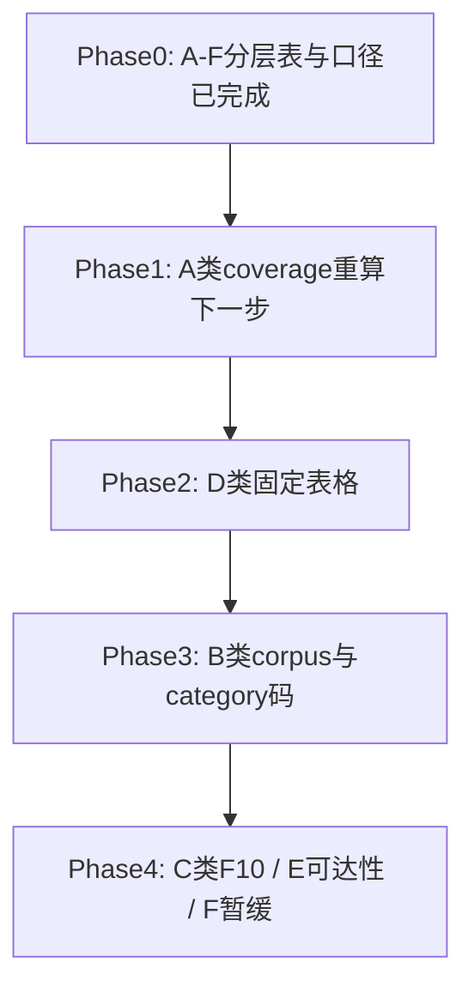

# 当前进展：CNINFO 数据源 A–F 分层验证（Phase 0 已完成）

_最后更新：2026-07-02_

> **本文件说明「现在具体在做什么」。** 仓库整体导航见 [PROJECT_MAP.md](PROJECT_MAP.md)；**A–F 分层与验证口径权威文档**见 [plans/cninfo_data_source_layered_inventory.md](plans/cninfo_data_source_layered_inventory.md)；产品大方向见 [ROADMAP.md](ROADMAP.md)。

---

## 当前阶段（一句话）

Era C 已建立 **CNINFO 数据源 A–F 分层框架与统一验证口径**（Phase 0 完成）。**下一步：Phase 1 — 用 per-company coverage 口径重做 A 类（类年报）验证**，确认年报/半年报/季报到底稳不稳。

---

## 为什么从「success rate」改为「A–F 分层 + 分层口径」

旧验证把不同形态的数据（定期报告、事件公告、F10 表格、市场行为表格）混在同一个 success rate 里衡量。例如 [cninfo_report_announcement_validation_summary.md](outputs/validation/cninfo_report_announcement_validation_summary.md) 的 `success 368/780` 按 **(公司 × report_type × query_strategy)** 计行，**无法回答「这家公司这份报告找没找到」**。

新框架见 [plans/cninfo_data_source_layered_inventory.md](plans/cninfo_data_source_layered_inventory.md)：

- **A 类**：per-company **coverage%**（公司 × 期望报告期）
- **B 类**：**corpus** + **known-event benchmark**（禁止随机公司覆盖率）
- **C 类**：orgId + **字段可得性%**
- **D 类**：**字段可得性%** + 入口稳定性
- **E 类**：仅可达性 / 权限三态
- **F 类**：暂缓，文本线索

---

## 现在已有（基础）

| 项目 | 现状 |
|---|---|
| **A–F 分层权威文档** | [plans/cninfo_data_source_layered_inventory.md](plans/cninfo_data_source_layered_inventory.md)（Phase 0，已完成） |
| 栏目细节与 P0 模板 | [plans/cninfo_data_source_value_inventory.md](plans/cninfo_data_source_value_inventory.md)（交叉引用，分类以分层表为准） |
| 执行清单 | [plans/eraC_execution_plan.md](plans/eraC_execution_plan.md) |
| P0 小样本（旧口径） | 最新公告、PDF 元数据、F10：`testing / partial` |
| 类年报检索（旧口径） | `validate_cninfo_report_announcements.py` 已跑；**保留为阶段快照，不能作最终 coverage 结论** |
| 历史底座（冻结） | 2024 全市场年报抽取（Era B） |

---

## 当前正在做

- **Phase 0 已完成**：固化 A–F 分层表与每类分母/分子/成功指标。
- **尚未开始 Phase 1**：待新建 `validate_cninfo_report_coverage.py` 并重算 A 类 coverage。

---

## 下一步（Phase 1）

| 步骤 | 内容 |
|---|---|
| 1 | 新建 `lab/validate_cninfo_report_coverage.py`：分母 = mapped 公司 × 期望报告期；分子 = 命中且 PDF + 报告期正确；输出 **coverage%** |
| 2 | 本地手动跑脚本（关 VPN），生成 `outputs/validation/cninfo_report_coverage_validation{.csv,_summary.md}` |
| 3 | 用 coverage% 判定 A 类是否真正稳定；回填 [分层表](plans/cninfo_data_source_layered_inventory.md) A 类状态 |
| 4 | **不要同时展开** Phase 2（D 类）及以后 |

> **旧快照说明：** [cninfo_report_announcement_validation_summary.md](outputs/validation/cninfo_report_announcement_validation_summary.md) 保留为历史运行记录，其中的 `368/780` **不代表** per-company coverage，**不能**作为「A 类已跑通」的最终依据。

---

## 当前不做什么

- **不**同时推进 Phase 2–4（D/B/C/E/F）。
- **不**接 PostgreSQL / MinIO / MongoDB。
- **不**继续用旧 P0/P1/P2 单一 success rate 作为主判断标准。
- **不**改动 Era A / Era B 代码；`recommended_status` 不写 `verified`。

---

## 老师可以看哪里

| 想了解 | 看这里 |
|---|---|
| A–F 分层与验证口径 | [plans/cninfo_data_source_layered_inventory.md](plans/cninfo_data_source_layered_inventory.md) |
| 仓库地图、文件归属 | [PROJECT_MAP.md](PROJECT_MAP.md) |
| Composer 执行清单 | [plans/eraC_execution_plan.md](plans/eraC_execution_plan.md) |
| 验证产物（含阶段快照） | [outputs/validation/](outputs/validation/) |
| B 类机制总结 | [cninfo_announcement_acquisition_mechanism_summary.md](outputs/validation/cninfo_announcement_acquisition_mechanism_summary.md) |

---

## 术语表

| 术语 | 含义 |
|---|---|
| A–F 分层 | CNINFO 数据源六层分类（见分层表） |
| coverage% | A 类指标：命中期望报告数 / 期望报告总数 |
| corpus | B 类：按 category 在时间窗内拉取的公告语料 |
| known-event benchmark | B 类低频事件：只对已知发生过事件的公司验证 |
| 阶段快照 | 某次脚本运行的 summary，非最终口径结论 |

---

## 附录：2024 数据底座（Era B，冻结）

点击展开：full_market_2024 关键数字（历史记录）

非金融核心指标严格审计 `usable` **9.43/11**；公司全集 6124，成功抽取 5707。当前阶段聚焦 CNINFO A–F 分层验证，不再更新这些指标。

