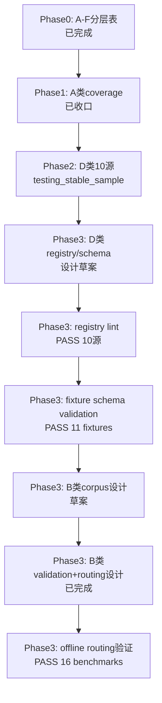

# 当前进展：CNINFO 数据源 A–F 分层验证（Phase 1 已收口 · Phase 2 已收口）

_最后更新：2026-07-06_

> **本文件说明「现在具体在做什么」。** 仓库整体导航见 [PROJECT_MAP.md](PROJECT_MAP.md)；**A–F 分层与验证口径权威文档**见 [plans/cninfo_data_source_layered_inventory.md](plans/cninfo_data_source_layered_inventory.md)；产品大方向见 [ROADMAP.md](ROADMAP.md)。

---

## 当前阶段（一句话）

**Era C Phase 1（A 类）已收口**（P1 **749/796 = 94.10%**）。**Phase 2 D 类已收口**（10 源 `testing_stable_sample`）。**Phase 3 B 类** corpus + live metadata v1 已打通（5 ready · 5/5 pass）。**Phase 4 C 类** P2-B dividend **3/3** `endpoint_found`；contact + business_scope **3/3 derived**（无独立 endpoint）；**无 YAML backfill**；**无 verified**；**不入库**。

---

## Phase 1 A 类收口摘要

| 项 | 结果 |
|----|------|
| P1 effective coverage | **749/796 = 94.10%** |
| 二轮 audit found pass | **97.5%** |
| **recommended_status** | **testing / usable candidate** |
| 完整总结 | [cninfo_report_phase1_final_summary.md](outputs/validation/cninfo_report_phase1_final_summary.md) |
| Later improvement | BSE residual — 不阻塞 Phase 2 |

---

## Phase 3 D 类设计（已收口）

| 项 | 状态 |
|----|------|
| Source Registry 设计 | [cninfo_d_class_source_registry_design.md](plans/cninfo_d_class_source_registry_design.md) |
| Schema Draft | [cninfo_d_class_schema_draft.md](plans/cninfo_d_class_schema_draft.md) |
| Ingestion Status Model | [cninfo_d_class_ingestion_status_model.md](plans/cninfo_d_class_ingestion_status_model.md) |
| **Source → Schema 映射审查** | [cninfo_d_class_source_to_schema_mapping_review.md](plans/cninfo_d_class_source_to_schema_mapping_review.md) |
| **Registry YAML draft** | [config/cninfo_d_class_source_registry_draft.yaml](config/cninfo_d_class_source_registry_draft.yaml) · [notes](plans/cninfo_d_class_source_registry_draft_notes.md) |
| **JSON Schema draft** | [schemas/d_class/](schemas/d_class/) · [notes](plans/cninfo_d_class_json_schema_draft_notes.md) |
| **Registry lint 设计** | [cninfo_d_class_registry_lint_design.md](plans/cninfo_d_class_registry_lint_design.md) · 脚本草案 `lab/lint_cninfo_d_class_registry.py`（23 规则 R001–R023） |
| **Schema validation plan** | [cninfo_d_class_schema_validation_plan.md](plans/cninfo_d_class_schema_validation_plan.md) |
| **Fixtures + mapper + validation v1** | `fixtures/d_class/`（11）· `lab/cninfo_d_class_mappers.py` · `lab/validate_cninfo_d_class_schema.py` · [summary](outputs/validation/cninfo_d_class_schema_validation_summary.md) |
| 性质 | **设计草案**；不入库、不写 migration、不写 verified |

---

## Phase 3 B 类 Corpus 设计（进行中）

| 项 | 状态 |
|----|------|
| **Corpus 设计** | [cninfo_b_class_corpus_design.md](plans/cninfo_b_class_corpus_design.md) |
| **Document Model** | [cninfo_b_class_document_model_draft.md](plans/cninfo_b_class_document_model_draft.md) |
| **B vs D 边界** | [cninfo_b_vs_d_class_boundary.md](plans/cninfo_b_vs_d_class_boundary.md) |
| **Source Registry 设计** | [cninfo_b_class_source_registry_design.md](plans/cninfo_b_class_source_registry_design.md) |
| **Registry YAML draft** | [config/cninfo_b_class_source_registry_draft.yaml](config/cninfo_b_class_source_registry_draft.yaml) · [notes](plans/cninfo_b_class_source_registry_draft_notes.md) |
| **Validation 设计** | [cninfo_b_class_validation_design.md](plans/cninfo_b_class_validation_design.md) |
| **Category routing** | [cninfo_b_class_category_routing_rules.md](plans/cninfo_b_class_category_routing_rules.md) · [cninfo_announcement_categories.yaml](config/cninfo_announcement_categories.yaml) |
| **Routing validation** | `lab/validate_cninfo_b_class_category_routing.py` · [routing summary](outputs/validation/cninfo_b_class_category_routing_summary.md)（16 benchmark PASS） |
| **Document seed** | `lab/seed_cninfo_b_class_document_fixtures.py` · [fixtures](fixtures/b_class/document/periodic_report_document_fixtures.jsonl)（20 条 metadata）· [seed summary](outputs/validation/cninfo_b_class_document_seed_summary.md) |
| **JSON Schema** | [schemas/b_class/](schemas/b_class/)（8 逻辑表 draft-07）· [notes](plans/cninfo_b_class_json_schema_draft_notes.md) |
| **Schema validation** | `lab/validate_cninfo_b_class_document_schema.py` · [summary](outputs/validation/cninfo_b_class_document_schema_validation_summary.md)（20/20 PASS） |
| **Raw file seed** | `lab/seed_cninfo_b_class_raw_file_fixtures.py` · [fixtures](fixtures/b_class/raw_file/periodic_report_raw_file_fixtures.jsonl)（20 条） |
| **Raw file validation** | `lab/validate_cninfo_b_class_raw_file_schema.py` · [summary](outputs/validation/cninfo_b_class_raw_file_schema_validation_summary.md)（20/20 PASS） |
| **Parser / chunker plan** | [parser plan](plans/cninfo_b_class_parser_chunker_plan.md) · [chunking](plans/cninfo_b_class_chunking_strategy.md) · [parse quality](plans/cninfo_b_class_parse_quality_model.md) |
| **Non-periodic seed** | `lab/seed_cninfo_b_class_non_periodic_document_fixtures.py` · [fixtures](fixtures/b_class/document/non_periodic_document_fixtures.jsonl)（13 条）· [summary](outputs/validation/cninfo_b_class_non_periodic_document_schema_validation_summary.md) |
| **Parse run dry-run** | `lab/seed_cninfo_b_class_parse_run_dry_run_fixtures.py` · [fixtures](fixtures/b_class/parse_run/document_parse_run_dry_run_fixtures.jsonl)（33 条）· [summary](outputs/validation/cninfo_b_class_parse_run_schema_validation_summary.md) |
| **Registry lint** | `lab/lint_cninfo_b_class_registry.py` · [design](plans/cninfo_b_class_registry_lint_design.md) · [summary](outputs/validation/cninfo_b_class_registry_lint_summary.md)（23 rules PASS） |
| **Retrieval validation 设计** | [corpus design](plans/cninfo_b_class_corpus_retrieval_validation_design.md) · [dry-run summary](outputs/validation/cninfo_b_class_corpus_retrieval_dry_run_summary.md) · [live summary](outputs/validation/cninfo_b_class_corpus_retrieval_live_summary.md) · [intake template](plans/cninfo_b_class_ready_case_intake_template.md) · [review checklist](plans/cninfo_b_class_ready_case_review_checklist.md) |
| **Retrieval ready + live v1** | **5** ready（4 known-document + 1 guard）；live **5/5 pass**（`LIVE_PASS`）；`query_executed=5` |
| **Guard audit** | `periodic_guard_002` **ready**；2025-03-27~2025-04-02；29 条摘要未误入 `periodic_report` |
| 性质 | 仅 metadata retrieval；**PDF 未下载/解析**；**未写 verified**；18 条 placeholder 未请求 |

---

## Phase 4 C 类 F10 / Company Profile（设计启动）

| 项 | 状态 |
|----|------|
| **Source discovery 设计** | [cninfo_c_class_f10_source_discovery_design.md](plans/cninfo_c_class_f10_source_discovery_design.md) |
| **Profile data model** | [cninfo_c_class_profile_data_model_draft.md](plans/cninfo_c_class_profile_data_model_draft.md) |
| **C / B / D 边界** | [cninfo_c_vs_b_vs_d_boundary.md](plans/cninfo_c_vs_b_vs_d_boundary.md) |
| **Candidate YAML** | [config/cninfo_c_class_source_candidates.yaml](config/cninfo_c_class_source_candidates.yaml)（**P1 + P2-A backfill v1**：**6** 源 `testing` + endpoint；**4** 源仍 `candidate`） |
| **JSON Schema** | [schemas/c_class/](schemas/c_class/)（**7** 逻辑表 draft-07，含 `c_company_security_profile`）· [notes](plans/cninfo_c_class_json_schema_draft_notes.md) |
| **Registry lint** | [design](plans/cninfo_c_class_registry_lint_design.md) · `lab/lint_cninfo_c_class_registry.py` · [summary](outputs/validation/cninfo_c_class_registry_lint_summary.md)（**14 rules PASS**） |
| **Live validation v1** | `lab/validate_cninfo_c_class_live_sources.py` · [summary](outputs/validation/cninfo_c_class_live_source_validation_summary.md)（**LIVE_PASS**） |
| **Basic profile mapper** | `lab/cninfo_c_class_mappers.py` · `lab/seed_cninfo_c_class_basic_profile_fixtures.py` · [mapper summary](outputs/validation/cninfo_c_class_basic_profile_mapper_summary.md) · [schema validation](outputs/validation/cninfo_c_class_basic_profile_schema_validation_summary.md)（**2/2 PASS**） |
| **Security profile mapper** | `map_company_security_profile()` · `lab/seed_cninfo_c_class_security_profile_fixtures.py` · [mapper summary](outputs/validation/cninfo_c_class_security_profile_mapper_summary.md) · [schema validation](outputs/validation/cninfo_c_class_security_profile_schema_validation_summary.md)（**3/3 PASS**） |
| **Executive profile mapper** | `map_company_executive_profile()` · `lab/seed_cninfo_c_class_executive_profile_fixtures.py` · [mapper summary](outputs/validation/cninfo_c_class_executive_profile_mapper_summary.md) · [schema validation](outputs/validation/cninfo_c_class_executive_profile_schema_validation_summary.md)（**6/6 PASS**） |
| **Share capital profile mapper** | `map_company_share_capital_profile()` · `lab/seed_cninfo_c_class_share_capital_profile_fixtures.py` · [mapper summary](outputs/validation/cninfo_c_class_share_capital_profile_mapper_summary.md) · [schema validation](outputs/validation/cninfo_c_class_share_capital_profile_schema_validation_summary.md)（**6/6 PASS**） |
| **Shareholder profile mapper** | `map_company_shareholder_profile()` · `lab/seed_cninfo_c_class_shareholder_profile_fixtures.py` · [mapper summary](outputs/validation/cninfo_c_class_shareholder_profile_mapper_summary.md) · [schema validation](outputs/validation/cninfo_c_class_shareholder_profile_schema_validation_summary.md)（**12/12 PASS**） |
| **P2-A mapper completion** | [cninfo_c_class_p2a_mapper_completion_summary.md](plans/cninfo_c_class_p2a_mapper_completion_summary.md) — P2-A 四源链路收口（testing / prototype） |
| **C-class status consolidation** | [cninfo_c_class_status_consolidation_summary.md](plans/cninfo_c_class_status_consolidation_summary.md) — 10 源总表（**6 testing · 4 candidate**） |
| **P2-B probe** | [P2-B plan](plans/cninfo_c_class_p2b_probe_plan.md) · [P2-B probe records](fixtures/c_class/probe/records/c_class_p2b_probe_records.yaml)（dividend **3/3** · contact/business **3/3 derived** · industry pending） |
| **P2 DevTools probe** | [P2 plan](plans/cninfo_c_class_p2_probe_plan.md) · [P2 probe records](fixtures/c_class/probe/records/c_class_p2_probe_records.yaml)（**12/12**） · [P2-A backfill decision](plans/cninfo_c_class_p2a_yaml_backfill_decision.md) · [P2-A live validation](outputs/validation/cninfo_c_class_p2a_live_source_validation_summary.md)（**LIVE_PASS 12/12**） |
| **Known-company fixtures** | [fixtures/c_class/known_company_profile_fixtures.jsonl](fixtures/c_class/known_company_profile_fixtures.jsonl)（**12** 条；600000 / 300001 / 688001） |
| **Schema validation** | `lab/validate_cninfo_c_class_profile_schema.py` · [summary](outputs/validation/cninfo_c_class_profile_schema_validation_summary.md)（**12/12 PASS**） |
| **DevTools probe plan** | [probe plan](plans/cninfo_c_class_devtools_probe_plan.md) · [checklist](plans/cninfo_c_class_probe_checklist.md) · [record template](fixtures/c_class/probe/c_class_probe_record_template.yaml) |
| **P1 probe records** | [c_class_p1_probe_records.yaml](fixtures/c_class/probe/records/c_class_p1_probe_records.yaml)（**9** 条 · basic+security 已填 · industry observed）· [P1 execution notes](plans/cninfo_c_class_p1_probe_execution_notes.md) |
| **P1 probe review** | [probe review](plans/cninfo_c_class_p1_probe_review.md) · [YAML backfill decision](plans/cninfo_c_class_p1_yaml_backfill_decision.md) · [field mapping draft](plans/cninfo_c_class_basic_profile_field_mapping_draft.md) |
| **既有 P0 参考** | `lab/validate_cninfo_f10_company_profile.py`（本阶段不扩跑） |
| 性质 | **设计草案 + offline validation**；不入库、不写 migration、不写 verified、不做全市场 F10 抓取 |

---

## Phase 2 D 类（已收口）

| 项 | 状态 |
|----|------|
| **已验证 source** | **10**（P1 五 + P2 五） |
| **testing_stable_sample** | **10** |
| **blocked** | **0** |
| **schema_changed** | **0** |
| **verified** | **0** |
| **candidate 待探测** | **2**（ipo_query、szse_calendar） |
| **Phase 2 总总结** | [cninfo_table_sources_phase2_current_final_summary.md](outputs/validation/cninfo_table_sources_phase2_current_final_summary.md) |
| Priority-1 分源 | [cninfo_table_sources_priority1_summary.md](outputs/validation/cninfo_table_sources_priority1_summary.md) |
| Priority-2 分源 | [cninfo_table_sources_priority2_current_summary.md](outputs/validation/cninfo_table_sources_priority2_current_summary.md) |
| P1 稳定性 | [cninfo_table_sources_multidate_stability_summary.md](outputs/validation/cninfo_table_sources_multidate_stability_summary.md) |
| P2 稳定性 | [cninfo_table_sources_priority2_stability_summary.md](outputs/validation/cninfo_table_sources_priority2_stability_summary.md) |
| 配置 / 脚本 | [config/cninfo_table_sources.yaml](config/cninfo_table_sources.yaml)、`lab/validate_cninfo_table_sources*.py` |

---

## 下一步

| 步骤 | 内容 |
|------|------|
| 1 | ~~Phase 2 十源验证 + 稳定性~~ → **已收口** |
| 2 | ~~D 类 registry / schema / status model 设计草案~~ → **已完成** |
| 3 | ~~Source → Schema 映射审查~~ → **已完成** |
| 4 | ~~Registry YAML draft（10 源）~~ → **已完成** |
| 5 | ~~JSON Schema draft（10 逻辑表）~~ → **已完成** |
| 6 | ~~registry lint / schema validation plan 设计~~ → **已完成**（lint PASS） |
| 7 | ~~fixtures + mapper + schema validation v1~~ → **已完成**（11 fixture PASS） |
| 8 | ~~B 类 corpus / document model / B-D 边界设计~~ → **已完成** |
| 9 | ~~B 类 document_corpus source registry~~ → **已完成**（4 source YAML draft） |
| 10 | ~~B 类 validation 口径 + category routing 配置~~ → **已完成** |
| 11 | ~~B 类 offline title routing 脚本 + benchmark~~ → **已完成**（16/16 PASS） |
| 12 | ~~Phase 1 found → B 类 document metadata fixtures~~ → **已完成**（20 条） |
| 13 | ~~B 类 JSON Schema + document fixture validation~~ → **已完成**（20/20 PASS） |
| 14 | ~~B 类 raw_file fixture seed + schema validation~~ → **已完成**（20/20 PASS） |
| 15 | ~~B 类 parser / chunker / parse quality 设计~~ → **已完成** |
| 16 | ~~B 类 non-periodic document fixture seed~~ → **已完成**（13 条，schema 13/13 PASS） |
| 17 | ~~B 类 parse_run dry-run fixture + schema validation~~ → **已完成**（33/33 PASS） |
| 18 | ~~B 类 registry lint~~ → **已完成**（23 rules PASS） |
| 19 | ~~B 类 corpus retrieval validation 小样本设计~~ → **已完成**（design_only fixtures） |
| 20 | ~~B 类 retrieval ready-case 机制 + selector~~ → **已完成**（21 placeholder，ready=0） |
| 21 | ~~B 类 ready-case intake 模板 + 审核 checklist~~ → **已完成** |
| 22 | ~~B 类 corpus retrieval 脚本骨架（dry-run）~~ → **已完成**（NO_READY_CASES） |
| 23 | ~~第一批真实 known-document 草稿填入 placeholder case（3 条）~~ → **已完成** |
| 24 | ~~人工 checklist review → 3 条改 `case_status: ready` → selector → dry-run 复跑~~ → **已完成** |
| 25 | ~~B 类 corpus retrieval live metadata v1（3 ready case）~~ → **已完成** |
| 26 | ~~补第 4 条 ready（board_resolution）+ periodic_guard 草稿~~ → **已完成** |
| 27 | ~~periodic_guard_002 补 date 窗 → ready → guard live audit~~ → **已完成**（5/5 LIVE_PASS） |
| 28 | ~~C 类 F10 / company profile source discovery 设计草案~~ → **已完成** |
| 29 | ~~C 类 company profile JSON Schema draft（6 schema）~~ → **已完成** |
| 30 | ~~C 类 registry lint + known-company fixture schema validation~~ → **已完成**（12 rules PASS · 12/12 fixture PASS） |
| 31 | ~~C 类 DevTools probe plan + checklist + record template~~ → **已完成** |
| 32 | ~~C 类 P1 probe record 文件（3×3 矩阵）~~ → **已完成**（9 条 pending，未实际 probe） |
| 33 | 人工 DevTools probe P1（basic → security → industry）→ 填写 probe records | **已完成**（basic 2/3 + security 3/3） |
| 34 | ~~C 类 P1 probe review + YAML 回填决策文档~~ → **已完成** |
| 35 | ~~C 类 P1 YAML backfill v1（basic + security）~~ → **已完成**；lint PASS |
| 36 | ~~建立 C 类 known-company live validation v1~~ → **LIVE_PASS**（600000 预期已对齐） |
| 37 | ~~C 类 basic_profile mapper draft + fixture schema validation~~ → **已完成**（2 fixtures · 2/2 PASS） |
| 38 | ~~C 类 security_profile mapper draft + fixture schema validation~~ → **已完成**（3 fixtures · 3/3 PASS） |
| 39 | ~~C 类 P2 DevTools probe plan + records 初始化~~ → **已完成**（12 条 pending） |
| 40 | ~~C 类 P2 executive_profile 人工 DevTools probe~~ → **已完成**（3/3 `endpoint_found`） |
| 41 | ~~C 类 P2 share_capital + shareholders 人工 DevTools probe~~ → **已完成**（9/9 `endpoint_found`；P2-A **12/12**） |
| 42 | ~~C 类 P2-A YAML backfill decision 起草~~ → **已完成** |
| 43 | ~~C 类 P2-A YAML backfill v1 + registry lint~~ → **已完成**（6 源 `testing` · lint PASS） |
| 44 | ~~C 类 P2-A live validation v1~~ → **LIVE_PASS**（12/12） |
| 45 | ~~C 类 executive_profile mapper draft + fixture schema validation~~ → **已完成**（6 fixtures · 6/6 PASS） |
| 46 | ~~C 类 share_capital_profile mapper draft + fixture schema validation~~ → **已完成**（6 fixtures · 6/6 PASS） |
| 47 | ~~C 类 shareholder_profile mapper draft + fixture schema validation~~ → **已完成**（12 fixtures · 12/12 PASS） |
| 48 | ~~C 类 P2-A mapper completion summary~~ → **已完成** |
| 49 | ~~C 类 status consolidation summary~~ → **已完成** |
| 50 | ~~C 类 P2-B probe plan + records 初始化~~ → **已完成** |
| 51 | ~~C 类 P2-B dividend_financing manual probe~~ → **3/3 `endpoint_found`**（`getCompanyHisDividend`） |
| 52 | ~~C 类 P2-B contact_profile 600000 probe~~ → **derived_candidate_from_basic_profile** |
| 53 | ~~C 类 P2-B contact_profile 3/3 derived~~ → **已完成** |
| 54 | ~~C 类 P2-B business_scope 3/3 derived~~ → **已完成** |
| 55 | P2-B industry_profile derived recheck |
| 56 | **暂不全量抓取、暂不入库** |

---

## 当前不做什么

- **不写 verified** / full-market stable
- **不接** PostgreSQL / MinIO / MongoDB
- **不**同时大规模推进 Phase 3 与 Phase 2 扩源

---

## 老师可以看哪里

| 想了解 | 看这里 |
|--------|--------|
| **B 类 corpus** | [corpus design](plans/cninfo_b_class_corpus_design.md) · [live summary](outputs/validation/cninfo_b_class_corpus_retrieval_live_summary.md) |
| **C 类 profile 设计** | [P1 backfill decision](plans/cninfo_c_class_p1_yaml_backfill_decision.md) · [P2-A backfill decision](plans/cninfo_c_class_p2a_yaml_backfill_decision.md) · [candidates YAML](config/cninfo_c_class_source_candidates.yaml)（**P1 + P2-A backfill v1**） · [lint summary](outputs/validation/cninfo_c_class_registry_lint_summary.md) |
| **D 类 registry / schema 设计** | [registry](plans/cninfo_d_class_source_registry_design.md) · [YAML](config/cninfo_d_class_source_registry_draft.yaml) · [JSON Schema](schemas/d_class/) · [schema validation summary](outputs/validation/cninfo_d_class_schema_validation_summary.md) |
| **Phase 2 总总结** | [cninfo_table_sources_phase2_current_final_summary.md](outputs/validation/cninfo_table_sources_phase2_current_final_summary.md) |
| D 类 priority-1 分源 | [cninfo_table_sources_priority1_summary.md](outputs/validation/cninfo_table_sources_priority1_summary.md) |
| D 类 priority-2 分源 | [cninfo_table_sources_priority2_current_summary.md](outputs/validation/cninfo_table_sources_priority2_current_summary.md) |
| 多日期 / 多参数稳定性 | [multidate](outputs/validation/cninfo_table_sources_multidate_stability_summary.md) / [priority2_stability](outputs/validation/cninfo_table_sources_priority2_stability_summary.md) |
| Phase 1 最终总结 | [cninfo_report_phase1_final_summary.md](outputs/validation/cninfo_report_phase1_final_summary.md) |
| A–F 分层 | [plans/cninfo_data_source_layered_inventory.md](plans/cninfo_data_source_layered_inventory.md) |
| 仓库地图 | [PROJECT_MAP.md](PROJECT_MAP.md) |
