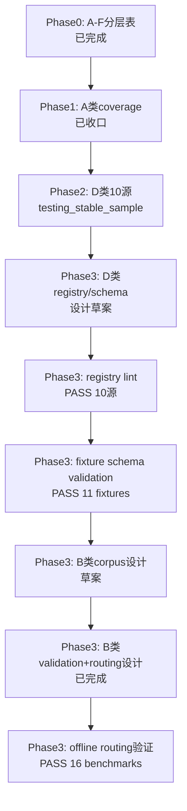

# 当前进展：CNINFO 数据源 A–F 分层验证（Phase 1 已收口 · Phase 2 已收口）

_最后更新：2026-07-10_

> **本文件说明「现在具体在做什么」。** 仓库整体导航见 [PROJECT_MAP.md](PROJECT_MAP.md)；**A–F 分层与验证口径权威文档**见 [plans/cninfo_data_source_layered_inventory.md](plans/cninfo_data_source_layered_inventory.md)；产品大方向见 [ROADMAP.md](ROADMAP.md)。

---

## 当前阶段（一句话）

**Era C Phase 1（A 类）已收口**。**Phase 2 D 类 endpoint 验证已收口**。**Phase 3 B 类** corpus + live metadata v1 已打通；**B-class Phase 1 tiny live 收口完成**（**5/5 resolved** · closure gate **`PASS_WITH_CAVEAT`** · **无 verified**）；**B-class Phase 2 expansion 收口完成**（**20/20 acceptable** · closure gate **`PASS_WITH_CAVEAT`** · **无 verified**）；**B-class Phase 2.5 failed retry 收口完成**（**50/50 effective** · retry closure gate **`PASS_WITH_CAVEAT`** · **无 verified**）；**B-class Phase 3 100-company planning package 已准备**（planning gate **`READY_FOR_APPROVAL`** · universe **100** · overlap **0** · **无 CNINFO** · **无 live**）；**B-class Phase 3 100-company runner extension 与 dry-run 已准备**（dry-run **100/100** · test **20/20 PASS** · runner gate **`READY_FOR_APPROVAL`** · **无 live**）；**B-class Phase 3 100-company live metadata validation 已执行**（**1/100 acceptable** · CNINFO **3** · execution gate **`FAIL_REVIEW_REQUIRED`** · **无 PDF** · **无 verified**）；**B-class Phase 3 failed-case triage 与 isolated retry 规划已准备**（retry **99** · hold **1** · triage gate **`READY_FOR_REVIEW`** · retry planning gate **`READY_FOR_APPROVAL`** · **无 CNINFO** · **无 retry**）；**D-class Phase 0 市场行为层规划已启动**（offline only · **无 D-class live**）；**D-class Phase 1 schema freeze review 已准备**（gate **`READY_FOR_APPROVAL`** · lint **10/10 PASS** · **无 D-class live**）；**D-class Phase 1 schema freeze approval package 已准备**（**未 signoff** · **无 D-class live**）。**Phase 4 C 类** **863 snapshot 已生成**；**状态 `SNAPSHOT_GENERATED_QA_REVIEW`**；**Phase 3 batch 500 closure 已完成**（closure gate **`PASS_WITH_CAVEAT`**）；**Phase 3.5 batch planning 已准备**（draft **500** · eligible **3645** · gate **`READY_FOR_REVIEW`**）；**Phase 3.5 harvest dry-run 与 approval extension 已准备**（dry-run gate **`PASS_OFFLINE`** · approval gate **`READY_FOR_APPROVAL`** · test **11/11 PASS** · CNINFO **0** · **未批准 live**）；**Phase 3.5 live harvest 已执行**（**500** 公司 · raw **3500** · execution gate **`PASS_WITH_CAVEAT`** · **无 snapshot**）；**Phase 3.5 harvest QA 与 failure triage 已完成**（failed **6** · partial **75** · success subset **463** · triage gate **`PASS_WITH_CAVEAT`** · CNINFO **0**）；**Phase 3.5 isolated resume planning 已准备**（resume universe **29** · planning gate **`READY_FOR_APPROVAL`** · **NOT APPROVED** · CNINFO **0**）；**Phase 3.5 isolated resume runner extension 与 dry-run 已准备**（dry-run **29/29** · test **27/27 PASS** · runner extension gate **`READY_FOR_APPROVAL`** · planned requests **120** · CNINFO **0** · **NOT APPROVED live**）；**Phase 3.5 isolated resume live 已执行**（**29** 公司 · CNINFO **120** · complete **28** · partial **1** · failed **0** · execution gate **`PASS_WITH_CAVEAT`** · **无 snapshot**）；**Phase 3.5 isolated resume QA + merge 规划 已完成**（recovered **28** · updated success candidate **491** · holdout **9** · gate **`PASS_WITH_CAVEAT`** · CNINFO **0**）；**Phase 3.5 expanded success-subset snapshot 规划 已准备**（universe **491** · gate **`READY_FOR_APPROVAL`** · CNINFO **0** · **NOT APPROVED for build**）；**并行：A-class Report Metadata Phase 0 规划已启动**（offline only · **无 CNINFO** · **无 PDF** · **无解析** · **无 RAG** · **B/C 输出未触碰**）；**A-class Phase 1 freeze v1 已离线实现**（implementation gate **`PASS_OFFLINE`** · lint **14/14 PASS**）；**A-class ready-case benchmark 已完成**（**5/5 PASS** · gate **`READY_FOR_REVIEW`** · **无 CNINFO**）；**A-class tiny live metadata approval package 已准备**（gate **`READY_FOR_APPROVAL`** · **无 A-class live** · **无 PDF**）；**A-class tiny live metadata v2 rerun 已执行**（**5/5 correct report-type** · v2 gate **`PASS_WITH_CAVEAT`** · CNINFO **11** · **无 PDF** · **无 verified**）；**A-class Phase 1 tiny live metadata v2 closure 已完成**（closure gate **`PASS_WITH_CAVEAT`** · **无 CNINFO**）；**A-class Phase 1 boundary 已收口**（`a_class_phase1_boundary_gate = PASS_WITH_CAVEAT`** · **不是 verified** · **不是 production_ready**）；**A-class Phase 2 20-company metadata expansion 规划包已准备**（planning gate **`READY_FOR_APPROVAL`** · universe **20** · **无 CNINFO** · **无 live** · **无 PDF**）；**A-class Phase 2 metadata expansion runner 已离线准备**（dry-run **20/20** · test **16/16 PASS** · runner gate **`READY_FOR_APPROVAL`** · CNINFO **0**）；**A-class Phase 2 20-company live metadata validation 已执行**（**12/20 correct** · CNINFO **28** · wrong_report_type **0** · PDF **0** · execution gate **`FAIL_REVIEW_REQUIRED`** · **不是 verified**）；**A-class Phase 2 failed-case isolated retry 已执行**（retry **0/8 correct** · CNINFO **0** · wrong_report_type **0** · PDF **0** · retry execution gate **`FAIL_REVIEW_REQUIRED`** · Phase 2 execution gate **`FAIL_REVIEW_REQUIRED`** · **不是 verified**）；**A-class Phase 2 merge closure 已完成**（**12 accepted** · **8 unresolved network** · closure gate **`PASS_WITH_CAVEAT_NETWORK_UNRESOLVED`** · CNINFO **0** · **不是 verified**）；**A-class Phase 2 network recovery retry_v2 规划包已准备**（universe **8** · planning gate **`READY_FOR_APPROVAL`** · **无 CNINFO** · **无 live** · **NOT APPROVED**）；**A-class Phase 2 retry_v2 runner extension + dry-run 已完成**（**8/8 planned_ok** · runner gate **`READY_FOR_APPROVAL`** · test **18/18 PASS** · CNINFO **0** · **NOT APPROVED live**）；**A-class Phase 2 network recovery retry_v2 live 已执行**（**0/8 acceptable** · execution gate **`FAIL_REVIEW_REQUIRED`** · CNINFO **0** · orgId network_error · PDF **0** · **不是 verified**）；**A-class Phase 2 retry_v2 merge closure 更新已完成**（**12 effective accepted** · **8 effective unresolved** · retry_v2 closure gate **`PASS_WITH_CAVEAT_NETWORK_UNRESOLVED`** · CNINFO **0** · **不是 verified**）；**A-class Phase 2 CNINFO reachability precheck 规划包已准备**（candidates **3** · request cap **≤6** · planning gate **`READY_FOR_APPROVAL`** · **无 CNINFO** · **无 live** · **NOT APPROVED**）；**A-class Phase 2 CNINFO reachability precheck runner 与 dry-run 已准备**（**3/3 planned_ok** · test **23/23 PASS** · runner gate **`READY_FOR_APPROVAL`** · CNINFO **0** · **NOT APPROVED live**）；**A-class Phase 2 CNINFO reachability precheck live 已执行**（**2/3 orgId resolved** · CNINFO **2** · execution gate **`PASS_WITH_CAVEAT`** · PDF **0** · **不是 verified**）；**A-class Phase 2 retry_v3 isolated 规划包已准备**（universe **8** · planning gate **`READY_FOR_APPROVAL`** · **无 CNINFO** · **无 live** · **NOT APPROVED**）；**A-class Phase 2 retry_v3 runner extension 与 dry-run 已准备**（**8/8 planned_ok** · test **23/23 PASS** · runner extension gate **`READY_FOR_APPROVAL`** · CNINFO **0** · **NOT APPROVED live**）；**A-class Phase 2 retry_v3 live path implementation 已准备**（live-path test **25/25 PASS** · live implementation gate **`READY_FOR_APPROVAL`** · **无真实 CNINFO** · **NOT APPROVED live**）；**A-class Phase 2 retry_v3 isolated live 已执行**（**8/8 acceptable** · CNINFO **18** · execution gate **`PASS_WITH_CAVEAT`** · PDF **0** · **不是 verified**）；**A-class Phase 2 retry_v3 merge closure 已完成**（**20/20 effective accepted** · final closure gate **`PASS_WITH_CAVEAT`** · CNINFO **0** · **不是 verified**）；**A-class Phase 2 final commit boundary review 已完成**（gate **`READY_FOR_COMMIT_REVIEW`** · **无 commit**）；**A-class Phase 3 50-company expansion planning package 已准备**（universe **50** · overlap **0/0** · planning gate **`READY_FOR_APPROVAL`** · **无 CNINFO** · **无 live**）；**A-class Phase 3 runner extension + dry-run 已准备**（**50/50 planned_ok** · test **26/26 PASS** · runner gate **`READY_FOR_APPROVAL`** · **无 live**）；**A-class Phase 3 live path implementation 已准备**（test **28/28 PASS** · live path gate **`READY_FOR_APPROVAL`** · **NOT APPROVED live**）；**A-class Phase 3 50-company isolated live 已执行**（**49/50 acceptable** · CNINFO **104** · execution gate **`PASS_WITH_CAVEAT`** · PDF **0** · **无 commit** · **无 push** · **不是 verified**）；**A-class Phase 3 50-company merge closure 已完成**（**49/50 effective** · A3M017 unresolved · closure gate **`PASS_WITH_CAVEAT`** · CNINFO **0** · **不是 verified**）；**A-class Phase 3 50-company final commit boundary review 已完成**（**80 yes / 9 no** · boundary gate **`READY_FOR_COMMIT_REVIEW`** · A3M017 caveat retained · **不是 verified**）；**A-class Phase 3 explicit-path commit 已完成**（**`bbc15c3`** · **77 files** · review gate **`READY_FOR_HUMAN_DECISION`** · **无 push** · **不是 verified**）；**A-class Phase 3 A3M017 isolated retry planning package 已准备**（universe **1** · planning gate **`READY_FOR_APPROVAL`** · CNINFO **0** · **NOT APPROVED live** · **不是 verified**）；**C-class 未整体完成**；**无 verified**；**不入库**。

---

## Phase 1 A 类收口摘要

| 项 | 结果 |
|----|------|
| P1 effective coverage | **749/796 = 94.10%** |
| 二轮 audit found pass | **97.5%** |
| **recommended_status** | **testing / usable candidate** |
| 完整总结 | [cninfo_report_phase1_final_summary.md](outputs/validation/cninfo_report_phase1_final_summary.md) |
| Later improvement | BSE residual — 不阻塞 Phase 2 |

---

## Phase 3 D 类设计（已收口）

| 项 | 状态 |
|----|------|
| Source Registry 设计 | [cninfo_d_class_source_registry_design.md](plans/cninfo_d_class_source_registry_design.md) |
| Schema Draft | [cninfo_d_class_schema_draft.md](plans/cninfo_d_class_schema_draft.md) |
| Ingestion Status Model | [cninfo_d_class_ingestion_status_model.md](plans/cninfo_d_class_ingestion_status_model.md) |
| **Source → Schema 映射审查** | [cninfo_d_class_source_to_schema_mapping_review.md](plans/cninfo_d_class_source_to_schema_mapping_review.md) |
| **Registry YAML draft** | [config/cninfo_d_class_source_registry_draft.yaml](config/cninfo_d_class_source_registry_draft.yaml) · [notes](plans/cninfo_d_class_source_registry_draft_notes.md) |
| **JSON Schema draft** | [schemas/d_class/](schemas/d_class/) · [notes](plans/cninfo_d_class_json_schema_draft_notes.md) |
| **Registry lint 设计** | [cninfo_d_class_registry_lint_design.md](plans/cninfo_d_class_registry_lint_design.md) · 脚本草案 `lab/lint_cninfo_d_class_registry.py`（23 规则 R001–R023） |
| **Schema validation plan** | [cninfo_d_class_schema_validation_plan.md](plans/cninfo_d_class_schema_validation_plan.md) |
| **Fixtures + mapper + validation v1** | `fixtures/d_class/`（11）· `lab/cninfo_d_class_mappers.py` · `lab/validate_cninfo_d_class_schema.py` · [summary](outputs/validation/cninfo_d_class_schema_validation_summary.md) |
| 性质 | **设计草案**；不入库、不写 migration、不写 verified |

---

## Phase 3 B 类 Corpus 设计（进行中）

| 项 | 状态 |
|----|------|
| **Corpus 设计** | [cninfo_b_class_corpus_design.md](plans/cninfo_b_class_corpus_design.md) |
| **Document Model** | [cninfo_b_class_document_model_draft.md](plans/cninfo_b_class_document_model_draft.md) |
| **B vs D 边界** | [cninfo_b_vs_d_class_boundary.md](plans/cninfo_b_vs_d_class_boundary.md) |
| **Source Registry 设计** | [cninfo_b_class_source_registry_design.md](plans/cninfo_b_class_source_registry_design.md) |
| **Registry YAML draft** | [config/cninfo_b_class_source_registry_draft.yaml](config/cninfo_b_class_source_registry_draft.yaml) · [notes](plans/cninfo_b_class_source_registry_draft_notes.md) |
| **Validation 设计** | [cninfo_b_class_validation_design.md](plans/cninfo_b_class_validation_design.md) |
| **Category routing** | [cninfo_b_class_category_routing_rules.md](plans/cninfo_b_class_category_routing_rules.md) · [cninfo_announcement_categories.yaml](config/cninfo_announcement_categories.yaml) |
| **Routing validation** | `lab/validate_cninfo_b_class_category_routing.py` · [routing summary](outputs/validation/cninfo_b_class_category_routing_summary.md)（16 benchmark PASS） |
| **Document seed** | `lab/seed_cninfo_b_class_document_fixtures.py` · [fixtures](fixtures/b_class/document/periodic_report_document_fixtures.jsonl)（20 条 metadata）· [seed summary](outputs/validation/cninfo_b_class_document_seed_summary.md) |
| **JSON Schema** | [schemas/b_class/](schemas/b_class/)（8 逻辑表 draft-07）· [notes](plans/cninfo_b_class_json_schema_draft_notes.md) |
| **Schema validation** | `lab/validate_cninfo_b_class_document_schema.py` · [summary](outputs/validation/cninfo_b_class_document_schema_validation_summary.md)（20/20 PASS） |
| **Raw file seed** | `lab/seed_cninfo_b_class_raw_file_fixtures.py` · [fixtures](fixtures/b_class/raw_file/periodic_report_raw_file_fixtures.jsonl)（20 条） |
| **Raw file validation** | `lab/validate_cninfo_b_class_raw_file_schema.py` · [summary](outputs/validation/cninfo_b_class_raw_file_schema_validation_summary.md)（20/20 PASS） |
| **Parser / chunker plan** | [parser plan](plans/cninfo_b_class_parser_chunker_plan.md) · [chunking](plans/cninfo_b_class_chunking_strategy.md) · [parse quality](plans/cninfo_b_class_parse_quality_model.md) |
| **Non-periodic seed** | `lab/seed_cninfo_b_class_non_periodic_document_fixtures.py` · [fixtures](fixtures/b_class/document/non_periodic_document_fixtures.jsonl)（13 条）· [summary](outputs/validation/cninfo_b_class_non_periodic_document_schema_validation_summary.md) |
| **Parse run dry-run** | `lab/seed_cninfo_b_class_parse_run_dry_run_fixtures.py` · [fixtures](fixtures/b_class/parse_run/document_parse_run_dry_run_fixtures.jsonl)（33 条）· [summary](outputs/validation/cninfo_b_class_parse_run_schema_validation_summary.md) |
| **Registry lint** | `lab/lint_cninfo_b_class_registry.py` · [design](plans/cninfo_b_class_registry_lint_design.md) · [summary](outputs/validation/cninfo_b_class_registry_lint_summary.md)（23 rules PASS） |
| **Retrieval validation 设计** | [corpus design](plans/cninfo_b_class_corpus_retrieval_validation_design.md) · [dry-run summary](outputs/validation/cninfo_b_class_corpus_retrieval_dry_run_summary.md) · [live summary](outputs/validation/cninfo_b_class_corpus_retrieval_live_summary.md) · [intake template](plans/cninfo_b_class_ready_case_intake_template.md) · [review checklist](plans/cninfo_b_class_ready_case_review_checklist.md) |
| **Retrieval ready + live v1** | **5** ready（4 known-document + 1 guard）；live **5/5 pass**（`LIVE_PASS`）；`query_executed=5` |
| **Guard audit** | `periodic_guard_002` **ready**；2025-03-27~2025-04-02；29 条摘要未误入 `periodic_report` |
| 性质 | 仅 metadata retrieval；**PDF 未下载/解析**；**未写 verified**；18 条 placeholder 未请求 |

---

## A 类 Phase 0 定期报告元数据规划（2026-07-09 启动）

> **并行说明：** C-class Phase 3 batch 500 live harvest 可能在另一终端运行；本轮仅 A-class **离线规划**，**不调用 CNINFO**、**不 live**、**不 harvest**、**不下载 PDF**、**不解析**、**无 RAG**；**不修改 C-class / B-class 既有输出**。

| 项 | 状态 |
|----|------|
| **架构计划** | [cninfo_a_class_report_metadata_architecture_plan.md](plans/cninfo_a_class_report_metadata_architecture_plan.md) |
| **Source discovery 计划** | [cninfo_a_class_source_discovery_plan.md](plans/cninfo_a_class_source_discovery_plan.md) |
| **Phase 1 minimum fields** | [cninfo_a_class_phase1_minimum_fields.csv](outputs/validation/cninfo_a_class_phase1_minimum_fields.csv)（**40** 字段 · required=**21** · future=**5**） |
| **Readiness matrix** | [cninfo_a_class_readiness_matrix.csv](outputs/validation/cninfo_a_class_readiness_matrix.csv)（**6** 组件） |
| **Planning summary** | [cninfo_a_class_initial_planning_summary.md](outputs/validation/cninfo_a_class_initial_planning_summary.md) |
| **Schema freeze review** | [cninfo_a_class_phase1_schema_freeze_review.md](plans/cninfo_a_class_phase1_schema_freeze_review.md) · [summary](outputs/validation/cninfo_a_class_phase1_schema_freeze_review_summary.md) |
| **Field decision matrix** | [cninfo_a_class_phase1_field_decision_matrix.csv](outputs/validation/cninfo_a_class_phase1_field_decision_matrix.csv)（**40** 行 · proposed required=**22** · removed=**2**） |
| **Phase1 fixtures** | [fixtures/a_class/phase1/](fixtures/a_class/phase1/)（**3** 骨架 · 合成占位符） |
| **Freeze v1 lint** | [lab/lint_cninfo_a_class_phase1_freeze_v1.py](lab/lint_cninfo_a_class_phase1_freeze_v1.py) · [lint summary](outputs/validation/cninfo_a_class_phase1_freeze_v1_lint_summary.md)（**10/10 PASS**） |
| **Approval checklist** | [cninfo_a_class_phase1_schema_freeze_approval_checklist.md](outputs/validation/cninfo_a_class_phase1_schema_freeze_approval_checklist.md) |
| **Approval summary** | [cninfo_a_class_phase1_schema_freeze_approval_summary.md](outputs/validation/cninfo_a_class_phase1_schema_freeze_approval_summary.md) |
| **Implementation plan** | [cninfo_a_class_phase1_freeze_v1_implementation_plan.md](plans/cninfo_a_class_phase1_freeze_v1_implementation_plan.md) |
| **Freeze v1 field catalog** | [cninfo_a_class_phase1_freeze_v1_field_catalog.csv](outputs/validation/cninfo_a_class_phase1_freeze_v1_field_catalog.csv)（**40** 行 · required=**22** · recommended=**12**） |
| **Registry draft** | [cninfo_a_class_source_registry_draft.yaml](config/cninfo_a_class_source_registry_draft.yaml)（**3** sources · `live_validation_status=not_run`） |
| **Freeze v1 lint** | [lab/lint_cninfo_a_class_freeze_v1.py](lab/lint_cninfo_a_class_freeze_v1.py) · [lint summary](outputs/validation/cninfo_a_class_phase1_freeze_v1_lint_summary.md)（**14/14 PASS**） |
| **Implementation summary** | [cninfo_a_class_phase1_freeze_v1_implementation_summary.md](outputs/validation/cninfo_a_class_phase1_freeze_v1_implementation_summary.md) |
| **Ready-case benchmark** | [cninfo_a_class_phase1_ready_case_benchmark.csv](outputs/validation/cninfo_a_class_phase1_ready_case_benchmark.csv) · [summary](outputs/validation/cninfo_a_class_phase1_ready_case_benchmark_summary.md)（**5/5 PASS**） |
| **Benchmark runner** | [lab/run_cninfo_a_class_phase1_ready_case_benchmark.py](lab/run_cninfo_a_class_phase1_ready_case_benchmark.py) · [tests](lab/test_cninfo_a_class_phase1_ready_case_benchmark.py)（**11/11 PASS**） |
| **Ready-case fixtures** | [fixtures/a_class/phase1/ready_cases/](fixtures/a_class/phase1/ready_cases/)（**AC001–AC005**） |
| **Tiny live approval checklist** | [cninfo_a_class_phase1_tiny_live_metadata_approval_checklist.md](outputs/validation/cninfo_a_class_phase1_tiny_live_metadata_approval_checklist.md) |
| **Tiny live universe** | [cninfo_a_class_phase1_tiny_live_metadata_universe.csv](outputs/validation/cninfo_a_class_phase1_tiny_live_metadata_universe.csv)（**5** 家 · ALM001–ALM005） |
| **Tiny live command draft** | [cninfo_a_class_phase1_tiny_live_metadata_command_draft.md](plans/cninfo_a_class_phase1_tiny_live_metadata_command_draft.md)（**NOT APPROVED**） |
| **Tiny live approval summary** | [cninfo_a_class_phase1_tiny_live_metadata_approval_summary.md](outputs/validation/cninfo_a_class_phase1_tiny_live_metadata_approval_summary.md) |
| **Tiny live runner** | [lab/run_cninfo_a_class_tiny_live_metadata_validation.py](lab/run_cninfo_a_class_tiny_live_metadata_validation.py) · [tests](lab/test_cninfo_a_class_tiny_live_metadata_validation_runner.py)（**9/9 PASS**） |
| **Dry-run report** | [a_class_tiny_live_metadata_dryrun_report.csv](outputs/validation/cninfo_a_class_tiny_live_metadata/reports/a_class_tiny_live_metadata_dryrun_report.csv) · [summary](outputs/validation/cninfo_a_class_tiny_live_metadata/reports/a_class_tiny_live_metadata_dryrun_summary.md) |
| **Live execution report** | [a_class_tiny_live_metadata_report.csv](outputs/validation/cninfo_a_class_tiny_live_metadata/reports/a_class_tiny_live_metadata_report.csv) · [summary](outputs/validation/cninfo_a_class_tiny_live_metadata/reports/a_class_tiny_live_metadata_summary.md) · [quality](outputs/validation/cninfo_a_class_tiny_live_metadata/reports/a_class_tiny_live_metadata_quality_report.csv)（**5/5 found**） |
| **Caveat fix review** | [cninfo_a_class_tiny_live_metadata_fix_review.md](outputs/validation/cninfo_a_class_tiny_live_metadata_fix_review.md) |
| **Universe v2 draft** | [cninfo_a_class_phase1_tiny_live_metadata_universe_v2_draft.csv](outputs/validation/cninfo_a_class_phase1_tiny_live_metadata_universe_v2_draft.csv) |
| **Matching logic tests** | [lab/test_cninfo_a_class_tiny_live_metadata_matching_logic.py](lab/test_cninfo_a_class_tiny_live_metadata_matching_logic.py)（**10/10 PASS**） |
| **V2 live report** | [a_class_tiny_live_metadata_v2_report.csv](outputs/validation/cninfo_a_class_tiny_live_metadata/reports/a_class_tiny_live_metadata_v2_report.csv) · [summary](outputs/validation/cninfo_a_class_tiny_live_metadata/reports/a_class_tiny_live_metadata_v2_summary.md) · [quality](outputs/validation/cninfo_a_class_tiny_live_metadata/reports/a_class_tiny_live_metadata_v2_quality_report.csv)（**5/5 correct**） |
| **V2 rerun review** | [cninfo_a_class_tiny_live_metadata_v2_rerun_review.md](outputs/validation/cninfo_a_class_tiny_live_metadata_v2_rerun_review.md) |
| **V2 closure review** | [cninfo_a_class_phase1_tiny_live_metadata_v2_closure_review.md](plans/cninfo_a_class_phase1_tiny_live_metadata_v2_closure_review.md) |
| **V2 closure metrics** | [cninfo_a_class_phase1_tiny_live_metadata_v2_closure_metrics.csv](outputs/validation/cninfo_a_class_phase1_tiny_live_metadata_v2_closure_metrics.csv) |
| **V2 closure summary** | [cninfo_a_class_phase1_tiny_live_metadata_v2_closure_summary.md](outputs/validation/cninfo_a_class_phase1_tiny_live_metadata_v2_closure_summary.md) |
| **Next-step recommendation** | [cninfo_a_class_phase1_next_step_recommendation.md](plans/cninfo_a_class_phase1_next_step_recommendation.md) |
| **Boundary signoff** | [cninfo_a_class_phase1_boundary_signoff.md](plans/cninfo_a_class_phase1_boundary_signoff.md) |
| **Boundary metrics** | [cninfo_a_class_phase1_boundary_metrics.csv](outputs/validation/cninfo_a_class_phase1_boundary_metrics.csv) |
| **Boundary summary** | [cninfo_a_class_phase1_boundary_summary.md](outputs/validation/cninfo_a_class_phase1_boundary_summary.md) |
| **Phase 2 expansion plan** | [cninfo_a_class_phase2_metadata_expansion_plan.md](plans/cninfo_a_class_phase2_metadata_expansion_plan.md) |
| **Phase 2 candidate design** | [cninfo_a_class_phase2_candidate_universe_design.csv](outputs/validation/cninfo_a_class_phase2_candidate_universe_design.csv) |
| **Phase 2 universe draft** | [cninfo_a_class_phase2_metadata_universe_draft.csv](outputs/validation/cninfo_a_class_phase2_metadata_universe_draft.csv)（**20** 家 · A2M001–A2M020） |
| **Phase 2 command draft** | [cninfo_a_class_phase2_metadata_command_draft.md](plans/cninfo_a_class_phase2_metadata_command_draft.md)（**NOT APPROVED**） |
| **Phase 2 approval checklist** | [cninfo_a_class_phase2_metadata_approval_checklist.md](outputs/validation/cninfo_a_class_phase2_metadata_approval_checklist.md) |
| **Phase 2 approval summary** | [cninfo_a_class_phase2_metadata_approval_summary.md](outputs/validation/cninfo_a_class_phase2_metadata_approval_summary.md) |
| **Phase 2 expansion runner** | [lab/run_cninfo_a_class_phase2_metadata_expansion.py](lab/run_cninfo_a_class_phase2_metadata_expansion.py) · [tests](lab/test_cninfo_a_class_phase2_metadata_expansion_runner.py) · [extension summary](outputs/validation/cninfo_a_class_phase2_metadata_runner_extension_summary.md) |
| **Phase 2 dry-run report** | [a_class_phase2_metadata_dryrun_report.csv](outputs/validation/cninfo_a_class_phase2_metadata_expansion/reports/a_class_phase2_metadata_dryrun_report.csv) · [summary](outputs/validation/cninfo_a_class_phase2_metadata_expansion/reports/a_class_phase2_metadata_dryrun_summary.md)（**20/20 planned_ok** · CNINFO **0**） |
| **Phase 2 live execution** | [report](outputs/validation/cninfo_a_class_phase2_metadata_expansion/reports/a_class_phase2_metadata_report.csv) · [summary](outputs/validation/cninfo_a_class_phase2_metadata_expansion/reports/a_class_phase2_metadata_summary.md) · [quality](outputs/validation/cninfo_a_class_phase2_metadata_expansion/reports/a_class_phase2_metadata_quality_report.csv)（**12/20 correct** · CNINFO **28** · PDF **0**） |
| **Failed retry review** | [cninfo_a_class_phase2_failed_cases_review.md](outputs/validation/cninfo_a_class_phase2_failed_cases_review.md) |
| **Failed retry universe** | [cninfo_a_class_phase2_failed_retry_universe.csv](outputs/validation/cninfo_a_class_phase2_failed_retry_universe.csv)（**8** 家） |
| **Failed retry command draft** | [cninfo_a_class_phase2_failed_retry_command_draft.md](plans/cninfo_a_class_phase2_failed_retry_command_draft.md)（**NOT APPROVED**） |
| **Failed retry approval** | [checklist](outputs/validation/cninfo_a_class_phase2_failed_retry_approval_checklist.md) · [summary](outputs/validation/cninfo_a_class_phase2_failed_retry_approval_summary.md) |
| **Failed retry tests** | [lab/test_cninfo_a_class_phase2_failed_retry_runner.py](lab/test_cninfo_a_class_phase2_failed_retry_runner.py)（**12/12 PASS**） |
| **Failed retry dry-run** | [a_class_phase2_failed_retry_dryrun_report.csv](outputs/validation/cninfo_a_class_phase2_metadata_retry/reports/a_class_phase2_failed_retry_dryrun_report.csv) · [summary](outputs/validation/cninfo_a_class_phase2_metadata_retry/reports/a_class_phase2_failed_retry_dryrun_summary.md)（**8/8 planned_ok** · CNINFO **0**） |
| **Failed retry live execution** | [report](outputs/validation/cninfo_a_class_phase2_metadata_retry/reports/a_class_phase2_failed_retry_report.csv) · [summary](outputs/validation/cninfo_a_class_phase2_metadata_retry/reports/a_class_phase2_failed_retry_summary.md) · [quality](outputs/validation/cninfo_a_class_phase2_metadata_retry/reports/a_class_phase2_failed_retry_quality_report.csv)（**0/8 correct** · CNINFO **0** · orgId network_error · PDF **0**） |
| **Phase 2 merge closure** | [closure review](plans/cninfo_a_class_phase2_metadata_merge_closure_review.md) · [merged result](outputs/validation/cninfo_a_class_phase2_metadata_merged_result.csv) · [network ledger](outputs/validation/cninfo_a_class_phase2_unresolved_network_failure_ledger.csv) · [closure metrics](outputs/validation/cninfo_a_class_phase2_metadata_closure_metrics.csv) · [closure summary](outputs/validation/cninfo_a_class_phase2_metadata_closure_summary.md) · [retry recommendation](plans/cninfo_a_class_phase2_network_recovery_retry_recommendation.md)（**12 accepted** · **8 unresolved network** · CNINFO **0** · closure **完成**） |
| **Network recovery retry v2** | [retry v2 plan](plans/cninfo_a_class_phase2_network_recovery_retry_v2_plan.md) · [universe](outputs/validation/cninfo_a_class_phase2_network_recovery_retry_v2_universe.csv) · [live report](outputs/validation/cninfo_a_class_phase2_metadata_retry_v2/reports/a_class_phase2_retry_v2_report.csv) · [live summary](outputs/validation/cninfo_a_class_phase2_metadata_retry_v2/reports/a_class_phase2_retry_v2_summary.md) · [quality](outputs/validation/cninfo_a_class_phase2_metadata_retry_v2/reports/a_class_phase2_retry_v2_quality_report.csv)（**0/8 acceptable** · CNINFO **0** · orgId network_error · PDF **0**） |
| **Retry v2 merge closure** | [closure review](plans/cninfo_a_class_phase2_retry_v2_closure_review.md) · [ledger v2](outputs/validation/cninfo_a_class_phase2_unresolved_network_failure_ledger_v2.csv) · [merged result v2](outputs/validation/cninfo_a_class_phase2_metadata_merged_result_v2.csv) · [closure metrics](outputs/validation/cninfo_a_class_phase2_retry_v2_closure_metrics.csv) · [closure summary](outputs/validation/cninfo_a_class_phase2_retry_v2_closure_summary.md) · [next-step recommendation](plans/cninfo_a_class_phase2_post_retry_v2_next_step_recommendation.md)（**12 effective accepted** · **8 effective unresolved** · CNINFO **0** · closure **完成**） |
| **CNINFO reachability precheck** | [precheck plan](plans/cninfo_a_class_phase2_cninfo_reachability_precheck_plan.md) · [runner](lab/run_cninfo_a_class_phase2_cninfo_reachability_precheck.py) · [live report](outputs/validation/cninfo_a_class_phase2_cninfo_reachability_precheck/reports/a_class_phase2_cninfo_reachability_precheck_report.csv) · [live summary](outputs/validation/cninfo_a_class_phase2_cninfo_reachability_precheck/reports/a_class_phase2_cninfo_reachability_precheck_summary.md) · [quality](outputs/validation/cninfo_a_class_phase2_cninfo_reachability_precheck/reports/a_class_phase2_cninfo_reachability_precheck_quality_report.csv)（**2/3 orgId resolved** · CNINFO **2** · execution gate **`PASS_WITH_CAVEAT`** · PDF **0**） |
| **Retry v3 isolated planning** | [retry v3 plan](plans/cninfo_a_class_phase2_retry_v3_isolated_plan.md) · [universe](outputs/validation/cninfo_a_class_phase2_retry_v3_universe.csv) · [approval checklist](outputs/validation/cninfo_a_class_phase2_retry_v3_approval_checklist.md) · [command draft](plans/cninfo_a_class_phase2_retry_v3_command_draft.md) · [runner design](plans/cninfo_a_class_phase2_retry_v3_runner_extension_design.md) · [planning summary](outputs/validation/cninfo_a_class_phase2_retry_v3_planning_summary.md)（**8 case** · CNINFO **0** · **NOT APPROVED** · **不是 verified**） |
| **Retry v3 runner extension + dry-run** | [runner extension summary](outputs/validation/cninfo_a_class_phase2_retry_v3_runner_extension_summary.md) · [dry-run report](outputs/validation/cninfo_a_class_phase2_metadata_retry_v3/reports/a_class_phase2_retry_v3_dryrun_report.csv) · [dry-run summary](outputs/validation/cninfo_a_class_phase2_metadata_retry_v3/reports/a_class_phase2_retry_v3_dryrun_summary.md) · [tests](lab/test_cninfo_a_class_phase2_retry_v3_runner.py)（**8/8 planned_ok** · test **23/23 PASS** · CNINFO **0** · **NOT APPROVED live**） |
| **Retry v3 live path implementation** | [live implementation summary](outputs/validation/cninfo_a_class_phase2_retry_v3_live_implementation_summary.md) · [live-path tests](lab/test_cninfo_a_class_phase2_retry_v3_live_path.py)（test **25/25 PASS** · mock CNINFO **0**） |
| **Retry v3 live execution** | [live report](outputs/validation/cninfo_a_class_phase2_metadata_retry_v3/reports/a_class_phase2_retry_v3_report.csv) · [live summary](outputs/validation/cninfo_a_class_phase2_metadata_retry_v3/reports/a_class_phase2_retry_v3_summary.md) · [quality](outputs/validation/cninfo_a_class_phase2_metadata_retry_v3/reports/a_class_phase2_retry_v3_quality_report.csv)（**8/8 acceptable** · CNINFO **18** · execution gate **`PASS_WITH_CAVEAT`** · PDF **0** · **不是 verified**） |
| **Retry v3 merge closure** | [closure review](plans/cninfo_a_class_phase2_retry_v3_merge_closure_review.md) · [merged result v3](outputs/validation/cninfo_a_class_phase2_metadata_merged_result_v3.csv) · [recovered ledger](outputs/validation/cninfo_a_class_phase2_retry_v3_recovered_case_ledger.csv) · [final closure metrics](outputs/validation/cninfo_a_class_phase2_retry_v3_final_closure_metrics.csv) · [final closure summary](outputs/validation/cninfo_a_class_phase2_retry_v3_final_closure_summary.md) · [next-step recommendation](plans/cninfo_a_class_phase2_post_retry_v3_next_step_recommendation.md)（**20/20 effective accepted** · CNINFO **0** · closure **完成**） |
| **Commit boundary review** | [boundary review](plans/cninfo_a_class_phase2_final_commit_boundary_review.md) · [artifact inventory](outputs/validation/cninfo_a_class_phase2_final_artifact_inventory.csv) · [caveat ledger](outputs/validation/cninfo_a_class_phase2_final_caveat_ledger.csv) · [safe-to-commit list](outputs/validation/cninfo_a_class_phase2_safe_to_commit_list.md) · [boundary summary](outputs/validation/cninfo_a_class_phase2_commit_boundary_summary.md)（CNINFO **0** · gate **`READY_FOR_COMMIT_REVIEW`**） |
| **Phase 2 commit** | **`cad5ed1`** · **80 files** · explicit-path only · **A-class Phase 2 commit complete** · test **117/117 PASS**（CNINFO **0** · **无 push** · **不是 verified**） |
| **Phase 3 50-company planning** | [expansion plan](plans/cninfo_a_class_phase3_50_company_expansion_plan.md) · [universe draft](outputs/validation/cninfo_a_class_phase3_50_company_universe_draft.csv) · [approval checklist](outputs/validation/cninfo_a_class_phase3_50_company_approval_checklist.md) · [command draft](plans/cninfo_a_class_phase3_50_company_command_draft.md) · [runner design](plans/cninfo_a_class_phase3_50_company_runner_extension_design.md) · [planning summary](outputs/validation/cninfo_a_class_phase3_50_company_planning_summary.md)（**50** case · A3M001–A3M050 · overlap **0/0** · CNINFO **0** · **NOT APPROVED** · **不是 verified**） |
| **Phase 3 runner extension + dry-run** | [runner extension summary](outputs/validation/cninfo_a_class_phase3_50_company_runner_extension_summary.md) · [dry-run report](outputs/validation/cninfo_a_class_phase3_50_company_expansion/reports/a_class_phase3_50_company_dryrun_report.csv) · [dry-run summary](outputs/validation/cninfo_a_class_phase3_50_company_expansion/reports/a_class_phase3_50_company_dryrun_summary.md) · [tests](lab/test_cninfo_a_class_phase3_50_company_runner.py)（**50/50 planned_ok** · test **26/26 PASS** · CNINFO **0** · **NOT APPROVED live**） |
| **Phase 3 live path implementation** | [live path summary](outputs/validation/cninfo_a_class_phase3_50_company_live_path_summary.md) · [live-path tests](lab/test_cninfo_a_class_phase3_50_company_live_path.py)（**28/28 PASS** · mock CNINFO **0** · live path wired） |
| **Phase 3 50-company live execution** | [expansion report](outputs/validation/cninfo_a_class_phase3_50_company_expansion/reports/a_class_phase3_50_company_expansion_report.csv) · [expansion summary](outputs/validation/cninfo_a_class_phase3_50_company_expansion/reports/a_class_phase3_50_company_expansion_summary.md) · [expansion quality report](outputs/validation/cninfo_a_class_phase3_50_company_expansion/reports/a_class_phase3_50_company_expansion_quality_report.csv) · raw_metadata × **50**（**49/50 acceptable** · CNINFO **104** · failed **1** · needs_review **1** · PDF **0** · **不是 verified** · **无 commit** · **无 push**） |
| **Phase 3 merge closure** | [closure review](plans/cninfo_a_class_phase3_50_company_merge_closure_review.md) · [effective merged result](outputs/validation/cninfo_a_class_phase3_50_company_effective_merged_result.csv) · [unresolved ledger](outputs/validation/cninfo_a_class_phase3_50_company_unresolved_case_ledger.csv) · [closure metrics](outputs/validation/cninfo_a_class_phase3_50_company_closure_metrics.csv) · [closure summary](outputs/validation/cninfo_a_class_phase3_50_company_closure_summary.md) · [next-step recommendation](outputs/validation/cninfo_a_class_phase3_50_company_post_closure_next_step_recommendation.md)（**49/50 effective** · A3M017 unresolved · CNINFO **0** · closure **完成**） |
| **Phase 3 commit boundary review** | [boundary review](plans/cninfo_a_class_phase3_50_company_final_commit_boundary_review.md) · [artifact inventory](outputs/validation/cninfo_a_class_phase3_50_company_final_artifact_inventory.csv) · [caveat ledger](outputs/validation/cninfo_a_class_phase3_50_company_final_caveat_ledger.csv) · [safe-to-commit list](outputs/validation/cninfo_a_class_phase3_50_company_safe_to_commit_list.md) · [boundary summary](outputs/validation/cninfo_a_class_phase3_50_company_commit_boundary_summary.md)（**80 yes / 9 no** · A3M017 caveat retained · CNINFO **0**） |
| **Phase 3 commit** | **`bbc15c3`** · **77 files** · explicit-path only · **A-class Phase 3 commit complete** · test **54/54 PASS**（runner **26/26** · live-path **28/28** · CNINFO **0** · **无 push** · **不是 verified**）· A3M017 caveat retained in ledgers/raw_metadata |
| **Phase 3 A3M017 isolated retry planning** | [retry plan](plans/cninfo_a_class_phase3_a3m017_isolated_retry_plan.md) · [retry universe](outputs/validation/cninfo_a_class_phase3_a3m017_isolated_retry_universe.csv) · [approval checklist](outputs/validation/cninfo_a_class_phase3_a3m017_isolated_retry_approval_checklist.md) · [command draft](plans/cninfo_a_class_phase3_a3m017_isolated_retry_command_draft.md) · [planning summary](outputs/validation/cninfo_a_class_phase3_a3m017_isolated_retry_planning_summary.md) · [next-step recommendation](outputs/validation/cninfo_a_class_phase3_a3m017_isolated_retry_next_step_recommendation.md)（**1** case · A3M017 · CNINFO **0** · **NOT APPROVED** · **不是 verified**） |
| **Era D ~200 expansion planning** | [plan](plans/cninfo_a_class_erad_scale_200_plan.md) · [universe](outputs/validation/cninfo_a_class_erad_scale_200_universe_draft.csv) · [approval checklist](outputs/validation/cninfo_a_class_erad_scale_200_approval_checklist.md) · [command draft](plans/cninfo_a_class_erad_scale_200_command_draft.md) · [planning summary](outputs/validation/cninfo_a_class_erad_scale_200_planning_summary.md) · [next-step](outputs/validation/cninfo_a_class_erad_scale_200_next_step_recommendation.md)（**200** = **50+150** · CNINFO **0** · **NOT APPROVED live**） |
| **Era D ~200 runner extension + dry-run** | [runner extension summary](outputs/validation/cninfo_a_class_erad_scale_200_runner_extension_summary.md) · [dry-run report](outputs/validation/cninfo_a_class_erad_scale_200/reports/a_class_erad_scale_200_dryrun_report.csv) · [dry-run summary](outputs/validation/cninfo_a_class_erad_scale_200/reports/a_class_erad_scale_200_dryrun_summary.md) · tests **27/27 PASS**（**200/200 planned_ok** · CNINFO **0** · live **NOT APPROVED** · **不是 verified**） |
| **Era D ~200 live path** | [live path summary](outputs/validation/cninfo_a_class_erad_scale_200_live_path_summary.md) · live-path tests **26/26 PASS**（mock CNINFO · **NOT APPROVED** · **不是 verified**） |
| **Era D ~200 live execution** | [execution summary](outputs/validation/cninfo_a_class_erad_scale_200_execution_summary.md) · [live report](outputs/validation/cninfo_a_class_erad_scale_200/reports/a_class_erad_scale_200_live_report.csv) · [live summary](outputs/validation/cninfo_a_class_erad_scale_200/reports/a_class_erad_scale_200_live_summary.md) · **192/200 acceptable** · CNINFO **423** · gate **`PASS_WITH_CAVEAT`** · **不是 verified**） |
| **Era D ~200 failed-case triage + retry planning** | [triage summary](outputs/validation/cninfo_a_class_erad_scale_200_failed_case_triage_summary.md) · [triage ledger](outputs/validation/cninfo_a_class_erad_scale_200_failed_case_triage_ledger.csv) · [retry universe](outputs/validation/cninfo_a_class_erad_scale_200_isolated_retry_universe_draft.csv) · [retry plan](plans/cninfo_a_class_erad_scale_200_isolated_retry_plan.md) · **7 retry / 1 defer** · CNINFO **0** · **NOT APPROVED retry live**） |
| **Era D ~200 isolated retry runner + dry-run** | [runner extension summary](outputs/validation/cninfo_a_class_erad_scale_200_isolated_retry_runner_extension_summary.md) · [dry-run report](outputs/validation/cninfo_a_class_erad_scale_200_failed_retry/reports/a_class_erad_scale_200_failed_retry_dryrun_report.csv) · tests **21/21 PASS**（**7/7 planned_ok** · CNINFO **0**） |
| **Era D ~200 isolated retry live path** | [live path summary](outputs/validation/cninfo_a_class_erad_scale_200_isolated_retry_live_path_summary.md) · live-path tests **18/18 PASS**（mock CNINFO **0** · **不是 verified**） |
| **Era D ~200 isolated retry live execution** | [execution summary](outputs/validation/cninfo_a_class_erad_scale_200_isolated_retry_live_execution_summary.md) · [live report](outputs/validation/cninfo_a_class_erad_scale_200_failed_retry/reports/a_class_erad_scale_200_failed_retry_live_report.csv) · **0/7 acceptable** · recovered **0** · CNINFO **21** · gate **`FAIL_REVIEW_REQUIRED`** · merge effective **192/200** · AD2E146 excluded · **不是 verified**） |
| **Era D ~200 merge closure** | [closure summary](outputs/validation/cninfo_a_class_erad_scale_200_merge_closure_summary.md) · [closure decision](outputs/validation/cninfo_a_class_erad_scale_200_merge_closure_decision.md) · [effective accepted ledger](outputs/validation/cninfo_a_class_erad_scale_200_effective_accepted_ledger.csv) · [unresolved final ledger](outputs/validation/cninfo_a_class_erad_scale_200_unresolved_final_ledger.csv) · effective **192/200** · unresolved **8** · CNINFO **0** · gate **`PASS_WITH_CAVEAT`** · track **closed with caveat** · **不是 verified**） |
| **Era D ~200 commit boundary review** | [boundary review](plans/cninfo_a_class_erad_scale_200_commit_boundary_review.md) · [boundary summary](outputs/validation/cninfo_a_class_erad_scale_200_commit_boundary_summary.md) · safe **47** · CNINFO **0** · boundary gate **`READY_FOR_COMMIT_REVIEW`** · **不是 verified**） |
| **Era D ~200 explicit-path commit** | **`41dc049`** · **47 files** · effective **192/200** · unresolved **8** · commit gate **`PASS_WITH_CAVEAT`** · bulk raw_metadata excluded · **无 push** · **不是 verified**） |
| **Era D next-scale planning** | [plan](plans/cninfo_a_class_erad_next_scale_plan.md) · [universe strategy](outputs/validation/cninfo_a_class_erad_next_scale_universe_strategy.md) · [request budget](outputs/validation/cninfo_a_class_erad_next_scale_request_budget.md) · [candidate universe](outputs/validation/cninfo_a_class_erad_next_scale_candidate_universe_draft.csv) · slice1 **+300** · overlap **0** · CNINFO **0** · gate **`READY_FOR_APPROVAL`** · **NOT APPROVED live/runner** · **不是 verified**） |
| **Era D next-scale slice1 runner + dry-run** | [runner extension summary](outputs/validation/cninfo_a_class_erad_next_scale_slice1_runner_extension_summary.md) · [dry-run report](outputs/validation/cninfo_a_class_erad_next_scale_slice1/reports/a_class_erad_next_scale_slice1_dryrun_report.csv) · [dry-run summary](outputs/validation/cninfo_a_class_erad_next_scale_slice1/reports/a_class_erad_next_scale_slice1_dryrun_summary.md) · tests **17/17 PASS**（**300/300 planned_ok** · **600** planned requests · CNINFO **0** · live **NOT APPROVED** · **不是 verified**） |
| **Era D next-scale slice1 live path** | [live path summary](outputs/validation/cninfo_a_class_erad_next_scale_slice1_live_path_summary.md) · [live-path tests](lab/test_cninfo_a_class_erad_next_scale_slice1_live_path.py)（**17/17 PASS** · mock CNINFO **0** · live path wired） |
| **Gate** | `a_class_phase1_boundary_gate = PASS_WITH_CAVEAT` · `a_class_phase2_metadata_execution_gate = FAIL_REVIEW_REQUIRED` · `a_class_phase2_failed_retry_execution_gate = FAIL_REVIEW_REQUIRED` · `a_class_phase2_metadata_closure_gate = PASS_WITH_CAVEAT_NETWORK_UNRESOLVED` · `a_class_phase2_network_recovery_retry_v2_execution_gate = FAIL_REVIEW_REQUIRED` · `a_class_phase2_retry_v2_closure_gate = PASS_WITH_CAVEAT_NETWORK_UNRESOLVED` · `a_class_phase2_cninfo_reachability_precheck_execution_gate = PASS_WITH_CAVEAT` · `a_class_phase2_retry_v3_planning_gate = READY_FOR_APPROVAL` · `a_class_phase2_retry_v3_runner_extension_gate = READY_FOR_APPROVAL` · `a_class_phase2_retry_v3_live_implementation_gate = READY_FOR_APPROVAL` · `a_class_phase2_retry_v3_execution_gate = PASS_WITH_CAVEAT` · `a_class_phase2_metadata_final_closure_gate = PASS_WITH_CAVEAT` · `a_class_phase2_commit_boundary_review_gate = READY_FOR_COMMIT_REVIEW` · `a_class_phase2_commit_review_gate = READY_FOR_HUMAN_DECISION` · `a_class_phase3_50_company_planning_gate = READY_FOR_APPROVAL` · `a_class_phase3_50_company_runner_extension_gate = READY_FOR_APPROVAL` · `a_class_phase3_50_company_live_path_gate = READY_FOR_APPROVAL` · `a_class_phase3_50_company_execution_gate = PASS_WITH_CAVEAT` · `a_class_phase3_50_company_closure_gate = PASS_WITH_CAVEAT` · `a_class_phase3_50_company_commit_boundary_review_gate = READY_FOR_COMMIT_REVIEW` · `a_class_phase3_50_company_commit_review_gate = READY_FOR_HUMAN_DECISION` · `a_class_phase3_a3m017_isolated_retry_planning_gate = READY_FOR_APPROVAL` · `a_class_erad_scale_200_planning_gate = READY_FOR_APPROVAL` · `a_class_erad_scale_200_runner_extension_gate = READY_FOR_APPROVAL` · `a_class_erad_scale_200_live_path_gate = READY_FOR_APPROVAL` · `a_class_erad_scale_200_execution_gate = PASS_WITH_CAVEAT` · `a_class_erad_scale_200_failed_case_triage_gate = PASS_OFFLINE` · `a_class_erad_scale_200_isolated_retry_planning_gate = READY_FOR_APPROVAL` · `a_class_erad_scale_200_isolated_retry_runner_extension_gate = READY_FOR_APPROVAL` · `a_class_erad_scale_200_isolated_retry_live_path_gate = READY_FOR_APPROVAL` · `a_class_erad_scale_200_isolated_retry_execution_gate = FAIL_REVIEW_REQUIRED` · `a_class_erad_scale_200_merge_closure_gate = PASS_WITH_CAVEAT` · `a_class_erad_scale_200_commit_boundary_gate = READY_FOR_COMMIT_REVIEW` · `a_class_erad_scale_200_commit_gate = PASS_WITH_CAVEAT` · `a_class_erad_next_scale_planning_gate = READY_FOR_APPROVAL` · `a_class_erad_next_scale_slice1_runner_extension_gate = READY_FOR_APPROVAL` · `a_class_erad_next_scale_slice1_live_path_gate = READY_FOR_APPROVAL` |
| **下一步** | **Human approve slice1 live**（exact phrase）**OR** hold until human schedules |
| 性质 | metadata + URL lineage only；不接 DB/MinIO/RAG；不写 verified；不升级 testing_stable_sample |

---

## B 类 Phase 0 公告元数据规划（2026-07-09 启动）

> **并行说明：** C-class Phase 3 batch 500 live harvest 可能在另一终端运行；本轮仅 B-class **离线规划**，**不调用 CNINFO**、**不 live**、**不 harvest**、**不下载 PDF**；**不修改 C-class Phase 3 live 输出根**。

| 项 | 状态 |
|----|------|
| **架构计划** | [cninfo_b_class_announcement_metadata_architecture_plan.md](plans/cninfo_b_class_announcement_metadata_architecture_plan.md) |
| **Source discovery 计划** | [cninfo_b_class_source_discovery_plan.md](plans/cninfo_b_class_source_discovery_plan.md) |
| **Readiness matrix** | [cninfo_b_class_readiness_matrix.csv](outputs/validation/cninfo_b_class_readiness_matrix.csv) |
| **Planning summary** | [cninfo_b_class_initial_planning_summary.md](outputs/validation/cninfo_b_class_initial_planning_summary.md) |
| **既有产物 inventory** | [cninfo_b_class_existing_artifact_inventory.csv](outputs/validation/cninfo_b_class_existing_artifact_inventory.csv) · [summary](outputs/validation/cninfo_b_class_existing_artifact_inventory_summary.md)（**72** 条 · high=**28**） |
| **Endpoint candidate 表** | [cninfo_b_class_endpoint_candidate_table.csv](outputs/validation/cninfo_b_class_endpoint_candidate_table.csv)（**7** 候选 · high priority=**4** · endpoint null=**2**） |
| **Phase 1 minimum fields** | [cninfo_b_class_phase1_minimum_fields.csv](outputs/validation/cninfo_b_class_phase1_minimum_fields.csv)（**46** 字段 · required=**17** · review_later=**12**） |
| **Schema freeze review** | [cninfo_b_class_phase1_schema_freeze_review.md](plans/cninfo_b_class_phase1_schema_freeze_review.md) · [summary](outputs/validation/cninfo_b_class_phase1_schema_freeze_review_summary.md) |
| **Registry alignment** | [cninfo_b_class_source_registry_alignment_report.csv](outputs/validation/cninfo_b_class_source_registry_alignment_report.csv) |
| **Manual review checklist** | [cninfo_b_class_phase1_schema_freeze_manual_review_checklist.md](outputs/validation/cninfo_b_class_phase1_schema_freeze_manual_review_checklist.md) |
| **Field decision matrix** | [cninfo_b_class_phase1_field_decision_matrix.csv](outputs/validation/cninfo_b_class_phase1_field_decision_matrix.csv) |
| **Endpoint decision matrix** | [cninfo_b_class_phase1_endpoint_decision_matrix.csv](outputs/validation/cninfo_b_class_phase1_endpoint_decision_matrix.csv) |
| **Approval draft** | [cninfo_b_class_phase1_schema_freeze_approval_draft.md](plans/cninfo_b_class_phase1_schema_freeze_approval_draft.md)（signoff 已记录） |
| **Signoff summary** | [cninfo_b_class_phase1_schema_freeze_signoff_summary.md](outputs/validation/cninfo_b_class_phase1_schema_freeze_signoff_summary.md) |
| **Implementation plan** | [cninfo_b_class_phase1_freeze_v1_implementation_plan.md](plans/cninfo_b_class_phase1_freeze_v1_implementation_plan.md) |
| **Freeze v1 field catalog** | [cninfo_b_class_phase1_freeze_v1_field_catalog.csv](outputs/validation/cninfo_b_class_phase1_freeze_v1_field_catalog.csv)（**15** required） |
| **Freeze v1 endpoint catalog** | [cninfo_b_class_phase1_freeze_v1_endpoint_catalog.csv](outputs/validation/cninfo_b_class_phase1_freeze_v1_endpoint_catalog.csv) |
| **Freeze v1 fixtures** | [fixtures/b_class/phase1/](fixtures/b_class/phase1/)（**3** 基础 + **3** ready-case） |
| **Freeze v1 lint** | [lab/lint_cninfo_b_class_phase1_freeze_v1.py](lab/lint_cninfo_b_class_phase1_freeze_v1.py) · [lint summary](outputs/validation/cninfo_b_class_phase1_freeze_v1_lint_summary.md)（**9/9 PASS**） |
| **Ready-case benchmark** | [cninfo_b_class_phase1_ready_case_benchmark.csv](outputs/validation/cninfo_b_class_phase1_ready_case_benchmark.csv) · [summary](outputs/validation/cninfo_b_class_phase1_ready_case_benchmark_summary.md)（**RC001–RC005**） |
| **Benchmark offline runner** | [lab/run_cninfo_b_class_phase1_ready_case_benchmark.py](lab/run_cninfo_b_class_phase1_ready_case_benchmark.py) · [execution report](outputs/validation/cninfo_b_class_phase1_ready_case_benchmark_execution_report.csv) · [execution summary](outputs/validation/cninfo_b_class_phase1_ready_case_benchmark_execution_summary.md)（**5/5 PASS** · executed endpoints **NONE**） |
| **Tiny live approval package** | [approval checklist](outputs/validation/cninfo_b_class_phase1_tiny_live_validation_approval_checklist.md) · [tiny universe](outputs/validation/cninfo_b_class_phase1_tiny_live_validation_universe.csv) · [command draft](plans/cninfo_b_class_phase1_tiny_live_validation_command_draft.md) · [approval summary](outputs/validation/cninfo_b_class_phase1_tiny_live_validation_approval_summary.md) |
| **Tiny live runner** | [lab/run_cninfo_b_class_tiny_live_validation.py](lab/run_cninfo_b_class_tiny_live_validation.py) · [tests](lab/test_cninfo_b_class_tiny_live_validation_runner.py) · [live summary](outputs/validation/cninfo_b_class_tiny_live_validation_summary.md)（**5 executed · 4 found** · CNINFO **8** reqs） |
| **TLC002 failure triage** | [failure analysis](outputs/validation/cninfo_b_class_tlc002_failure_analysis.md) · [decision summary](outputs/validation/cninfo_b_class_tlc002_failure_decision_summary.md)（**retry_candidate** · gate **`READY_FOR_REVIEW`**） |
| **TLC002 isolated retry package** | [retry plan](plans/cninfo_b_class_tlc002_isolated_retry_plan.md) · [retry checklist](outputs/validation/cninfo_b_class_tlc002_retry_checklist.md) · [command draft](plans/cninfo_b_class_tlc002_retry_command_draft.md) |
| **TLC002 retry runner** | [lab/run_cninfo_b_class_tlc002_retry.py](lab/run_cninfo_b_class_tlc002_retry.py) · [execution summary](outputs/validation/cninfo_b_class_tlc002_retry_execution_summary.md)（**failure recovered**） |
| **Phase 1 tiny live closure** | [closure review](plans/cninfo_b_class_phase1_tiny_live_closure_review.md) · [final metrics](outputs/validation/cninfo_b_class_phase1_tiny_live_final_metrics.csv) · [closure summary](outputs/validation/cninfo_b_class_phase1_tiny_live_closure_summary.md) |
| **Phase 2 expansion package** | [expansion plan](plans/cninfo_b_class_phase2_expansion_plan.md) · [candidate design](outputs/validation/cninfo_b_class_phase2_candidate_universe_design.csv) · [universe draft](outputs/validation/cninfo_b_class_phase2_expansion_universe_draft.csv) · [command draft](plans/cninfo_b_class_phase2_expansion_command_draft.md) · [approval checklist](outputs/validation/cninfo_b_class_phase2_expansion_approval_checklist.md) · [approval summary](outputs/validation/cninfo_b_class_phase2_expansion_approval_summary.md) |
| **Phase 2 expansion runner** | [lab/run_cninfo_b_class_phase2_expansion_validation.py](lab/run_cninfo_b_class_phase2_expansion_validation.py) · [tests](lab/test_cninfo_b_class_phase2_expansion_runner.py) · [extension summary](outputs/validation/cninfo_b_class_phase2_expansion_runner_extension_summary.md) |
| **Phase 2 live execution** | [expansion report](outputs/validation/cninfo_b_class_phase2_expansion/reports/b_class_phase2_expansion_report.csv) · [summary](outputs/validation/cninfo_b_class_phase2_expansion/reports/b_class_phase2_expansion_summary.md) · [quality report](outputs/validation/cninfo_b_class_phase2_expansion/reports/b_class_phase2_expansion_quality_report.csv)（**20/20 found** · CNINFO **40** · PDF **0**） |
| **Phase 2 closure** | [closure review](plans/cninfo_b_class_phase2_expansion_closure_review.md) · [closure metrics](outputs/validation/cninfo_b_class_phase2_expansion_closure_metrics.csv) · [closure summary](outputs/validation/cninfo_b_class_phase2_expansion_closure_summary.md) · [next-step recommendation](plans/cninfo_b_class_phase2_next_step_recommendation.md) |
| **Phase 2.5 expansion package** | [expansion plan](plans/cninfo_b_class_phase25_expansion_plan.md) · [candidate design](outputs/validation/cninfo_b_class_phase25_candidate_universe_design.csv) · [universe draft](outputs/validation/cninfo_b_class_phase25_expansion_universe_draft.csv) · [command draft](plans/cninfo_b_class_phase25_expansion_command_draft.md) · [approval checklist](outputs/validation/cninfo_b_class_phase25_expansion_approval_checklist.md) · [approval summary](outputs/validation/cninfo_b_class_phase25_expansion_approval_summary.md) |
| **Phase 2.5 expansion runner** | [lab/run_cninfo_b_class_phase25_expansion_validation.py](lab/run_cninfo_b_class_phase25_expansion_validation.py) · [tests](lab/test_cninfo_b_class_phase25_expansion_runner.py) · [extension summary](outputs/validation/cninfo_b_class_phase25_expansion_runner_extension_summary.md) |
| **Phase 2.5 live execution** | [expansion report](outputs/validation/cninfo_b_class_phase25_expansion/reports/b_class_phase25_expansion_report.csv) · [summary](outputs/validation/cninfo_b_class_phase25_expansion/reports/b_class_phase25_expansion_summary.md) · [quality report](outputs/validation/cninfo_b_class_phase25_expansion/reports/b_class_phase25_expansion_quality_report.csv)（**45/50 acceptable** · CNINFO **93** · PDF **0**） |
| **Phase 2.5 closure** | [closure review](plans/cninfo_b_class_phase25_expansion_closure_review.md) · [failed-case triage](outputs/validation/cninfo_b_class_phase25_failed_case_triage.csv) · [retry planning note](plans/cninfo_b_class_phase25_failed_retry_planning_note.md) · [closure metrics](outputs/validation/cninfo_b_class_phase25_expansion_closure_metrics.csv) · [closure summary](outputs/validation/cninfo_b_class_phase25_expansion_closure_summary.md) · [next-step recommendation](plans/cninfo_b_class_phase25_next_step_recommendation.md) |
| **Phase 2.5 failed retry package** | [retry universe](outputs/validation/cninfo_b_class_phase25_failed_retry_universe.csv) · [command draft](plans/cninfo_b_class_phase25_failed_retry_command_draft.md) · [approval checklist](outputs/validation/cninfo_b_class_phase25_failed_retry_approval_checklist.md) · [approval summary](outputs/validation/cninfo_b_class_phase25_failed_retry_approval_summary.md) · [package summary](outputs/validation/cninfo_b_class_phase25_failed_retry_package_summary.md) · [retry tests](lab/test_cninfo_b_class_phase25_failed_retry_runner.py) |
| **Phase 2.5 failed retry live** | [retry report](outputs/validation/cninfo_b_class_phase25_failed_retry/reports/b_class_phase25_failed_retry_report.csv) · [summary](outputs/validation/cninfo_b_class_phase25_failed_retry/reports/b_class_phase25_failed_retry_summary.md) · [quality report](outputs/validation/cninfo_b_class_phase25_failed_retry/reports/b_class_phase25_failed_retry_quality_report.csv)（**5/5 found** · CNINFO **10** · PDF **0**） |
| **Phase 2.5 failed retry closure** | [closure review](plans/cninfo_b_class_phase25_failed_retry_closure_review.md) · [merged effective result](outputs/validation/cninfo_b_class_phase25_effective_merged_result.csv) · [closure metrics](outputs/validation/cninfo_b_class_phase25_failed_retry_closure_metrics.csv) · [closure summary](outputs/validation/cninfo_b_class_phase25_failed_retry_closure_summary.md) · [post-retry recommendation](plans/cninfo_b_class_phase25_post_retry_next_step_recommendation.md) |
| **Phase 3 100-company planning package** | [expansion plan](plans/cninfo_b_class_phase3_100_expansion_plan.md) · [candidate design](outputs/validation/cninfo_b_class_phase3_100_candidate_universe_design.csv) · [universe draft](outputs/validation/cninfo_b_class_phase3_100_universe_draft.csv) · [command draft](plans/cninfo_b_class_phase3_100_command_draft.md) · [approval checklist](outputs/validation/cninfo_b_class_phase3_100_approval_checklist.md) · [planning summary](outputs/validation/cninfo_b_class_phase3_100_planning_summary.md) |
| **Phase 3 100-company runner** | [runner extension summary](outputs/validation/cninfo_b_class_phase3_100_runner_extension_summary.md) · [tests](lab/test_cninfo_b_class_phase3_100_runner.py) · [dry-run report](outputs/validation/cninfo_b_class_phase3_100_expansion/reports/b_class_phase3_100_dryrun_report.csv) · [dry-run summary](outputs/validation/cninfo_b_class_phase3_100_expansion/reports/b_class_phase3_100_dryrun_summary.md)（**100/100 planned_ok** · CNINFO **0**） |
| **Phase 3 100-company live execution** | [report](outputs/validation/cninfo_b_class_phase3_100_expansion/reports/b_class_phase3_100_report.csv) · [summary](outputs/validation/cninfo_b_class_phase3_100_expansion/reports/b_class_phase3_100_summary.md) · [quality report](outputs/validation/cninfo_b_class_phase3_100_expansion/reports/b_class_phase3_100_quality_report.csv)（**1/100 acceptable** · CNINFO **3** · PDF **0**） |
| **Phase 3 failed retry package** | [triage review](plans/cninfo_b_class_phase3_100_failed_case_triage_review.md) · [failed triage](outputs/validation/cninfo_b_class_phase3_100_failed_case_triage.csv) · [success hold ledger](outputs/validation/cninfo_b_class_phase3_100_success_hold_ledger.csv) · [retry universe](outputs/validation/cninfo_b_class_phase3_100_failed_retry_universe.csv) · [retry plan](plans/cninfo_b_class_phase3_100_failed_retry_plan.md) · [command draft](plans/cninfo_b_class_phase3_100_failed_retry_command_draft.md) · [approval checklist](outputs/validation/cninfo_b_class_phase3_100_failed_retry_approval_checklist.md) · [planning summary](outputs/validation/cninfo_b_class_phase3_100_failed_retry_planning_summary.md) |
| **Phase 3 failed retry runner** | [runner extension summary](outputs/validation/cninfo_b_class_phase3_100_failed_retry_runner_extension_summary.md) · [tests](lab/test_cninfo_b_class_phase3_100_failed_retry_runner.py) · [dry-run report](outputs/validation/cninfo_b_class_phase3_100_failed_retry/reports/b_class_phase3_100_failed_retry_dryrun_report.csv) · [dry-run summary](outputs/validation/cninfo_b_class_phase3_100_failed_retry/reports/b_class_phase3_100_failed_retry_dryrun_summary.md)（**99/99 planned_ok** · CNINFO **0** · planned_request_count **198**） |
| **Phase 3 failed retry live path** | [live implementation summary](outputs/validation/cninfo_b_class_phase3_100_failed_retry_live_implementation_summary.md) · [live-path tests](lab/test_cninfo_b_class_phase3_100_failed_retry_live_path.py)（**24/24 PASS**） |
| **Phase 3 failed retry live execution** | [report](outputs/validation/cninfo_b_class_phase3_100_failed_retry/reports/b_class_phase3_100_failed_retry_report.csv) · [summary](outputs/validation/cninfo_b_class_phase3_100_failed_retry/reports/b_class_phase3_100_failed_retry_summary.md) · [quality report](outputs/validation/cninfo_b_class_phase3_100_failed_retry/reports/b_class_phase3_100_failed_retry_quality_report.csv)（**8/99 acceptable** · CNINFO **18** · PDF **0**） |
| **Phase 3 failed retry closure** | [closure review](plans/cninfo_b_class_phase3_100_failed_retry_closure_review.md) · [effective merged result](outputs/validation/cninfo_b_class_phase3_100_effective_merged_result.csv) · [recovered ledger](outputs/validation/cninfo_b_class_phase3_100_retry_recovered_case_ledger.csv) · [persistent ledger](outputs/validation/cninfo_b_class_phase3_100_persistent_failure_ledger.csv) · [EP002 analysis](outputs/validation/cninfo_b_class_phase3_100_ep002_orgid_failure_analysis.csv) · [closure metrics](outputs/validation/cninfo_b_class_phase3_100_failed_retry_closure_metrics.csv) · [closure summary](outputs/validation/cninfo_b_class_phase3_100_failed_retry_closure_summary.md) · [next-step recommendation](plans/cninfo_b_class_phase3_100_post_failed_retry_next_step_recommendation.md)（**9/100 effective** · **91 unresolved**） |
| **Phase 3 EP002 precheck package** | [precheck plan](plans/cninfo_b_class_phase3_100_ep002_reachability_precheck_plan.md) · [candidates](outputs/validation/cninfo_b_class_phase3_100_ep002_reachability_precheck_candidates.csv) · [approval checklist](outputs/validation/cninfo_b_class_phase3_100_ep002_reachability_precheck_approval_checklist.md) · [command draft](plans/cninfo_b_class_phase3_100_ep002_reachability_precheck_command_draft.md) · [runner design](plans/cninfo_b_class_phase3_100_ep002_reachability_precheck_runner_design.md) · [planning summary](outputs/validation/cninfo_b_class_phase3_100_ep002_reachability_precheck_planning_summary.md)（**8** candidates · cap **≤16** · CNINFO **0**） |
| **Phase 3 EP002 precheck runner** | [runner](lab/run_cninfo_b_class_phase3_100_ep002_reachability_precheck.py) · [tests](lab/test_cninfo_b_class_phase3_100_ep002_reachability_precheck_runner.py) · [runner summary](outputs/validation/cninfo_b_class_phase3_100_ep002_reachability_precheck_runner_summary.md) · [dry-run report](outputs/validation/cninfo_b_class_phase3_100_ep002_reachability_precheck/reports/b_class_phase3_100_ep002_reachability_precheck_dryrun_report.csv) · [dry-run summary](outputs/validation/cninfo_b_class_phase3_100_ep002_reachability_precheck/reports/b_class_phase3_100_ep002_reachability_precheck_dryrun_summary.md)（**8/8 planned_ok** · planned_requests **8** · tests **26/26 PASS** · CNINFO **0**） |
| **Phase 3 EP002 precheck live execution** | [live report](outputs/validation/cninfo_b_class_phase3_100_ep002_reachability_precheck/reports/b_class_phase3_100_ep002_reachability_precheck_report.csv) · [live summary](outputs/validation/cninfo_b_class_phase3_100_ep002_reachability_precheck/reports/b_class_phase3_100_ep002_reachability_precheck_summary.md) · [quality report](outputs/validation/cninfo_b_class_phase3_100_ep002_reachability_precheck/reports/b_class_phase3_100_ep002_reachability_precheck_quality_report.csv)（**8/8 orgId resolved** · CNINFO **8** · PDF **0**） |
| **Phase 3 retry_v2 package** | [isolated plan](plans/cninfo_b_class_phase3_100_retry_v2_isolated_plan.md) · [retry_v2 universe](outputs/validation/cninfo_b_class_phase3_100_retry_v2_universe.csv) · [approval checklist](outputs/validation/cninfo_b_class_phase3_100_retry_v2_approval_checklist.md) · [command draft](plans/cninfo_b_class_phase3_100_retry_v2_command_draft.md) · [runner design](plans/cninfo_b_class_phase3_100_retry_v2_runner_extension_design.md) · [planning summary](outputs/validation/cninfo_b_class_phase3_100_retry_v2_planning_summary.md)（**91** cases · CNINFO **0** · **NOT APPROVED**） |
| **Phase 3 retry_v2 runner** | [runner extension summary](outputs/validation/cninfo_b_class_phase3_100_retry_v2_runner_extension_summary.md) · [tests](lab/test_cninfo_b_class_phase3_100_retry_v2_runner.py) · [dry-run report](outputs/validation/cninfo_b_class_phase3_100_retry_v2/reports/b_class_phase3_100_retry_v2_dryrun_report.csv) · [dry-run summary](outputs/validation/cninfo_b_class_phase3_100_retry_v2/reports/b_class_phase3_100_retry_v2_dryrun_summary.md)（**91/91 planned_ok** · planned_requests **182** · tests **26/26 PASS** · CNINFO **0**） |
| **Phase 3 retry_v2 live path** | [live path summary](outputs/validation/cninfo_b_class_phase3_100_retry_v2_live_path_summary.md) · [live-path tests](lab/test_cninfo_b_class_phase3_100_retry_v2_live_path.py)（**24/24 PASS**） |
| **Phase 3 retry_v2 live execution** | [live report](outputs/validation/cninfo_b_class_phase3_100_retry_v2/reports/b_class_phase3_100_retry_v2_report.csv) · [live summary](outputs/validation/cninfo_b_class_phase3_100_retry_v2/reports/b_class_phase3_100_retry_v2_summary.md) · [quality report](outputs/validation/cninfo_b_class_phase3_100_retry_v2/reports/b_class_phase3_100_retry_v2_quality_report.csv)（**91/91 acceptable** · CNINFO **182** · PDF **0**） |
| **Phase 3 retry_v2 merge closure** | [closure review](plans/cninfo_b_class_phase3_100_retry_v2_merge_closure_review.md) · [effective merged result v2](outputs/validation/cninfo_b_class_phase3_100_effective_merged_result_v2.csv) · [retry_v2 recovered ledger](outputs/validation/cninfo_b_class_phase3_100_retry_v2_recovered_case_ledger.csv) · [closure metrics](outputs/validation/cninfo_b_class_phase3_100_retry_v2_closure_metrics.csv) · [closure summary](outputs/validation/cninfo_b_class_phase3_100_retry_v2_closure_summary.md) · [next-step recommendation](plans/cninfo_b_class_phase3_100_post_retry_v2_next_step_recommendation.md)（**100/100 effective** · CNINFO **0**） |
| **Phase 3 commit boundary review** | [boundary review](plans/cninfo_b_class_phase3_100_final_commit_boundary_review.md) · [artifact inventory](outputs/validation/cninfo_b_class_phase3_100_final_artifact_inventory.csv) · [caveat ledger](outputs/validation/cninfo_b_class_phase3_100_final_caveat_ledger.csv) · [safe-to-commit list](outputs/validation/cninfo_b_class_phase3_100_safe_to_commit_list.md) · [boundary summary](outputs/validation/cninfo_b_class_phase3_100_commit_boundary_summary.md)（**763 yes / 12 no** · CNINFO **0**） |
| **Phase 3 commit** | **`f3f6077`** · **578 files** · explicit-path only · **B-class Phase 3 commit complete** · inventory gap **185**（supplemental commit follows） |
| **Phase 3 retry_v2 test cleanup hardening** | [hardening summary](outputs/validation/cninfo_b_class_phase3_100_retry_v2_test_cleanup_hardening_summary.md) · gate **`PASS_OFFLINE`** |
| **Phase 3 retry_v2 missing-artifact recovery** | [recovery summary](outputs/validation/cninfo_b_class_phase3_100_retry_v2_missing_artifact_recovery_summary.md) · **185/185 restored** · recovery gate **`PASS_WITH_CAVEAT`** |
| **Phase 3 retry_v2 supplemental commit** | **185** recovered live sidecars · **无 amend f3f6077** · **无 push** · **不是 verified** |
| **Phase 3 post-commit inventory gap review** | [gap review](plans/cninfo_b_class_phase3_100_post_commit_inventory_gap_review.md) · [missing ledger](outputs/validation/cninfo_b_class_phase3_100_post_commit_missing_artifact_ledger.csv) · [gap metrics](outputs/validation/cninfo_b_class_phase3_100_post_commit_gap_metrics.csv) · [gap summary](outputs/validation/cninfo_b_class_phase3_100_post_commit_gap_summary.md) · [next-step recommendation](outputs/validation/cninfo_b_class_phase3_100_post_commit_next_step_recommendation.md)（**185 missing** · **578/763 committed** · gate **`READY_FOR_HUMAN_DECISION`** · CNINFO **0**） |
| **Live validation approval plan** | [cninfo_b_class_phase1_live_validation_approval_plan.md](plans/cninfo_b_class_phase1_live_validation_approval_plan.md) |
| **Live validation checklist** | [cninfo_b_class_phase1_live_validation_checklist.md](outputs/validation/cninfo_b_class_phase1_live_validation_checklist.md) |
| **Implementation summary** | [cninfo_b_class_phase1_freeze_v1_implementation_summary.md](outputs/validation/cninfo_b_class_phase1_freeze_v1_implementation_summary.md) |
| **Gate** | `b_class_phase3_100_retry_v2_supplemental_commit_review_gate = READY_FOR_HUMAN_DECISION` · `b_class_phase3_100_retry_v2_missing_artifact_recovery_gate = PASS_WITH_CAVEAT` · `b_class_phase3_100_retry_v2_test_cleanup_hardening_gate = PASS_OFFLINE` · `b_class_phase3_100_post_commit_inventory_gap_gate = READY_FOR_HUMAN_DECISION` · `b_class_phase3_100_commit_review_gate = READY_FOR_HUMAN_DECISION` · `b_class_phase3_100_retry_v2_execution_gate = PASS_WITH_CAVEAT` · `b_class_phase3_100_retry_v2_live_path_gate = READY_FOR_APPROVAL` · `b_class_phase3_100_retry_v2_runner_extension_gate = READY_FOR_APPROVAL` · `b_class_phase3_100_retry_v2_planning_gate = READY_FOR_APPROVAL` · `b_class_phase3_100_ep002_reachability_precheck_execution_gate = PASS_WITH_CAVEAT` · `b_class_phase3_100_ep002_reachability_precheck_runner_gate = READY_FOR_APPROVAL` · `b_class_phase3_100_ep002_reachability_precheck_planning_gate = READY_FOR_APPROVAL` · `b_class_phase3_100_failed_retry_closure_gate = PASS_WITH_CAVEAT_NETWORK_UNRESOLVED` · `b_class_phase3_100_failed_retry_execution_gate = FAIL_REVIEW_REQUIRED` · `b_class_phase3_100_failed_retry_live_implementation_gate = READY_FOR_APPROVAL` · `b_class_phase3_100_failed_retry_runner_extension_gate = READY_FOR_APPROVAL` · `b_class_phase3_100_failed_retry_planning_gate = READY_FOR_APPROVAL` · `b_class_phase3_100_failed_case_triage_gate = READY_FOR_REVIEW` · `b_class_phase3_100_execution_gate = FAIL_REVIEW_REQUIRED` · `b_class_phase3_100_runner_extension_gate = READY_FOR_APPROVAL` · `b_class_phase3_100_planning_gate = READY_FOR_APPROVAL` · `b_class_phase25_failed_retry_closure_gate = PASS_WITH_CAVEAT` · `b_class_phase25_failed_retry_execution_gate = PASS_WITH_CAVEAT` · `b_class_phase25_failed_retry_package_gate = READY_FOR_APPROVAL` · `b_class_phase25_expansion_closure_gate = PASS_WITH_CAVEAT` · `b_class_phase25_expansion_execution_gate = PASS_WITH_CAVEAT` · `b_class_phase25_expansion_runner_gate = READY_FOR_APPROVAL` · `b_class_phase25_expansion_planning_gate = READY_FOR_APPROVAL` · `b_class_phase2_expansion_closure_gate = PASS_WITH_CAVEAT` · `b_class_phase2_expansion_execution_gate = PASS_WITH_CAVEAT` · `b_class_phase1_tiny_live_closure_gate = PASS_WITH_CAVEAT` |
| **下一步** | B-class Phase 3 **supplemental commit review human decision**（push if desired · **无 verified**） |
| 性质 | **规划 only**；不接 DB/MinIO/RAG；不写 verified；不升级 testing_stable_sample |

---

## B 类 Era D ~200 Metadata Expansion（2026-07-10）

> **explicit-path commit complete** · **198/200 caveat retained** · **NOT pushed** · **NOT verified**

| 项 | 状态 |
|----|------|
| **Live + closure** | effective **198/200** · CNINFO **397** · closure gate **`PASS_WITH_CAVEAT`** |
| **Explicit-path commit** | **`e738fa9`** · **30 files** · [commit status](outputs/validation/cninfo_b_class_erad_scale_200_commit_status.md) |
| **Unresolved** | [ledger](outputs/validation/cninfo_b_class_erad_scale_200_unresolved_case_ledger.csv) — BD2E090 · BD2E092（`network_error`） |
| **Excluded from commit** | `raw_metadata/` **200** · `quality/` **200**（bulk · local-only · confirmed not committed） |
| **Gate** | `b_class_erad_scale_200_commit_gate = PASS_WITH_CAVEAT` |
| **下一步** | Human-approved push（separate phrase）· or optional BD2E090/BD2E092 retry（deferred）· or Era D next-scale planning |

---

## B 类 Era D Next-Scale Slice1（2026-07-10）

> **merge closure complete** · **300/300 effective** · **CNINFO 0（closure）** · **NOT verified** · **NOT pushed**

| 项 | 状态 |
|----|------|
| **Mode** | `--erad-b-scale-500-slice1` · BD2E201–500 · **fresh_metadata only** |
| **Live execution** | [summary](outputs/validation/cninfo_b_class_erad_next_scale_slice1_live_execution_summary.md) · Session1 **150/150** + Session2 **150/150** · CNINFO **600** |
| **Merge closure** | [summary](outputs/validation/cninfo_b_class_erad_next_scale_slice1_merge_closure_summary.md) · [decision](outputs/validation/cninfo_b_class_erad_next_scale_slice1_merge_closure_decision.md) · effective **300/300** · edge **9** |
| **Ledgers** | [effective](outputs/validation/cninfo_b_class_erad_next_scale_slice1_effective_accepted_ledger.csv) · [edge triage](outputs/validation/cninfo_b_class_erad_next_scale_slice1_edge_case_triage_ledger.csv) · [cumulative lineage](outputs/validation/cninfo_b_class_erad_next_scale_slice1_cumulative_lineage_summary.md) |
| **Commit boundary** | [review](plans/cninfo_b_class_erad_next_scale_slice1_commit_boundary_review.md) · [summary](outputs/validation/cninfo_b_class_erad_next_scale_slice1_commit_boundary_summary.md) · safe **~48** paths · **NOT_APPROVED** |
| **Cumulative** | scale-200 **198** + slice1 **300** → **498** toward ~500 |
| **Gate** | `b_class_erad_next_scale_slice1_merge_closure_gate = PASS_WITH_CAVEAT` · `b_class_erad_next_scale_slice1_commit_boundary_gate = READY_FOR_COMMIT_REVIEW` |
| **下一步** | Human approve slice1 explicit-path commit（exact phrase）· or hold closed-with-caveat |

---

## B 类 Era D Next-Scale Planning（2026-07-10）

> **planning complete** · **slice1 dry-run complete** · **CNINFO = 0** · **NOT APPROVED live**

| 项 | 状态 |
|----|------|
| **Primary path** | **staged 200→500→fuller** · next slice **+300**（BD2E201–500） |
| **Plan** | [cninfo_b_class_erad_next_scale_plan.md](plans/cninfo_b_class_erad_next_scale_plan.md) |
| **Universe strategy** | [strategy](outputs/validation/cninfo_b_class_erad_next_scale_universe_strategy.md) · [draft CSV](outputs/validation/cninfo_b_class_erad_next_scale_candidate_universe_draft.csv)（**300** rows） |
| **Request budget** | [budget](outputs/validation/cninfo_b_class_erad_next_scale_request_budget.md) · est. **~460–600** · cap **≤720** |
| **Planning summary** | [summary](outputs/validation/cninfo_b_class_erad_next_scale_planning_summary.md) |
| **Gate** | `b_class_erad_next_scale_planning_gate = READY_FOR_APPROVAL` |
| **下一步** | Live-path mock for slice1 · or push `e738fa9`（separate phrase）· or optional 2-case retry（deferred） |

---

## D 类 Phase 0 市场行为层规划（2026-07-09 启动）

> **并行说明：** C-class `SNAPSHOT_GENERATED_QA_REVIEW` 不变；B-class Phase 1 tiny live **已收口**（closure gate **`PASS_WITH_CAVEAT`**）；本轮仅 D-class **离线规划**，**不调用 CNINFO**、**不 live**、**不 harvest**；**不修改 C-class / B-class 输出**。

| 项 | 状态 |
|----|------|
| **架构计划** | [cninfo_d_class_market_data_architecture_plan.md](plans/cninfo_d_class_market_data_architecture_plan.md) |
| **Source discovery 计划** | [cninfo_d_class_source_discovery_plan.md](plans/cninfo_d_class_source_discovery_plan.md) |
| **Readiness matrix** | [cninfo_d_class_readiness_matrix.csv](outputs/validation/cninfo_d_class_readiness_matrix.csv)（**12** 组件） |
| **Planning summary** | [cninfo_d_class_initial_planning_summary.md](outputs/validation/cninfo_d_class_initial_planning_summary.md) |
| **既有 Phase 2/3 参考** | [phase2 final summary](outputs/validation/cninfo_table_sources_phase2_current_final_summary.md) · [registry YAML](config/cninfo_d_class_source_registry_draft.yaml) · [schema validation](outputs/validation/cninfo_d_class_schema_validation_summary.md) |
| **Gate** | `d_class_initial_planning_gate = DESIGN_STARTED` |
| **Phase 1 schema freeze** | [cninfo_d_class_phase1_schema_freeze_review.md](plans/cninfo_d_class_phase1_schema_freeze_review.md) · [field matrix](outputs/validation/cninfo_d_class_phase1_field_decision_matrix.csv) · [event schema](plans/cninfo_d_class_event_object_schema.md) · [freeze summary](outputs/validation/cninfo_d_class_phase1_schema_freeze_summary.md) · lint **10/10 PASS** |
| **Phase 1 gate** | `d_class_phase1_schema_freeze_gate = READY_FOR_APPROVAL`（**不是 PASS**） |
| **Phase 1 approval package** | [approval checklist](outputs/validation/cninfo_d_class_phase1_schema_freeze_approval_checklist.md) · [approval summary](outputs/validation/cninfo_d_class_phase1_schema_freeze_approval_summary.md) · [implementation plan](plans/cninfo_d_class_phase1_freeze_v1_implementation_plan.md) · [quality policy](plans/cninfo_d_class_event_quality_policy.md) |
| **Phase 1 freeze v1 implementation** | [field catalog](outputs/validation/cninfo_d_class_phase1_freeze_v1_field_catalog.csv) · [implementation summary](outputs/validation/cninfo_d_class_phase1_freeze_v1_implementation_summary.md) · lint **12/12 PASS** · fixtures **DC001–DC007** |
| **Phase 1 implementation gate** | `d_class_phase1_freeze_v1_implementation_gate = PASS_OFFLINE`（**不是 PASS** · **不是 verified**） |
| **Phase 1 ready-case benchmark** | [benchmark CSV](outputs/validation/cninfo_d_class_phase1_ready_case_benchmark.csv) · [benchmark summary](outputs/validation/cninfo_d_class_phase1_ready_case_benchmark_summary.md) · runner `lab/run_cninfo_d_class_phase1_ready_case_benchmark.py` · tests **8/8 PASS** · cases **7/7 PASS** |
| **Ready-case benchmark gate** | `d_class_ready_case_benchmark_gate = READY_FOR_REVIEW`（**不是 PASS** · **不是 live_ready**） |
| **Phase 1 tiny live approval package** | [approval checklist](outputs/validation/cninfo_d_class_phase1_tiny_live_approval_checklist.md) · [tiny universe](outputs/validation/cninfo_d_class_phase1_tiny_live_universe.csv) · [command draft](plans/cninfo_d_class_phase1_tiny_live_command_draft.md) · [approval summary](outputs/validation/cninfo_d_class_phase1_tiny_live_approval_summary.md) |
| **Tiny live validation gate** | `d_class_phase1_tiny_live_validation_gate = READY_FOR_APPROVAL`（**不是 PASS** · **不是 verified** · **不是 live_ready**） |
| **Tiny live runner** | [run_cninfo_d_class_tiny_live_validation.py](lab/run_cninfo_d_class_tiny_live_validation.py) · [extension summary](outputs/validation/cninfo_d_class_tiny_live_runner_extension_summary.md) · dry-run **7/7** · tests **10/10 PASS** |
| **Tiny live execution** | [live report](outputs/validation/cninfo_d_class_tiny_live_validation/reports/d_class_tiny_live_report.csv) · [summary](outputs/validation/cninfo_d_class_tiny_live_validation/reports/d_class_tiny_live_summary.md) · **5/7 acceptable** · CNINFO **18** |
| **Runner gate** | `d_class_tiny_live_runner_gate = READY_FOR_APPROVAL` |
| **Execution gate** | `d_class_tiny_live_execution_gate = PASS_WITH_CAVEAT`（**不是 PASS** · **不是 verified**） |
| **Phase 1 tiny live closure** | [closure review](plans/cninfo_d_class_phase1_tiny_live_closure_review.md) · [closure metrics](outputs/validation/cninfo_d_class_phase1_tiny_live_closure_metrics.csv) · [expectation calibration](plans/cninfo_d_class_phase1_expectation_calibration_note.md) · [closure summary](outputs/validation/cninfo_d_class_phase1_tiny_live_closure_summary.md) |
| **Closure gate** | `d_class_phase1_tiny_live_closure_gate = PASS_WITH_CAVEAT`（**不是 PASS** · **不是 verified**） |
| **DLC003/DLC006 calibration** | [calibration review](plans/cninfo_d_class_dlc003_dlc006_calibration_review.md) · [decision matrix](outputs/validation/cninfo_d_class_dlc003_dlc006_calibration_decision_matrix.csv) · [universe v2 draft](outputs/validation/cninfo_d_class_phase1_tiny_live_universe_v2_draft.csv) · [calibration summary](outputs/validation/cninfo_d_class_dlc003_dlc006_calibration_summary.md) |
| **Calibration gate** | `d_class_dlc003_dlc006_calibration_gate = READY_FOR_HUMAN_DECISION`（**不是 PASS** · **不是 approved**） |
| **Phase 1 boundary** | [boundary signoff](plans/cninfo_d_class_phase1_boundary_signoff.md) · [boundary metrics](outputs/validation/cninfo_d_class_phase1_boundary_metrics.csv) · [boundary summary](outputs/validation/cninfo_d_class_phase1_boundary_summary.md) |
| **Boundary gate** | `d_class_phase1_boundary_gate = PASS_WITH_CAVEAT`（**不是 PASS** · **不是 verified**） |
| **Bounded probe v2 design** | [bounded probe design](plans/cninfo_d_class_dlc003_dlc006_bounded_probe_extension_design.md) · [probe matrix](outputs/validation/cninfo_d_class_dlc003_dlc006_bounded_probe_matrix.csv) · [command draft](plans/cninfo_d_class_tiny_live_v2_bounded_probe_command_draft.md) · [design summary](outputs/validation/cninfo_d_class_tiny_live_v2_bounded_probe_design_summary.md) |
| **Bounded probe design gate** | `d_class_tiny_live_v2_bounded_probe_design_gate = READY_FOR_APPROVAL`（**NOT APPROVED** · **不是 live_ready**） |
| **Bounded probe v2 runner** | [runner extension summary](outputs/validation/cninfo_d_class_tiny_live_v2_bounded_probe_runner_extension_summary.md) · tests **14/14 PASS** |
| **Bounded probe runner gate** | `d_class_tiny_live_v2_bounded_probe_runner_gate = READY_FOR_APPROVAL`（保持） |
| **Bounded probe v2 execution** | [v2 report](outputs/validation/cninfo_d_class_tiny_live_validation_v2/reports/d_class_tiny_live_v2_bounded_probe_report.csv) · [v2 summary](outputs/validation/cninfo_d_class_tiny_live_validation_v2/reports/d_class_tiny_live_v2_bounded_probe_summary.md) · CNINFO **40** · DLC003/DLC006 still **empty_but_valid** |
| **Bounded probe execution gate** | `d_class_tiny_live_v2_bounded_probe_execution_gate = PASS_WITH_CAVEAT`（**不是 PASS** · **不是 verified**） |
| **V2 bounded probe closure** | [closure review](plans/cninfo_d_class_tiny_live_v2_bounded_probe_closure_review.md) · [v1-v2 evidence matrix](outputs/validation/cninfo_d_class_dlc003_dlc006_v1_v2_evidence_matrix.csv) · [final calibration decision](outputs/validation/cninfo_d_class_dlc003_dlc006_final_calibration_decision_summary.md) · [closure summary](outputs/validation/cninfo_d_class_tiny_live_v2_bounded_probe_closure_summary.md) |
| **V2 closure gate** | `d_class_tiny_live_v2_bounded_probe_closure_gate = PASS_WITH_CAVEAT` |
| **Final calibration gate** | `d_class_dlc003_dlc006_final_calibration_gate = HUMAN_SIGNED_OFF_WITH_CAVEAT`（**不是 PASS** · **不是 verified**） |
| **Calibration human signoff** | [human signoff](outputs/validation/cninfo_d_class_dlc003_dlc006_calibration_human_signoff.md) · [calibrated universe](outputs/validation/cninfo_d_class_phase1_tiny_live_universe_calibrated.csv) · [application summary](outputs/validation/cninfo_d_class_dlc003_dlc006_calibration_application_summary.md) |
| **Option C planning** | [replacement plan](plans/cninfo_d_class_known_event_replacement_case_plan.md) · [planning summary](outputs/validation/cninfo_d_class_known_event_replacement_planning_summary.md) · gate **READY_FOR_HUMAN_CANDIDATES** |
| **Known event replacement gate** | `d_class_known_event_replacement_case_planning_gate = READY_FOR_HUMAN_CANDIDATES`（**NOT APPROVED** · **无 CNINFO**） |
| **Candidate intake validation** | [intake instructions](plans/cninfo_d_class_known_event_candidate_intake_instructions.md) · [intake summary](outputs/validation/cninfo_d_class_known_event_candidate_intake_summary.md) · tests **10/10 PASS** |
| **Candidate intake gate** | `d_class_known_event_candidate_intake_gate = HUMAN_CANDIDATE_VALIDATED`（**不是 ready_for_live** · **不是 verified**） |
| **Candidate validation** | [validation summary](outputs/validation/cninfo_d_class_known_event_candidate_validation_summary.md) · DLC003R **688671** · DLC006R **301259** · evidence type 已规范化 |
| **Replacement validation approval package** | [approval summary](outputs/validation/cninfo_d_class_known_event_replacement_validation_approval_summary.md) · [filled universe](outputs/validation/cninfo_d_class_tiny_live_replacement_universe_filled.csv) · [approval checklist](outputs/validation/cninfo_d_class_known_event_replacement_approval_checklist.md) · gate **READY_FOR_APPROVAL** |
| **Replacement validation package gate** | `d_class_known_event_replacement_validation_package_gate = READY_FOR_APPROVAL`（**NOT APPROVED** · **不是 live_ready** · **不是 verified**） |
| **Replacement runner extension** | [runner extension summary](outputs/validation/cninfo_d_class_known_event_replacement_runner_extension_summary.md) · tests **20/20 PASS** · dry-run **7/7 planned_ok** |
| **Replacement runner extension gate** | `d_class_known_event_replacement_runner_extension_gate = READY_FOR_APPROVAL`（**NOT APPROVED**） |
| **Replacement live implementation** | [live implementation summary](outputs/validation/cninfo_d_class_known_event_replacement_live_implementation_summary.md) · live-path tests **22/22 PASS** |
| **Replacement live implementation gate** | `d_class_known_event_replacement_live_implementation_gate = READY_FOR_APPROVAL`（保持） |
| **Replacement live execution** | [live summary](outputs/validation/cninfo_d_class_known_event_replacement_validation/reports/d_class_known_event_replacement_live_summary.md) · [live report](outputs/validation/cninfo_d_class_known_event_replacement_validation/reports/d_class_known_event_replacement_live_report.csv) · CNINFO **40** · DLC003R **21** · DLC006R **19** |
| **Replacement execution gate** | `d_class_known_event_replacement_validation_execution_gate = FAIL_REVIEW_REQUIRED`（**不是 PASS** · **不是 verified**） |
| **Replacement live failure review** | [failure review](plans/cninfo_d_class_known_event_replacement_live_failure_review.md) · [review summary](outputs/validation/cninfo_d_class_known_event_replacement_live_failure_review_summary.md) · [reconciliation matrix](outputs/validation/cninfo_d_class_known_event_replacement_evidence_reconciliation_matrix.csv) |
| **Failure review gate** | `d_class_known_event_replacement_live_failure_review_gate = READY_FOR_HUMAN_DECISION` |
| **Targeted probe design** | [option design](plans/cninfo_d_class_known_event_targeted_probe_option_design.md) · [risk ledger](outputs/validation/cninfo_d_class_known_event_targeted_probe_risk_ledger.csv) · [planning checklist](outputs/validation/cninfo_d_class_known_event_targeted_probe_planning_checklist.md) · **NOT APPROVED** |
| **Targeted probe planning package** | [plan](plans/cninfo_d_class_known_event_targeted_probe_plan.md) · [universe draft](outputs/validation/cninfo_d_class_known_event_targeted_probe_universe_draft.csv) · [approval checklist](outputs/validation/cninfo_d_class_known_event_targeted_probe_approval_checklist.md) · [command draft](plans/cninfo_d_class_known_event_targeted_probe_command_draft.md) · [runner design](plans/cninfo_d_class_known_event_targeted_probe_runner_extension_design.md) · [planning summary](outputs/validation/cninfo_d_class_known_event_targeted_probe_planning_summary.md) |
| **Targeted probe planning gate** | `d_class_known_event_targeted_probe_planning_gate = READY_FOR_APPROVAL`（**NOT APPROVED** · **不是 live_ready** · **不是 verified**） |
| **Targeted probe runner extension** | [extension summary](outputs/validation/cninfo_d_class_known_event_targeted_probe_runner_extension_summary.md) · tests **27/27 PASS** · dry-run **2/2 planned_ok** · planned **24** |
| **Targeted probe runner extension gate** | `d_class_known_event_targeted_probe_runner_extension_gate = READY_FOR_APPROVAL`（**NOT APPROVED for live**） |
| **Targeted probe live implementation** | [live implementation summary](outputs/validation/cninfo_d_class_known_event_targeted_probe_live_implementation_summary.md) · live-path tests **29/29 PASS**（mock only） |
| **Targeted probe live implementation gate** | `d_class_known_event_targeted_probe_live_implementation_gate = READY_FOR_APPROVAL`（保持） |
| **Targeted probe live execution** | [live summary](outputs/validation/cninfo_d_class_known_event_targeted_probe/reports/d_class_known_event_targeted_probe_live_summary.md) · [live report](outputs/validation/cninfo_d_class_known_event_targeted_probe/reports/d_class_known_event_targeted_probe_live_report.csv) · CNINFO **13** · DLC003R-T01 **1** · DLC006R-T01 **12** |
| **Targeted probe execution gate** | `d_class_known_event_targeted_probe_execution_gate = FAIL_REVIEW_REQUIRED`（**不是 PASS** · **不是 verified**） |
| **Targeted probe closure** | [closure review](plans/cninfo_d_class_known_event_targeted_probe_closure_review.md) · [closure summary](outputs/validation/cninfo_d_class_known_event_targeted_probe_closure_summary.md) · [effective ledger](outputs/validation/cninfo_d_class_known_event_targeted_probe_effective_result_ledger.csv) · [DLC006R decision package](plans/cninfo_d_class_dlc006r_human_decision_package.md) |
| **Targeted probe closure gate** | `d_class_known_event_targeted_probe_closure_gate = READY_FOR_HUMAN_DECISION`（保持） |
| **DLC006R human decision** | [decision record](plans/cninfo_d_class_dlc006r_human_decision_record.md) · **Option A + Option C** · [disclosure reconcile note](plans/cninfo_d_class_dlc006r_disclosure_evidence_reconciliation_note.md) |
| **Known-event replacement final closure** | [final closure summary](outputs/validation/cninfo_d_class_known_event_replacement_final_closure_summary.md) · [final effective ledger](outputs/validation/cninfo_d_class_known_event_replacement_final_effective_status_ledger.csv) · [closure metrics](outputs/validation/cninfo_d_class_known_event_replacement_final_closure_metrics.csv) |
| **Replacement final closure gate** | `d_class_known_event_replacement_final_closure_gate = PASS_WITH_CAVEAT`（**不是 PASS** · **不是 verified**） |
| **Replacement boundary review** | [boundary review](plans/cninfo_d_class_known_event_replacement_boundary_review.md) · [boundary summary](outputs/validation/cninfo_d_class_known_event_replacement_boundary_summary.md) · [safe-to-commit list](outputs/validation/cninfo_d_class_known_event_replacement_safe_to_commit_list.md) · [caveat ledger](outputs/validation/cninfo_d_class_known_event_replacement_final_caveat_ledger.csv) |
| **Replacement boundary review gate** | `d_class_known_event_replacement_boundary_review_gate = READY_FOR_COMMIT_REVIEW` |
| **Replacement commit** | **`389cd9c`** · **64 files** · explicit-path only · **D-class known-event replacement commit complete** |
| **Replacement push** | commit **`389cd9c`** on **`origin/main`** · [push status](outputs/validation/cninfo_d_class_known_event_replacement_push_status.md) |
| **Replacement push gate** | `d_class_known_event_replacement_push_gate = READY_FOR_HUMAN_DECISION` |
| **Next component planning (Era C)** | superseded by Era D planning below |
| **margin_trading first-slice commit** | **`116f875`** · explicit-path · closure **`PASS_WITH_CAVEAT`** |
| **disclosure_schedule first-slice** | acceptable **5/5** · commit **`d37ce0a`** · closure **`PASS_WITH_CAVEAT`** · DDS004 CAV-DDS-004 retained |
| **disclosure_schedule commit review gate** | `d_class_disclosure_schedule_first_slice_commit_review_gate = PASS_WITH_CAVEAT` |
| **Era D next-component planning** | [plan v1](plans/cninfo_d_class_erad_next_component_planning.md) · [matrix v1](outputs/validation/cninfo_d_class_erad_next_component_candidate_matrix.csv) · CNINFO **0** |
| **Era D next-component planning refresh** | [refresh plan](plans/cninfo_d_class_erad_next_component_planning_refresh.md) · [matrix v2](outputs/validation/cninfo_d_class_erad_next_component_candidate_matrix_v2.csv) · [recommendation v2](outputs/validation/cninfo_d_class_erad_next_component_recommendation_v2.md) · [summary](outputs/validation/cninfo_d_class_erad_next_component_planning_refresh_summary.md) · CNINFO **0** |
| **Era D planning refresh gate** | `d_class_erad_next_component_planning_refresh_gate = PASS_WITH_CAVEAT`（human chose **`restricted_shares_unlock`**） |
| **Era D primary recommendation (refresh)** | **`restricted_shares_unlock`** · runner-up **`equity_pledge`** · exclude **688671/301259** |
| **restricted_shares_unlock first-slice sketch** | [plan draft](plans/cninfo_d_class_restricted_shares_unlock_first_slice_plan_draft.md) · superseded by formal plan |
| **restricted_shares_unlock first-slice approval package** | [plan](plans/cninfo_d_class_restricted_shares_unlock_first_slice_plan.md) · [universe](outputs/validation/cninfo_d_class_restricted_shares_unlock_first_slice_universe_draft.csv) · [checklist](outputs/validation/cninfo_d_class_restricted_shares_unlock_first_slice_approval_checklist.md) · [summary](outputs/validation/cninfo_d_class_restricted_shares_unlock_first_slice_approval_summary.md) · CNINFO **0** |
| **restricted_shares_unlock approval gate** | `d_class_restricted_shares_unlock_first_slice_approval_gate = READY_FOR_APPROVAL` · **APPROVED_FOR_THIS_LIVE_ONLY** |
| **restricted_shares_unlock runner extension** | [extension summary](outputs/validation/cninfo_d_class_restricted_shares_unlock_first_slice_runner_extension_summary.md) · dry-run **5/5** · planned **20** · tests **20/20 PASS** |
| **restricted_shares_unlock runner extension gate** | `d_class_restricted_shares_unlock_first_slice_runner_extension_gate = READY_FOR_APPROVAL` |
| **restricted_shares_unlock live path** | [live-path summary](outputs/validation/cninfo_d_class_restricted_shares_unlock_first_slice_live_path_summary.md) · tests **22/22 PASS** |
| **restricted_shares_unlock live-path gate** | `d_class_restricted_shares_unlock_first_slice_live_path_gate = READY_FOR_APPROVAL` |
| **restricted_shares_unlock isolated live** | [execution summary](outputs/validation/cninfo_d_class_restricted_shares_unlock_first_slice_live_execution_summary.md) · CNINFO **15** · acceptable **5/5** · sparse-day **5/5** · execution gate **`PASS_WITH_CAVEAT`** |
| **restricted_shares_unlock execution gate** | `d_class_restricted_shares_unlock_first_slice_execution_gate = PASS_WITH_CAVEAT` |
| **restricted_shares_unlock closure** | [closure summary](outputs/validation/cninfo_d_class_restricted_shares_unlock_first_slice_closure_summary.md) · **5/5** · sparse-day empty **5/5** · CNINFO **0** |
| **restricted_shares_unlock closure gate** | `d_class_restricted_shares_unlock_first_slice_closure_gate = PASS_WITH_CAVEAT` |
| **restricted_shares_unlock commit boundary** | [boundary summary](outputs/validation/cninfo_d_class_restricted_shares_unlock_first_slice_commit_boundary_summary.md) · safe **~32** · CNINFO **0** |
| **restricted_shares_unlock commit boundary gate** | `d_class_restricted_shares_unlock_first_slice_commit_boundary_gate = READY_FOR_COMMIT_REVIEW` · **APPROVED_FOR_EXPLICIT_PATH_COMMIT** |
| **restricted_shares_unlock explicit-path commit** | **`aa087b5`** · **32 files** · sparse-day caveat retained |
| **restricted_shares_unlock commit gate** | `d_class_restricted_shares_unlock_first_slice_commit_gate = PASS_WITH_CAVEAT` · **NOT pushed** · **NOT verified** |
| **equity_pledge next-component planning** | [plan](plans/cninfo_d_class_equity_pledge_next_component_planning.md) · [matrix](outputs/validation/cninfo_d_class_equity_pledge_next_component_candidate_matrix.csv) · [recommendation](outputs/validation/cninfo_d_class_equity_pledge_next_component_recommendation.md) · [summary](outputs/validation/cninfo_d_class_equity_pledge_next_component_planning_summary.md) · CNINFO **0** |
| **equity_pledge planning gate** | `d_class_equity_pledge_next_component_planning_gate = READY_FOR_APPROVAL` |
| **equity_pledge primary recommendation** | **`equity_pledge`** · runner-up **`shareholder_change`** · first-slice sketch **DEP001–DEP005** |
| **equity_pledge first-slice sketch** | [plan draft](plans/cninfo_d_class_equity_pledge_first_slice_plan_draft.md) · [universe sketch](outputs/validation/cninfo_d_class_equity_pledge_first_slice_universe_draft_sketch.csv) · **NOT APPROVED** |
| **block_trade first-slice approval package** | [plan](plans/cninfo_d_class_block_trade_first_slice_plan.md) · [universe](outputs/validation/cninfo_d_class_block_trade_first_slice_universe_draft.csv) · [checklist](outputs/validation/cninfo_d_class_block_trade_first_slice_approval_checklist.md) · [summary](outputs/validation/cninfo_d_class_block_trade_first_slice_approval_summary.md) · CNINFO **0** |
| **block_trade approval gate** | `d_class_block_trade_first_slice_approval_gate = READY_FOR_APPROVAL` · **APPROVED_FOR_THIS_LIVE_ONLY** |
| **block_trade runner extension** | [extension summary](outputs/validation/cninfo_d_class_block_trade_first_slice_runner_extension_summary.md) · dry-run **5/5** · tests **19/19 PASS** · CNINFO **0** |
| **block_trade runner extension gate** | `d_class_block_trade_first_slice_runner_extension_gate = READY_FOR_APPROVAL` |
| **block_trade live path** | [live-path summary](outputs/validation/cninfo_d_class_block_trade_first_slice_live_path_summary.md) · tests **18/18 PASS**（mock only） |
| **block_trade isolated live** | [isolated live summary](outputs/validation/cninfo_d_class_block_trade_first_slice_isolated_live_validation_summary.md) · CNINFO **5** · acceptable **4/5** · execution gate **`PASS_WITH_CAVEAT`** |
| **block_trade execution gate** | `d_class_block_trade_first_slice_execution_gate = PASS_WITH_CAVEAT` |
| **block_trade closure** | [closure summary](outputs/validation/cninfo_d_class_block_trade_first_slice_closure_summary.md) · **4/5** · sparse-day empty **5/5** · CNINFO **0** |
| **block_trade closure gate** | `d_class_block_trade_first_slice_closure_gate = PASS_WITH_CAVEAT` |
| **block_trade commit boundary** | [boundary summary](outputs/validation/cninfo_d_class_block_trade_first_slice_commit_boundary_summary.md) · safe **~27** · CNINFO **0** |
| **block_trade commit boundary gate** | `d_class_block_trade_first_slice_commit_boundary_gate = READY_FOR_COMMIT_REVIEW` |
| **block_trade explicit-path commit** | **`403472d`** · **28 files** · [commit status](outputs/validation/cninfo_d_class_block_trade_first_slice_commit_status.md) |
| **block_trade commit gate** | `d_class_block_trade_first_slice_commit_gate = PASS_WITH_CAVEAT` · **NOT pushed** · **NOT verified** |
| **margin_trading closure gate** | `d_class_margin_trading_first_slice_closure_gate = PASS_WITH_CAVEAT` |
| **下一步** | **Human approve equity_pledge as next Era D component**（phrase in [next-step recommendation](outputs/validation/cninfo_d_class_equity_pledge_next_component_next_step_recommendation.md)）→ first-slice approval package（offline · **无 CNINFO**） |
| 性质 | **规划 only**；7 源市场行为类别；不接 DB/MinIO/RAG；不写 verified；不升级 testing_stable_sample |

---

## Phase 4 C 类 F10 / Company Profile（设计启动）

| 项 | 状态 |
|----|------|
| **Source discovery 设计** | [cninfo_c_class_f10_source_discovery_design.md](plans/cninfo_c_class_f10_source_discovery_design.md) |
| **Profile data model** | [cninfo_c_class_profile_data_model_draft.md](plans/cninfo_c_class_profile_data_model_draft.md) |
| **C / B / D 边界** | [cninfo_c_vs_b_vs_d_boundary.md](plans/cninfo_c_vs_b_vs_d_boundary.md) |
| **Candidate YAML** | [config/cninfo_c_class_source_candidates.yaml](config/cninfo_c_class_source_candidates.yaml)（**P1 + P2-A backfill v1**：**6** 源 `testing` + endpoint；**4** 源仍 `candidate`） |
| **JSON Schema** | [schemas/c_class/](schemas/c_class/)（**7** 逻辑表 draft-07，含 `c_company_security_profile`）· [notes](plans/cninfo_c_class_json_schema_draft_notes.md) |
| **Registry lint** | [design](plans/cninfo_c_class_registry_lint_design.md) · `lab/lint_cninfo_c_class_registry.py` · [summary](outputs/validation/cninfo_c_class_registry_lint_summary.md)（**14 rules PASS**） |
| **Live validation v1** | `lab/validate_cninfo_c_class_live_sources.py` · [summary](outputs/validation/cninfo_c_class_live_source_validation_summary.md)（**LIVE_PASS**） |
| **Basic profile mapper** | `lab/cninfo_c_class_mappers.py` · `lab/seed_cninfo_c_class_basic_profile_fixtures.py` · [mapper summary](outputs/validation/cninfo_c_class_basic_profile_mapper_summary.md) · [schema validation](outputs/validation/cninfo_c_class_basic_profile_schema_validation_summary.md)（**2/2 PASS**） |
| **Security profile mapper** | `map_company_security_profile()` · `lab/seed_cninfo_c_class_security_profile_fixtures.py` · [mapper summary](outputs/validation/cninfo_c_class_security_profile_mapper_summary.md) · [schema validation](outputs/validation/cninfo_c_class_security_profile_schema_validation_summary.md)（**3/3 PASS**） |
| **Executive profile mapper** | `map_company_executive_profile()` · `lab/seed_cninfo_c_class_executive_profile_fixtures.py` · [mapper summary](outputs/validation/cninfo_c_class_executive_profile_mapper_summary.md) · [schema validation](outputs/validation/cninfo_c_class_executive_profile_schema_validation_summary.md)（**6/6 PASS**） |
| **Share capital profile mapper** | `map_company_share_capital_profile()` · `lab/seed_cninfo_c_class_share_capital_profile_fixtures.py` · [mapper summary](outputs/validation/cninfo_c_class_share_capital_profile_mapper_summary.md) · [schema validation](outputs/validation/cninfo_c_class_share_capital_profile_schema_validation_summary.md)（**6/6 PASS**） |
| **Shareholder profile mapper** | `map_company_shareholder_profile()` · `lab/seed_cninfo_c_class_shareholder_profile_fixtures.py` · [mapper summary](outputs/validation/cninfo_c_class_shareholder_profile_mapper_summary.md) · [schema validation](outputs/validation/cninfo_c_class_shareholder_profile_schema_validation_summary.md)（**12/12 PASS**） |
| **P2-A mapper completion** | [cninfo_c_class_p2a_mapper_completion_summary.md](plans/cninfo_c_class_p2a_mapper_completion_summary.md) — P2-A 四源链路收口（testing / prototype） |
| **C-class status consolidation** | [cninfo_c_class_status_consolidation_summary.md](plans/cninfo_c_class_status_consolidation_summary.md) — 10 源总表（**6 testing · 4 candidate**） |
| **P2-B probe** | [P2-B plan](plans/cninfo_c_class_p2b_probe_plan.md) · [probe records](fixtures/c_class/probe/records/c_class_p2b_probe_records.yaml) · [source decision table](plans/cninfo_c_class_p2b_source_decision_table.md)（discovery **closed**） |
| **30 smoke（active）** | `lab/validate_cninfo_c_class_scale_smoke.py` · [active sample](lab/eval_companies_c_class_smoke_30_active.yaml) · [active summary](outputs/validation/cninfo_c_class_scale_smoke_30_active_summary.md)（**LIVE_PARTIAL** · pass=177 · blocked/429=0） |
| **200 smoke 计划** | [cninfo_c_class_scale_smoke_200_plan.md](plans/cninfo_c_class_scale_smoke_200_plan.md)（计划 only · 不直接跑 live） |
| **200 active 样本 + dry-run** | [eval_companies_c_class_smoke_200_active.yaml](lab/eval_companies_c_class_smoke_200_active.yaml)（**195** 家）· [dry-run summary](outputs/validation/cninfo_c_class_scale_smoke_200_active_summary.md) |
| **1000-like non-BSE live + diagnosis** | [candidate](lab/eval_companies_c_class_smoke_1000_non_bse_candidate.yaml)（**889**）· [live report](outputs/validation/cninfo_c_class_smoke_1000_non_bse_live_report.csv) · [diagnosis](outputs/validation/cninfo_c_class_smoke_1000_non_bse_diagnosis.md) |
| **Targeted retry live** | [partial 62](lab/eval_companies_c_class_retry_889_partial_fail_retry.yaml) · [live summary](outputs/validation/cninfo_c_class_retry_889_partial_fail_live_summary.md) · **LIVE_PARTIAL**（pass=300 fail=72） |
| **Source status decision** | [cninfo_c_class_source_status_decision.md](plans/cninfo_c_class_source_status_decision.md) |
| **Stable 200 non-BSE** | [sample](lab/eval_companies_c_class_stable_200_non_bse.yaml) · [live summary](outputs/validation/cninfo_c_class_stable_200_live_summary.md) · [diagnosis](outputs/validation/cninfo_c_class_stable_200_diagnosis.md)（**LIVE_PARTIAL**） |
| **Universe split（195）** | [split plan](plans/cninfo_c_class_universe_split_and_sample_cleaning_plan.md) · non-BSE **172** · BSE-920 **12** · legacy **8** · abnormal **3** |
| **30 smoke（含退市样本）** | [30 summary](outputs/validation/cninfo_c_class_scale_smoke_30_summary.md)（`LIVE_PARTIAL` · 退市拖累） |
| **P2 DevTools probe** | [P2 plan](plans/cninfo_c_class_p2_probe_plan.md) · [P2 probe records](fixtures/c_class/probe/records/c_class_p2_probe_records.yaml)（**12/12**） · [P2-A backfill decision](plans/cninfo_c_class_p2a_yaml_backfill_decision.md) · [P2-A live validation](outputs/validation/cninfo_c_class_p2a_live_source_validation_summary.md)（**LIVE_PASS 12/12**） |
| **Known-company fixtures** | [fixtures/c_class/known_company_profile_fixtures.jsonl](fixtures/c_class/known_company_profile_fixtures.jsonl)（**12** 条；600000 / 300001 / 688001） |
| **Schema validation** | `lab/validate_cninfo_c_class_profile_schema.py` · [summary](outputs/validation/cninfo_c_class_profile_schema_validation_summary.md)（**12/12 PASS**） |
| **DevTools probe plan** | [probe plan](plans/cninfo_c_class_devtools_probe_plan.md) · [checklist](plans/cninfo_c_class_probe_checklist.md) · [record template](fixtures/c_class/probe/c_class_probe_record_template.yaml) |
| **P1 probe records** | [c_class_p1_probe_records.yaml](fixtures/c_class/probe/records/c_class_p1_probe_records.yaml)（**9** 条 · basic+security 已填 · industry observed）· [P1 execution notes](plans/cninfo_c_class_p1_probe_execution_notes.md) |
| **P1 probe review** | [probe review](plans/cninfo_c_class_p1_probe_review.md) · [YAML backfill decision](plans/cninfo_c_class_p1_yaml_backfill_decision.md) · [field mapping draft](plans/cninfo_c_class_basic_profile_field_mapping_draft.md) |
| **既有 P0 参考** | `lab/validate_cninfo_f10_company_profile.py`（本阶段不扩跑） |
| **863 full harvest** | `lab/harvest_cninfo_c_class.py` · [full summary](outputs/validation/cninfo_c_class_harvest_full_summary.md) · **PASS_WITH_RESUME**（863 · 6041/8630） |
| **Harvest 离线 QA** | `lab/review_cninfo_c_class_full_harvest_qa.py` · [qa review](outputs/validation/cninfo_c_class_full_harvest_qa_review.md) · **PASS_WITH_CAVEAT** |
| **QA flag triage** | `lab/triage_cninfo_c_class_full_harvest_qa_flags.py` · [triage](outputs/validation/cninfo_c_class_full_harvest_qa_flag_triage.md) · **PASS_WITH_CAVEAT_REVIEW_QUEUE_READY** |
| **dividend parser patch** | `lab/cninfo_c_class_mappers.py` · `parse_dividend_f007v()` · fixture **10/10 PASS** |
| **dividend 离线 re-map** | `lab/remap_cninfo_c_class_dividend_history_offline.py` · [remap summary](outputs/validation/cninfo_c_class_dividend_history_remap_summary.md) · needs_review **80→12** |
| **Open issues & closure** | [cninfo_c_class_open_issues_closure_plan.md](plans/cninfo_c_class_open_issues_closure_plan.md) · **HARVEST_COMPLETED_QA_ONGOING** · **9 open issues** |
| **QA queue closure plan** | [cninfo_c_class_qa_review_queue_closure_plan.md](plans/cninfo_c_class_qa_review_queue_closure_plan.md) · [closure CSV](outputs/validation/cninfo_c_class_qa_review_queue_closure_plan.csv)（**72** flags · P0=6 / P1=12 / P2=54） |
| **QA queue closure classification** | [closure summary](outputs/validation/cninfo_c_class_qa_review_queue_closure_summary.md) · [classification CSV](outputs/validation/cninfo_c_class_qa_review_queue_closure_classification.csv) · **gate PASS**（accepted=60 · manual=10 · follow-up=2） |
| **review_later 复判** | [reclassification report](outputs/validation/cninfo_c_class_review_later_field_reclassification.md) · [CSV](outputs/validation/cninfo_c_class_review_later_field_reclassification.csv)（**31** 字段 · promote=10 · keep=13） |
| **review_later promotion plan** | [promotion plan](outputs/validation/cninfo_c_class_review_later_promotion_plan.md) · [CSV](outputs/validation/cninfo_c_class_review_later_promotion_plan.csv)（**10** candidates · ready=9 · mapper_patch=1） |
| **promotion candidate approval** | [approval summary](outputs/validation/cninfo_c_class_review_later_promotion_candidate_approval.md) · [CSV](outputs/validation/cninfo_c_class_review_later_promotion_candidate_approval.csv) · **gate PASS**（**9** approved_as_candidate） |
| **Field & Quality Consolidation Batch** | [batch summary](outputs/validation/cninfo_c_class_field_quality_consolidation_batch_summary.md) · [establishment_date remap](outputs/validation/cninfo_c_class_establishment_date_remap_summary.md) · [after-patch approval](outputs/validation/cninfo_c_class_review_later_promotion_candidate_approval_after_patch.md) · [raw_only policy](outputs/validation/cninfo_c_class_raw_only_field_policy_review.md) · [quality rules draft](plans/cninfo_c_class_product_quality_rules_draft.md) |
| **Field Freeze Review** | [freeze summary](outputs/validation/cninfo_c_class_field_freeze_summary.md) · [final catalog](outputs/validation/cninfo_c_class_final_field_catalog.csv) · [freeze v1](plans/cninfo_c_class_field_freeze_v1.md) · [profile matrix](outputs/validation/cninfo_c_class_company_profile_coverage_matrix.csv) |
| **Field Inventory Promotion** | [promotion summary](outputs/validation/cninfo_c_class_field_inventory_promotion_summary.md) · [promotion check](outputs/validation/cninfo_c_class_field_inventory_promotion_check.csv) · **normalized_core=74** |
| **Company Snapshot Planning** | [architecture plan](plans/cninfo_c_class_company_snapshot_architecture_plan.md) · [field mapping](outputs/validation/cninfo_c_class_company_snapshot_field_mapping.csv) · [planning summary](outputs/validation/cninfo_c_class_company_snapshot_planning_summary.md) |
| **Snapshot Builder Prototype** | [builder](../lab/build_cninfo_c_class_company_snapshot.py) · [demo 688750](outputs/snapshot/cninfo_c_class/company_snapshot_demo/688750.json) · [demo summary](outputs/validation/cninfo_c_class_snapshot_builder_demo_summary.md) |
| **Snapshot Smoke 10** | [smoke sample](lab/eval_companies_c_class_snapshot_smoke_10.yaml) · [runner](lab/run_cninfo_c_class_snapshot_smoke_10.py) · [smoke outputs](outputs/snapshot/cninfo_c_class/smoke/) · [report](outputs/validation/cninfo_c_class_snapshot_smoke_10_report.csv) · [summary](outputs/validation/cninfo_c_class_snapshot_smoke_10_summary.md) · **gate PASS_WITH_CAVEAT** |
| **Snapshot Full Batch Planning** | [full batch plan](plans/cninfo_c_class_snapshot_full_batch_plan.md) · [planning summary](outputs/validation/cninfo_c_class_snapshot_full_batch_planning_summary.md) · **863** 家 · **gate PASS_WITH_CAVEAT** |
| **Snapshot Full Batch Runner** | [batch runner](lab/build_cninfo_c_class_snapshot_batch.py) · [test](lab/test_cninfo_c_class_snapshot_batch_runner.py) · [dry-run summary](outputs/validation/cninfo_c_class_snapshot_batch_dryrun_summary.md) · test **5/5 PASS** |
| **Snapshot Full Execution Approval** | [approval checklist](plans/cninfo_c_class_snapshot_full_execution_approval_checklist.md) · [approval summary](outputs/validation/cninfo_c_class_snapshot_full_execution_approval_summary.md) · gate **READY_FOR_APPROVAL** |
| **Snapshot Full Batch** | [full snapshots](outputs/snapshot/cninfo_c_class/full/) · **863** JSON · status **complete_with_caveat=863** |
| **Snapshot Full QA Review** | [review script](lab/review_cninfo_c_class_snapshot_full_quality.py) · [quality summary](outputs/validation/cninfo_c_class_snapshot_full_quality_summary.md) · [module coverage](outputs/validation/cninfo_c_class_snapshot_full_module_coverage.csv) · test **5/5 PASS** |
| **Full Market Expansion Planning** | [registry plan](plans/cninfo_c_class_full_market_universe_registry_plan.md) · [universe design](outputs/validation/cninfo_c_class_full_market_universe_design.md) · [BSE strategy](plans/cninfo_c_class_bse_expansion_strategy.md) · [hold policy](plans/cninfo_c_class_hold_company_policy.md) · [harvest architecture](plans/cninfo_c_class_full_market_harvest_architecture.md) · [expansion summary](outputs/validation/cninfo_c_class_full_market_expansion_planning_summary.md) |
| 性质 | **Era D post-fix8 audit verified**（**813 complete / 50 needs_review**）· **HOLD live/rebuild** · C-line **continues** |

---

## Phase 2 D 类（已收口）

| 项 | 状态 |
|----|------|
| **已验证 source** | **10**（P1 五 + P2 五） |
| **testing_stable_sample** | **10** |
| **blocked** | **0** |
| **schema_changed** | **0** |
| **verified** | **0** |
| **candidate 待探测** | **2**（ipo_query、szse_calendar） |
| **Phase 2 总总结** | [cninfo_table_sources_phase2_current_final_summary.md](outputs/validation/cninfo_table_sources_phase2_current_final_summary.md) |
| Priority-1 分源 | [cninfo_table_sources_priority1_summary.md](outputs/validation/cninfo_table_sources_priority1_summary.md) |
| Priority-2 分源 | [cninfo_table_sources_priority2_current_summary.md](outputs/validation/cninfo_table_sources_priority2_current_summary.md) |
| P1 稳定性 | [cninfo_table_sources_multidate_stability_summary.md](outputs/validation/cninfo_table_sources_multidate_stability_summary.md) |
| P2 稳定性 | [cninfo_table_sources_priority2_stability_summary.md](outputs/validation/cninfo_table_sources_priority2_stability_summary.md) |
| 配置 / 脚本 | [config/cninfo_table_sources.yaml](config/cninfo_table_sources.yaml)、`lab/validate_cninfo_table_sources*.py` |

---

## 下一步

| 步骤 | 内容 |
|------|------|
| 1 | ~~Phase 2 十源验证 + 稳定性~~ → **已收口** |
| 2 | ~~D 类 registry / schema / status model 设计草案~~ → **已完成** |
| 3 | ~~Source → Schema 映射审查~~ → **已完成** |
| 4 | ~~Registry YAML draft（10 源）~~ → **已完成** |
| 5 | ~~JSON Schema draft（10 逻辑表）~~ → **已完成** |
| 6 | ~~registry lint / schema validation plan 设计~~ → **已完成**（lint PASS） |
| 7 | ~~fixtures + mapper + schema validation v1~~ → **已完成**（11 fixture PASS） |
| 8 | ~~B 类 corpus / document model / B-D 边界设计~~ → **已完成** |
| 9 | ~~B 类 document_corpus source registry~~ → **已完成**（4 source YAML draft） |
| 10 | ~~B 类 validation 口径 + category routing 配置~~ → **已完成** |
| 11 | ~~B 类 offline title routing 脚本 + benchmark~~ → **已完成**（16/16 PASS） |
| 12 | ~~Phase 1 found → B 类 document metadata fixtures~~ → **已完成**（20 条） |
| 13 | ~~B 类 JSON Schema + document fixture validation~~ → **已完成**（20/20 PASS） |
| 14 | ~~B 类 raw_file fixture seed + schema validation~~ → **已完成**（20/20 PASS） |
| 15 | ~~B 类 parser / chunker / parse quality 设计~~ → **已完成** |
| 16 | ~~B 类 non-periodic document fixture seed~~ → **已完成**（13 条，schema 13/13 PASS） |
| 17 | ~~B 类 parse_run dry-run fixture + schema validation~~ → **已完成**（33/33 PASS） |
| 18 | ~~B 类 registry lint~~ → **已完成**（23 rules PASS） |
| 19 | ~~B 类 corpus retrieval validation 小样本设计~~ → **已完成**（design_only fixtures） |
| 20 | ~~B 类 retrieval ready-case 机制 + selector~~ → **已完成**（21 placeholder，ready=0） |
| 21 | ~~B 类 ready-case intake 模板 + 审核 checklist~~ → **已完成** |
| 22 | ~~B 类 corpus retrieval 脚本骨架（dry-run）~~ → **已完成**（NO_READY_CASES） |
| 23 | ~~第一批真实 known-document 草稿填入 placeholder case（3 条）~~ → **已完成** |
| 24 | ~~人工 checklist review → 3 条改 `case_status: ready` → selector → dry-run 复跑~~ → **已完成** |
| 25 | ~~B 类 corpus retrieval live metadata v1（3 ready case）~~ → **已完成** |
| 26 | ~~补第 4 条 ready（board_resolution）+ periodic_guard 草稿~~ → **已完成** |
| 27 | ~~periodic_guard_002 补 date 窗 → ready → guard live audit~~ → **已完成**（5/5 LIVE_PASS） |
| 28 | ~~C 类 F10 / company profile source discovery 设计草案~~ → **已完成** |
| 29 | ~~C 类 company profile JSON Schema draft（6 schema）~~ → **已完成** |
| 30 | ~~C 类 registry lint + known-company fixture schema validation~~ → **已完成**（12 rules PASS · 12/12 fixture PASS） |
| 31 | ~~C 类 DevTools probe plan + checklist + record template~~ → **已完成** |
| 32 | ~~C 类 P1 probe record 文件（3×3 矩阵）~~ → **已完成**（9 条 pending，未实际 probe） |
| 33 | 人工 DevTools probe P1（basic → security → industry）→ 填写 probe records | **已完成**（basic 2/3 + security 3/3） |
| 34 | ~~C 类 P1 probe review + YAML 回填决策文档~~ → **已完成** |
| 35 | ~~C 类 P1 YAML backfill v1（basic + security）~~ → **已完成**；lint PASS |
| 36 | ~~建立 C 类 known-company live validation v1~~ → **LIVE_PASS**（600000 预期已对齐） |
| 37 | ~~C 类 basic_profile mapper draft + fixture schema validation~~ → **已完成**（2 fixtures · 2/2 PASS） |
| 38 | ~~C 类 security_profile mapper draft + fixture schema validation~~ → **已完成**（3 fixtures · 3/3 PASS） |
| 39 | ~~C 类 P2 DevTools probe plan + records 初始化~~ → **已完成**（12 条 pending） |
| 40 | ~~C 类 P2 executive_profile 人工 DevTools probe~~ → **已完成**（3/3 `endpoint_found`） |
| 41 | ~~C 类 P2 share_capital + shareholders 人工 DevTools probe~~ → **已完成**（9/9 `endpoint_found`；P2-A **12/12**） |
| 42 | ~~C 类 P2-A YAML backfill decision 起草~~ → **已完成** |
| 43 | ~~C 类 P2-A YAML backfill v1 + registry lint~~ → **已完成**（6 源 `testing` · lint PASS） |
| 44 | ~~C 类 P2-A live validation v1~~ → **LIVE_PASS**（12/12） |
| 45 | ~~C 类 executive_profile mapper draft + fixture schema validation~~ → **已完成**（6 fixtures · 6/6 PASS） |
| 46 | ~~C 类 share_capital_profile mapper draft + fixture schema validation~~ → **已完成**（6 fixtures · 6/6 PASS） |
| 47 | ~~C 类 shareholder_profile mapper draft + fixture schema validation~~ → **已完成**（12 fixtures · 12/12 PASS） |
| 48 | ~~C 类 P2-A mapper completion summary~~ → **已完成** |
| 49 | ~~C 类 status consolidation summary~~ → **已完成** |
| 50 | ~~C 类 P2-B probe plan + records 初始化~~ → **已完成** |
| 51 | ~~C 类 P2-B dividend_financing manual probe~~ → **3/3 `endpoint_found`**（`getCompanyHisDividend`） |
| 52 | ~~C 类 P2-B contact_profile 600000 probe~~ → **derived_candidate_from_basic_profile** |
| 53 | ~~C 类 P2-B contact_profile 3/3 derived~~ → **已完成** |
| 54 | ~~C 类 P2-B business_scope 3/3 derived~~ → **已完成** |
| 55 | ~~C 类 P2-B industry_profile derived recheck~~ → **3/3 derived** |
| 56 | ~~C 类 P2-B source decision table~~ → **已完成** |
| 57 | ~~C 类 30-company smoke（含退市样本）~~ → **LIVE_PARTIAL**（[summary](outputs/validation/cninfo_c_class_scale_smoke_30_summary.md) · 退市拖累） |
| 58 | ~~C 类 30-company smoke（active-only）~~ → **完成**（[active summary](outputs/validation/cninfo_c_class_scale_smoke_30_active_summary.md)） |
| 59 | dividend_history YAML backfill → **GO（仅决策）** · caveat historical dividend only · **暂不执行** |
| 60 | 扩至 200 家 → **CONDITIONAL YES** · [200 plan](plans/cninfo_c_class_scale_smoke_200_plan.md) |
| 61 | ~~active 200 样本派生 + dry-run checkpoint~~ → **PASS**（195 · 1365 skipped · [summary](outputs/validation/cninfo_c_class_scale_smoke_200_active_summary.md)） |
| 62 | ~~shareholder empty_but_valid + security observe-only 口径~~ → **已文档化**（[200 plan](plans/cninfo_c_class_scale_smoke_200_plan.md) §6–§7 · §7af） |
| 63 | ~~200 live smoke~~ → **LIVE_PARTIAL**（195 · [summary](outputs/validation/cninfo_c_class_scale_smoke_200_active_summary.md)） |
| 64 | ~~BSE failure diagnosis~~ → **完成**（[diagnosis](outputs/validation/cninfo_c_class_scale_smoke_200_bse_diagnosis.md)） |
| 65 | ~~universe split + sample cleaning~~ → **完成**（[split plan](plans/cninfo_c_class_universe_split_and_sample_cleaning_plan.md)） |
| 66 | ~~从 `eval_companies_1000` 离线派生 non-BSE ~1000 候选 + dry-run~~ → **完成** |
| 67 | ~~non-BSE 1000-like live~~ → **LIVE_PARTIAL**（[diagnosis](outputs/validation/cninfo_c_class_smoke_1000_non_bse_diagnosis.md)） |
| 68 | ~~targeted retry 样本派生 + dry-run~~ → **完成** |
| 69 | ~~partial-fail targeted retry live~~ → **LIVE_PARTIAL**（62 · [summary](outputs/validation/cninfo_c_class_retry_889_partial_fail_live_summary.md)） |
| 70 | ~~C-class source status decision~~ → **完成** |
| 71 | ~~stable 200 non-BSE 样本设计 + dry-run~~ → **完成**（[plan](plans/cninfo_c_class_stable_200_sample_plan.md)） |
| 72 | ~~stable 200 live v1~~ → **LIVE_PARTIAL**（[v1 diagnosis](outputs/validation/cninfo_c_class_stable_200_diagnosis.md)） |
| 73 | ~~stable 200 rerun（新版 runner）~~ → **LIVE_PASS**（[decision](plans/cninfo_c_class_stable_200_live_pass_decision.md)） |
| 74 | ~~12 家 six-fail retry live~~ → **LIVE_PASS**（[summary](outputs/validation/cninfo_c_class_retry_stable_200_six_fail_12_live_summary.md)） |
| 75 | ~~stable 200 v2~~ → **取消**（不需要） |
| 76 | ~~889 non-BSE rerun plan + dry-run~~ → **完成**（[plan](plans/cninfo_c_class_889_non_bse_rerun_plan.md) · **DRY_RUN_ONLY** 6223） |
| 77 | ~~889 non-BSE rerun live~~ → **LIVE_PARTIAL**（[diagnosis](outputs/validation/cninfo_c_class_889_non_bse_rerun_diagnosis.md)） |
| 78 | ~~partial-fail targeted retry 样本设计（~41 家）~~ → **完成**（[retry plan](plans/cninfo_c_class_889_rerun_retry_plan.md) · dry-run **287**） |
| 79 | ~~26 家 all6 hold 子集标注~~ → **完成**（`eval_companies_c_class_889_rerun_all6_hold.yaml`） |
| 80 | ~~partial-fail targeted retry live~~ → **LIVE_PARTIAL**（[live summary](outputs/validation/cninfo_c_class_889_rerun_partial_fail_retry_live_summary.md) · pass=237 fail=9） |
| 81 | ~~post-retry decision~~ → **完成**（[decision](plans/cninfo_c_class_889_post_retry_decision.md)） |
| 82 | ~~C-class field inventory~~ → **完成**（[inventory](plans/cninfo_c_class_field_inventory.md) · **120** 字段） |
| 83 | ~~C-class harvest planning~~ → **完成**（[harvest plan](plans/cninfo_c_class_harvest_plan.md) · 863 家） |
| 84 | ~~harvest runner dry-run~~ → **PASS**（[summary](outputs/validation/cninfo_c_class_harvest_dryrun_summary.md) · 863 · 6041） |
| 85 | ~~dividend_history mapper spec~~ → **完成**（[mapping](plans/cninfo_c_class_dividend_history_mapping.md) · normalized_core=9） |
| 86 | ~~dividend_history mapper 代码~~ → **完成**（`lab/cninfo_c_class_mappers.py` · fixture test **5/5 PASS** · [summary](outputs/validation/cninfo_c_class_dividend_history_mapper_test_summary.md)） |
| 87 | ~~harvest runner dry-run validation~~ → **PASS**（[validation summary](outputs/validation/cninfo_c_class_harvest_dryrun_validation_summary.md) · mapper 6/6 connected · CNINFO=0） |
| 88 | ~~harvest live runner smoke~~ → **PASS**（10 家 · [smoke summary](outputs/validation/cninfo_c_class_harvest_smoke_summary.md)） |
| 89 | ~~863 full harvest approval plan~~ → **完成**（[execution plan](plans/cninfo_c_class_full_harvest_863_execution_plan.md)） |
| 90 | ~~harvest runner 安全控制~~ → **完成**（`--approve-full-harvest` · `--resume` · [safety test](outputs/validation/cninfo_c_class_harvest_runner_safety_test_summary.md) **5/5**） |
| 91 | ~~863 full harvest 执行~~ → **PASS_WITH_RESUME**（[full summary](outputs/validation/cninfo_c_class_harvest_full_summary.md) · 863 · 6041/8630） |
| 92 | ~~863 full harvest 离线 QA~~ → **PASS_WITH_CAVEAT**（[qa review](outputs/validation/cninfo_c_class_full_harvest_qa_review.md) · flags=137） |
| 93 | ~~QA flag triage~~ → **PASS_WITH_CAVEAT_REVIEW_QUEUE_READY**（[triage](outputs/validation/cninfo_c_class_full_harvest_qa_flag_triage.md)） |
| 94 | ~~dividend F007V parser patch~~ → **完成**（`10股派X元` · fixture 10/10） |
| 95 | ~~dividend_history 离线 re-map~~ → **完成**（needs_review **80→12** · [remap](outputs/validation/cninfo_c_class_dividend_history_remap_summary.md)） |
| 96 | ~~open issues & closure plan~~ → **完成**（[closure plan](plans/cninfo_c_class_open_issues_closure_plan.md) · **9 open issues**） |
| 97 | ~~QA review queue closure planning~~ → **完成**（[qa closure plan](plans/cninfo_c_class_qa_review_queue_closure_plan.md) · 72 flags） |
| 98 | ~~执行 QA queue closure classification~~ → **完成**（[closure summary](outputs/validation/cninfo_c_class_qa_review_queue_closure_summary.md) · gate PASS） |
| 99 | ~~review_later 31 字段复判~~ → **完成**（[reclassification](outputs/validation/cninfo_c_class_review_later_field_reclassification.md) · promote=10） |
| 100 | ~~review_later promotion planning~~ → **完成**（[promotion plan](outputs/validation/cninfo_c_class_review_later_promotion_plan.md) · ready=9） |
| 101 | ~~promotion candidate approval~~ → **完成**（[approval](outputs/validation/cninfo_c_class_review_later_promotion_candidate_approval.md) · 9 approved · gate PASS） |
| 102 | ~~mapper patch planning~~（establishment_date）→ **完成**（[patch plan](outputs/validation/cninfo_c_class_establishment_date_mapper_patch_plan.md) · PLANNED_NOT_IMPLEMENTED） |
| 103 | ~~raw_only 25 字段政策~~ → **完成**（[policy review](outputs/validation/cninfo_c_class_raw_only_field_policy_review.md)） |
| 104 | ~~product quality rules draft~~ → **完成**（[rules draft](plans/cninfo_c_class_product_quality_rules_draft.md)） |
| 105 | ~~establishment_date mapper patch implementation~~ → **完成**（[remap summary](outputs/validation/cninfo_c_class_establishment_date_remap_summary.md) · 863 parsed · [after-patch approval](outputs/validation/cninfo_c_class_review_later_promotion_candidate_approval_after_patch.md)） |
| 106 | ~~C-class Field Freeze Review~~ → **完成**（[freeze summary](outputs/validation/cninfo_c_class_field_freeze_summary.md) · [final catalog](outputs/validation/cninfo_c_class_final_field_catalog.csv) · **120** 字段） |
| 107 | ~~field inventory 升格执行~~ → **完成**（[promotion summary](outputs/validation/cninfo_c_class_field_inventory_promotion_summary.md) · **10** promoted · normalized_core=**74**） |
| 108 | ~~company_snapshot planning~~ → **完成**（[architecture plan](plans/cninfo_c_class_company_snapshot_architecture_plan.md) · **18** 模块 · **120** 行映射） |
| 109 | ~~snapshot builder prototype~~ → **demo 完成**（[688750 snapshot](outputs/snapshot/cninfo_c_class/company_snapshot_demo/688750.json) · gate PASS） |
| 110 | ~~snapshot smoke 10 家 batch~~ → **完成**（[smoke summary](outputs/validation/cninfo_c_class_snapshot_smoke_10_summary.md) · **10** 家 · gate **PASS_WITH_CAVEAT**） |
| 111 | ~~863-wide snapshot batch 规划~~ → **完成**（[full batch plan](plans/cninfo_c_class_snapshot_full_batch_plan.md) · gate **PASS_WITH_CAVEAT**） |
| 112 | ~~full batch runner 实现（dry-run）~~ → **完成**（[dry-run summary](outputs/validation/cninfo_c_class_snapshot_batch_dryrun_summary.md) · test **5/5 PASS**） |
| 113 | ~~full batch 执行批准 checklist~~ → **完成**（[approval checklist](plans/cninfo_c_class_snapshot_full_execution_approval_checklist.md) · gate **READY_FOR_APPROVAL**） |
| 114 | ~~full batch 执行~~ → **完成**（863 JSON · complete_with_caveat=863） |
| 115 | ~~full snapshot QA review~~ → **完成**（[quality summary](outputs/validation/cninfo_c_class_snapshot_full_quality_summary.md) · test **5/5 PASS**） |
| 116 | ~~full market expansion planning~~ → **完成**（[expansion summary](outputs/validation/cninfo_c_class_full_market_expansion_planning_summary.md)） |
| 117 | ~~company registry draft design~~ → **完成**（[registry design](plans/cninfo_c_class_company_registry_design.md) · [lineage design](outputs/validation/cninfo_c_class_company_registry_lineage_design.md) · [registry readiness matrix](outputs/validation/cninfo_c_class_registry_readiness_matrix.csv) · gate **READY_FOR_SCHEMA_APPROVAL**） |
| 118 | ~~company registry schema approval~~ → **完成**（[schema approval checklist](plans/cninfo_c_class_company_registry_schema_approval_checklist.md) · [schema approval summary](outputs/validation/cninfo_c_class_registry_schema_approval_summary.md) · gate **PASS**） |
| 119 | ~~registry candidate derivation design~~ → **完成**（[derivation design](plans/cninfo_c_class_registry_derivation_design.md) · [derivation mapping](outputs/validation/cninfo_c_class_registry_derivation_mapping.csv) · [derivation summary](outputs/validation/cninfo_c_class_registry_derivation_summary.md)） |
| 120 | ~~registry candidate generator 实现~~ → **完成**（[generator](lab/derive_cninfo_c_class_company_registry_candidate.py) · [candidate draft](outputs/validation/cninfo_c_class_company_registry_candidate_draft.csv) · [candidate summary](outputs/validation/cninfo_c_class_company_registry_candidate_summary.md) · test **5/5 PASS**） |
| 121 | ~~registry candidate QA review~~ → **完成**（[QA script](lab/review_cninfo_c_class_registry_candidate_quality.py) · [quality report](outputs/validation/cninfo_c_class_registry_candidate_quality_report.csv) · [quality summary](outputs/validation/cninfo_c_class_registry_candidate_quality_summary.md) · gate **PASS_WITH_CAVEAT**） |
| 122 | ~~registry conflict triage design~~ → **完成**（[triage design](plans/cninfo_c_class_registry_conflict_triage_design.md) · [triage CSV](outputs/validation/cninfo_c_class_registry_conflict_triage.csv) · [resolution policy](plans/cninfo_c_class_registry_conflict_resolution_policy.md) · gate **READY_FOR_CANONICAL_APPROVAL**） |
| 123 | ~~canonical identity approval design~~ → **完成**（[approval design](plans/cninfo_c_class_registry_canonical_identity_approval.md) · [approval CSV](outputs/validation/cninfo_c_class_registry_canonical_identity_approval.csv) · [approval summary](outputs/validation/cninfo_c_class_registry_canonical_identity_approval_summary.md) · gate **READY_FOR_MANUAL_SIGNOFF**） |
| 124 | ~~registry identity review queue 生成~~ → **完成**（[review queue](outputs/validation/cninfo_c_class_registry_identity_review_queue.csv) · [review folder](outputs/validation/registry_identity_review/) · [queue summary](outputs/validation/cninfo_c_class_registry_identity_review_queue_summary.md)） |
| 125 | ~~registry conflict fast triage~~ → **完成**（[fast triage summary](outputs/validation/cninfo_c_class_registry_conflict_fast_triage_summary.md) · actionable **259** · remaining manual **9**） |
| 126 | ~~registry rename history signoff~~ → **完成**（[rename signoff CSV](outputs/validation/cninfo_c_class_registry_rename_history_signoff.csv) · [rename signoff summary](outputs/validation/cninfo_c_class_registry_rename_history_signoff_summary.md) · gate **PASS** · 10 approved · 5 manual · **无 merge**） |
| 127 | ~~BSE legacy + duplicate identity signoff~~ → **完成**（[BSE signoff](outputs/validation/cninfo_c_class_registry_bse_legacy_mapping_signoff.csv) · [duplicate signoff](outputs/validation/cninfo_c_class_registry_duplicate_identity_signoff.csv) · [identity signoff summary](outputs/validation/cninfo_c_class_registry_identity_signoff_summary.md) · gate **PASS** · **无 merge**） |
| 128 | ~~registry identity decision ledger 合并~~ → **完成**（[decision ledger](outputs/validation/cninfo_c_class_registry_identity_decision_ledger.csv) · [ledger summary](outputs/validation/cninfo_c_class_registry_identity_decision_ledger_summary.md) · gate **PASS** · **267** decisions · **无 merge**） |
| 129 | ~~registry product decision review~~ → **完成**（[product decision review](plans/cninfo_c_class_registry_product_decision_review.md) · [product decision summary](outputs/validation/cninfo_c_class_registry_product_decision_summary.md) · gate **PASS_WITH_CAVEAT** · implementation **deferred**） |
| 130 | ~~full-market expansion execution readiness 评估~~ → **完成**（[readiness review](plans/cninfo_c_class_full_market_expansion_readiness_review.md) · [readiness matrix](outputs/validation/cninfo_c_class_full_market_expansion_readiness_matrix.csv) · [readiness summary](outputs/validation/cninfo_c_class_full_market_expansion_readiness_summary.md) · gate **PASS_WITH_CAVEAT** · execution **deferred**） |
| 131 | ~~universe reconciliation + phased execution planning~~ → **完成**（[reconciliation plan](plans/cninfo_c_class_full_market_universe_reconciliation_plan.md) · [reconciliation matrix](outputs/validation/cninfo_c_class_full_market_universe_reconciliation_matrix.csv) · [phased execution plan](plans/cninfo_c_class_full_market_phased_execution_plan.md) · execution **deferred**） |
| 132 | ~~Phase 0 offline reconciliation script build~~ → **完成**（[reconcile script](lab/reconcile_cninfo_c_class_full_market_universe.py) · [result CSV](outputs/validation/cninfo_c_class_full_market_universe_reconciliation_result.csv) · [summary](outputs/validation/cninfo_c_class_full_market_universe_reconciliation_summary.md) · test **6/6 PASS** · gate **PASS_WITH_CAVEAT**） |
| 133 | ~~Phase 1 registry candidate refresh planning~~ → **完成**（[refresh plan](plans/cninfo_c_class_registry_candidate_refresh_plan.md) · [action matrix](outputs/validation/cninfo_c_class_registry_candidate_refresh_action_matrix.csv) · [execution plan](plans/cninfo_c_class_registry_candidate_refresh_execution_plan.md) · [planning summary](outputs/validation/cninfo_c_class_registry_candidate_refresh_planning_summary.md) · gate **DESIGN_COMPLETE**） |
| 134 | ~~Phase 1 refresh script dry-run 实现~~ → **完成**（[refresh script](lab/refresh_cninfo_c_class_company_registry_candidate.py) · [refreshed CSV](outputs/validation/cninfo_c_class_company_registry_candidate_refreshed.csv) · [refresh summary](outputs/validation/cninfo_c_class_company_registry_candidate_refresh_summary.md) · test **8/8 PASS** · gate **PASS_WITH_CAVEAT** · **无 merge**） |
| 135 | ~~Phase 2 expansion smoke planning~~ → **完成**（[smoke plan](plans/cninfo_c_class_phase2_expansion_smoke_plan.md) · [candidate matrix](outputs/validation/cninfo_c_class_phase2_expansion_smoke_candidate_matrix.csv) · [execution checklist](plans/cninfo_c_class_phase2_expansion_smoke_execution_checklist.md) · [planning summary](outputs/validation/cninfo_c_class_phase2_expansion_smoke_planning_summary.md) · gate **DESIGN_COMPLETE**） |
| 136 | ~~Phase 2 smoke universe selection script~~ → **完成**（[select script](lab/select_cninfo_c_class_phase2_smoke_universe.py) · [smoke YAML](lab/eval_companies_c_class_phase2_smoke_200.yaml) · [selection matrix](outputs/validation/cninfo_c_class_phase2_smoke_200_selection_matrix.csv) · [selection summary](outputs/validation/cninfo_c_class_phase2_smoke_200_selection_summary.md) · test **8/8 PASS** · gate **PASS**） |
| 137 | ~~Phase 2 harvest dry-run planning~~ → **完成**（[dry-run plan](plans/cninfo_c_class_phase2_smoke_200_harvest_dryrun_plan.md) · [expected case matrix](outputs/validation/cninfo_c_class_phase2_smoke_200_harvest_expected_case_matrix.csv) · [command checklist](plans/cninfo_c_class_phase2_smoke_200_harvest_command_checklist.md) · [review checklist](outputs/validation/cninfo_c_class_phase2_smoke_200_harvest_dryrun_review_checklist.md) · gate **READY_FOR_DRYRUN**） |
| 138 | ~~Phase 2 harvest dry-run 执行~~ → **完成**（[dry-run report](outputs/validation/cninfo_c_class_phase2_smoke_200_harvest_dryrun_report.csv) · [dry-run QA](outputs/validation/cninfo_c_class_phase2_smoke_200_harvest_dryrun_qa_summary.md) · gate **PASS** · **1400** cases · live **未批准**） |
| 139 | ~~Phase 2 live harvest approval planning~~ → **完成**（[approval plan](plans/cninfo_c_class_phase2_smoke_200_live_harvest_approval_plan.md) · [approval checklist](outputs/validation/cninfo_c_class_phase2_smoke_200_live_harvest_approval_checklist.md) · [command draft](plans/cninfo_c_class_phase2_smoke_200_live_harvest_command_draft.md) · [approval summary](outputs/validation/cninfo_c_class_phase2_smoke_200_live_harvest_approval_summary.md) · gate **READY_FOR_APPROVAL** · **runner extension required**） |
| 140 | ~~harvest runner output-root isolation extension~~ → **完成**（[extension summary](outputs/validation/cninfo_c_class_phase2_smoke_200_harvest_output_root_extension_summary.md) · [isolation test](lab/test_cninfo_c_class_harvest_output_root_isolation.py) · test **8/8 PASS** · safety **5/5 PASS** · gate **PASS** · live **未执行**） |
| 141 | ~~Phase 2 live harvest 执行~~ → **完成**（[live report](outputs/validation/cninfo_c_class_phase2_smoke_200_live_harvest_report.csv) · [live summary](outputs/validation/cninfo_c_class_phase2_smoke_200_live_harvest_summary.md) · **1400** HTTP · terminal smoke **PASS** · markdown gate **FAIL**） |
| 142 | ~~Phase 2 live harvest QA review~~ → **完成**（[QA summary](outputs/validation/cninfo_c_class_phase2_smoke_200_live_harvest_qa_summary.md) · [isolation check](outputs/validation/cninfo_c_class_phase2_smoke_200_output_isolation_check.md) · gate **PASS_WITH_CAVEAT** · **188/200** complete · snapshot **未启动**） |
| 143 | ~~Phase 2 snapshot dry-run planning（188 成功子集）~~ → **完成**（[dry-run plan](plans/cninfo_c_class_phase2_smoke_188_snapshot_dryrun_plan.md) · [subset design](outputs/validation/cninfo_c_class_phase2_smoke_188_snapshot_subset_design.csv) · [command checklist](plans/cninfo_c_class_phase2_smoke_188_snapshot_command_checklist.md) · [planning summary](outputs/validation/cninfo_c_class_phase2_smoke_188_snapshot_planning_summary.md) · gate **DESIGN_COMPLETE** · **builder extension required** · snapshot **未启动**） |
| 144 | ~~snapshot builder extension（phase2 188 子集）~~ → **完成**（[extension summary](outputs/validation/cninfo_c_class_phase2_smoke_188_snapshot_builder_extension_summary.md) · [188 YAML](lab/eval_companies_c_class_phase2_smoke_188_snapshot.yaml) · test **9/9 PASS** · gate **PASS**） |
| 145 | ~~Phase 2 smoke 188 snapshot dry-run 执行~~ → **完成**（[dry-run report](outputs/validation/cninfo_c_class_phase2_smoke_188_snapshot_dryrun_report.csv) · [dry-run summary](outputs/validation/cninfo_c_class_phase2_smoke_188_snapshot_dryrun_summary.md) · **188** 家 · JSON **未生成**） |
| 146 | ~~Phase 2 smoke 188 snapshot build 显式用户批准~~ → **已批准并执行** |
| 147 | ~~Phase 2 smoke 188 snapshot build 执行~~ → **完成**（[build report](outputs/validation/cninfo_c_class_phase2_smoke_188_snapshot_build_report.csv) · [build summary](outputs/validation/cninfo_c_class_phase2_smoke_188_snapshot_build_summary.md) · [build QA](outputs/validation/cninfo_c_class_phase2_smoke_188_snapshot_build_qa_summary.md) · **188** JSON · gate **PASS_WITH_CAVEAT** · 输出 `outputs/snapshot/cninfo_c_class/phase2_smoke_188/`） |
| 148 | ~~Phase 2 smoke 188 snapshot QA review~~ → **完成**（[QA summary](outputs/validation/cninfo_c_class_phase2_smoke_188_snapshot_qa_summary.md) · [review script](lab/review_cninfo_c_class_phase2_smoke_188_snapshot_quality.py) · test **5/5 PASS** · gate **PASS_WITH_CAVEAT** · status CSV 已校正） |
| 149 | ~~Phase 2 smoke closure review~~ → **完成**（[closure review](plans/cninfo_c_class_phase2_smoke_closure_review.md) · [closure metrics](outputs/validation/cninfo_c_class_phase2_smoke_closure_metrics.csv) · [excluded ledger](outputs/validation/cninfo_c_class_phase2_smoke_excluded_company_caveat_ledger.csv) · gate **PASS_WITH_CAVEAT**） |
| 150 | ~~Phase 3 batch expansion planning~~ → **就绪**（[readiness summary](outputs/validation/cninfo_c_class_phase3_batch_readiness_summary.md) · `READY_FOR_PLANNING`） |
| 151 | ~~Phase 3 batch 500 expansion planning~~ → **完成**（[expansion plan](plans/cninfo_c_class_phase3_batch_500_expansion_plan.md) · [planning summary](outputs/validation/cninfo_c_class_phase3_batch_500_planning_summary.md) · gate **DESIGN_COMPLETE** · **未执行**） |
| 152 | ~~Phase 3 batch 500 universe selection~~ → **完成**（[selection script](lab/select_cninfo_c_class_phase3_batch_500_universe.py) · [batch YAML](lab/eval_companies_c_class_phase3_batch_500_001.yaml) · [selection summary](outputs/validation/cninfo_c_class_phase3_batch_500_001_selection_summary.md) · test **12/12 PASS** · gate **PASS**） |
| 153 | ~~Phase 3 batch 500 harvest dry-run planning~~ → **完成**（[dry-run plan](plans/cninfo_c_class_phase3_batch_500_001_harvest_dryrun_plan.md) · [expected case matrix](outputs/validation/cninfo_c_class_phase3_batch_500_001_harvest_expected_case_matrix.csv) · [command checklist](plans/cninfo_c_class_phase3_batch_500_001_harvest_command_checklist.md) · gate **READY_FOR_DRYRUN** · dry-run **未执行**） |
| 154 | ~~Phase 3 batch 500 harvest dry-run execution~~ → **完成**（[dry-run QA](outputs/validation/cninfo_c_class_phase3_batch_500_001_harvest_dryrun_qa_summary.md) · **500** · **3500** HTTP · gate **PASS** · live **未批准**） |
| 155 | ~~Phase 3 harvest runner approval flag extension + live approval planning~~ → **完成**（[approval plan](plans/cninfo_c_class_phase3_batch_500_001_live_harvest_approval_plan.md) · [extension summary](outputs/validation/cninfo_c_class_phase3_batch_500_001_harvest_approval_extension_summary.md) · test **10/10 PASS** · gate **`READY_FOR_APPROVAL`** · live **未执行**） |
| 156 | ~~Phase 3 batch 500 live harvest~~ → **已执行**（**500** · **3500** HTTP · **487** complete · gate **FAIL**） |
| 157 | ~~Phase 3 batch 500 failure identity triage~~ → **完成**（[caveat ledger](outputs/validation/cninfo_c_class_phase3_batch_500_failure_identity_caveat_ledger.csv) · [triage summary](outputs/validation/cninfo_c_class_phase3_batch_500_failure_identity_caveat_summary.md) · **9** all-direct-failure · gate **`READY_FOR_REVIEW`**） |
| 158 | ~~Phase 3 batch 500 success-subset snapshot planning~~ → **完成**（[subset design](outputs/validation/cninfo_c_class_phase3_batch_500_success_snapshot_subset_design.csv) · [snapshot plan](plans/cninfo_c_class_phase3_batch_500_success_snapshot_plan.md) · **491** / **9** · gate **`DESIGN_COMPLETE`**） |
| 159 | ~~Phase 3 batch 500 success-subset snapshot dry-run planning + execution~~ → **完成**（[dry-run plan](plans/cninfo_c_class_phase3_batch_500_success_snapshot_dryrun_plan.md) · [491 YAML](lab/eval_companies_c_class_phase3_batch_500_success_snapshot_491.yaml) · [planning summary](outputs/validation/cninfo_c_class_phase3_batch_500_success_snapshot_dryrun_planning_summary.md) · **491** · JSON **0** · gate **`READY_FOR_DRYRUN`**） |
| 160 | ~~Phase 3 batch 500 success-subset snapshot build approval package~~ → **完成**（[approval checklist](outputs/validation/cninfo_c_class_phase3_batch_500_success_snapshot_build_approval_checklist.md) · [command draft](plans/cninfo_c_class_phase3_batch_500_success_snapshot_build_command_draft.md) · gate **`READY_FOR_APPROVAL`** · build **未执行**） |
| 161 | ~~Phase 3 success-subset snapshot approval extension~~ → **完成**（[extension summary](outputs/validation/cninfo_c_class_phase3_success_snapshot_approval_extension_summary.md) · test **11/11 PASS** · flag **`--approve-phase3-success-snapshot-build`** · build **未执行**） |
| 162 | ~~Phase 3 batch 500 success-subset snapshot build~~ → **完成**（**491** JSON · success **491** · failed **0** · gate **PASS**） |
| 163 | ~~Phase 3 success-subset snapshot QA review~~ → **完成**（[QA summary](outputs/validation/cninfo_c_class_phase3_batch_500_success_snapshot_qa_summary.md) · test **6/6 PASS** · gate **`PASS_WITH_CAVEAT`**） |
| 164 | ~~Phase 3 batch 500 closure review~~ → **完成**（[closure review](plans/cninfo_c_class_phase3_batch_500_closure_review.md) · [closure metrics](outputs/validation/cninfo_c_class_phase3_batch_500_closure_metrics.csv) · [closure summary](outputs/validation/cninfo_c_class_phase3_batch_500_closure_summary.md) · gate **`PASS_WITH_CAVEAT`**） |
| 165 | ~~Phase 3.5 batch planning~~ → **完成**（[planning doc](plans/cninfo_c_class_phase35_batch_planning.md) · [universe draft](outputs/validation/cninfo_c_class_phase35_batch_universe_draft.csv) · draft **500** · eligible **3645** · gate **`READY_FOR_REVIEW`** · **未批准**） |
| 166 | ~~Phase 3.5 harvest dry-run + approval extension~~ → **完成**（[YAML](lab/eval_companies_c_class_phase35_batch_500_001.yaml) · [dry-run report](outputs/validation/cninfo_c_class_phase35_harvest_dryrun_report.csv) · [extension summary](outputs/validation/cninfo_c_class_phase35_harvest_approval_extension_summary.md) · dry-run gate **`PASS_OFFLINE`** · approval gate **`READY_FOR_APPROVAL`** · test **11/11 PASS** · **未批准 live**） |
| 167 | ~~Phase 3.5 live harvest~~ → **完成**（raw **3500** · complete **419** · partial **75** · failed **6** · execution gate **`PASS_WITH_CAVEAT`** · **无 snapshot**） |
| 168 | ~~Phase 3.5 harvest QA + failure triage~~ → **完成**（[QA review](plans/cninfo_c_class_phase35_harvest_qa_review.md) · [QA summary](outputs/validation/cninfo_c_class_phase35_harvest_qa_summary.md) · success subset **463** · holdout **37** · triage gate **`PASS_WITH_CAVEAT`**） |
| 169 | ~~Phase 3.5 isolated resume planning~~ → **完成**（[resume plan](plans/cninfo_c_class_phase35_isolated_resume_plan.md) · [resume universe](outputs/validation/cninfo_c_class_phase35_isolated_resume_universe.csv) · universe **29** · gate **`READY_FOR_APPROVAL`** · **NOT APPROVED**） |
| 170 | ~~Phase 3.5 isolated resume runner extension + dry-run~~ → **完成**（[extension summary](outputs/validation/cninfo_c_class_phase35_isolated_resume_runner_extension_summary.md) · [dry-run report](outputs/harvest/cninfo_c_class/phase35_batch_500_001_resume/reports/cninfo_c_class_phase35_isolated_resume_dryrun_report.csv) · test **27/27 PASS** · gate **`READY_FOR_APPROVAL`** · CNINFO **0** · **NOT APPROVED live**） |
| 171 | ~~Phase 3.5 isolated resume live~~ → **完成**（[live summary](outputs/harvest/cninfo_c_class/phase35_batch_500_001_resume/reports/cninfo_c_class_phase35_isolated_resume_summary.md) · CNINFO **120** · complete **28** · partial **1** · failed **0** · gate **`PASS_WITH_CAVEAT`** · **无 snapshot**） |
| 172 | ~~Phase 3.5 isolated resume QA + merge planning~~ → **完成**（[QA summary](outputs/validation/cninfo_c_class_phase35_isolated_resume_qa_summary.md) · [merge plan](outputs/validation/cninfo_c_class_phase35_resume_merge_planning.md) · recovered **28** · updated success **491** · holdout **9** · gate **`PASS_WITH_CAVEAT`** · CNINFO **0**） |
| 173 | ~~Phase 3.5 expanded success-subset snapshot planning~~ → **完成**（[planning summary](outputs/validation/cninfo_c_class_phase35_expanded_snapshot_planning_summary.md) · universe **491** · gate **`READY_FOR_APPROVAL`** · CNINFO **0** · **NOT APPROVED**） |
| 174 | ~~Phase 3.5 expanded snapshot builder extension + dry-run~~ → **完成**（[extension summary](outputs/validation/cninfo_c_class_phase35_expanded_snapshot_builder_extension_summary.md) · [dry-run report](outputs/validation/cninfo_c_class_phase35_expanded_snapshot_dryrun_report.csv) · test **17/17 PASS** · gate **`READY_FOR_APPROVAL`** · CNINFO **0** · snapshot JSON **0** · **NOT APPROVED build**） |
| 175 | ~~Phase 3.5 expanded success-subset snapshot build~~ → **完成**（[build summary](outputs/validation/cninfo_c_class_phase35_expanded_snapshot_build_summary.md) · [build report](outputs/validation/cninfo_c_class_phase35_expanded_snapshot_build_report.csv) · snapshot JSON **491** · gate **`PASS_WITH_CAVEAT`** · CNINFO **0** · harvest roots **unchanged**） |
| 176 | ~~Phase 3.5 expanded snapshot QA review（offline）~~ → **完成**（[QA summary](outputs/validation/cninfo_c_class_phase35_expanded_snapshot_qa_summary.md) · [case ledger](outputs/validation/cninfo_c_class_phase35_expanded_snapshot_qa_case_ledger.csv) · test **10/10 PASS** · gate **`PASS_WITH_CAVEAT`** · CNINFO **0**） |
| 177 | ~~Phase 3.5 expanded snapshot closure review（offline）~~ → **完成**（[closure review](plans/cninfo_c_class_phase35_expanded_snapshot_closure_review.md) · [closure summary](outputs/validation/cninfo_c_class_phase35_expanded_snapshot_closure_summary.md) · gate **`PASS_WITH_CAVEAT`** · CNINFO **0** · **no commit**） |
| 178 | ~~C-class Phase 3.5 expanded snapshot commit boundary review~~ → **完成**（[boundary review](plans/cninfo_c_class_phase35_expanded_snapshot_commit_boundary_review.md) · [boundary summary](outputs/validation/cninfo_c_class_phase35_expanded_snapshot_commit_boundary_summary.md) · gate **`READY_FOR_COMMIT_REVIEW`** · CNINFO **0** · **no commit**） |
| 179 | ~~C-class Phase 3.5 expanded snapshot commit~~ → **完成**（[safe-to-commit list](outputs/validation/cninfo_c_class_phase35_expanded_snapshot_safe_to_commit_list.md) · **40 files** · explicit-path only · gate **`READY_FOR_HUMAN_DECISION`** · snapshot JSON **未入库** · **no push**） |
| 180 | ~~C-class Phase 3.5 holdout + C35R016 triage planning~~ → **完成**（[triage plan](plans/cninfo_c_class_phase35_holdout_c35r016_triage_plan.md) · [triage matrix](outputs/validation/cninfo_c_class_phase35_holdout_triage_matrix.csv) · [C35R016 brief](outputs/validation/cninfo_c_class_phase35_c35r016_case_brief.md) · holdout **9** · gate **`READY_FOR_HUMAN_DECISION`** · CNINFO **0** · **no promotion**） |
| 181 | ~~C-class Phase 3.5 holdout closed-with-caveat signoff~~ → **完成**（[signoff](plans/cninfo_c_class_phase35_holdout_closed_with_caveat_signoff.md) · [ledger](outputs/validation/cninfo_c_class_phase35_holdout_closed_with_caveat_ledger.csv) · Option 1 accepted · gate **`PASS_WITH_CAVEAT`** · CNINFO **0** · **no live**） |
| 182 | ~~C-class Phase 3.5 holdout signoff commit~~ → **完成**（triage + signoff **11 files** · explicit-path only · gate **`READY_FOR_HUMAN_DECISION`** · **no push**） |
| 183 | ~~C-class Phase 3.5 Case B landing acceptance~~ → **完成**（`a12d5fb`+`522c89b` on **`origin/main`** · gate **`PASS_WITH_CAVEAT`** · **no further C push**） |
| 184 | ~~C-class Era D resume/stability planning~~ → **完成**（[plan](plans/cninfo_c_class_erad_resume_stability_plan.md) · gate **`READY_FOR_APPROVAL`** · CNINFO **0**） |
| 185 | ~~C-class Era D Slice-C-EraD-01 cleanup hardening~~ → **完成**（[summary](outputs/validation/cninfo_c_class_erad_cleanup_hardening_summary.md) · **35/35 PASS** · gate **`PASS_OFFLINE`** · CNINFO **0**） |
| 186 | ~~C-class Era D Slice-C-EraD-02 harvest resume audit dry-run~~ → **完成**（[audit summary](outputs/validation/cninfo_c_class_erad_harvest_resume_audit_summary.md) · [report](outputs/validation/cninfo_c_class_erad_harvest_resume_audit/reports/c_class_erad_harvest_resume_audit_report.csv) · test **7/7 PASS** · 863_primary **805+58** · gate **`PASS_OFFLINE`** · CNINFO **0** · **hold live resume**） |
| 187 | ~~C-class Era D Slice-C-EraD-03 snapshot rebuild readiness planning~~ → **完成**（[plan](plans/cninfo_c_class_erad_snapshot_rebuild_readiness_plan.md) · **Option A HOLD** · gate **`PASS_WITH_CAVEAT`** · CNINFO **0**） |
| 188 | ~~C-class Era D Option A HOLD signoff + 58 needs_review triage~~ → **完成**（[signoff](plans/cninfo_c_class_erad_option_a_hold_signoff.md) · [triage summary](outputs/validation/cninfo_c_class_erad_needs_review_58_triage_summary.md) · live_needed **0/58** · gate **`PASS_WITH_CAVEAT`** / **`PASS_OFFLINE`** · **no rebuild** · **no live**） |
| 189 | ~~C-class Era D status-fix 8 offline scan~~ → **完成**（[summary](outputs/validation/cninfo_c_class_erad_status_fix_8_summary.md) · **8/8 ten_of_ten** · gate **`PASS_OFFLINE`**） |
| 190 | ~~C-class Era D status-fix 8 apply to production status CSV~~ → **完成**（[apply summary](outputs/validation/cninfo_c_class_erad_status_fix_8_apply_summary.md) · **8/8 appended** · backup **`.bak_erad_status_fix_8_20260710T080910Z`** · gate **`PASS_WITH_CAVEAT`** · CNINFO **0**） |
| 191 | ~~C-class Era D partial-6 human-review packet~~ → **完成**（[summary](outputs/validation/cninfo_c_class_erad_partial6_human_review_summary.md) · **6/6 accept_with_caveat** · needs_live_resume **0/6** · gate **`PASS_OFFLINE`** · CNINFO **0**） |
| 192 | ~~C-class Era D local retention policy + artifact index~~ → **完成**（[policy](plans/cninfo_c_class_erad_local_retention_policy.md) · [index](outputs/validation/cninfo_c_class_erad_local_artifact_index.md) · gate **`PASS_OFFLINE`** · CNINFO **0**） |
| 193 | ~~C-class Era D post status-fix-8 harvest resume audit re-run~~ → **完成**（[summary](outputs/validation/cninfo_c_class_erad_harvest_resume_audit_post_fix8_summary.md) · **813+50** vs **805+58** · gate **`PASS_OFFLINE`** · CNINFO **0**） |
| 194 | ~~C-class Era D remaining-50 closure + fuller-market scale planning~~ → **完成**（[50 closure](outputs/validation/cninfo_c_class_erad_needs_review_50_closure_summary.md) · live_needed **0/50** · [fuller-market plan](plans/cninfo_c_class_erad_fuller_market_scale_plan.md) · slice1 **+200** · gate **`PASS_OFFLINE`** + **`READY_FOR_APPROVAL`** · CNINFO **0**） |
| 195 | ~~C-class Era D fuller-market slice1 harvest dry-run prep~~ → **完成**（[prep summary](outputs/validation/cninfo_c_class_erad_fuller_market_slice1_dryrun_prep_summary.md) · YAML **200** · dry-run **1400** HTTP cases · gate **`PASS_OFFLINE`** · CNINFO **0**） |
| 196 | ~~C-class Era D fuller-market slice1 live path wiring~~ → **完成**（[live path summary](outputs/validation/cninfo_c_class_erad_fuller_market_slice1_live_path_summary.md) · tests **12/12** · gate **`READY_FOR_APPROVAL`** · **NOT executed live** · CNINFO **0**） |
| 187 | ~~portrait_ontology P0–P3~~ → **完成**（[ontology plan](plans/company_portrait_ontology_plan.md) · **715** fields · pilot **000009** · gates **`PASS_OFFLINE`** · CNINFO **0** · **无 live** · **无 DB**） |
| 100 | dividend_history YAML backfill → **GO（决策 only）** · **不执行** |
| 101 | BSE legacy / hold / abnormal side-track → **待文档化** |
| 102 | **暂不入库** · **C-class 未整体完成**

---

## 横切 — portrait_ontology（2026-07-10）

| 项 | 状态 |
|----|------|
| Ontology 计划 | [company_portrait_ontology_plan.md](plans/company_portrait_ontology_plan.md) |
| 模块索引 | [company_portrait_module_index.csv](outputs/validation/company_portrait_module_index.csv)（**18** 模块） |
| 字段 catalog v0 | [company_portrait_field_catalog_v0.csv](outputs/validation/company_portrait_field_catalog_v0.csv)（**715** 字段） |
| 覆盖矩阵 v0 | [company_portrait_coverage_matrix_v0.csv](outputs/validation/company_portrait_coverage_matrix_v0.csv) |
| 覆盖率汇总 | [company_portrait_coverage_summary.md](outputs/validation/company_portrait_coverage_summary.md) |
| 本地布局 | [company_portrait_local_layout.md](plans/company_portrait_local_layout.md) |
| JSON Schema | [schemas/portrait/](schemas/portrait/) |
| 试点填充 | [000009](outputs/portrait/companies/000009/) · [pilot summary](outputs/validation/company_portrait_pilot_fill_summary.md)（**36** facts · **14** field_ids） |
| Gate | `portrait_p0_catalog_gate` / `p1` / `p2` / `p3` = **`PASS_OFFLINE`** · catalog cleanup **v0.1**（[summary](outputs/validation/company_portrait_catalog_cleanup_summary.md) · M01/M07/M08/M09 hash slug **0** · mapped **58**） |
| 性质 | **offline only** · 只读引用 harvest/validation · **无 live** · **无 DB** · **无 verified** |
| 下一步 | 用 M01 缺口指导 C basic harvest；全市场 portrait 批量生成延后 |

---

## 当前不做什么

- **不写 verified** / full-market stable
- **不接** PostgreSQL / MinIO / MongoDB
- **不**同时大规模推进 Phase 3 与 Phase 2 扩源
- **不执行 harvest live 重跑**（863 已完成；parser patch 已离线 re-map normalized）
- **不跑** 889 全量重 live · **不清洗** 26 家 all6（hold 子集）
- **不生成 stable 200 v2** · **不剔除 12 家 six-fail**
- **不执行** dividend YAML backfill（决策 GO，待 889 后）
- **security_profile** 保持 **observe-only**（不绑定主 gate；见 [200 plan](plans/cninfo_c_class_scale_smoke_200_plan.md) §7）
- **股东源** `empty_but_valid` 按 [200 plan](plans/cninfo_c_class_scale_smoke_200_plan.md) §6 解读（非 blocked/http_error/schema failure）

---

## 老师可以看哪里

| 想了解 | 看这里 |
|--------|--------|
| **B 类 corpus** | [corpus design](plans/cninfo_b_class_corpus_design.md) · [live summary](outputs/validation/cninfo_b_class_corpus_retrieval_live_summary.md) |
| **C 类 profile 设计** | [P1 backfill decision](plans/cninfo_c_class_p1_yaml_backfill_decision.md) · [P2-A backfill decision](plans/cninfo_c_class_p2a_yaml_backfill_decision.md) · [candidates YAML](config/cninfo_c_class_source_candidates.yaml)（**P1 + P2-A backfill v1**） · [lint summary](outputs/validation/cninfo_c_class_registry_lint_summary.md) |
| **Universe split** | [split plan](plans/cninfo_c_class_universe_split_and_sample_cleaning_plan.md) · non-BSE 172 · BSE-920 12 · legacy hold 8 · abnormal 3 |
| **D 类 registry / schema 设计** | [registry](plans/cninfo_d_class_source_registry_design.md) · [YAML](config/cninfo_d_class_source_registry_draft.yaml) · [JSON Schema](schemas/d_class/) · [schema validation summary](outputs/validation/cninfo_d_class_schema_validation_summary.md) |
| **Phase 2 总总结** | [cninfo_table_sources_phase2_current_final_summary.md](outputs/validation/cninfo_table_sources_phase2_current_final_summary.md) |
| D 类 priority-1 分源 | [cninfo_table_sources_priority1_summary.md](outputs/validation/cninfo_table_sources_priority1_summary.md) |
| D 类 priority-2 分源 | [cninfo_table_sources_priority2_current_summary.md](outputs/validation/cninfo_table_sources_priority2_current_summary.md) |
| 多日期 / 多参数稳定性 | [multidate](outputs/validation/cninfo_table_sources_multidate_stability_summary.md) / [priority2_stability](outputs/validation/cninfo_table_sources_priority2_stability_summary.md) |
| **公司画像 ontology** | [ontology plan](plans/company_portrait_ontology_plan.md) · [coverage summary](outputs/validation/company_portrait_coverage_summary.md) · [pilot 000009](outputs/portrait/companies/000009/) |
| A–F 分层 | [plans/cninfo_data_source_layered_inventory.md](plans/cninfo_data_source_layered_inventory.md) |
| 仓库地图 | [PROJECT_MAP.md](PROJECT_MAP.md) |
