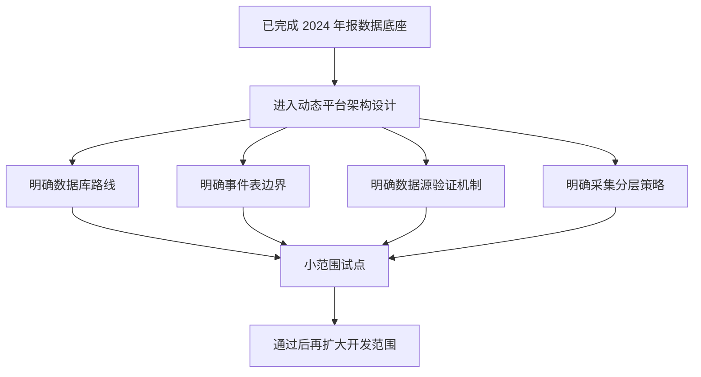

# 当前进展：从 2024 年报数据底座进入动态平台架构设计阶段

_最后更新：2026-06-30_

> **本文件说明「现在具体在做什么」。** 产品大方向见 [ROADMAP.md](ROADMAP.md)；已完成成果见 [CHANGELOG.md](CHANGELOG.md)；详细计划见 [plans/](plans/)。

---

## 当前阶段（一句话）

2024 年报结构化数据底座已经完成；现在进入**动态平台架构设计阶段**，先把数据库路线、事件表边界、数据源验证、采集分层想清楚，再做小范围试点。

---

## 为什么现在不直接写代码

上一阶段交付的是一份**静态的 2024 年报数据库**。要升级成动态平台，涉及数据库选型、事件建模、新数据源接入、采集方式等多个方向。

如果现在直接动手写代码或做全量迁移，风险很高、返工成本大。所以当前阶段先做**架构设计 + 小范围试点准备**，把方向定清楚，再投入开发。

当前阶段的工作逻辑可以理解为先定边界，再做小范围试点：

---

## 现在已有（基础）

| 项目 | 现状 |
|---|---|
| 数据来源 | 主要为 CNINFO 公开年报 PDF |
| 数据集 | `full_market_2024`：6124 家全集，5707 家成功，417 家未找到公告，0 错误 |
| 入库 | `SQLite` 约 62,890 条字段级记录 |
| 抽取字段 | 主营业务、行业讨论、管理层讨论、`rnd_investment`、`revenue_by_region`、`revenue_by_segment`、风险因素、主要子公司等 |
| 证据留存 | 尽量保留来源 PDF、页码、证据句、来源 URL |
| 质量审计 | 自动合理性分数 + 严格质量审计；标签含 `usable` / `partial` / `wrong` / `not_found_missed` |
| 非金融核心指标 | 严格审计 `usable` **9.43/11**；自动合理性分数 **10.67/11**；`rnd_investment` 找到率 **94.2%** |
| 金融公司 | 已有银行 / 券商 / 保险 / 其他金融分类，但标签与子类型仍需人工复核 |

当前系统是**数据底座 + 质量审计层**，不是完整 `RAG` 产品，也不是完整 `LLM Wiki` 产品，更不是动态平台。

---

## 当前正在做

- 梳理「从静态数据库到动态平台」的整体架构方向。
- 明确结构化核心数据库的路线判断（`SQLite` 原型 → 未来候选 `PostgreSQL`）。
- 设计事件表模式，并划清它的边界（只记标准化重要变化）。
- 设计数据源验证机制（候选 → 小样本验证 → 已验证）。
- 设计分层采集策略（`HTTP` / `Playwright` / `BrowserUser`）。
- 设计存储结构：`MinIO` 原始文件层 + `MongoDB` 采集层 + `PostgreSQL` 核心库（`PostgreSQL` 为当前最优先验证方向，非立即全量迁移）。

详见 [plans/dynamic_data_platform_plan.md](plans/dynamic_data_platform_plan.md) 与 [plans/storage_schema_design_plan.md](plans/storage_schema_design_plan.md)。

---

## 下一步准备怎么做

| 步骤 | 内容 |
|---|---|
| 1 | 确认动态平台架构方案（数据库、事件表、采集分层） |
| 2 | 设计 `PostgreSQL` 目标 schema，并做**小样本试点**（不全量迁移） |
| 3 | 选 1–2 个候选数据源做小样本验证，形成验证记录 |
| 4 | 在年报底座上跑通一个事件表最小示例 |

---

## 当前不做什么

- **不**直接做 `SQLite` 到 `PostgreSQL` 的全量迁移（先设计 schema + 小样本试点）。
- **不**直接开发完整 `RAG` / `LLM Wiki` 产品。
- **不**对大量网站做大规模 RPA 抓取。
- **不**在事件表里堆原始文件、所有字段值或抓取日志。
- **不**声称未验证的数据源已可用。

### 三条关键边界

1. **`PostgreSQL` 仍在评估阶段，不是全量迁移。** 它是未来结构化核心数据库的候选，具备支持智能检索原型的技术基础，但具体效果需要小样本测试验证。
2. **数据源清单要通过验证逐步建立。** 流程是「候选数据源 → 小样本验证 → 已验证数据源」，未验证不写「长期稳定可用」。
3. **事件表只记录标准化重要变化。** 它服务于公司时间线与智能推送，不替代原始文件层、字段表和抓取日志。

---

## 老师可以看哪里

| 想了解 | 看这里 |
|---|---|
| 产品大方向、分几个阶段、现在在哪 | [ROADMAP.md](ROADMAP.md) |
| 现在具体在做什么、下一步 | 本文件 |
| 已经完成了什么 | [CHANGELOG.md](CHANGELOG.md) |
| 当前阶段详细计划 | [plans/dynamic_data_platform_plan.md](plans/dynamic_data_platform_plan.md) |
| 存储结构设计（MinIO / MongoDB / PostgreSQL） | [plans/storage_schema_design_plan.md](plans/storage_schema_design_plan.md) |
| 2024 数据底座质量详情 | [stage3_quality_followup_summary.md](outputs/generalization/full_market_2024/stage3_quality_followup_summary.md) |
| 评估方法与术语 | [docs/evaluation_method.md](docs/evaluation_method.md) |

---

## GitHub Projects 看板入口

Project board: [GitHub Projects 看板](https://github.com/users/reagan-nz/projects/1/views/1)

看板用于展示 Todo / In Progress / Review / Done 的实时任务状态。

---

## 本阶段完成标准

- 动态平台架构方向有书面方案（数据库、事件表、数据源验证、采集分层都有明确边界）。
- 小范围试点范围已明确，待老师确认后即可执行。
- 不改动现有代码与数据，2024 数据底座与核心指标保持不变。

---

## 术语表

| 术语 | 含义 |
|---|---|
| `full_market_2024` | 2024 年全 A 股年报抽取运行 |
| `run_name` | 运行名称，标识一次抽取 / 刷新批次 |
| 严格质量审计 | 对已存字段做更严规则复核 |
| 自动合理性分数 | 抽取时的结构合理性估计，通常高于严格审计结果 |
| `usable` / `partial` / `wrong` | 审计标签：可用 / 部分可用 / 错误 |
| `not_found_missed` | PDF 中应有披露但抽取结果为未找到 |
| 事件表 | 记录公司标准化重要变化的表，用于时间线与推送 |
| `PostgreSQL` | 未来结构化核心数据库候选，仍在评估，不立即迁移 |
| `pgvector` | `PostgreSQL` 的向量检索扩展 |
| `Playwright` | 浏览器自动化框架 |
| `BrowserUser` | 浏览器智能体，用于结构不统一的复杂页面 |
| `RAG` | 检索增强问答；尚未构建 |
| `LLM Wiki` | 大模型知识页；尚未构建 |
| CNINFO | 巨潮资讯网，法定信息披露来源 |
| `SQLite` | 当前使用的轻量数据库原型 |

指标详细解释见 [docs/evaluation_method.md](docs/evaluation_method.md)。

---

## 附录：2024 数据底座关键数字

点击展开：full_market_2024 指标、板块分布、近期里程碑

### 非金融公司（工业类 11 字段）

| 指标 | 数值 |
|---|---:|
| 严格审计 `usable`（核心指标） | 9.43 / 11 |
| 自动合理性分数 | 10.67 / 11 |
| `rnd_investment` 找到率 | 94.2% |
| `revenue_by_region` 审计错误 | 38 |
| `revenue_by_segment` 审计错误 | 19 |

### 抽取规模

| 指标 | 数值 |
|---|---:|
| 公司全集 | 6124 |
| 成功抽取 | 5707 |
| 未找到公告 | 417 |
| 技术错误 | 0 |
| `SQLite` 字段记录 | 62,890 |

### 金融公司（单独核心指标，不与非金融混报）

| 类型 | 严格审计 `usable` |
|---|---:|
| 银行 | 9.00 / 13 |
| 券商 | 7.66 / 12 |
| 保险 | 9.25 / 12（仅 2 家，仅供参考） |
| 其他金融 | 5.75 / 8 |

### 板块严格审计 `usable`（非金融）

| 板块 | 指标 |
|---|---:|
| 北交所 bse | 8.82 |
| 沪市主板 sse_main | 9.35 |
| 深市主板 szse_main | 9.43 |
| 科创板 star | 9.61 |
| 创业板 chinext | 9.67 |

> `#32c` 小范围写回未更新全局 9.43/11；全局核心指标需有意安排全量严格质量审计重跑后才变更。

