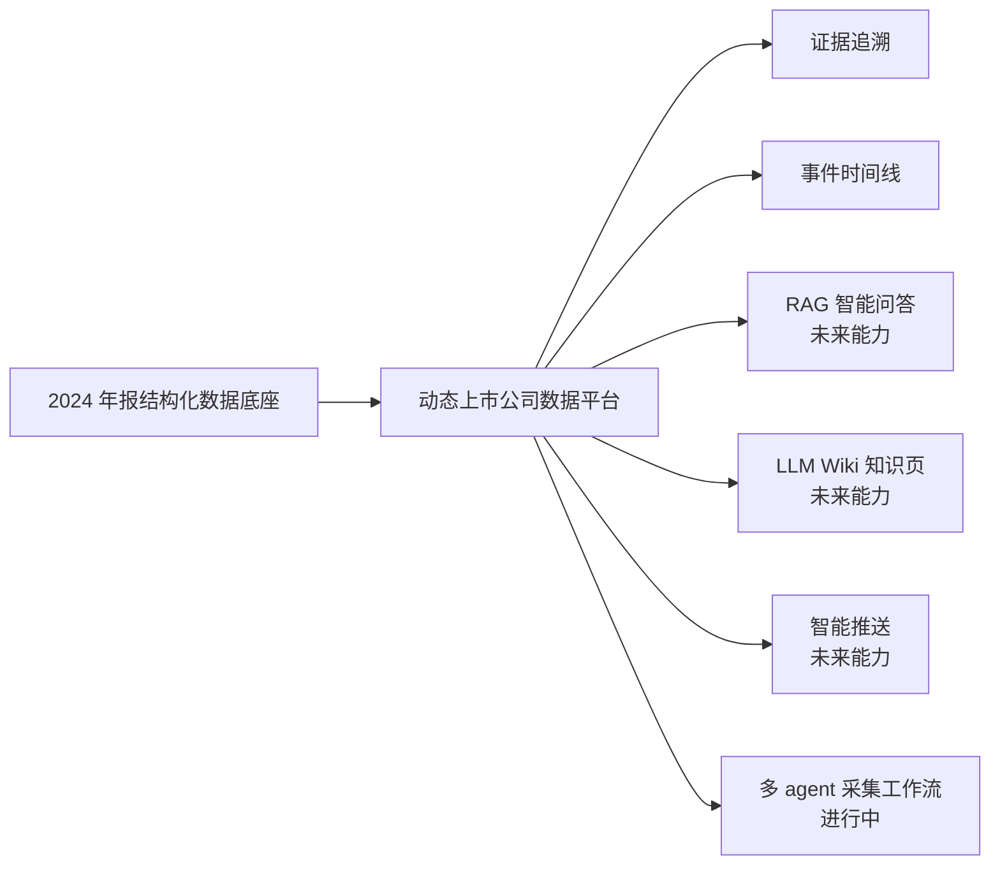

# 上市公司数据平台（在建）

> **第一次看这个仓库？先读 [PROJECT_MAP.md](PROJECT_MAP.md)**：它说明仓库里三代数据方向 + 控制面/多 agent 层分别是什么、每个文件属于哪条线、当前聚焦哪里。当前聚焦见 [CURRENT_STATUS.md](CURRENT_STATUS.md)；工作流寄存器见 [PROJECT_CONTROL.md](PROJECT_CONTROL.md)。

## 项目一句话介绍

从 A 股公开年报 PDF 中批量抽取结构化字段、保留来源证据、运行质量审计，并正在把这份静态数据底座升级为**可持续更新、可证据追溯**的动态上市公司数据平台。当前工程重心是 **CNINFO A–D 类数据采集能力验证**，配套 **Controller + 多 agent 编排**，并把 **runtime 产物与仓库历史分离**。

下面这张图概括了项目从当前数据底座走向未来动态平台的方向：



---

## 当前已经完成什么

| 事项 | 结果 |
|---|---|
| 2024 全市场抽取（`full_market_2024`） | 6124 家全集，5707 家成功，417 家未找到公告，0 错误 |
| 数据入库 | `SQLite` 约 62,890 条字段级记录 |
| 质量审计 | 非金融核心指标 `usable` **9.43/11**，自动合理性分数 **10.67/11**，`rnd_investment` 找到率 **94.2%** |
| 证据留存 | 字段尽量保留来源 PDF、页码、证据句、URL |
| Controller / agents（本地） | policy foundation · runtime ignore boundary · `.cursor/agents` · `PROJECT_CONTROL` 已入仓（**无 verified** · **无 push**） |

当前是**数据底座 + 质量审计层 + CNINFO 能力研究 + 本地自治工作流**，不是完整 `RAG` 产品，也不是完整 `LLM Wiki` 产品，更不是已上线的动态平台。

---

## 当前正在做什么

**CNINFO 数据源能力研究（A/B/C/D 并行）+ Controller 多 agent 编排。**  
类年报 / 公告元数据 / F10 harvest / 市场行为组件按 track 推进；本地可做文档同步、bounded commit、worktree、merge；**push 与不可逆发布需 human**。存储/平台架构设计仍**暂缓全量落地**，等数据源验证透再谈。

详见 [CURRENT_STATUS.md](CURRENT_STATUS.md)、[PROJECT_CONTROL.md](PROJECT_CONTROL.md) 与 [plans/cninfo_data_source_value_inventory.md](plans/cninfo_data_source_value_inventory.md)。

---

## 如何阅读本仓库

| 想了解 | 看这里 |
|---|---|
| 仓库整体结构、每个文件属于哪条线 | [PROJECT_MAP.md](PROJECT_MAP.md) |
| 工作流控制面 / queue / approvals | [PROJECT_CONTROL.md](PROJECT_CONTROL.md) |
| 产品大方向、分几个阶段、现在在哪 | [ROADMAP.md](ROADMAP.md) |
| 现在具体在做什么、下一步 | [CURRENT_STATUS.md](CURRENT_STATUS.md) |
| 已经完成了什么 | [CHANGELOG.md](CHANGELOG.md) |
| 各阶段详细计划 | [plans/README.md](plans/README.md) |
| 当前阶段总体计划 | [plans/dynamic_data_platform_plan.md](plans/dynamic_data_platform_plan.md) |
| 实时任务看板 | 见下方「项目看板入口」 |

---

## 文档入口

- [ROADMAP.md](ROADMAP.md) — 产品大方向
- [CURRENT_STATUS.md](CURRENT_STATUS.md) — 当前小方向
- [PROJECT_CONTROL.md](PROJECT_CONTROL.md) — 控制面寄存器
- [CHANGELOG.md](CHANGELOG.md) — 已完成成果
- [plans/README.md](plans/README.md) — 计划目录说明
- [plans/dynamic_data_platform_plan.md](plans/dynamic_data_platform_plan.md) — 动态平台计划
- [docs/](docs/) — 评估方法、数据库、抽取流程等技术细节

---

## 项目看板入口

Project board: [GitHub Projects 看板](https://github.com/users/reagan-nz/projects/1/views/1)

看板用于展示 Todo / In Progress / Review / Done 的实时任务状态。

---

## 重要边界

- **不是**全量人工验证（62,890 条字段记录未逐条人工核对）。
- **不是**完整 `RAG` 产品，**不是**完整 `LLM Wiki` 产品，**不是**已上线的动态平台。
- **不写** `verified` / `production_ready` 除非有独立证据与 human 口径。
- 金融公司指标与非金融核心指标 **9.43/11 分开报告**，不得混报。
- `PostgreSQL` 仍在评估，**不**立即全量迁移。
- 数据源需经「候选 → 小样本验证 → 已验证」后才声称可用。
- Runtime 重产物与 Git 历史分离；本地 commit ≠ remote publication。

---

## 快速开始

```bash
cd listed_company_data_collector
python -m venv .venv && source .venv/bin/activate
pip install -r requirements.txt
```

```bash
# 单公司抽取（需本地 PDF + 官方 URL）
python lab/extract_annual_report.py \
  --pdf path/to/report.pdf --stock-code 600031 \
  --source-url https://static.cninfo.com.cn/...

# 批量评估（需网络，可断点续跑）
python lab/eval_generalize.py \
  --companies lab/eval_companies_1000.yaml \
  --out outputs/generalization/eval1000 --throttle 1.0
```

---

## 项目结构

```
listed_company_data_collector/
  lab/              # 年报抽取与 CNINFO 验证脚本
  config/           # 公司与数据源配置
  outputs/          # 运行产物（runtime 重产物不提交 Git）
  docs/             # 技术文档
  plans/            # 分阶段详细计划 + controller 策略
  .cursor/agents/   # 多 track executor / reviewer 定义
  PROJECT_CONTROL.md
```
