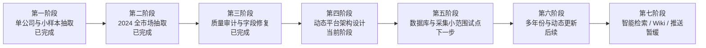

# 产品大方向：从静态年报数据库到动态上市公司数据平台

_最后更新：2026-06-29_

---

## 一句话目标

把现在的「2024 年 A 股年报结构化数据库」逐步升级为一个**可持续更新、可证据追溯、可智能问答**的动态上市公司数据平台。

---

## 为什么不只是年报数据库

现在我们已经有一份高质量的 2024 年报结构化数据底座。但年报是**一年一次的静态快照**，无法回答「这家公司最近发生了什么」「业务和风险有没有变化」这类动态问题。

要真正可用，平台需要在静态底座之上补充：**动态更新、事件时间线、证据追溯、智能检索**。这是从「一份数据」走向「一个平台」的关键。

---

## 产品最终形态

最终希望支持以下能力（按优先级递进，不是一次性全做）：

| 能力 | 说明 |
|---|---|
| 稳定的数据底座 | 结构化字段 + 来源证据，可查询、可审计 |
| 动态更新 | 定期补充新公告、新披露，而非一年一次 |
| 证据追溯 | 每条数据都能回到来源 PDF / 页码 / 句子 / URL |
| 事件时间线 | 把重要变化整理成公司时间线 |
| 智能问答（`RAG`） | 基于结构化数据 + 证据的检索增强问答 |
| 公司知识页（`LLM Wiki`） | 自动整理的公司/行业知识页 |
| 智能推送 | 重要变化主动提醒 |
| 多源数据扩展 | 在年报之外接入更多已验证数据源 |

> 这些是**方向**，不是已经做出来的功能。`RAG`、`LLM Wiki`、智能推送目前都**尚未构建**。

---

## 阶段路线表

| 阶段 | 主题 | 状态 |
|---|---|---|
| 第一阶段 | 单公司与小样本抽取验证 | 已完成 |
| 第二阶段 | 2024 全市场抽取与入库 | 已完成 |
| 第三阶段 | 质量审计与字段修复 | 已完成 |
| **第四阶段** | **动态平台架构设计与小范围试点准备** | **当前阶段** |
| 第五阶段 | 数据库与采集架构小范围试点 | 下一步 |
| 第六阶段 | 多年份扩展与动态更新机制 | 后续待办 |
| 第七阶段 | 智能检索 / 知识页 / 推送原型 | 暂缓 |

下图用阶段图展示当前项目所处位置：

---

## 当前所处阶段

**第四阶段：动态平台架构设计与小范围试点准备。**

当前阶段**不是**直接开发完整产品，而是先把架构方向想清楚，再做小范围试点验证。具体地说，现在要先回答：

- 结构化核心数据库走什么路线（`SQLite` 原型 → 未来候选 `PostgreSQL`）？
- 事件表记录什么、不记录什么？
- 新数据源怎么验证后再接入？
- 采集分层怎么设计（`HTTP` / `Playwright` / `BrowserUser`）？

详细计划见 [plans/dynamic_data_platform_plan.md](plans/dynamic_data_platform_plan.md)。

---

## 每个阶段的完成标准

| 阶段 | 完成标准 |
|---|---|
| 第一阶段 | 抽取器在多板块、多行业上稳定可用 |
| 第二阶段 | 全 A 股 2024 年报抽取 + 入库 + 首次质量审计完成 |
| 第三阶段 | 非金融核心指标稳定（当前 `usable` 9.43/11），残留问题已文档化 |
| 第四阶段 | 架构方向有书面方案；事件表、数据库、采集分层有明确边界；试点范围明确 |
| 第五阶段 | 至少 1 个数据库方案 + 1 个数据源小范围试点完成并有验证记录 |
| 第六阶段 | 形成可重复的动态更新机制 |
| 第七阶段 | 至少 1 个智能检索 / 知识页原型可演示 |

---

## 未来能力（方向，尚未构建）

- `RAG` 智能问答
- `LLM Wiki` 公司知识页
- 智能推送 / 通知
- 多源动态数据接入

---

## 暂时不做什么

- **不**直接做 `SQLite` 到 `PostgreSQL` 的全量迁移。
- **不**直接开发完整 `RAG` 产品。
- **不**直接开发完整 `LLM Wiki` 产品。
- **不**直接对大量网站做大规模 RPA 抓取。
- **不**在未验证的情况下声称某数据源「长期稳定可用」。

> 当前阶段不是直接开发完整产品，而是先完成动态平台架构设计和小范围试点准备。

---

## 计划文件入口

- [plans/README.md](plans/README.md) — 计划目录说明
- [plans/dynamic_data_platform_plan.md](plans/dynamic_data_platform_plan.md) — 当前阶段总体计划
- [CURRENT_STATUS.md](CURRENT_STATUS.md) — 当前小方向与下一步
- [CHANGELOG.md](CHANGELOG.md) — 已完成的阶段成果

---

## GitHub Projects 看板入口

Project board: [GitHub Projects 看板](https://github.com/users/reagan-nz/projects/1/views/1)

看板用于展示 Todo / In Progress / Review / Done 的实时任务状态。
