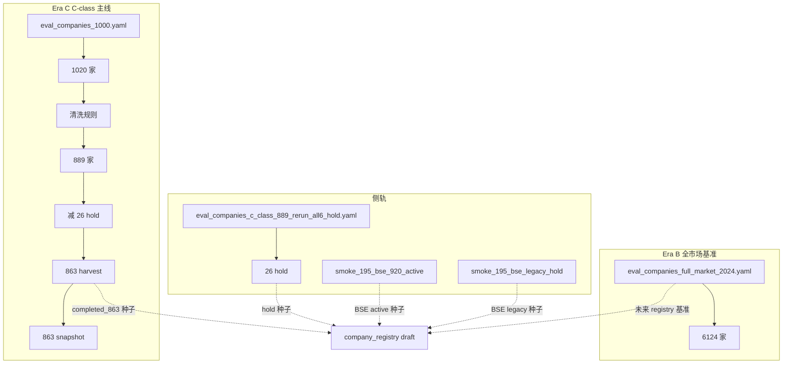
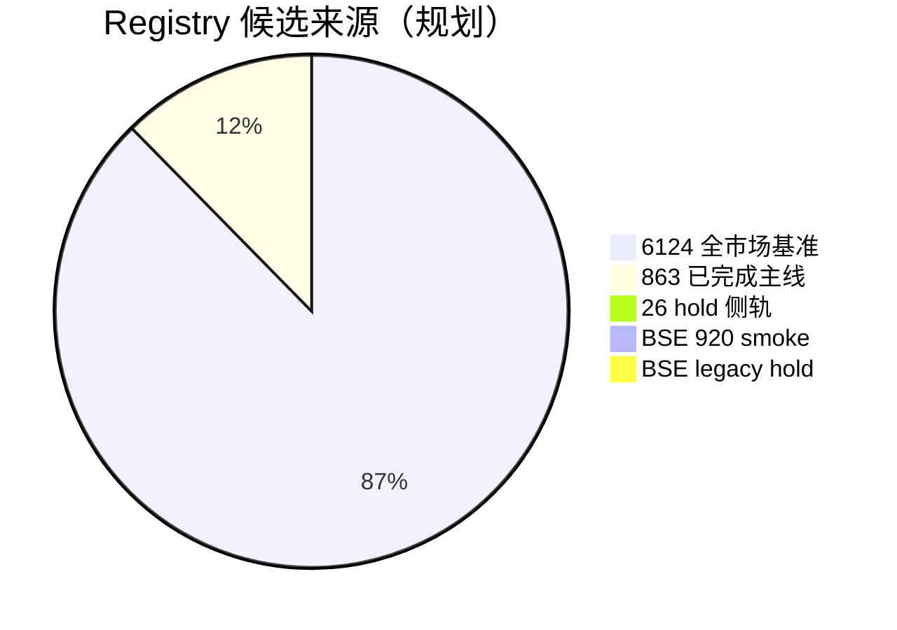

# CNINFO C-Class Company Registry Lineage 设计

_生成时间：2026-07-08_

> **性质：** universe 血缘与 registry 候选构成设计。**仅规划** · **不生成 registry 数据**。

**C-class 状态：** `SNAPSHOT_GENERATED_QA_REVIEW`

**依据：** [company registry design](../../plans/cninfo_c_class_company_registry_design.md) · [full market universe design](cninfo_c_class_full_market_universe_design.md)

---

## 1. 血缘总览

---

## 2. Era B：全市场基准（6124）

| 属性 | 值 |
|------|-----|
| **文件** | `lab/eval_companies_full_market_2024.yaml` |
| **规模** | **6124** 家 |
| **角色** | 全市场 universe 基准；registry **最大候选池** |
| **registry 映射** | `source=full_market_2024` · `harvest_support_status=unsupported`（默认） |

**与 863 关系：** 6124 ⊃ 863；863 为 Era C 已验证子集。

---

## 3. Era C：1000 → 889 → 863 清洗链

| 阶段 | 文件 / 规则 | 规模 | 说明 |
|------|-------------|------|------|
| 起点 | `eval_companies_1000.yaml` | 1020 | Era C 评估 universe |
| 清洗 | name_delisted / name_suffix_tui 等 | 889 | 排除退市、*ST 后缀等 |
| hold 剔除 | `eval_companies_c_class_889_rerun_all6_hold.yaml` | 26 | all6 HTTP 500 / 不可达 |
| **harvest 主线** | `eval_companies_c_class_harvest_863_non_bse.yaml` | **863** | 已完成 harvest |
| **snapshot** | `outputs/snapshot/cninfo_c_class/full/*.json` | **863** | `complete_with_caveat` |

**registry 映射：**

- 863 条：`harvest_support_status=completed_863` · `snapshot_support_status=completed_863`
- 26 hold：`hold_flag=true` · `harvest_support_status=hold`
- 889−863=26：与 hold YAML 一一对应

---

## 4. 侧轨 universe

### 4.1 Hold 侧轨（26 家）

| 属性 | 值 |
|------|-----|
| **文件** | `lab/eval_companies_c_class_889_rerun_all6_hold.yaml` |
| **规模** | 26 |
| **政策** | [hold company policy](../../plans/cninfo_c_class_hold_company_policy.md) Option B |
| **registry** | `hold_flag=true` · 独立 universe slice |

### 4.2 BSE 920 active

| 属性 | 值 |
|------|-----|
| **文件** | `lab/eval_companies_c_class_smoke_195_bse_920_active.yaml` |
| **registry** | `bse_flag=bse_920` · `harvest_support_status=supported`（待扩样） |

### 4.3 BSE legacy 83/87

| 属性 | 值 |
|------|-----|
| **文件** | `lab/eval_companies_c_class_smoke_195_bse_legacy_hold.yaml` |
| **registry** | `bse_flag=bse_legacy_83_87` · `hold_flag=true` · `unsupported` |

---

## 5. 未来 registry 候选构成

**合并规则（设计，未实现）：**

1. **主键：** `company_id` = `{exchange}:{org_id}`（org_id 缺失时用 code 降级）
2. **优先级：** `completed_863` > `hold` > `full_market_2024` 默认
3. **冲突：** 同 org_id 多 code → `org_id_conflict_flag=true` · canonical 取 `current_code`（920 优先于 83/87）
4. **去重：** 6124 与 863 交集以 863 质量元数据覆盖

---

## 6. Lineage 字段在 registry 中的表达

| lineage 概念 | registry 字段 |
|--------------|---------------|
| 来自哪份 YAML | `source` |
| 是否在 863 主线 | `harvest_support_status=completed_863` |
| 是否在 hold 侧轨 | `hold_flag` |
| 全市场基准成员 | `source` 含 `full_market_2024` |
| BSE 分层 | `bse_flag`（扩展）· `legacy_code` · `current_code` |

---

## 7. 与 snapshot / harvest 的衔接

| 下游 | 当前输入 | 未来输入 |
|------|----------|----------|
| harvest | `eval_companies_c_class_harvest_863_non_bse.yaml` | registry 过滤 `harvest_support_status in (supported, completed_863)` |
| snapshot | 同上 + harvest 输出 | registry 过滤 `snapshot_support_status` |
| QA | status/error CSV | registry `notes` + quality 字段 |

---

## 8. 红线

- 不派生 registry YAML/JSON
- 不修改现有 eval YAML
- 不 harvest · 不 snapshot 重跑

**下一步：** registry schema 审批 → `derive_cninfo_c_class_company_registry_draft.py` 设计
