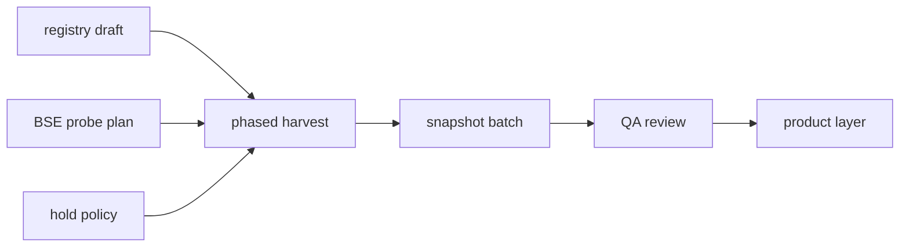

# CNINFO C-Class Full Market Expansion Planning Summary

_生成时间：2026-07-08_

> 全市场扩展架构规划摘要。**仅规划** · **不执行扩展** · **无 CNINFO**

**C-class 状态：** `SNAPSHOT_GENERATED_QA_REVIEW`

---

# Current State

| 项 | 状态 |
|----|------|
| C-class harvest | **863 non-BSE** · `PASS_WITH_RESUME` |
| normalized + field governance | field freeze · promotion 完成（74 normalized_core） |
| snapshot | **863 JSON** · 全部 `complete_with_caveat` |
| snapshot QA | **863/863** valid JSON · test 5/5 PASS |
| 当前 gate | `SNAPSHOT_GENERATED_QA_REVIEW` |
| verified / testing_stable_sample | **无** |

---

# Expansion Goal

| 项 | 目标 |
|----|------|
| 从 | **863** non-BSE validated universe |
| 到 | **A 股全市场**（基准 ~**6124** · `eval_companies_full_market_2024.yaml`） |
| 范围 | Universe → Harvest → Snapshot → QA 完整链路 |
| 本轮 | **仅架构规划**，不执行 |

---

# Remaining Blockers

| # | Blocker | 优先级 | 说明 |
|---|---------|--------|------|
| 1 | **company_registry 未建立** | P0 | 当前依赖分散 YAML；全市场须统一主数据层 |
| 2 | **6124 与 CNINFO 未交叉验证** | P0 | Era B 年报 universe ≠ C-class F10 可达列表 |
| 3 | **BSE legacy 83/87 不兼容** | P0 | `legacy_code_incompatible` · 须 mapping probe |
| 4 | **26 all6 hold 政策待固化** | P1 | 推荐 Option B 侧轨，未执行 |
| 5 | **4 源仍为 candidate** | P2 | industry/business/contact/dividend YAML 未升格 testing |
| 6 | **5000+ 规模未验证** | P1 | harvest/snapshot runner 仅 863 实测 |
| 7 | **security observe 产品决策** | P2 | market_behavior/risk_profile partial 待决策 |
| 8 | **增量更新机制未设计** | P2 | 缺 stale_flag / delta harvest 规划 |

---

# Recommended Execution Order

| 阶段 | 任务 | 本轮 |
|------|------|------|
| **1** | company_registry draft 派生（从 6124 + 现有 YAML） | 规划完成 · **不执行** |
| **2** | BSE 920 子 universe smoke 计划 + legacy targeted probe 计划 | 规划完成 · **不执行** |
| **3** | hold 政策固化（Option B）+ hold recheck 模板 | 规划完成 · **不执行** |
| **4** | non-BSE phased harvest 批次计划（200–500/批） | 待下轮规划 |
| **5** | phased harvest 执行（须 `--approve-full-market-harvest`） | **禁止本轮** |
| **6** | full market snapshot batch | **禁止本轮** |
| **7** | full market QA review | **禁止本轮** |
| **8** | product layer / security observe 决策 | 可与阶段 1–3 并行 |

---

# Not Included

本轮 **明确不做**：

- **不实现** registry backfill / 不生成全量公司名单
- **不请求** CNINFO · **不执行** live
- **不执行** harvest · **不生成** full market snapshot JSON
- **不修改** raw / normalized / field_inventory / mapper
- **不 DB** · **不 MinIO** · **不 RAG**
- **不写** verified · **不升级** testing_stable_sample
- **不修改** B/D/Phase1 轨道

---

# 规划产物索引

| 文档 | 路径 |
|------|------|
| Universe Registry Plan | [cninfo_c_class_full_market_universe_registry_plan.md](../../plans/cninfo_c_class_full_market_universe_registry_plan.md) |
| Universe Design | [cninfo_c_class_full_market_universe_design.md](cninfo_c_class_full_market_universe_design.md) |
| BSE Expansion Strategy | [cninfo_c_class_bse_expansion_strategy.md](../../plans/cninfo_c_class_bse_expansion_strategy.md) |
| Hold Company Policy | [cninfo_c_class_hold_company_policy.md](../../plans/cninfo_c_class_hold_company_policy.md) |
| Harvest Architecture | [cninfo_c_class_full_market_harvest_architecture.md](../../plans/cninfo_c_class_full_market_harvest_architecture.md) |
| Readiness Matrix | [cninfo_c_class_full_market_readiness_matrix.csv](cninfo_c_class_full_market_readiness_matrix.csv) |

---

## 红线确认

- 全市场扩展 **仅完成架构规划**
- C-class 保持 **`SNAPSHOT_GENERATED_QA_REVIEW`**
- 下一步建议：**registry draft 派生脚本设计** 或 **product layer / security observe 决策**
