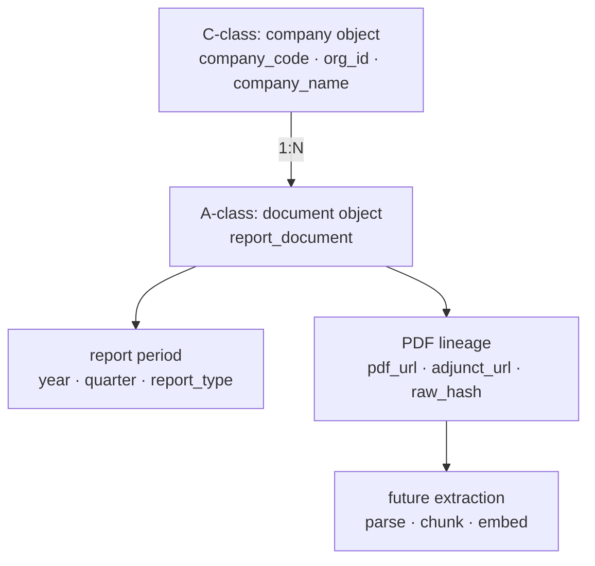

# CNINFO A 类定期报告元数据层架构计划

_最后更新：2026-07-09_

> **性质：** 规划文档 only；不调用 CNINFO；不下载 PDF；不写 verified；不入库。  
> **前置：** [cninfo_data_source_layered_inventory.md](cninfo_data_source_layered_inventory.md) §4 · [cninfo_report_phase1_final_summary.md](../outputs/validation/cninfo_report_phase1_final_summary.md) · [cninfo_c_vs_b_vs_d_boundary.md](cninfo_c_vs_b_vs_d_boundary.md)  
> **并行约束：** C-class Phase 3 batch 500 live harvest 可能正在运行；本计划不触碰 `outputs/harvest/cninfo_c_class/phase3_batch_500_001/`；不修改 B-class / C-class 既有输出。

---

## 1. A-class Purpose

A-class 是 CNINFO **定期报告文档证据层**（periodic report metadata layer）。

它回答：

> **"What official documents explain this company?"**

覆盖报告类型：

- **annual reports**（年报）
- **semi-annual reports**（半年报）
- **quarterly reports**（一季报、三季报）

A-class 的核心价值不是解析 PDF 正文，而是把每家公司、每个报告期的**官方披露文档**登记为可追溯的 document 对象：

- 按 `company_code` 发现定期报告公告；
- 保留 `announcement_title`、`publish_date`、`report_period`、`report_type`；
- 登记 `pdf_url` / `adjunct_url` 与 `source_endpoint` 形成 PDF lineage；
- 为后续 PDF 下载、解析、chunk、RAG 预留对象与状态字段，但**不在 Phase 0 执行**。

A-class **不是** C-class F10 / company profile 层。C-class 回答「公司静态画像字段是什么」；A-class 回答「这家公司有哪些官方定期报告文档、PDF 链接在哪里」。

A-class 与 B-class 的边界：B-class 承接**非定期公告事件流**（董事会决议、股东大会等）；A-class 专注**周期性披露报告**（年报 / 半年报 / 季报）。二者可共享 `hisAnnouncement/query` endpoint，但对象模型与验证口径分离。

---

## 2. Relationship Chain



| 层级 | 类 | 数据单元 | 关系说明 |
|------|-----|----------|----------|
| **公司** | C-class | `company_code` / `org_id` / profile snapshot | A-class 通过 `company_code` 关联 C-class 公司身份；**不 merge identity** |
| **文档** | A-class | `report_document` | 每份定期报告 = 一条 document 记录；主键候选 `document_id` |
| **报告期** | A-class | `report_period_snapshot` | 公司 × 年 × 季 × 报告类型的期望/实际覆盖视图 |
| **PDF 谱系** | A-class | `document_lineage` | URL 登记、检索时间、响应 hash；Phase 0 **不下载正文** |
| **未来抽取** | Later | parse / chunk / citation | 独立批准；不在本计划范围 |

关系原则：

1. **company → document**：一家公司可有多份 `report_document`（按报告期 × 报告类型）。
2. **document → report period**：每份 document 必须可解析或登记 `report_period`；与 `report_period_snapshot` 对齐。
3. **document → PDF lineage**：`pdf_url` 来自 CNINFO `adjunctUrl`；`lineage_status` 跟踪发现/链接/待审状态。
4. **lineage → future extraction**：`document_lineage.storage_status` 预留 `not_attempted`；解析层 deferred。

---

## 3. Relationship With Other Classes

| 类 | 职责 | 与 A-class 关系 |
|----|------|-----------------|
| **A-class** | 定期报告 metadata + PDF URL lineage | 本层 |
| **B-class** | 非定期公告 / 事件文档 metadata | 共享 `hisAnnouncement/query`；A-class 的 periodic 结果可作为 B-class `periodic_report_pdf` 源的输入，但对象模型分离 |
| **C-class** | 公司 profile / F10 结构化画像 | 提供 `company_code` / `org_id` / `company_name`；A-class 不替代 C-class harvest |
| **D-class** | 固定结构化 CNINFO 表格 | 与 A-class 无直接竞争；D-class 事件可引用 A-class document 作为 PDF 证据 |

---

## 4. Core Data Objects

以下为 A-class Phase 0/1 目标逻辑对象（当前仅设计，不建表）：

### Object 1: report_document

定期报告文档主记录。对应 `hisAnnouncement/query` 返回的一条匹配公告，提升为可进入 evidence corpus 的 document 单元。

| 字段 | 类型 | 必填 | 说明 |
|------|------|------|------|
| `document_id` | string | yes | 逻辑文档主键；候选 = `announcement_id` 或 `company_code` + `report_type` + `report_period` 复合 |
| `company_code` | string | yes | 证券代码；关联 C-class company |
| `company_name` | string | no | 公司简称 |
| `report_type` | enum | yes | `annual_report` / `semi_annual_report` / `quarterly_report_q1` / `quarterly_report_q3` |
| `report_period` | date/string | yes | 报告期（如 `2024-12-31`）；不可为 `unknown` 才算 effective found |
| `publish_date` | date | yes | 披露日（由 `announcementTime` 归一化） |
| `announcement_id` | string | yes | CNINFO `announcementId` |
| `announcement_title` | string | yes | 公告标题 |
| `pdf_url` | uri | no | `adjunctUrl` 派生的完整静态 PDF URL |
| `adjunct_url` | string | no | CNINFO 原始 `adjunctUrl` 字段 |
| `source_endpoint` | uri | yes | 如 `https://www.cninfo.com.cn/new/hisAnnouncement/query` |
| `retrieval_time` | datetime | yes | 元数据抓取时间 |
| `raw_hash` | string | no | 原始响应或规范化 metadata 的 hash（**非 PDF 文件 hash**） |
| `lineage_status` | enum | yes | 如 `discovered` / `linked` / `needs_review` / `not_found` |
| `quality_status` | enum | yes | 如 `pass` / `caveat` / `blocked` / `needs_review` |

与 Phase 1 A-class retrieval 对齐：

- effective found 定义见 [cninfo_report_phase1_final_summary.md](../outputs/validation/cninfo_report_phase1_final_summary.md)
- title exclusion 与 period match 逻辑继承 `lab/validate_cninfo_report_coverage.py`

### Object 2: report_period_snapshot

公司报告期覆盖视图。按 `company_code` 聚合期望报告期与实际 `document_id` 的映射。

| 字段 | 类型 | 必填 | 说明 |
|------|------|------|------|
| `company_code` | string | yes | 证券代码 |
| `year` | integer | yes | 会计年度 |
| `quarter` | integer | no | 1 / 2 / 3 / 4；年报可为 null 或 4 |
| `report_type` | enum | yes | 与 `report_document.report_type` 一致 |
| `document_id` | string | no | 命中时的 `report_document.document_id`；未命中为 null |
| `available_sections` | array | no | 未来解析后可填章节列表；Phase 0 为空或 `not_parsed` |

用途：

- 支撑 per-company coverage% 计分（company × report_type × expected_period）
- 服务 QA、缺口分析、增量 harvest 窗口设计
- Phase 0 仅作为读模型设计，不生成全市场 snapshot

### Object 3: document_lineage

PDF URL 与文件谱系登记层。当前阶段**只登记 URL 与 metadata hash，不下载正文**。

| 字段 | 类型 | 必填 | 说明 |
|------|------|------|------|
| `source_url` | uri | no | 页面或 referer URL |
| `download_time` | datetime | no | Phase 0 固定 null；未来 PDF 下载时填写 |
| `file_hash` | string | no | Phase 0 固定 null；未来 PDF 内容 hash |
| `file_size` | integer | no | Phase 0 固定 null |
| `mime_type` | string | no | 默认假设 `application/pdf`；未经验证 |
| `storage_status` | enum | yes | Phase 0 值：`not_attempted`；未来：`stored` / `failed` |
| `version` | integer | yes | lineage 版本号；初版 = 1 |

与 `report_document` 关系：1:1 或 1:N（同一 document 多次检索可产生 version 递增）。

---

## 5. Minimum Fields Summary

Phase 1 最小字段集详见 [cninfo_a_class_phase1_minimum_fields.csv](../outputs/validation/cninfo_a_class_phase1_minimum_fields.csv)。

required_level 分三档：

- **required**：Phase 1 metadata capture 门禁字段
- **recommended**：强烈建议保留，缺失需 QA flag
- **future**：PDF 下载 / 解析 / 存储层字段，Phase 0 仅登记占位

---

## 6. Boundary

### Phase 0 / Phase 1 明确不做

- **不调用 CNINFO**（本规划轮）
- **不 live harvest**
- **不下载 PDF**
- **不解析 PDF 正文**
- **不 OCR / chunk / embed / RAG**
- **不接 DB / MinIO**
- **不写 verified**
- **不升级 testing_stable_sample**
- **不 merge identity**
- **不修改 C-class / B-class 既有输出**

### Phase 0 / Phase 1 仅做

1. **架构与对象设计**：冻结 `report_document` / `report_period_snapshot` / `document_lineage`
2. **source discovery 离线规划**：endpoint 候选、字段预期、风险与 validation plan
3. **readiness matrix**：评估各组件就绪度
4. **minimum field catalog**：Phase 1 字段目录
5. **继承 Phase 1 retrieval 证据**：`validate_cninfo_report_coverage.py` 与 P1 summary 作为设计输入

### 与既有 A-class Phase 1 工作的关系

仓库中已有 A-class per-company coverage 验证（94.10% effective coverage · testing/usable candidate）。本架构计划把 A-class **从 coverage 验证收敛到 document evidence 层设计**：

- Phase 1 retrieval 脚本与 CSV 保留为**验证证据**；
- 新一轮 A-class 重启点 = **report metadata objects + PDF lineage + readiness**；
- 不在本轮回溯修改 Phase 1 跑次结果。

---

## 7. Recommended Phase Sequence

| Phase | 名称 | 内容 | Gate |
|-------|------|------|------|
| **Phase 0** | architecture + source discovery | 离线对象设计、候选源盘点、readiness matrix | `DESIGN_STARTED` |
| **Phase 1** | metadata schema freeze + offline fixtures | 字段目录冻结、离线 fixture 骨架、registry 草案 | `READY_FOR_SCHEMA_REVIEW` |
| **Phase 2** | controlled live metadata | 显式批准后的小样本 live metadata harvest（仍不下载 PDF） | `READY_FOR_APPROVAL` |
| **Later** | PDF download / parse / RAG | 独立批准；不在本计划范围 | deferred |

---

## 8. Gate

```text
a_class_initial_planning_gate = DESIGN_STARTED
```

下一步见 [cninfo_a_class_source_discovery_plan.md](cninfo_a_class_source_discovery_plan.md) 与 [cninfo_a_class_initial_planning_summary.md](../outputs/validation/cninfo_a_class_initial_planning_summary.md)。
