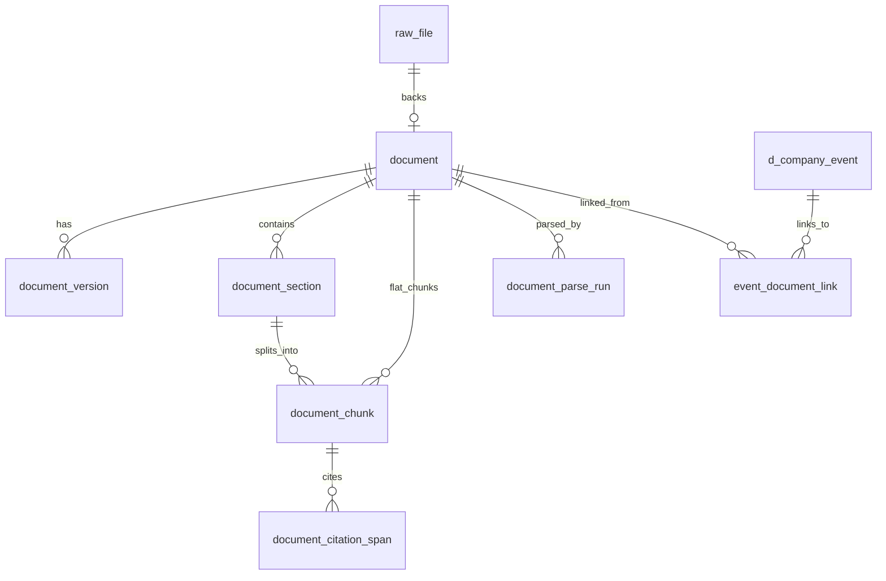

# CNINFO B 类 Document Model Draft

_最后更新：2026-07-05_

> **性质：** 逻辑模型草案；不建表、不下载、不解析、不 chunk。  
> **上级：** [cninfo_b_class_corpus_design.md](cninfo_b_class_corpus_design.md)  
> **边界：** [cninfo_b_vs_d_class_boundary.md](cninfo_b_vs_d_class_boundary.md)

---

## 1. 目标

定义 B 类 **document corpus** 的逻辑对象、字段与关系，供未来：

- 承接 Phase 1 A 类 retrieval 结果；
- 承接 B 类公告 category corpus；
- 驱动 parse → chunk → embed → RAG / LLM Wiki；
- 与 D 类 event 通过 linkage 表关联。

**类比：** D 类有 `d_company_event`、`d_raw_record_snapshot` 等逻辑表（见 [schemas/d_class/](../schemas/d_class/)）；B 类本文档为 **同级逻辑模型**，**当前无 JSON Schema 文件、无 migration**。

---

## 2. raw_file

物理或逻辑文件层。当前阶段 **可不实际下载**，`storage_uri_candidate` 可为空。

| 字段 | 类型 | 必填 | 说明 |
|------|------|------|------|
| `raw_file_id` | string | yes | 逻辑主键 |
| `source_url` | uri | yes | 原始 URL（通常 = CNINFO `pdf_url`） |
| `download_status` | enum | yes | `not_attempted` / `downloaded` / `download_failed` / `skipped` |
| `sha256_candidate` | string | no | 下载后文件 hash；当前为空 |
| `mime_type` | string | no | 如 `application/pdf` |
| `file_size_candidate` | integer | no | 字节数 |
| `storage_uri_candidate` | string | no | 对象存储 URI；**当前为空** |
| `fetch_time` | datetime | no | 下载时间 |
| `notes` | string | no | 如「设计阶段仅登记 URL」 |

---

## 3. document

业务文档单元 — corpus 的核心对象。

| 字段 | 类型 | 必填 | 说明 |
|------|------|------|------|
| `document_id` | string | yes | 逻辑主键 |
| `raw_file_id` | string | no | 关联 raw_file；未下载时可空 |
| `source_id` | string | yes | 如 `cninfo_report_retrieval`、`cninfo_announcement_category` |
| `company_code` | string | yes | 证券代码 |
| `company_name` | string | no | 简称 |
| `org_id` | string | no | CNINFO orgId |
| `title` | string | yes | 公告 / 报告标题 |
| `document_type` | enum | yes | 见 corpus design §5 |
| `report_period` | date | no | 报告类必填；公告常空 |
| `announcement_date` | date | no | 披露日 |
| `pdf_url` | uri | no | CNINFO 静态链接；`not_found` 时为空 |
| `retrieval_status` | enum | yes | found / not_found / title_excluded / … |
| `classification_confidence` | enum | no | high / medium / low / unknown |
| `created_at` | datetime | yes | |

**扩展 metadata（document 级 status，与 corpus design §7 对齐）：**

| 字段 | 说明 |
|------|------|
| `parse_status` | not_started / parsed_text / … |
| `chunk_status` | not_started / chunked / … |
| `embedding_status` | not_started / skipped / … |
| `language` | 默认 zh-CN |
| `page_count_candidate` | parse 后填充 |
| `source_confidence` | 检索 + 分类综合置信度 |
| `raw_metadata_json` | CNINFO 原始公告对象（lineage） |

---

## 4. document_version

处理同一逻辑文档的修订、补充、更正公告。

| 字段 | 类型 | 必填 | 说明 |
|------|------|------|------|
| `document_version_id` | string | yes | 逻辑主键 |
| `document_id` | string | yes | 父 document |
| `version_no` | integer | yes | 从 1 递增 |
| `title` | string | yes | 该版本标题 |
| `pdf_url` | uri | no | 该版本 PDF |
| `announcement_date` | date | no | 该版本披露日 |
| `is_current` | boolean | yes | 是否当前有效版本 |
| `change_reason` | string | no | 如「更正公告」「补充披露」 |
| `raw_metadata_json` | object | no | 该版本原始 metadata |

**典型场景：** 年报更正公告、`(修订稿)` 标题；旧版本 `is_current=false` 但保留审计。

---

## 5. document_section

解析后的章节 / 结构单元。

| 字段 | 类型 | 必填 | 说明 |
|------|------|------|------|
| `section_id` | string | yes | 逻辑主键 |
| `document_id` | string | yes | 父 document |
| `section_title` | string | no | 章节标题 |
| `section_path` | string | no | 层级路径，如 `3/3.1/3.1.2` |
| `page_start` | integer | no | 起始页 |
| `page_end` | integer | no | 结束页 |
| `section_type` | enum | no | `toc` / `mda` / `financial_statement` / `governance` / `other` |
| `parse_confidence` | enum | no | 章节边界识别置信度 |

---

## 6. document_chunk

RAG 检索与 LLM context 的基本单元。

| 字段 | 类型 | 必填 | 说明 |
|------|------|------|------|
| `chunk_id` | string | yes | 逻辑主键 |
| `section_id` | string | no | 所属 section；可无 section 的 flat chunk |
| `document_id` | string | yes | 父 document |
| `chunk_index` | integer | yes | 文档内顺序 |
| `text` | string | yes | chunk 正文 |
| `token_count_candidate` | integer | no | 估算 token 数 |
| `page_start` | integer | no | |
| `page_end` | integer | no | |
| `chunk_strategy` | string | no | 如 `fixed_512_tokens`、`section_aware`、`page_based` |
| `quality_flags` | array[enum] | no | 见 §9 |

---

## 7. document_citation_span

可回溯的证据引用片段 — LLM Wiki / Q&A 的 citation 锚点。

| 字段 | 类型 | 必填 | 说明 |
|------|------|------|------|
| `citation_id` | string | yes | 逻辑主键 |
| `document_id` | string | yes | |
| `chunk_id` | string | no | 关联 chunk；可独立于 chunk 存 span |
| `page_no` | integer | no | PDF 页码 |
| `span_start` | integer | no | 页内或全文字符偏移 |
| `span_end` | integer | no | |
| `quote_text` | string | yes | 引用原文 |
| `citation_confidence` | enum | no | high / medium / low |

---

## 8. document_parse_run

单次解析运行的血缘记录（类比 D 类 `d_source_validation_run`）。

| 字段 | 类型 | 必填 | 说明 |
|------|------|------|------|
| `parse_run_id` | string | yes | |
| `document_id` | string | yes | |
| `parser_name` | string | yes | 如 `pymupdf`、`pdfplumber` |
| `parser_version` | string | no | |
| `parse_status` | enum | yes | parsed_text / parsed_partial / parse_failed / … |
| `page_count` | integer | no | |
| `text_length` | integer | no | 提取字符数 |
| `error_message` | string | no | |
| `created_at` | datetime | yes | |

---

## 9. document quality flags

`document_chunk.quality_flags` 或 `document` 级标记，枚举建议：

| flag | 说明 |
|------|------|
| `scanned_pdf_candidate` | 疑似扫描件，OCR 质量风险 |
| `table_heavy` | 表格密集，chunk 易断裂 |
| `image_heavy` | 图片为主，文本稀少 |
| `title_mismatch` | 标题与预期 document_type 不符 |
| `period_mismatch` | 报告期与预期不符 |
| `duplicate_candidate` | 疑似重复公告 / 重复 retrieval |
| `low_text_density` | 页文本过少 |
| `parse_failed` | 解析失败标记 |

---

## 10. 与 D 类 event 的 linkage

**逻辑表：`event_document_link`**（未来物理表或 join 视图）

| 字段 | 类型 | 说明 |
|------|------|------|
| `link_id` | string | 主键 |
| `event_id` | string | D 类 `d_company_event.event_id` |
| `document_id` | string | B 类 document |
| `link_type` | enum | 见下 |
| `link_confidence` | enum | high / medium / low |
| `evidence_note` | string | 人工或规则说明 |

### link_type 枚举

| link_type | 说明 |
|-----------|------|
| `source_announcement` | D 类 event 的源披露公告（最强） |
| `same_company_same_date` | 同公司同日公告弱关联 |
| `title_match` | 标题关键词匹配 |
| `manual_link` | 人工标注 |
| `inferred_link` | 模型推断，需低置信展示 |

**示例：** `equity_pledge` 的 `DECLAREDATE` + `SECCODE` → 检索「股权质押」公告 PDF → `source_announcement`。

**反例：** `margin_trading` 日度 metric **无**对应单一公告 document — 不应强行 link。

---

## 11. 对象关系图

> `d_company_event` 为 D 类逻辑表，非 B 类物理表；link 为跨层关联。

---

## 12. 当前不实现

| 不实现 | 说明 |
|--------|------|
| 建 SQL 表 / migration | 逻辑草案 only |
| 下载 PDF | storage_uri 为空 |
| 解析 / chunk / embed | 对象定义预留 |
| JSON Schema 文件 | 下一步可增 `schemas/b_class/` |
| 与 Phase 1 CSV 的自动导入脚本 | 未来离线 seed |

---

## 13. 与 D 类模型对照

| B 类 | D 类 analog |
|------|-------------|
| `document` | `d_company_event`（不同语义） |
| `raw_file` | `d_raw_record_snapshot`（文件 vs JSON row） |
| `document_parse_run` | `d_source_validation_run` |
| `event_document_link` | 无 D 类内置；跨层 join |
| `quality_flags` | D 类 `field_confidence` + `uncertain` fields |

详见 [cninfo_b_vs_d_class_boundary.md](cninfo_b_vs_d_class_boundary.md)。
