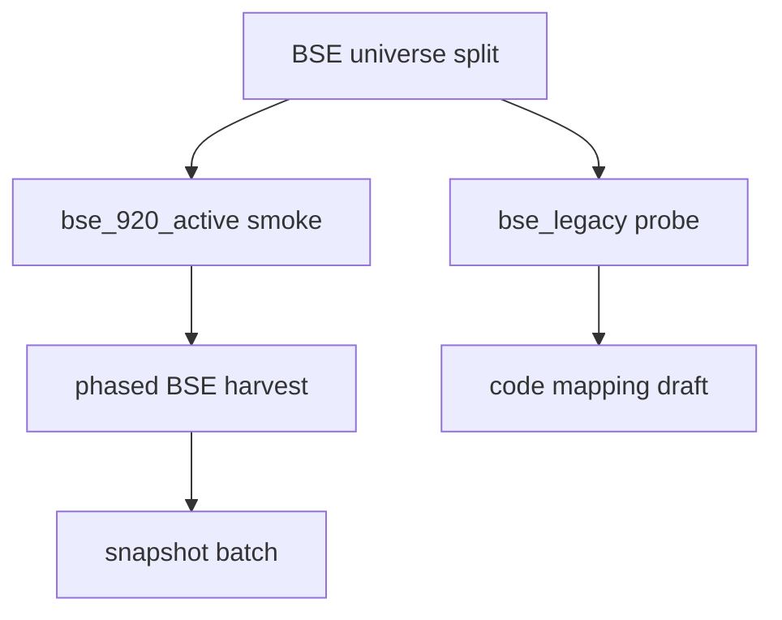

# CNINFO C-Class BSE 扩展策略

_生成时间：2026-07-08_

> **性质：** 北交所（BSE）纳入 C-class 全市场扩展的**策略规划**。**仅规划** · **不执行 probe** · **不写 verified**。

**C-class 状态：** `SNAPSHOT_GENERATED_QA_REVIEW`

**依据：** [BSE diagnosis](../outputs/validation/cninfo_c_class_scale_smoke_200_bse_diagnosis.md) · [universe split](cninfo_c_class_universe_split_and_sample_cleaning_plan.md) · [source status decision](cninfo_c_class_source_status_decision.md)

---

## 1. 当前状态

| 项 | 结论 |
|----|------|
| 863 主线 | **explicitly non-BSE**（889 母本已排除 106 家 `board_bse`） |
| BSE 整体 | **非整体不可用** — 须分 **920 新代码** vs **83/87 legacy** |
| 主 gate 政策 | BSE **不混入** non-BSE 主 gate 统计 |

---

## 2. BSE 分层诊断摘要

来源：`outputs/validation/cninfo_c_class_scale_smoke_200_bse_diagnosis.md`

| 层级 | 代码前缀 | 样本表现 | 推断 |
|------|----------|----------|------|
| **920 active** | `92xxxx` | 11/12 主源全过 | `scode={company_code}` 路径基本可用 |
| **83/87 legacy** | `83xxxx`/`87xxxx` | 8/8 HTTP 500 · `9240002` | `legacy_code_incompatible` |
| **重复代码** | `839729` vs `920729` | 同 orgId | 保留 920，legacy 标 hold |

### 920 active 样本（12 家，195 smoke）

`920023, 920035, 920050, 920145, 920160, 920186, 920339, 920367, 920663, 920729, 920866, 920957`

- `920186`：仅 top_float `empty_but_valid`（5/6 pass）
- 其余：6/6 pass

### 83/87 legacy hold（8 家）

`832317, 832491, 832876, 833266, 835174, 839680, 839729, 870656`

- **不进入** 1000-like 主宇宙 · **不进入** 863 harvest

---

## 3. BSE Code Mapping 设计

### 3.1 映射表概念（未来 artifact）

规划路径：`config/cninfo_c_class_bse_code_mapping_draft.yaml`（**本轮不创建**）

| 字段 | 说明 |
|------|------|
| `legacy_code` | 83/87 旧代码 |
| `current_code` | 920 新代码（若有） |
| `org_id` | CNINFO orgId |
| `mapping_status` | `confirmed` · `duplicate_drop` · `unresolved` |
| `notes` | 如永顺生物 839729→920729 |

### 3.2 legacy_code → current_code 规则

1. 优先以 **org_id 相同** 配对（案例：`gfbj0839729`）
2. 若无 920 对应码 → `mapping_status=unresolved` · `hold_flag=true`
3. harvest 请求 **仅使用 current_code** 作为 `scode`

### 3.3 orgId 映射

| 模式 | 示例 | 说明 |
|------|------|------|
| 深交所 | `gssz{code}` | non-BSE 已验证 |
| 上交所 | `gssh{code}` | non-BSE 已验证 |
| 北交所 | `gfbj0{code}` | BSE 特有前缀；须单独验证 |

**政策：** BSE 扩展时 **orgId fallback** 须纳入 harvest runner 扩展设计（规划，本轮不改代码）。

---

## 4. Endpoint 兼容性

### 4.1 当前 endpoint 模式

全部 C-class direct 源使用：

```
GET ...?scode={company_code}
```

无 `market` / `secCode` 组合参数（与 security observe 不同）。

### 4.2 兼容性结论

| 代码层 | 兼容性 | 证据 |
|--------|--------|------|
| 920xxxx | **高** | 195 live 11/12 全过 |
| 83/87xxxx | **低（硬失败）** | HTTP 500 / 9240002 |
| orgId+scode 组合 | **未验证** | 需 targeted DevTools probe |

### 4.3 探测计划（未来，本轮不执行）

| 步骤 | 内容 |
|------|------|
| 1 | 选 3 家 legacy（83/87）+ 2 家 920 作对照 |
| 2 | DevTools 尝试 `market` 参数 / `orgId`+`secCode` 变体 |
| 3 | 记录 probe records → 更新 BSE mapping draft |
| 4 | **禁止** 全量 889/6124 重跑 |

---

## 5. 十源对 BSE 的支持评估

| source_id | BSE 920 预期 | BSE 83/87 legacy | 说明 |
|-----------|-------------|------------------|------|
| `cninfo_company_basic_profile` | **supported** | **unsupported** | 920 已验证 6/6 |
| `cninfo_executive_profile` | **supported** | **unsupported** | 同上 |
| `cninfo_share_capital_profile` | **partial** | **unsupported** | 920186 等可能有 empty |
| `cninfo_top_shareholders_profile` | **partial** | **unsupported** | empty_but_valid 政策 |
| `cninfo_top_float_shareholders_profile` | **partial** | **unsupported** | 920186 已观测 |
| `cninfo_dividend_financing_profile` | **partial** | **unsupported** | 待 920 扩样验证 |
| `cninfo_company_security_profile` | **observe_only** | **observe_only** | 不进主 gate |
| contact / business / industry | **derived** | **unsupported** | 随 basic |

**汇总：**
- **920 层：** 可进入独立 BSE harvest 子轨（caveat 同 non-BSE partial 政策）
- **83/87 层：** 当前 **unsupported**；须 code mapping probe 后方可重评

---

## 6. 扩展路线（规划）



| 阶段 | 动作 | 本轮 |
|------|------|------|
| 1 | 920 子 universe registry 条目 | 规划 only |
| 2 | 920 smoke live（小样本） | **不执行** |
| 3 | 920 phased harvest | **不执行** |
| 4 | legacy targeted probe | **不执行** |
| 5 | mapping 更新 → legacy 重评 | **不执行** |

---

## 7. 红线确认

- 不请求 CNINFO · 不 live · 不 harvest
- 不修改 raw / normalized / mapper / field_inventory
- 不写 verified · 不 testing_stable_sample

**下一步（规划）：** BSE 920 子 universe smoke 计划文档 → legacy DevTools probe checklist
