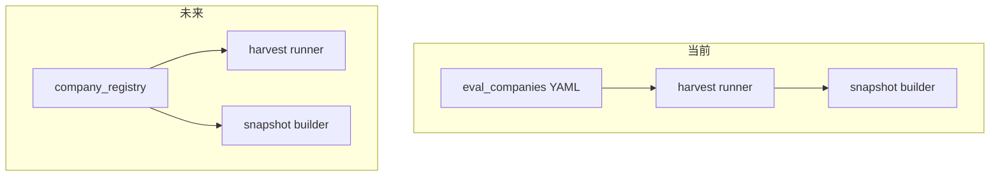

# CNINFO C-Class Company Registry 设计

_生成时间：2026-07-08_

> **性质：** `company_registry` 身份治理层设计（Era C Phase 4）。**仅规划** · **不生成 registry 数据** · **不写 verified**。

**C-class 状态：** `SNAPSHOT_GENERATED_QA_REVIEW`

**依据：** [full market universe registry plan](cninfo_c_class_full_market_universe_registry_plan.md) · [hold policy](cninfo_c_class_hold_company_policy.md) · [BSE expansion strategy](cninfo_c_class_bse_expansion_strategy.md) · [lineage design](../outputs/validation/cninfo_c_class_company_registry_lineage_design.md)

---

## 架构定位

`company_registry` 是 **身份治理层（identity governance layer）**，不是数据采集层。

本轮仅定义：

- 公司如何被识别
- 身份如何映射
- universe 血缘如何保留
- 未来扩展如何安全进行

**不**将 registry 视为当前 YAML 评估文件的立即替代；`eval_companies_*.yaml` 仍是 harvest / snapshot 的**当前操作输入**。

---

# 1. 为什么需要 Registry

当前 pipeline 依赖分散的 `eval_companies_*.yaml`，每份 YAML 只表达**某一时刻、某一 universe 切片**的公司列表，无法统一处理身份变更与多源冲突。

| 问题 | 现状证据 | registry 解决方向 |
|------|----------|-------------------|
| **公司更名** | YAML 中 `company_name` / `short_name` 为快照值，更名后旧 YAML 断链 | `rename_history` 保留历史；`company_code` + `org_id` 为稳定键 |
| **证券代码变更** | BSE 83/87 → 920 重编号；无统一 `previous_code` | `legacy_code` · `previous_code` · `current_code` 映射 |
| **历史代码（legacy）** | 839729 与 920729 永顺生物同 orgId，legacy 83/87 全 6/6 fail | `legacy_code` + `org_id_conflict_flag` |
| **BSE 83/87 → 920 过渡** | 195 live：920 11/12 过，83/87 8/8 HTTP 500 | `bse_flag` · `legacy_status` · `mapping_confidence` |
| **退市公司** | 889 清洗排除 7 家 `name_delisted_cn`；6124 含「国华退」等 | `delisted_flag` · `active_status=inactive` |
| **ST 公司** | 26 hold 中多 *ST；889 排除 15 家 `name_suffix_tui` | `st_flag`；不自动排除，以 endpoint 为准 |
| **重复 org_id** | `gfbj0839729` 对应 839729 与 920729 | `org_id_conflict_flag` · canonical code 指向 |
| **多数据源身份冲突** | Era B 6124 vs Era C 863 vs CNINFO F10 可达列表可能不一致 | registry 作为**单一身份真相源（SSOT）**；各源标注 `source` + `confidence` |

**结论：** registry 是**未来身份层**，不立即替换 YAML；YAML 逐步降级为 registry 的**派生视图（universe slice export）**。

---

# 2. company_registry Schema

共 **24** 个核心字段，分 6 组。

## 2.1 identity（身份）

| 字段 | 含义 | 来源 | 示例 | 未来用途 |
|------|------|------|------|----------|
| `company_id` | registry 内部稳定主键（与 code 解耦） | 派生规则：`{exchange}:{org_id}` 或 UUID | `SZSE:gssz0000009` | harvest/snapshot/QA 跨 code 变更关联 |
| `company_code` | 当前 6 位证券代码（harvest scode 参数） | `stock_code`（863 YAML） | `000009` | harvest runner `scode=` · snapshot 文件名 |
| `company_name` | 当前简称 | `short_name` / `company_name` | `中国宝安` | snapshot `company_name` · UI 展示 |
| `company_full_name` | 法定全称 | basic profile `legal_name`（863 normalized） | `中国宝安集团股份有限公司` | snapshot `company_identity` |
| `english_name` | 英文名称 | basic profile `english_name` | `China Baoan Group Co., Ltd.` | 国际化展示 · 去重辅助 |

## 2.2 security（证券层面）

| 字段 | 含义 | 来源 | 示例 | 未来用途 |
|------|------|------|------|----------|
| `exchange` | 交易所 | YAML `exchange` | `SZSE` | 板块路由 · orgId 前缀推断 |
| `board` | 上市板块 | YAML `board` | `szse_main` | universe 分批 · 统计 |
| `security_type` | 证券类型 | security observe `secType`（侧车） | `001001` | 观察层；不进主 gate |
| `listing_status` | 上市状态 | security observe / 名称推断 | `listed` · `delisted` | 与 `delisted_flag` 交叉验证 |
| `active_status` | 代码活跃状态 | 规则派生 | `active` · `legacy_code` · `duplicate_code` | harvest 是否使用此 code 为 scode |

## 2.3 identity mapping（身份映射）

| 字段 | 含义 | 来源 | 示例 | 未来用途 |
|------|------|------|------|----------|
| `org_id` | CNINFO 组织 ID | YAML `orgid` | `gssz0000009` | API 参数 · 跨 code 关联 |
| `legacy_code` | 历史证券代码 | BSE mapping / 人工 | `839729`（永顺生物旧码） | 83/87 层标识；不用于 harvest scode |
| `previous_code` | 最近一次变更前代码 | 变更事件记录 | `839729` | 增量更新 · 审计 |
| `rename_history` | 更名历史（JSON 数组） | 人工 / 公告解析（未来） | `[{"date":"2020-01","old":"深宝安A","new":"中国宝安"}]` | 断链恢复 · 产品展示 |
| `org_id_conflict_flag` | 同 org_id 多 code 标记 | 规则：同 org_id 计数>1 | `true`（839729/920729） | 指定 canonical `company_code` |

## 2.4 market status（市场状态）

| 字段 | 含义 | 来源 | 示例 | 未来用途 |
|------|------|------|------|----------|
| `st_flag` | 是否 ST/*ST | 名称规则 `*ST`/`ST` | `false` | caveat 标注；不自动 hold |
| `delisted_flag` | 是否退市 | 名称含「退」/ listing_status | `false` | hold / document_archive 路由 |
| `suspended_flag` | 是否暂停上市 | 未来公告/security | `false` | partial harvest 预期 |
| `hold_flag` | 是否进入 hold 侧轨 | hold YAML / 规则 | `false`（863 主线） | 跳过主 harvest gate |

## 2.5 C-class support（C 类支持状态）

| 字段 | 含义 | 来源 | 示例 | 未来用途 |
|------|------|------|------|----------|
| `harvest_support_status` | harvest 支持状态 | 规则 + quality CSV | `completed_863` | harvest runner universe 过滤 |
| `snapshot_support_status` | snapshot 支持状态 | 规则 + status CSV | `completed_863` | snapshot batch 过滤 |

**枚举：**

| 值 | 含义 |
|----|------|
| `completed_863` | 863 主线已完成 |
| `supported` | 可进入 harvest/snapshot |
| `partial` | 可达但 caveat |
| `hold` | 侧轨 hold |
| `unsupported` | 当前不支持（如 BSE legacy） |

## 2.6 quality（质量元数据）

| 字段 | 含义 | 来源 | 示例 | 未来用途 |
|------|------|------|------|----------|
| `source` | 记录来源 | 派生脚本标注 | `harvest_863_yaml` · `full_market_2024` | 血缘追溯 |
| `last_updated` | 最后更新时间 | ISO8601 UTC | `2026-07-08T00:00:00Z` | 增量刷新 |
| `confidence` | 身份置信度 | 规则 | `high` · `medium` · `low` | 冲突时优先级 |
| `notes` | 自由备注 | 人工 / 自动 | `889 all6 hold; HTTP 500` | 审计 · QA |

---

# 3. 与现有 YAML 的关系

| 现有产物 | registry 角色 |
|----------|----------------|
| `eval_companies_c_class_harvest_863_non_bse.yaml` | 863 条目的 `completed_863` 种子 |
| `eval_companies_full_market_2024.yaml` | 6124 全市场基准（Era B 口径） |
| `eval_companies_c_class_889_rerun_all6_hold.yaml` | 26 条 hold 种子 |
| `eval_companies_c_class_smoke_195_bse_920_active.yaml` | BSE 920 种子 |
| `eval_companies_c_class_smoke_195_bse_legacy_hold.yaml` | BSE legacy 种子 |

**过渡策略：**

1. **Phase 1（当前）：** YAML 为操作输入；registry 仅设计
2. **Phase 2（未来）：** registry draft 派生 → 导出 universe YAML slice
3. **Phase 3（未来）：** harvest/snapshot runner 直接读 registry 过滤条件

---

# 4. BSE 身份设计

本节为 registry 内 BSE 专项身份字段与政策（不执行 probe）。

## 4.1 BSE 分层

| 层级 | 代码前缀 | registry 策略 |
|------|----------|---------------|
| **BSE active（920）** | `92xxxx` | `bse_flag=bse_920` · `harvest_support_status=supported`（待扩样验证） |
| **BSE legacy（83/87）** | `83xxxx`/`87xxxx` | `bse_flag=bse_legacy_83_87` · `hold_flag=true` · `unsupported` |

## 4.2 BSE 专用映射字段（扩展，记入 identity mapping 组）

| 字段 | 含义 | 来源 | 示例 | 未来用途 |
|------|------|------|------|----------|
| `legacy_code` | 83/87 旧代码 | BSE legacy YAML | `839729` | 标识 legacy 层 |
| `current_code` | 920 新代码（canonical） | BSE 920 YAML / org_id 配对 | `920729` | harvest 唯一 scode |
| `legacy_status` | legacy 层状态 | 规则 | `legacy_hold` · `mapped` · `duplicate_drop` | 是否可回迁 |
| `mapping_confidence` | 映射置信度 | org_id 配对 / probe（未来） | `confirmed`（同 org_id）· `unresolved` | 映射是否可用于 harvest |

## 4.3 政策

| 项 | 政策 |
|----|------|
| **920 active** | 可成为 **supported universe**（独立子轨）；不混入 non-BSE 主 gate |
| **83/87 legacy** | 维持 **legacy_hold**；`harvest_support_status=unsupported` |
| **映射验证** | 须未来 targeted probe（**本轮不执行**）后方可将 legacy 升为 `mapped` |
| **重复代码** | 839729 → `duplicate_drop`；920729 → canonical |

**案例：永顺生物**

| 字段 | 839729（legacy） | 920729（current） |
|------|------------------|-------------------|
| `org_id` | `gfbj0839729` | `gfbj0839729` |
| `legacy_code` | — | `839729` |
| `current_code` | — | `920729` |
| `org_id_conflict_flag` | `true` | `true` |
| `active_status` | `duplicate_code` | `active` |
| `hold_flag` | `true` | `false` |

---

# 5. 未来 artifact 规划（本轮不创建）

| 路径 | 用途 |
|------|------|
| `config/cninfo_c_class_company_registry_draft.yaml` | registry 主文件（未来） |
| `config/cninfo_c_class_bse_code_mapping_draft.yaml` | BSE 代码映射表（未来） |
| `lab/derive_cninfo_c_class_company_registry_draft.py` | 离线派生脚本（未来） |

---

# 6. 红线确认

- **不生成** registry 数据行
- 不请求 CNINFO · 不 live · 不 harvest
- 不修改 raw / normalized / field_inventory / snapshot JSON
- 不写 verified · 不 testing_stable_sample · 不入库

**下一步（规划）：** [lineage design](../outputs/validation/cninfo_c_class_company_registry_lineage_design.md) · registry schema 审批 · 派生脚本设计
