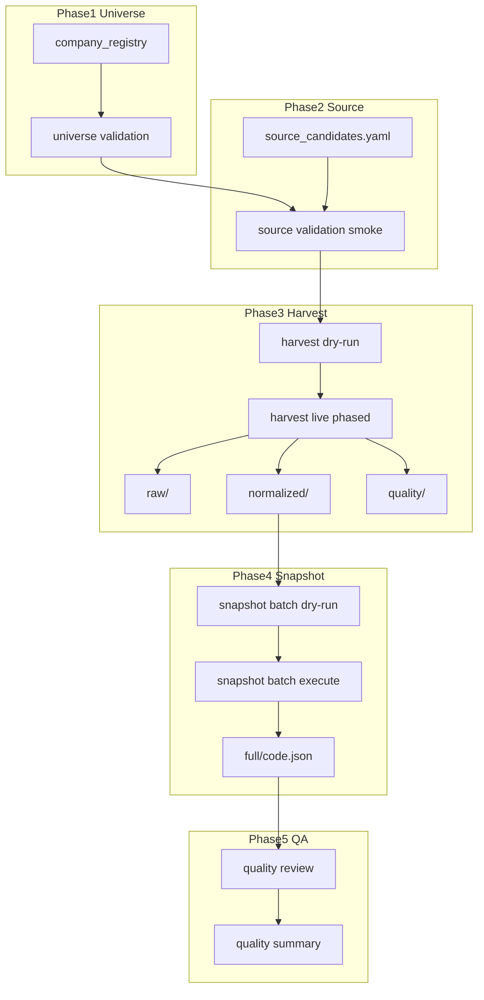

# CNINFO C-Class Full Market Harvest 架构

_生成时间：2026-07-08_

> **性质：** 全市场（5000+ 公司）Harvest → Snapshot → QA 流水线架构规划。**仅规划** · **不执行** · **不写 verified**。

**C-class 状态：** `SNAPSHOT_GENERATED_QA_REVIEW`

**依据：** [harvest runner](../lab/harvest_cninfo_c_class.py) · [snapshot batch runner](../lab/build_cninfo_c_class_snapshot_batch.py) · [863 full batch plan](cninfo_c_class_snapshot_full_batch_plan.md) · [registry plan](cninfo_c_class_full_market_universe_registry_plan.md)

---

## 1. 端到端流水线

---

## 2. 各阶段说明

### 2.1 Universe Registry

| 项 | 设计 |
|----|------|
| 输入 | `company_registry` draft |
| 校验 | company_count · hold_overlap=0 · duplicate_code 检测 |
| 输出 | phased universe YAML（按板块/批次） |
| 参考 | `build_cninfo_c_class_snapshot_batch.validate_universe()` |

### 2.2 Source Validation

| 项 | 设计 |
|----|------|
| 范围 | 10 源 · 每扩展阶段 smoke 30–200 家 |
| 政策 | security **observe_only**；derived 不单独请求 |
| 门槛 | non-BSE reach ≥95%；BSE 920 单独 gate |
| 参考 | `validate_cninfo_c_class_scale_smoke.py` |

### 2.3 Harvest Runner

| 项 | 当前 863 实现 | 全市场扩展设计 |
|----|--------------|----------------|
| 默认模式 | `--dry-run` | 保持 |
| live 批准 | `--approve-full-harvest` | 扩展为 `--approve-full-market-harvest` |
| smoke | `--live --limit N` | 每批 `--limit` 探测 |
| resume | `--resume` 跳过 complete | 保持 · 支持跨批次 |
| 输出 | raw/normalized/quality | 路径不变 · 按 company_code 分文件 |
| 隔离 | 单公司失败不停止 batch | 保持 |

**常量参考：**
- `HARVEST_EXPECTED_COMPANY_COUNT = 863` → 未来按 universe 动态
- `HTTP_SOURCES_PER_COMPANY = 7` · `MATRIX_SOURCES_PER_COMPANY = 10`

### 2.4 Snapshot Builder

| 项 | 设计 |
|----|------|
| 输入 | normalized/ 只读 |
| 批准 | `--approve-full-snapshot-batch` → 未来 `--approve-full-market-snapshot` |
| 输出 | `outputs/snapshot/cninfo_c_class/full/{code}.json` |
| resume | status CSV 跳过终态 |
| 隔离 | `run_single_company_safe()` per-company try/except |

### 2.5 Quality Review

| 项 | 设计 |
|----|------|
| 输入 | full/*.json 只读 |
| 产出 | completeness · module coverage · field coverage · quality flags |
| 参考 | `review_cninfo_c_class_snapshot_full_quality.py` |
| 政策 | partial / complete_with_caveat **合法** |

---

## 3. 5000+ 规模设计

### 3.1 分批策略（Sharding / Batching）

| 维度 | 建议 |
|------|------|
| 批次大小 | **200–500** 家/批（与 stable 200 经验一致） |
| 分批键 | `board` 或 `universe_shard_id` |
| 顺序 | non-BSE 板块优先 → BSE 920 独立 → hold 跳过 |
| 批准 | **每批** 须独立 dry-run + 人工批准（或批次级批准 token） |

### 3.2 Resume

| 层 | 机制 |
|----|------|
| harvest | `quality/company_harvest_status.csv` · `run_status.json` |
| snapshot | `full/quality/company_snapshot_status.csv` |
| 规则 | 跳过 `complete` / `complete_with_caveat` / `failed` 终态 |
| 强制重跑 | `--force` 忽略 resume |

### 3.3 Failure Isolation

| 层 | 机制 |
|----|------|
| harvest | 单公司单源失败记入 quality；不 abort batch |
| snapshot | `company_snapshot_error.csv` + 继续下一家 |
| 政策 | failed 公司可 `--resume` 重试 |

### 3.4 Partial Success

| 概念 | 政策 |
|------|------|
| source_partial | share_capital / top_float — 不判 harvest fail |
| empty_but_valid | executive / shareholder — partial 模块 |
| company_harvest_status | `complete` 允许部分源 empty |
| snapshot_status | `complete_with_caveat` 为预期主流 |

### 3.5 Incremental Update（增量更新）

| 触发 | 动作 |
|------|------|
| 新上市 | registry 新增 → delta harvest 单公司 |
| 更名 | 更新 registry `company_name` · 不重 harvest |
| 代码变更（BSE） | mapping 更新 → 新 code harvest · legacy 标 hold |
| 定期刷新 | 季度/年度 `--resume` 仅更新 `pending` 或 `stale` 标记公司 |

**规划字段（registry）：** `last_harvested_at` · `last_snapshot_at` · `stale_flag`

---

## 4. 安全闸模板

沿用 863 已验证的双开关模式：

| 操作 | 必需标志 |
|------|----------|
| harvest dry-run | 默认（无标志） |
| harvest live smoke | `--live --limit N` |
| harvest full market | `--live --approve-full-market-harvest` |
| snapshot dry-run | 默认 |
| snapshot full market | `--execute --approve-full-market-snapshot-batch` |

无批准 → exit 2 + `FULL_*_APPROVAL_REQUIRED`

---

## 5. 磁盘与运行时粗估

| 项 | 863 实测/估 | 全市场粗估 |
|----|------------|------------|
| harvest raw+normalized | ~数百 MB | **数 GB** |
| snapshot JSON | 500–900 MB | **3–6 GB** |
| harvest 离线时间 | ~数小时（863 live） | **数天**（分批 + 退避） |
| snapshot 离线时间 | 15–45 min | **2–4 h**（单进程粗估） |

---

## 6. 与现有 863 产物关系

- **863 不废弃**：`completed_863` 标记 · 增量扩展
- 目录结构 **不变**：`outputs/harvest/cninfo_c_class/` · `outputs/snapshot/cninfo_c_class/full/`
- smoke/demo 目录 **隔离**

---

## 7. 红线确认

- 本轮 **不执行** harvest / snapshot / live
- 不修改 raw / normalized / mapper / field_inventory
- 不写 verified · 不 testing_stable_sample · 不入库

**下一步（规划）：** phased harvest 批次计划模板 · registry 派生脚本设计
