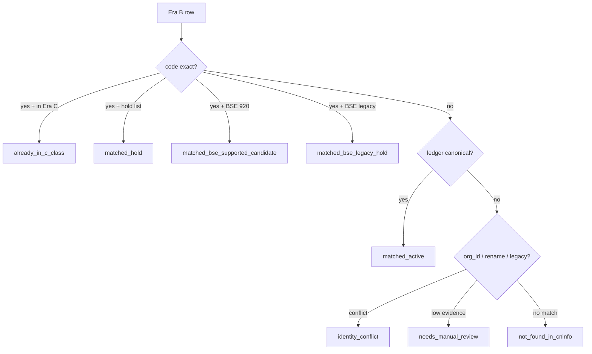

# CNINFO C-Class Full Market Universe Reconciliation Plan

_生成时间：2026-07-08_

> **性质：** Era B 全市场基准与 Era C 已验证 universe 的对账设计。**仅规划** · **不执行 reconciliation 产物生成** · **不写 verified**。

**C-class 状态：** `SNAPSHOT_GENERATED_QA_REVIEW`

**依据：**
- [Era B baseline](../lab/eval_companies_full_market_2024.yaml) · **6124**
- [Era C active](../lab/eval_companies_c_class_harvest_863_non_bse.yaml) · **863**
- [Hold universe](../lab/eval_companies_c_class_889_rerun_all6_hold.yaml) · **26**
- [BSE 920 smoke](../lab/eval_companies_c_class_smoke_195_bse_920_active.yaml) · **12**
- [BSE legacy smoke](../lab/eval_companies_c_class_smoke_195_bse_legacy_hold.yaml) · **8**
- [identity decision ledger](../outputs/validation/cninfo_c_class_registry_identity_decision_ledger.csv)
- [registry candidate draft](../outputs/validation/cninfo_c_class_company_registry_candidate_draft.csv)

---

# 1. Current Universe Relationship

## 1.1 两套 lineage 来源

| Universe | 路径 | 数量 | 来源口径 |
|----------|------|------|----------|
| **Era B** | `eval_companies_full_market_2024.yaml` | **~6124** | 2024 年报 A 股公司列表 |
| **Era C active** | `eval_companies_c_class_harvest_863_non_bse.yaml` | **863** | C-class F10 harvest 已验证 non-BSE 子集 |

## 1.2 派生关系（已知，非简单减法）

```
Era B (6124)
  ├─ Era C active (863)          ← 已 harvest + snapshot + QA
  ├─ Hold (26)                   ← 889 母本剔除；6/6 fail；不在 863 内
  ├─ BSE (~577 in Era B)         ← 863 显式 non-BSE；BSE 分 920 / legacy 轨
  └─ New candidates (~5235)      ← Era B − Era C − hold 粗估；须 reconciliation
```

**重要：** Era B 与 Era C **不是同一 lineage 的直接子集关系。**

| 误区 | 正确理解 |
|------|----------|
| `6124 − 863 = 5261` 即新增 harvest 名单 | **否** — 含 hold、BSE、退市/ST、Era B 独有口径差异 |
| Era C 公司均在 Era B 内 | **是** — 863 ⊆ Era B（code 精确匹配已验证） |
| Hold 在 Era C 内 | **否** — hold 26 家已从 863 排除 |
| Hold 在 Era B 内 | **是** — hold 26 ⊆ Era B |

## 1.3 交叉验证结果（离线 code 级）

| 关系 | 数量 | 说明 |
|------|------|------|
| Era C ⊆ Era B | **863/863** | company_code 精确匹配 |
| Era B − Era C | **5261** | 含 hold 26 + BSE ~577 + 其余 non-BSE 未验证 |
| Hold ∩ Era C | **0** | hold 已从 863 排除 |
| Hold ⊆ Era B | **26** | hold 在年报基准内 |

**本轮不生成 reconciliation 产物文件。**

---

# 2. Reconciliation Design

## 2.1 设计原则

| 原则 | 说明 |
|------|------|
| 离线优先 | 仅读 YAML / CSV / ledger；**不 run CNINFO / live** |
| 分类不合并 | 输出分类标签与置信度；**不 auto merge** |
| 保留双行 | rename / legacy / duplicate 保持独立 code 行 |
| 决策账本优先 | ledger approved 映射高于启发式猜测 |
| 人工兜底 | `needs_manual_review` 不自动降级 |

## 2.2 匹配优先级

按顺序尝试；前序命中则停止（除非标记 `identity_conflict` 需并列保留）：

| 优先级 | 匹配规则 | 输入 | 输出置信度 |
|--------|----------|------|------------|
| **1** | `company_code` exact match | Era B `stock_code` ↔ Era C / candidate `company_code` | **high** |
| **2** | canonical identity mapping | decision ledger `canonical_company_id` | **high** |
| **3** | `org_id` exact match | Era B `orgid` ↔ candidate / ledger | **medium-high** |
| **4** | `rename_history` | ledger rename_history signoff（10 approved） | **medium** |
| **5** | `legacy_code_mapping` | ledger BSE legacy mapping（248 approved · 3 manual） | **medium** |
| **6** | `company_name` similarity | 名称模糊匹配（末位兜底） | **low** → `needs_manual_review` |

## 2.3 禁止行为

| 禁止 | 原因 |
|------|------|
| auto merge identities | merge_executed 全程 false |
| 改写 harvest / snapshot 历史 | 治理元数据 only |
| 以 Era B 单独作为 CNINFO 可达列表 | 年报 ≠ F10 可达 |
| 自动将 hold 降级为 active | 须 hold policy 人工批准 |



---

# 3. Classification Taxonomy

## 3.1 分类定义

| 分类 | 定义 | 典型来源 |
|------|------|----------|
| **matched_active** | Era B 公司在 C-class 扩展域内，可进入未来 harvest 批次 | Era B − Era C − hold − BSE legacy |
| **already_in_c_class** | 已在 863 验证 universe 内 | Era C 863 |
| **matched_hold** | 匹配 hold 政策侧轨 | 26 all6 hold |
| **matched_bse_supported_candidate** | BSE 920 可支持候选 | candidate board=bse · code 92xxxx |
| **matched_bse_legacy_hold** | BSE 83/87/43 legacy 侧轨 | legacy_code_incompatible |
| **identity_conflict** | org_id / rename / legacy 多行冲突未消解 | conflict triage 508 组 |
| **needs_manual_review** | 证据不足或 ledger manual 未结案 | 8 ledger manual + 241 deferred |
| **not_found_in_cninfo** | Era B 有记录但 candidate / C-class 无对应 | 须未来 live 探测确认 |

## 3.2 分类与处置

| 分类 | 未来 harvest | 未来 snapshot | 备注 |
|------|-------------|---------------|------|
| matched_active | 允许（phased） | 允许 | 主扩展池 |
| already_in_c_class | 跳过（resume） | 跳过（已有） | 863 已覆盖 |
| matched_hold | **禁止** | **禁止** | Option B 侧轨 |
| matched_bse_supported_candidate | BSE 子 gate | BSE 子 gate | 920 轨 |
| matched_bse_legacy_hold | **禁止**主轨 | 侧轨观察 | legacy probe 后决策 |
| identity_conflict | **禁止**自动 | **禁止**自动 | 保持双行 |
| needs_manual_review | **禁止**自动 | **禁止**自动 | 人工 signoff 后重分类 |
| not_found_in_cninfo | 待定 | 待定 | 须 reconciliation + 可选探测 |

---

# 4. Output Design

## 4.1 未来产物

**`company_registry_reconciliation_candidate.csv`**（规划名；本轮不生成）

与既有 `company_registry_candidate_draft.csv`（6124 行）的关系：

| 产物 | 角色 |
|------|------|
| `company_registry_candidate_draft.csv` | 身份字段 draft（已存在） |
| `company_registry_reconciliation_candidate.csv` | **对账分类叠加层**（未来） |

## 4.2 字段设计

| 字段 | 类型 | 说明 |
|------|------|------|
| `company_id` | string | `CNINFO_{company_code}` |
| `company_code` | string | 6 位代码 |
| `company_name` | string | 简称 |
| `source_universe` | enum | `era_b` / `era_c` / `hold` / `bse_920` / `bse_legacy` |
| `canonical_status` | enum | 对账分类（§3 taxonomy） |
| `c_class_status` | enum | `harvested` / `snapshot_complete` / `not_started` / `hold` |
| `hold_status` | enum | `none` / `all6_hold` / `bse_legacy_hold` / `policy_pending` |
| `bse_status` | enum | `non_bse` / `bse_920` / `bse_legacy` / `unknown` |
| `identity_confidence` | enum | `high` / `medium` / `low` |
| `notes` | string | 匹配规则 · ledger 引用 · 人工说明 |

## 4.3 示例行（说明性，非实际产物）

| company_code | canonical_status | c_class_status | notes |
|--------------|------------------|----------------|-------|
| 000009 | already_in_c_class | snapshot_complete | Era C 863 已验证 |
| 000043 | matched_hold | hold | 26 all6 hold · 不在 863 |
| 920729 | matched_bse_supported_candidate | not_started | BSE 920 · ledger approved |
| 839729 | identity_conflict | not_started | duplicate_identity · 保持双行 |
| 832419 | needs_manual_review | not_started | BSE manual mapping 未结案 |

---

# 5. Reconciliation Gate（未来）

| Gate | 条件 |
|------|------|
| `universe_reconciliation_gate` | 全部分类完成 · manual 有明确 disposition · 无未解释 not_found 激增 |
| 通过后可进入 | Phase 1 registry candidate refresh（离线）→ Phase 2 smoke |

**本轮 gate：** **DESIGN_COMPLETE** · execution **not started**

---

# 6. 红线

本轮 **不做：**

- run CNINFO / live / harvest / snapshot
- 生成 reconciliation CSV 产物
- registry implementation / DB
- identity merge
- 修改 raw / normalized / field_inventory
- verified / testing_stable_sample
