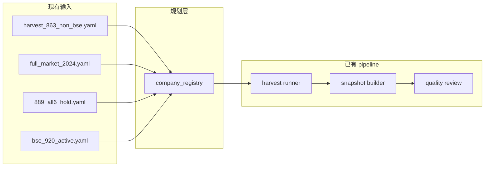

# CNINFO C-Class Full Market Universe Registry Plan

_生成时间：2026-07-08_

> **性质：** 全市场扩展 **company_registry 架构规划**（Era C Phase 4）。**仅规划** · **不执行 registry backfill** · **不写 verified**。

**C-class 状态：** `SNAPSHOT_GENERATED_QA_REVIEW`

**依据：** [863 harvest universe](../lab/eval_companies_c_class_harvest_863_non_bse.yaml) · [universe split](cninfo_c_class_universe_split_and_sample_cleaning_plan.md) · [full market 2024](../lab/eval_companies_full_market_2024.yaml) · [source status decision](cninfo_c_class_source_status_decision.md)

---

## 1. 设计目标

| 项 | 说明 |
|----|------|
| **是什么** | 以 **company_registry** 为中心的 A 股全市场公司主数据层，统一标识、板块、上市状态、hold 策略与 harvest/snapshot 支持状态 |
| **不是什么** | 替代现有 harvest normalized；不是 verified 全市场稳定层；不是 DB 表实现 |
| **当前输入** | 分散的 `eval_companies_*.yaml` 样本文件 + 863 harvest 产物 |
| **输出形态（未来）** | `config/cninfo_c_class_company_registry_draft.yaml` 或 CSV + 版本化 universe_id |

### 设计原则

1. **registry 管身份与策略**，不重复存储业务 profile 字段。
2. **863 为已验证子集**，registry 须能表达「已 harvest / 已 snapshot」与「待扩展」。
3. **BSE / hold / abnormal 走侧轨**，不强行并入主 gate。
4. **历史代码与 org_id 去重** 为一等公民字段。
5. **本轮不生成全量名单**，只定义字段与规则。

---

## 2. company_registry 字段定义

| 字段 | 类型 | 说明 |
|------|------|------|
| `company_code` | string | 6 位证券代码（主键之一） |
| `company_name` | string | 当前简称/法定名（可随时间变更） |
| `exchange` | enum | `SSE` · `SZSE` · `BSE` |
| `board` | enum | `sse_main` · `szse_main` · `chinext` · `star` · `bse` |
| `org_id` | string | CNINFO orgId（如 `gssz0000009` · `gfbj0839729`） |
| `security_status` | enum | `normal` · `st` · `star_st` · `delisted` · `suspended` · `unknown` |
| `active_status` | enum | `active` · `inactive` · `legacy_code` · `duplicate_code` |
| `hold_flag` | bool | 是否进入 hold 侧轨（不参与主 harvest gate） |
| `legacy_code` | string? | 历史代码（BSE 83/87 → 920 映射时填写） |
| `bse_flag` | enum | `none` · `bse_920` · `bse_legacy_83_87` |
| `harvest_support_status` | enum | `supported` · `partial` · `hold` · `unsupported` · `completed_863` |
| `snapshot_support_status` | enum | `supported` · `partial` · `hold` · `unsupported` · `completed_863` |
| `notes` | string | 人工/自动标注（退市、更名、重复 orgId 等） |

### 与现有 YAML 字段映射

| 现有字段（863 YAML） | registry 字段 |
|---------------------|---------------|
| `stock_code` | `company_code` |
| `company_name` / `short_name` | `company_name` |
| `exchange` | `exchange` |
| `board` | `board` |
| `orgid` | `org_id` |
| `financial` | 可扩展为 `sector_tag`（未来） |
| `harvest_status` | 映射到 `harvest_support_status` |

---

## 3. 板块覆盖设计

### 3.1 当前 863 已覆盖（non-BSE 主线）

| board | 863 数量 | registry 策略 |
|-------|----------|---------------|
| sse_main | 281 | `harvest_support_status=completed_863` |
| szse_main | 226 | 同上 |
| chinext | 231 | 同上 |
| star | 125 | 同上 |
| **合计** | **863** | 已 harvest + 已 snapshot |

### 3.2 待扩展板块

| board | 预估规模 | registry 策略 |
|-------|----------|---------------|
| **BSE（920）** | ~200+（全市场口径待与 6124 交叉核对） | `bse_flag=bse_920` · 单独子 universe |
| **BSE（83/87 legacy）** | 8（195 样本）/ 全市场待统计 | `bse_flag=bse_legacy_83_87` · `hold_flag=true` |
| **non-BSE 未入 863** | ~5261（6124 − 863 粗估，含重叠待去重） | `harvest_support_status=supported` 待 phased harvest |

### 3.3 五板块统一规则

```
SSE main   → exchange=SSE,  board=sse_main,   code 60xxxx/68xxxx(科创板单独)
SZSE main  → exchange=SZSE, board=szse_main,  code 000xxx/001xxx
ChiNext    → exchange=SZSE, board=chinext,    code 300xxx
STAR       → exchange=SSE,  board=star,       code 688xxx
BSE        → exchange=BSE,  board=bse,        code 92xxxx(新) / 83-87xxxx(legacy)
```

---

## 4. 特殊情形处理

### 4.1 退市公司

| 情形 | registry 处理 |
|------|---------------|
| 名称含「退」 | `security_status=delisted` · `active_status=inactive` |
| 6/6 主源 HTTP 500 | `hold_flag=true` · `harvest_support_status=hold` |
| 仅 document 有价值 | `snapshot_support_status=hold` · 见 hold policy Option C |

**政策：** 退市公司**不自动**进入主 harvest gate；可进入 `document_archive` 侧轨。

### 4.2 ST / *ST 公司

| 情形 | registry 处理 |
|------|---------------|
| 名称含 ST/*ST | `security_status=st` 或 `star_st` |
| live 可达 | `harvest_support_status=partial`（caveat 标注） |
| 6/6 全失败（26 hold 子集） | `hold_flag=true` · `excluded_reason=sample_quality_or_status_review` |

**政策：** ST **不自动排除**；以 endpoint 可达性 + hold 子集为准。

### 4.3 暂停上市

- `security_status=suspended`
- `harvest_support_status=partial` 或 `hold`（待 live 探测）
- snapshot 允许 `complete_with_caveat`

### 4.4 历史代码（BSE 83/87 → 920）

| 案例 | 处理 |
|------|------|
| `839729` / `920729` 永顺生物 | 同 `org_id=gfbj0839729` · **保留 920729** · `839729` 标 `legacy_code` + `duplicate_code` |
| 83/87 前缀 | `legacy_code` 填原码 · `bse_flag=bse_legacy_83_87` · `hold_flag=true` |

**映射表（规划）：** 未来 `config/cninfo_c_class_bse_code_mapping_draft.yaml`（本轮不创建执行文件）。

### 4.5 重复 org_id

- registry 增加 `org_id_primary_code` 指向 canonical `company_code`
- 非主代码标 `active_status=duplicate_code`
- harvest 时以 canonical code 为 scode 参数

### 4.6 公司更名

- `company_name` 存当前名；`notes` 记录更名历史
- 增量更新时以 `company_code` + `org_id` 为稳定键，不随简称变更断链

---

## 5. Registry 输入来源（现有产物）

| 来源 | 路径 | 用途 |
|------|------|------|
| 863 主线 | `lab/eval_companies_c_class_harvest_863_non_bse.yaml` | `completed_863` 种子 |
| 889 母本 | `lab/eval_companies_c_class_smoke_1000_non_bse_candidate.yaml` | non-BSE 扩展候选 |
| 全市场基准 | `lab/eval_companies_full_market_2024.yaml` | 6124 交叉核对（Era B 口径） |
| 26 hold | `lab/eval_companies_c_class_889_rerun_all6_hold.yaml` | hold 种子 |
| BSE 920 | `lab/eval_companies_c_class_smoke_195_bse_920_active.yaml` | BSE 子 universe |
| BSE legacy | `lab/eval_companies_c_class_smoke_195_bse_legacy_hold.yaml` | legacy hold |
| abnormal | `lab/eval_companies_c_class_smoke_195_abnormal_review.yaml` | 异常审查 |

---

## 6. harvest_support_status / snapshot_support_status 枚举

| 值 | 含义 |
|----|------|
| `completed_863` | 已在 863 主线完成 harvest/snapshot |
| `supported` | 规则上可进入下一阶段 harvest/snapshot |
| `partial` | 可达但 caveat（ST、source_partial 等） |
| `hold` | 侧轨 hold，不进入主 gate |
| `unsupported` | 当前 endpoint/代码层不支持（如 BSE legacy） |

---

## 7. 与现有 pipeline 关系



---

## 8. 本轮不执行

- 不生成全量 registry YAML/CSV
- 不请求 CNINFO
- 不修改 raw / normalized / field_inventory
- 不写 verified · 不 testing_stable_sample

**下一步（规划）：** registry draft 派生脚本设计 → BSE code mapping probe → phased universe 扩展
