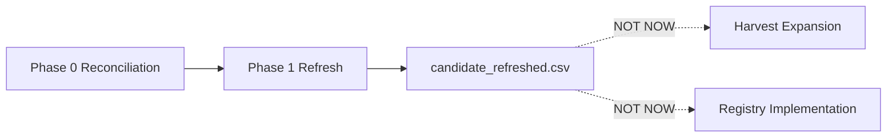

# CNINFO C-Class Registry Candidate Refresh Plan

_生成时间：2026-07-08_

> **性质：** Phase 1 registry candidate 刷新规划。**仅规划** · **不生成分 refreshed CSV** · **不写 verified**。

**C-class 状态：** `SNAPSHOT_GENERATED_QA_REVIEW`

**依据：**
- [Phase 0 reconciliation result](../outputs/validation/cninfo_c_class_full_market_universe_reconciliation_result.csv)
- [Phase 0 reconciliation summary](../outputs/validation/cninfo_c_class_full_market_universe_reconciliation_summary.md)
- [registry candidate draft](../outputs/validation/cninfo_c_class_company_registry_candidate_draft.csv)
- [identity decision ledger](../outputs/validation/cninfo_c_class_registry_identity_decision_ledger.csv)

---

# 1. Purpose

## 1.1 目标

Phase 1 refresh 基于 Phase 0 reconciliation 分类结果，**更新 registry candidate 层的支持状态与置信度元数据**。

| 项 | 说明 |
|----|------|
| 输入 | candidate draft（6124 行）+ reconciliation result（6124 行）+ decision ledger |
| 输出（未来） | `company_registry_candidate_refreshed.csv` |
| 本轮 | **仅规划**，不生成 refreshed 产物 |

## 1.2 明确边界

| 做 | 不做 |
|----|------|
| 叠加 reconciliation 分类与 refresh 动作 | **不创建** production registry |
| 更新 harvest/snapshot support 状态字段 | **不 merge** identities |
| 保留 24 字段 base + 5 扩展字段 | **不触发** harvest / snapshot |
| 标记 manual_review / conflict 队列 | **不 run** CNINFO / live |
| 为 Phase 2 smoke 提供 manifest 输入 | **不实现** registry Layer 2 / DB |



---

# 2. Input Classes

Phase 0 `classification` → Phase 1 `refresh_action` 映射：

| Phase 0 classification | count | refresh 策略 | 说明 |
|------------------------|-------|--------------|------|
| **already_in_c_class** | 863 | **keep high confidence** | 863 harvest + snapshot 已验证；保留 `completed_863` |
| **matched_active** | 4647 | **full_market_active_candidate** | Era B 扩展池；低置信 · 待 smoke 验证 |
| **matched_hold** | 26 | **preserve hold status** | 26 all6 hold；`hold_no_retry` 侧轨 |
| **matched_bse_supported_candidate** | 320 | **BSE supported candidate** | BSE 920 轨；独立 gate |
| **matched_bse_legacy_hold** | 242 | **legacy_hold** | BSE 83/87/43 legacy 侧轨 |
| **identity_conflict** | 10 | **conflict_review_required** | 保持双行 · 不合并 |
| **needs_manual_review** | 16 | **manual_review_required** | ledger / 同名异码待人工 |
| **not_found_in_cninfo** | 0 | **excluded / unresolved** | candidate 无对应；本轮 0 例 |

## 2.1 逐类处置规则

### already_in_c_class（863）

- `confidence` → **high**
- `harvest_support_status` → **supported**（`completed_863`）
- `snapshot_support_status` → **supported**（`completed_863`）
- `hold_flag` → false
- `refresh_action` → `preserve_high_confidence`
- **不降级**已有高置信行

### matched_active（4647）

- `confidence` → **low**（Era B baseline fill · 无 C-class 实测）
- `harvest_support_status` → **candidate_supported**
- `snapshot_support_status` → **not_built**
- `refresh_action` → `full_market_active_candidate`
- 进入未来 phased harvest manifest 主池

### matched_hold（26）

- `confidence` → **medium**（hold 政策明确）
- `hold_flag` → true
- `harvest_support_status` → **hold**
- `snapshot_support_status` → **hold**
- `refresh_action` → `preserve_hold`

### matched_bse_supported_candidate（320）

- `confidence` → **medium**（BSE 920 · ledger/smoke 支持）
- `harvest_support_status` → **candidate_supported**
- `snapshot_support_status` → **not_built**
- `refresh_action` → `bse_supported_candidate`
- 独立于 non-BSE 主 gate

### matched_bse_legacy_hold（242）

- `confidence` → **medium**
- `harvest_support_status` → **legacy_hold**
- `snapshot_support_status` → **hold**
- `refresh_action` → `preserve_legacy_hold`
- 不进入主 harvest gate

### identity_conflict（10）

- `confidence` → **review**
- `harvest_support_status` → **manual_review**
- `snapshot_support_status` → **manual_review**
- `requires_manual_review` → true
- `refresh_action` → `conflict_review_required`
- 保留 rename/duplicate 双行

### needs_manual_review（16）

- `confidence` → **review**
- `harvest_support_status` → **manual_review**
- `snapshot_support_status` → **manual_review**
- `requires_manual_review` → true
- `refresh_action` → `manual_review_required`

### not_found_in_cninfo（0）

- `confidence` → **low**
- `harvest_support_status` → **unsupported_unknown**
- `snapshot_support_status` → **not_built**
- `refresh_action` → `exclude_unresolved`
- 本轮 0 例 · 规则保留供未来

---

# 3. Confidence Rules

| 级别 | 适用 classification | 条件 |
|------|---------------------|------|
| **high** | already_in_c_class | 863 C-class validated + snapshot generated |
| **medium** | matched_hold · matched_bse_supported_candidate · matched_bse_legacy_hold | hold 政策 / BSE 轨 / ledger-supported mapping |
| **low** | matched_active · not_found_in_cninfo | Era B baseline only · 无 C-class 实测 |
| **review** | identity_conflict · needs_manual_review | 人工处置前不进入自动扩展池 |

**刷新原则：** refresh 只升/降 `confidence` 元数据，**不改写** company_code / org_id / 历史 harvest 产物。

---

# 4. Support Status Rules

## 4.1 harvest_support_status（未来值域）

| 值 | 含义 | 适用 |
|----|------|------|
| **supported** | 已 harvest 完成 | already_in_c_class（863） |
| **candidate_supported** | 可进入扩展 harvest 候选 | matched_active · matched_bse_supported_candidate |
| **hold** | hold 侧轨禁止 harvest | matched_hold |
| **legacy_hold** | BSE legacy 侧轨 | matched_bse_legacy_hold |
| **manual_review** | 人工审查前禁止 | identity_conflict · needs_manual_review |
| **unsupported_unknown** | 未知/未解析 | not_found_in_cninfo |

## 4.2 snapshot_support_status（未来值域）

| 值 | 含义 | 适用 |
|----|------|------|
| **supported** | snapshot 已生成 | already_in_c_class（863） |
| **candidate_supported** | 可进入 snapshot batch | matched_active · matched_bse_supported_candidate（harvest 后） |
| **not_built** | 尚未构建 | matched_active · BSE 920（pre-harvest） |
| **hold** | 侧轨禁止 | matched_hold · matched_bse_legacy_hold |
| **manual_review** | 人工审查前禁止 | identity_conflict · needs_manual_review |

---

# 5. Refresh Output Design

## 5.1 未来产物

**路径：** `outputs/validation/cninfo_c_class_company_registry_candidate_refreshed.csv`

**本轮不生成。**

## 5.2 字段设计

### 保留 24 registry 字段（与 draft 一致）

```
company_id, company_code, company_name, company_full_name, english_name,
exchange, board, security_type, listing_status, active_status,
org_id, legacy_code, previous_code, rename_history, org_id_conflict_flag,
st_flag, delisted_flag, suspended_flag, hold_flag,
harvest_support_status, snapshot_support_status, source, confidence, notes
```

### 新增 5 扩展字段

| 字段 | 说明 |
|------|------|
| `reconciliation_classification` | Phase 0 分类原值 |
| `refresh_action` | Phase 1 处置动作 |
| `refresh_confidence` | 刷新后置信级别（high/medium/low/review） |
| `requires_manual_review` | true/false |
| `lineage_note` | reconciliation_id · ledger 引用 · 不合并说明 |

## 5.3 Join 键

```
candidate_draft.company_code = reconciliation_result.company_code
```

一行对一行 left join；6124 行全覆盖。

---

# 6. Gate（未来执行后）

| Gate | 条件 |
|------|------|
| `registry_candidate_refresh_gate` | 6124 行均有 refresh_action · 863 high 未降级 · manual/conflict 未误入 active 池 |

**本轮 planning gate：** `registry_candidate_refresh_planning_gate = DESIGN_COMPLETE`

---

# 7. 红线

本轮 **不做：**

- 生成 `candidate_refreshed.csv`
- CNINFO / live / harvest / snapshot
- registry implementation / DB
- identity merge
- raw / normalized / field_inventory 修改
- verified / testing_stable_sample
