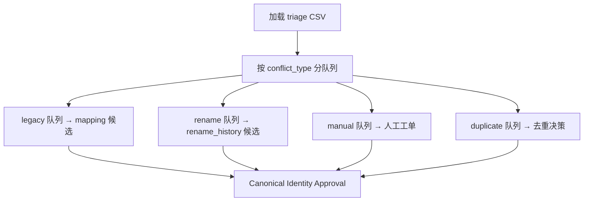

# CNINFO C-Class Registry Conflict Triage 设计

_生成时间：2026-07-08_

> **性质：** registry candidate 身份冲突分类与处置策略设计（Era C Phase 4）。**仅设计** · **不合并身份** · **不写 verified**。

**C-class 状态：** `SNAPSHOT_GENERATED_QA_REVIEW`

**前置 gate：** `registry_candidate_quality_gate = PASS_WITH_CAVEAT`

**依据：** [registry candidate QA summary](../outputs/validation/cninfo_c_class_registry_candidate_quality_summary.md) · [conflict triage CSV](../outputs/validation/cninfo_c_class_registry_conflict_triage.csv) · [resolution policy](cninfo_c_class_registry_conflict_resolution_policy.md)

---

# 1. Why Conflict Triage Exists

Registry 身份错误比缺失数据更危险。

错误合并示例：

```
Company A  +  Company B  →  合并为单一实体
```

将永久污染：

| 下游 | 影响 |
|------|------|
| **harvest** | scode / org_id 指向错误法人 |
| **snapshot** | 模块字段串线 |
| **event timeline** | 事件归属错误 |
| **shareholder data** | 股东结构混淆 |
| **financial history** | 财务历史不可恢复 |

**因此：** 冲突须在 canonical identity 决策前完成 triage review；**不自动合并**。


---

# 2. Conflict Taxonomy

QA 检出 **508** 条 duplicate findings，分为四类。

## A. possible_legacy_mapping

**含义：** 同一公司，旧证券代码 → 新证券代码。

**典型示例（BSE）：**

```
839729  ──→  920729
  │              │
  └─ org_id: gfbj0839729 ─┘
```

| 字段 | 说明 |
|------|------|
| `old_code` | legacy 83/87 或旧主板代码 |
| `current_code` | 920 或当前 active code |
| `mapping_confidence` | `confirmed`（同 org_id）· `unresolved` |
| `status` | `candidate_mapping` |

**决策：** `candidate_mapping` — 记录映射候选，**不合并**两行。

**本轮规模：** **251**

---

## B. possible_rename

**含义：** 同一公司变更名称（非代码变更）。

**典型示例：**

| old_name | new_name | change_date |
|----------|----------|-------------|
| 中航电测 | 中航成飞 | TBD |
| 江南嘉捷 | 三六零 | TBD |

| 字段 | 说明 |
|------|------|
| `rename_history_candidate` | JSON 数组候选 |
| `name_change_confidence` | `medium`（同 org_id 不同名） |

**决策：** `candidate_rename_history` — 写入 rename 候选，**不合并**实体。

**本轮规模：** **15**

---

## C. needs_manual_review

**含义：** 无法自动判定身份关系。

**可能原因：**

- 同 org_id 但公司名显著不同（非已知 rename）
- 缺失变更历史
- 多源 YAML 冲突
- 多证券并行（借壳 / 重组）

| 字段 | 说明 |
|------|------|
| `review_reason` | 分类原因 |
| `evidence_needed` | 公告 / 重组文件 / probe |
| `priority` | `high`（影响 harvest）· `medium` · `low` |

**决策：** `manual_review_no_auto_merge` — 保持独立 candidate 行。

**本轮规模：** **241**

---

## D. duplicate_identity

**含义：** 高概率重复实体（同一 legacy_code 多行等）。

| 字段 | 说明 |
|------|------|
| `duplicate_score` | 规则派生（未实现评分） |
| `evidence` | 如 `legacy_code=839729 on 2 rows` |
| `manual_decision_required` | `true` |

**决策：** `manual_decision_required` — 须人工确认是否 drop 重复行。

**本轮规模：** **1**

---

# 3. Triage Artifact

| 产出 | 路径 |
|------|------|
| 分类清单 | [cninfo_c_class_registry_conflict_triage.csv](../outputs/validation/cninfo_c_class_registry_conflict_triage.csv) |

**列说明：**

| 列 | 用途 |
|----|------|
| `conflict_id` | 稳定冲突编号 |
| `company_id_1/2` | 冲突双方 `CNINFO_{code}` |
| `conflict_type` | 四类 taxonomy |
| `org_id` | 冲突组织键 |
| `review_status` | 本轮全部 `unresolved` |
| `recommended_action` | 建议动作（非执行） |

**政策：** 本轮 **不 resolve** 任何冲突。

---

# 4. Triage Workflow（未来）



---

# 5. 红线确认

- 无 CNINFO · 无 live · 无 harvest
- **不修改** registry candidate CSV
- **不自动合并**身份
- 不建 production registry
- 不写 verified · 不入库

**下一步：** [resolution policy](cninfo_c_class_registry_conflict_resolution_policy.md) · [triage summary](../outputs/validation/cninfo_c_class_registry_conflict_triage_summary.md) · canonical identity approval
