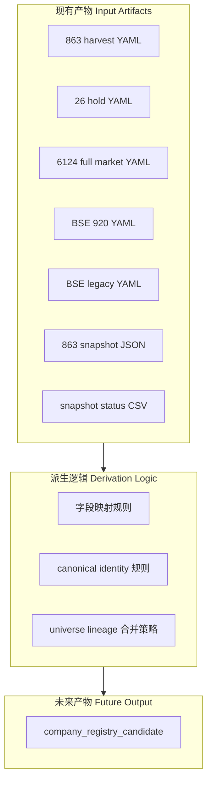
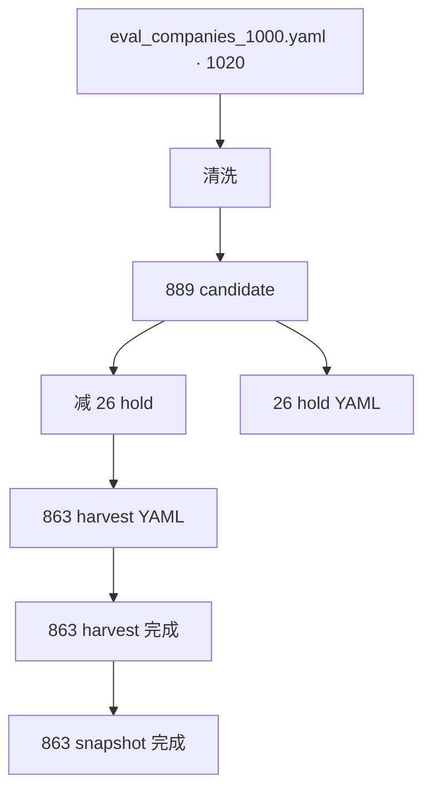
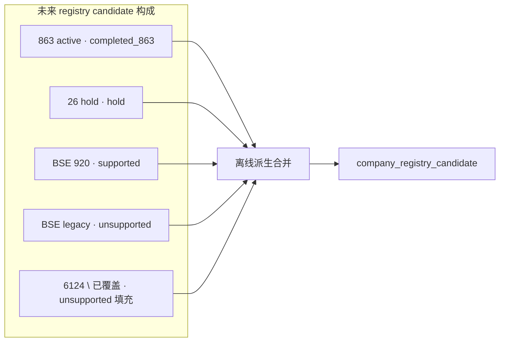
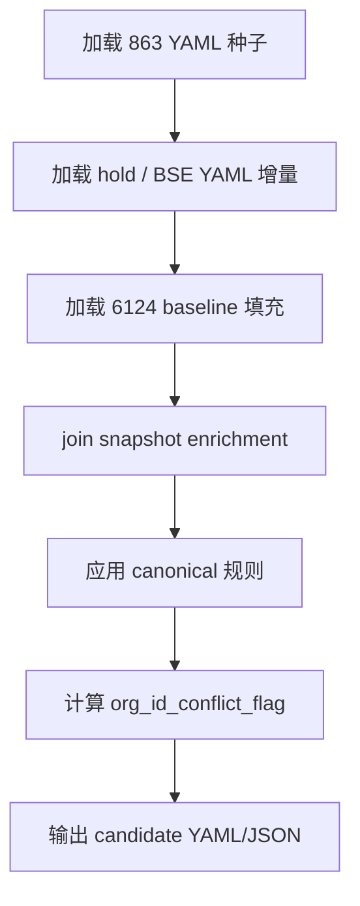

# CNINFO C-Class Registry Candidate 派生设计

_生成时间：2026-07-08_

> **性质：** `company_registry_candidate` 离线派生逻辑设计（Era C Phase 4）。**仅设计** · **不生成 registry 数据** · **不写 verified**。

**C-class 状态：** `SNAPSHOT_GENERATED_QA_REVIEW`

**前置 gate：** `registry_schema_approval_gate = PASS`

**依据：** [registry design](cninfo_c_class_company_registry_design.md) · [schema approval checklist](cninfo_c_class_company_registry_schema_approval_checklist.md) · [lineage design](../outputs/validation/cninfo_c_class_company_registry_lineage_design.md) · [BSE expansion strategy](cninfo_c_class_bse_expansion_strategy.md) · [hold policy](cninfo_c_class_hold_company_policy.md)

---

# 1. Purpose

## 1.1 派生定位

Registry candidate 派生是 **当前 YAML 制 universe 管理** 与 **未来公司身份层** 之间的桥梁。



## 1.2 Registry candidate 不是什么

| 不是 | 说明 |
|------|------|
| **harvest 输出** | harvest 产出 raw/normalized；registry 从 YAML + snapshot **离线派生** |
| **snapshot 输出** | snapshot 是产品视图；registry 可**读取** snapshot 做 enrichment，但不等同 snapshot |
| **normalized 表** | normalized 是字段级采集结果；registry 是身份治理记录 |
| **production registry** | candidate 为 draft 候选层；须经审批后才升为生产身份层 |

## 1.3 未来脚本（本轮不实现）

| 路径 | 职责 |
|------|------|
| `lab/derive_cninfo_c_class_company_registry_candidate.py` | 离线派生主脚本（未来） |
| `config/cninfo_c_class_company_registry_candidate.yaml` | candidate 主文件（未来） |
| `outputs/validation/cninfo_c_class_registry_candidate_summary.md` | 派生质量摘要（未来） |

---

# 2. Input Artifacts

## 2.1 输入产物总览

| 优先级 | 产物 | 路径 | 规模 | 角色 |
|--------|------|------|------|------|
| **Primary** | 863 harvest universe | `lab/eval_companies_c_class_harvest_863_non_bse.yaml` | 863 | 863 主线种子；最高优先级身份源 |
| **Hold** | 26 all6 hold | `lab/eval_companies_c_class_889_rerun_all6_hold.yaml` | 26 | hold 侧轨种子 |
| **BSE active** | 920 层 smoke | `lab/eval_companies_c_class_smoke_195_bse_920_active.yaml` | 12 | BSE supported 候选 |
| **BSE legacy** | 83/87 层 hold | `lab/eval_companies_c_class_smoke_195_bse_legacy_hold.yaml` | 8 | BSE legacy_hold 种子 |
| **Era B baseline** | 全市场基准 | `lab/eval_companies_full_market_2024.yaml` | 6124 | 最大候选池；低优先级填充 |
| **Snapshot** | 863 full snapshot | `outputs/snapshot/cninfo_c_class/full/{code}.json` | 863 | 身份 enrichment（legal_name · english_name） |
| **Snapshot QA** | status CSV | `outputs/snapshot/cninfo_c_class/full/quality/company_snapshot_status.csv` | 863 | snapshot_support_status |
| **BSE 文档** | 策略与案例 | `plans/cninfo_c_class_bse_expansion_strategy.md` | — | legacy_code · canonical 规则 |
| **Hold 文档** | 侧轨政策 | `plans/cninfo_c_class_hold_company_policy.md` | — | hold_flag · harvest_support_status |

## 2.2 字段来源矩阵（按产物）

### Primary：863 harvest YAML

| YAML 字段 | 可派生 registry 字段 |
|-----------|---------------------|
| `stock_code` | `company_code` |
| `short_name` / `company_name` | `company_name` |
| `exchange` | `exchange` |
| `orgid` | `org_id` |
| `board` | `board` |
| `harvest_status` | `harvest_support_status`（规则映射） |

### Hold：26 hold YAML

| YAML 字段 | 可派生 registry 字段 |
|-----------|---------------------|
| `stock_code` | `company_code` |
| `hold_reason` | `notes` |
| `failed_source_count` | `notes` |
| 成员关系 | `hold_flag=true` · `harvest_support_status=hold` |

### BSE YAML

| 来源 | 可派生 registry 字段 |
|------|---------------------|
| 920 active `stock_code` | `company_code`（canonical） |
| legacy `stock_code` | `legacy_code` · `previous_code` |
| 同 org_id 配对 | `org_id_conflict_flag` · `previous_code` |
| `universe_bucket` | `active_status` · `harvest_support_status` |

### Era B：6124 baseline

| YAML 字段 | 可派生 registry 字段 |
|-----------|---------------------|
| `stock_code` | `company_code` |
| `short_name` | `company_name` · `st_flag` · `delisted_flag`（名称规则） |
| `orgid` | `org_id` |
| `exchange` · `board` | `exchange` · `board` |
| 成员关系 | `source=full_market_2024` · `harvest_support_status=unsupported`（默认） |

### Snapshot enrichment

| Snapshot 路径 | 可派生 registry 字段 |
|---------------|---------------------|
| `modules.company_identity.fields.legal_name` | `company_full_name` |
| `modules.company_identity.fields.english_name` | `english_name` |
| `snapshot_status` | `snapshot_support_status`（规则映射） |
| `modules.securities_profile.fields` | `listing_status`（辅助） |

---

# 3. Registry Field Derivation Mapping

完整 24 字段映射见 [derivation mapping CSV](../outputs/validation/cninfo_c_class_registry_derivation_mapping.csv)。

## 3.1 映射表（设计）

| registry_field | source_artifact | source_field | mapping_rule | confidence | notes |
|----------------|-----------------|--------------|--------------|------------|-------|
| `company_id` | 派生规则 | `exchange` + `org_id` | `{exchange}:{org_id}`；org_id 缺失时降级 `{exchange}:{company_code}` | high | canonical 主键；跨 code 稳定 |
| `company_code` | 863 YAML / BSE YAML / 6124 YAML | `stock_code` | 直接映射；BSE legacy 行填 legacy code，920 行填 canonical code | high | harvest scode 对齐 |
| `company_name` | eval YAML | `short_name` 优先，fallback `company_name` | 直接映射 | high | 展示简称 |
| `company_full_name` | snapshot JSON | `modules.company_identity.fields.legal_name` | 863 行按 code join；无 snapshot 时留空 | high / medium | enrichment 源 |
| `english_name` | snapshot JSON | `modules.company_identity.fields.english_name` | 同上 | high / medium | 863 有覆盖 |
| `exchange` | eval YAML | `exchange` | 直接映射 | high | |
| `board` | eval YAML | `board` | 直接映射 | high | |
| `listing_status` | snapshot / 名称规则 | `snapshot_status` · 名称含「退」 | `delisted` 若 `delisted_flag`；否则 `listed`；6124 仅名称推断 | medium | 与 delisted_flag 交叉 |
| `active_status` | 规则派生 | BSE YAML · hold YAML | 863 主线=`active`；BSE legacy=`legacy_code`；duplicate org_id 非 canonical=`duplicate_code` | medium | caveat 字段 |
| `org_id` | eval YAML | `orgid` | 直接映射；多源冲突时 prefer 863 > hold > BSE 920 > 6124 | high | canonical 身份优先级 #1 |
| `legacy_code` | BSE legacy YAML / BSE 策略文档 | `stock_code`（83/87 行） | 仅 BSE legacy 层或 920 行的 `previous_code` 填充 | medium | 须同 org_id 配对 |
| `previous_code` | BSE mapping | legacy `stock_code` | 920 行填对应 83/87 code；非 BSE 留空 | medium | 变更事件源待建 |
| `rename_history` | — | — | 首轮默认 `[]`；未来公告解析填充 | low | 结构预留 |
| `org_id_conflict_flag` | 规则派生 | 全局 org_id 计数 | 同 org_id 对应 >1 个 `company_code` 则 `true` | high | 839729/920729 案例 |
| `st_flag` | eval YAML 名称 | `short_name` / `company_name` | 匹配 `*ST` 或前缀 `ST` | medium | 不自动 hold |
| `delisted_flag` | eval YAML 名称 | `short_name` | 名称含「退」则 `true` | medium | 6124 国华退等 |
| `suspended_flag` | — | — | 首轮默认 `false` | low | 无稳定源 |
| `hold_flag` | hold YAML / BSE legacy YAML | 成员关系 | code 出现在 hold 或 BSE legacy universe 则 `true` | high | |
| `harvest_support_status` | 规则派生 | universe 成员关系 | 863=`completed_863`；hold=`hold`；BSE 920=`supported`；BSE legacy/6124 默认=`unsupported` | high | 枚举见 schema approval |
| `snapshot_support_status` | snapshot status CSV | `status` | 863 且 status 非 failed=`completed_863`；无 snapshot=`unsupported` | high | |
| `source` | 派生脚本 | — | 标注主种子来源：`harvest_863_yaml` · `hold_26_yaml` · `bse_920_yaml` · `full_market_2024` | high | 血缘追溯 |
| `last_updated` | 派生脚本 | — | 派生执行时刻 ISO8601 UTC | high | |
| `confidence` | 规则派生 | 多源一致性 | 863+snapshot 一致=`high`；仅 6124=`low`；BSE legacy=`medium` | medium | |
| `notes` | hold YAML / QA | `hold_reason` · `notes` | 拼接 hold 原因、all6 fail 摘要 | medium | 审计用 |

---

# 4. Canonical Identity Rules

> **本轮仅设计规则，不实现。**

## 4.1 身份优先级

合并多源记录时，按以下优先级裁决冲突：

| 优先级 | 键 | 用途 |
|--------|-----|------|
| **1** | `org_id` | 跨 code 关联主键；同 org_id 视为同一法人实体 |
| **2** | `company_code` | 当前活跃证券代码；harvest scode |
| **3** | `company_name` | 展示与人工核对；**不**作为唯一键 |

## 4.2 `company_id` 生成概念

```
canonical_company_id = f(exchange, org_id, company_code)

规则：
  IF org_id IS NOT NULL AND org_id != "":
      company_id = "{exchange}:{org_id}"
  ELSE:
      company_id = "{exchange}:{company_code}"   # 降级
```

**示例：**

| exchange | org_id | company_code | company_id |
|----------|--------|--------------|------------|
| SZSE | gssz0000009 | 000009 | `SZSE:gssz0000009` |
| BSE | gfbj0839729 | 920729 | `BSE:gfbj0839729` |

同一 `company_id` 可对应多行（legacy code 行 + current code 行），通过 `active_status` 区分。

## 4.3 场景处理规则

### 公司更名

| 项 | 规则 |
|----|------|
| 检测 | 同 org_id 不同 `company_name`（跨 era YAML 或历史记录） |
| 处理 | 写入 `rename_history`；当前名称取最高优先级源 |
| 首轮 | `rename_history=[]`；仅记录当前 `company_name` |

### 证券代码变更

| 项 | 规则 |
|----|------|
| 检测 | BSE 83/87 与 920 同 org_id |
| 处理 | 920 行 `company_code=920xxx`；legacy 行 `legacy_code=83/87xxx`；`previous_code` 指向旧码 |
| canonical | harvest scode 仅使用 920 行 |

### BSE legacy code

| 层级 | active_status | hold_flag | harvest_support_status |
|------|---------------|-----------|------------------------|
| 920 active | `active` | `false` | `supported` |
| 83/87 legacy | `legacy_code` 或 `duplicate_code` | `true` | `unsupported` |

### 重复 org_id

| 项 | 规则 |
|----|------|
| 标记 | `org_id_conflict_flag=true` |
| canonical code | 920 > 863 主线 > 6124；83/87 legacy 永不作 canonical |
| 案例 | 839729/920729 → canonical=`920729` |

### 退市公司

| 项 | 规则 |
|----|------|
| 检测 | 名称含「退」→ `delisted_flag=true` |
| listing_status | `delisted` |
| harvest | 6124 纳入 candidate 但 `harvest_support_status=unsupported`；不自动剔除 |

### ST 公司

| 项 | 规则 |
|----|------|
| 检测 | 名称 `*ST` / `ST` 前缀 |
| 处理 | `st_flag=true`；**不**自动设 `hold_flag` |
| 26 hold | 部分 *ST 已在 hold YAML；以 hold 成员关系为准 |

## 4.4 多源合并优先级

```
863 harvest YAML  >  hold YAML  >  BSE 920 YAML  >  BSE legacy YAML  >  6124 baseline
```

同字段冲突时，高优先级源覆盖低优先级源；低优先级仅填充高优先级未覆盖的 code 行。

---

# 5. Universe Lineage Mapping

## 5.1 当前血缘（已实现 universe）



| 阶段 | 规模 | registry 标注 |
|------|------|---------------|
| Era B baseline | 6124 | `source=full_market_2024` |
| Era C 初始 | 1020 | 不单独建文件；血缘记入 notes |
| Era C 清洗后 | 889 | 889−863=26 进入 hold |
| Era C harvest 主线 | **863** | `harvest_support_status=completed_863` |
| Hold 侧轨 | **26** | `hold_flag=true` |

## 5.2 未来 registry candidate 构成（设计，本轮不合并）



| 切片 | 预期行数（约） | 与 863 关系 |
|------|----------------|-------------|
| 863 active | 863 | 核心种子 |
| 26 hold | 26 | 与 863 互斥 |
| BSE 920 | 12 | 增量 |
| BSE legacy | 8 | 与 920 部分 org_id 重叠 |
| 6124 填充 | ~5221 | 6124 − 已覆盖；默认 unsupported |

**合并原则（设计）：**

1. 不以 6124 覆盖 863 的质量元数据
2. hold 行不进入主 harvest gate
3. BSE legacy 行标注 `duplicate_code` 当同 org_id 已有 920 行
4. **本轮不执行实际 merge**

---

# 6. 派生流程概念（未来实现）



| 步骤 | 输入 | 输出 |
|------|------|------|
| 1 | 863 YAML | 863 行 candidate 草稿 |
| 2 | hold + BSE YAML | 增量行 + hold/BSE 标注 |
| 3 | 6124 YAML | 未覆盖 code 行 |
| 4 | snapshot JSON + status CSV | enrichment + snapshot_support_status |
| 5–6 | 全局规则 | company_id · conflict · canonical |
| 7 | — | `company_registry_candidate` 文件 |

---

# 7. 红线确认

- **无 CNINFO** · **无 live** · **无 harvest**
- **不生成** registry candidate 数据行
- 不修改 raw / normalized / field_inventory / snapshot JSON
- 不写 verified · 不 testing_stable_sample · 不入库 / MinIO / RAG

**下一步（规划）：** [derivation summary](../outputs/validation/cninfo_c_class_registry_derivation_summary.md) · registry candidate generator 实现（未来轮次）
