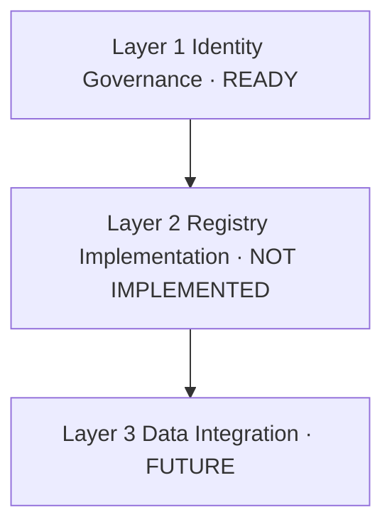

# CNINFO C-Class Registry Product Decision Review

_生成时间：2026-07-08_

> **性质：** Registry 身份层产品/架构决策评审（Era C Phase 4）。**仅决策评审** · **不实现 registry** · **不写 verified**。

**C-class 状态：** `SNAPSHOT_GENERATED_QA_REVIEW`

**依据：** [identity decision ledger](../outputs/validation/cninfo_c_class_registry_identity_decision_ledger.csv) · [ledger summary](../outputs/validation/cninfo_c_class_registry_identity_decision_ledger_summary.md)

---

# 1. Current Registry Readiness

## 1.1 当前状态

| 项 | 值 |
|----|-----|
| **C-class 状态** | `SNAPSHOT_GENERATED_QA_REVIEW` |
| **863 harvest** | 已完成 |
| **863 snapshot** | 已生成 · QA 完成 |
| **registry candidate** | 6124 行 draft 已生成 |
| **identity decision ledger** | 267 条决策已合并 |

## 1.2 已完成治理里程碑

| # | 里程碑 | 状态 |
|---|--------|------|
| 1 | company registry schema design | 完成 |
| 2 | registry candidate generation | 完成 |
| 3 | identity conflict triage | 完成（508 conflicts） |
| 4 | rename history approval | 完成（10 approved · 5 manual） |
| 5 | BSE legacy mapping approval | 完成（248 approved · 3 manual） |
| 6 | duplicate identity approval | 完成（1 approved） |
| 7 | identity decision ledger | 完成（267 decisions） |

## 1.3 结论

**Identity governance layer（身份治理层）已具备未来实现条件。**

| 确认项 | 结论 |
|--------|------|
| Schema 已批准 | 是 |
| Candidate draft 已生成 | 是 |
| 冲突已 triage + signoff | 是 |
| 决策账本已合并 | 是 |
| **Registry 已实现** | **否** — 本轮不声称 registry 已落地 |

---

# 2. Registry Implementation Boundary

三层架构边界定义：

## Layer 1：Identity Governance Layer

| 项 | 值 |
|----|-----|
| **Status** | **ready** |
| **产物** | schema · candidate draft · triage · signoff · decision ledger |

**包含：**

| 组件 | 说明 |
|------|------|
| `canonical_candidate` | 推荐 canonical 身份指向（元数据） |
| `rename_history` | 更名血缘候选（10 例 approved） |
| `legacy_code_mapping` | BSE/代码迁移映射（248 例 approved） |
| `conflict decision` | 冲突分类与处置决策 |

**政策：** Approval ≠ merge · 不修改 registry candidate · 不迁移历史数据

---

## Layer 2：Registry Implementation Layer

| 项 | 值 |
|----|-----|
| **Status** | **not implemented** |

**未来可能包含（本轮不创建）：**

| 组件 | 说明 |
|------|------|
| `company_registry` table | 生产身份表 |
| identity lookup service | 按 org_id / code 查询 |
| reconciliation workflow | 6124 universe 对账流水线 |

**本轮红线：** 无 DB · 无 registry tables · 无 backfill

---

## Layer 3：Data Integration Layer

| 项 | 值 |
|----|-----|
| **Status** | **future** |

**未来可能包含：**

| 组件 | 说明 |
|------|------|
| harvest integration | registry 驱动 universe slice |
| snapshot linkage | snapshot 与 canonical 关联 |
| event linkage | 事件时间线跨 code 关联 |

**政策：** 须 Layer 2 实现后再评估 · 不 rewrite old codes · 不 migrate snapshots

---

## 三层关系

---

# 3. Remaining Manual Queue

**剩余 manual review：8 例**

## Rename manual（5）

| code 对 | 名称 | reason |
|---------|------|--------|
| 600087 → 601975 | 退市长油 → 招商南油 | historical_listing_transition |
| 688287 → 832317 | 退市观典 → 观典防务 | cross_market_transition |
| 839680 → 920680 | *ST广道 → 广道退 | delisting_status_change |
| 600631 ↔ 600827 | 百联股份 | same_name_code_change |
| 600637 ↔ 600832 | 东方明珠 | same_name_code_change |

## BSE manual（3）

| code 对 | 名称 | reason |
|---------|------|--------|
| 301192 → 833874 | 泰祥股份 | no_clear_code_migration |
| 301321 → 833994 | 翰博高新 | no_clear_code_migration |
| 600849 → 601607 | 上海医药 | no_clear_code_migration |

## 影响评估

| 项 | 结论 |
|----|------|
| **阻塞架构批准？** | **否** — 8 例不阻塞 identity governance layer ready 判定 |
| **阻塞全量自动 reconciliation？** | **是** — 须人工结案后方可 100% 自动对账 |
| **阻塞 863 主线？** | **否** — 863 harvest/snapshot 已完成 |

---

# 4. Registry Readiness Gate

| 项 | 值 |
|----|-----|
| **registry_product_decision_gate** | **`PASS_WITH_CAVEAT`** |

## 理由

| # | 理由 |
|---|------|
| 1 | Identity governance 全流程已完成（schema → ledger） |
| 2 | 259/267 决策已 approved（97.0%） |
| 3 | merge_executed = false（政策合规） |
| 4 | **Implementation intentionally postponed** — Layer 2/3 未启动 |
| 5 | 8 例 manual 为 caveat，不阻塞架构批准 |

## Caveat 清单

- 8 例 manual identity review 未结案
- registry candidate 6124 行未 backfill 决策元数据
- BSE legacy probe 未执行（政策已批准，执行 defer）
- 无 production registry table / service

---

# 5. 当前政策重申

Identity decision ledger **不**：

- 替代 company identity
- 合并历史记录
- 重写旧证券代码
- 迁移 snapshot
- 修改 financial / event / shareholder history

---

# 6. 红线确认

- 无 CNINFO · 无 live · 无 harvest · **无 registry implementation**
- 无 DB · MinIO · RAG · 无 identity merge
- 未修改 registry candidate / raw / normalized / field_inventory
- 不写 verified · 不 testing_stable_sample

**推荐下一步：** [product decision summary](../outputs/validation/cninfo_c_class_registry_product_decision_summary.md) · full-market expansion execution readiness 评估
