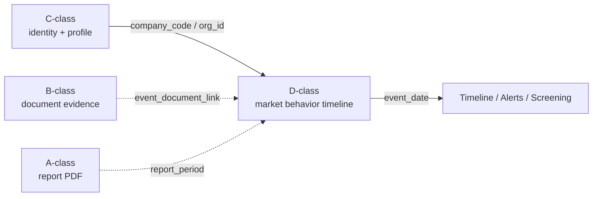

# CNINFO D 类市场结构化数据层架构计划

_最后更新：2026-07-09_

> **性质：** 规划文档 only；不调用 CNINFO；不 live；不 harvest；不写 verified；不入库。  
> **前置：** [cninfo_d_class_source_registry_design.md](cninfo_d_class_source_registry_design.md) · [cninfo_c_vs_b_vs_d_boundary.md](cninfo_c_vs_b_vs_d_boundary.md) · [cninfo_b_vs_d_class_boundary.md](cninfo_b_vs_d_class_boundary.md)  
> **并行约束：** C-class 状态 `SNAPSHOT_GENERATED_QA_REVIEW`；B-class Phase 1 tiny live validation 待批准；本计划不触碰 C/B 类 live 输出根。

---

## 1. Purpose

D-class **不是** company profile。

D-class 是 CNINFO **市场行为 / 公司事件结构化数据层**（market structured data layer）。它回答：

> **「这家上市公司在市场层面发生了什么？」**

D-class 描述的是**随时间变化的市场与资本行为**，而不是公司静态画像：

| 行为类型 | 说明 | 典型问题 |
|----------|------|----------|
| **market actions** | 市场交易层面的公司级行为 | 融资融券余额变化、大宗交易 |
| **trading events** | 可观测的交易或异常交易事件 | 大宗成交、公开信息/异常交易 |
| **shareholder actions** | 股东层面的持股变动 | 增减持、股东人数变化 |
| **capital market events** | 资本市场结构相关事件 | 限售解禁、股权质押、预约披露 |

D-class **不负责**：

- F10 公司简介、高管名单、十大股东 snapshot（→ **C-class**）
- 公告 PDF 全文与 citation 证据链（→ **B-class**）
- 年报 PDF 定期报告检索（→ **A-class**）

---

## 2. Relationship With Other Classes

| 类 | 职责 | 数据单元 | 与 D-class 关系 |
|----|------|----------|-----------------|
| **C-class** | company identity + company profile | `company_profile_snapshot` | 提供 `company_code` / `org_id` / `company_name` 等身份与画像上下文；**不承载**事件时间线 |
| **D-class** | company event / market behavior timeline | `d_company_event` / `d_company_metric_*` / `d_disclosure_schedule` | 本层；按事件日/交易日/报告期组织结构化行 |
| **B-class** | announcement / document metadata | `document` + PDF URL lineage | 可为 D-class 事件补 PDF 证据；通过 `event_document_link` 挂接，**不替代** fixed-table row |
| **A-class** | periodic report PDF retrieval | 公司 × 报告期 × 报告类型 | `disclosure_schedule` 可与 A-class 报告期联动 |

### 边界原则

1. **C-class = 画像快照**；**D-class = 行为时间线**。同一人员名在 C 类是 `executive_profile` 静态名单，在 D 类是 `management_share_change` 变动事件。
2. C-class `shareholder_profile` 是时点 top-N 股东表；D-class `shareholder_change` 是增减持事件流。
3. 允许跨层 **link** 与 **交叉验证**；禁止 **合并 registry** 或 **共用 schema 文件**。



---

## 3. Core Question & Product Use

**核心问题：** What happened to this listed company in market-level events?

| 产品用途 | 典型 UI | D-class 数据源 |
|----------|---------|----------------|
| 公司事件时间线 | 公司页「大事记」「市场动态」 | event rows 按 `event_date` 聚合 |
| 预警 / 监控 | 质押比例超阈、解禁临近 | `equity_pledge` · `restricted_shares_unlock` |
| 量化筛选 | 融资余额、股东人数变化 | `margin_trading` · `shareholder_data` |
| 披露日历 | 预约披露、变更披露日 | `disclosure_schedule` |

---

## 4. D-class Market Behavior Source Categories（Phase 0 范围）

本轮 Phase 0 聚焦以下 **7** 类市场行为源（与 Phase 2 已验证源对齐）：

| # | 类别 | source_id | 目标逻辑表 | 时间语义 |
|---|------|-----------|------------|----------|
| 1 | 融资融券 | `margin_trading` | `d_company_metric_daily` | `trade_date` |
| 2 | 大宗交易 | `block_trade` | `d_company_event` | `trade_date` |
| 3 | 限售解禁 | `restricted_shares_unlock` | `d_company_event` | `unlock_date` / `announcement_date` |
| 4 | 股权质押 | `equity_pledge` | `d_company_event` | `pledge_date` / `announcement_date` |
| 5 | 股东增减持 | `shareholder_change` | `d_company_event` + `d_event_party_detail` | `change_date` |
| 6 | 高管持股变化 | `executive_shareholding` | `d_company_event` + `d_event_party_detail` | `change_date` |
| 7 | 预约披露 / 信息披露日历 | `disclosure_schedule` | `d_disclosure_schedule` | `planned_date` / `actual_date` |

> **范围外（Phase 0 不展开）：** `abnormal_trading`、`shareholder_data`、`fund_industry_allocation` 等 Phase 2 已验证源；`ipo_query`、`szse_calendar` 等待探测 candidate。见 [cninfo_table_sources_phase2_current_final_summary.md](../outputs/validation/cninfo_table_sources_phase2_current_final_summary.md)。

---

## 5. Candidate Fields（Phase 0 最小字段意图）

以下为产品层字段意图；标准列名以 [config/cninfo_d_class_source_registry_draft.yaml](../config/cninfo_d_class_source_registry_draft.yaml) 为准。

### 5.1 融资融券（margin_trading）

| 字段 | 说明 |
|------|------|
| `company_code` | 证券代码 |
| `company_name` | 证券简称 |
| `trade_date` | 交易日 |
| `financing_balance` | 融资余额 |
| `financing_buy_amount` | 融资买入额 |
| `margin_balance` / `securities_lending_balance` | 融券余额 |
| `margin_sell_amount` / `securities_lending_volume` | 融券卖出量 |
| `total_margin_balance` / `margin_trading_balance` | 融资融券余额 |

### 5.2 大宗交易（block_trade）

| 字段 | 说明 |
|------|------|
| `company_code` | 证券代码 |
| `company_name` | 证券简称 |
| `trade_date` | 交易日期 |
| `transaction_price` | 成交均价 |
| `transaction_volume` | 成交量 |
| `transaction_amount` | 成交金额 |
| `buyer` | 买方（若 API 提供） |
| `seller` | 卖方（若 API 提供） |

> Phase 2 观测：`data20/ints/statistics` 返回公司级汇总统计；买卖双方明细可能在其他 endpoint，Phase 0 标为 gap。

### 5.3 限售解禁（restricted_shares_unlock）

| 字段 | 说明 |
|------|------|
| `company_code` | 证券代码 |
| `company_name` | 证券简称 |
| `announcement_date` | 公告日期 |
| `unlock_date` | 解禁日期 |
| `unlock_amount` | 解禁数量 |
| `unlock_ratio` | 解禁比例 |
| `tradable_amount` | 可流通数量 |

### 5.4 股权质押（equity_pledge）

| 字段 | 说明 |
|------|------|
| `company_code` | 证券代码 |
| `company_name` | 证券简称 |
| `pledge_date` | 质押日期 |
| `pledged_shares` | 质押股数 |
| `pledge_ratio` | 质押比例 |
| `pledgee` | 质权人 |
| `pledge_status` | 质押状态 |

### 5.5 股东增减持（shareholder_change）

| 字段 | 说明 |
|------|------|
| `company_code` | 证券代码 |
| `company_name` | 证券简称 |
| `shareholder_name` | 股东名称 |
| `change_type` | 变动类型（增持 inc / 减持 desc） |
| `change_amount` | 变动数量 |
| `change_ratio` | 变动比例 |
| `change_date` | 变动日期 |

### 5.6 高管持股变化（executive_shareholding）

| 字段 | 说明 |
|------|------|
| `company_code` | 证券代码 |
| `company_name` | 证券简称 |
| `executive_name` | 高管姓名 |
| `position` | 职务 |
| `change_type` | 变动类型 |
| `change_amount` | 变动数量 |
| `change_date` | 变动日期 |

### 5.7 预约披露 / 信息披露日历（disclosure_schedule）

| 字段 | 说明 |
|------|------|
| `company_code` | 证券代码 |
| `company_name` | 证券简称 |
| `report_type` | 报告类型 / 报告期 |
| `planned_date` | 首次预约披露日 |
| `actual_date` | 实际披露日 |
| `change_history` | 变更披露日序列（f003/f004/f005） |

---

## 6. Core Data Objects（设计层）

| 逻辑对象 | 说明 | 主要 schema |
|----------|------|-------------|
| `d_company_event` | 离散事件行（大宗、解禁、质押、增减持、高管变动） | `schemas/d_class/d_company_event.schema.json` |
| `d_company_metric_daily` | 日度公司级指标（融资融券） | `schemas/d_class/d_company_metric_daily.schema.json` |
| `d_disclosure_schedule` | 披露预约与变更日程 | `schemas/d_class/d_disclosure_schedule.schema.json` |
| `d_event_party_detail` | 事件主体明细（股东名、高管名、质权人） | `schemas/d_class/d_event_party_detail.schema.json` |
| `d_raw_record_snapshot` | 原始 API 行快照（lineage） | `schemas/d_class/d_raw_record_snapshot.schema.json` |
| `company_market_timeline`（读模型） | 按 `company_code` 聚合多源 event/metric 的时间线视图 | 设计 only；Phase 0 不生成 |

---

## 7. Ingestion Architecture（规划 only）

```
CNINFO data20/* JSON endpoint
        │
        ▼
  raw_record_snapshot（保留原始行 + fetch metadata）
        │
        ▼
  mapper（lab/cninfo_d_class_mappers.py 草案）
        │
        ▼
  logical record（d_company_event / d_company_metric_daily / d_disclosure_schedule）
        │
        ▼
  validation（fixture schema · registry lint）
        │
        ▼
  harvest 产物（未来：outputs/harvest/cninfo_d_class/ — **未启动**）
```

**Phase 0 停止线：** 架构与 source discovery 计划完成；**不实现** harvest runner · **不写入**磁盘 harvest 产物。

---

## 8. Relationship to Phase 2 / Phase 3 既有工作

| 既有产物 | 状态 | Phase 0 关系 |
|----------|------|--------------|
| Phase 2 十源 live 验证 | `testing_stable_sample` × 10 | 本计划 7 源均为其子集且已验证 endpoint |
| [cninfo_d_class_source_registry_draft.yaml](../config/cninfo_d_class_source_registry_draft.yaml) | design_only | 复用；本轮不修改 |
| [schemas/d_class/](../schemas/d_class/) | 10 逻辑表 draft | 复用；本轮不修改 |
| [fixtures/d_class/](../fixtures/d_class/) | 11 fixture PASS | 复用；本轮不扩跑 |
| C-class harvest / snapshot | `SNAPSHOT_GENERATED_QA_REVIEW` | 仅通过 `company_code` 关联；不合并 |

---

## 9. Phase 0 Deliverables

| 交付物 | 路径 |
|--------|------|
| 本架构计划 | `plans/cninfo_d_class_market_data_architecture_plan.md` |
| Source discovery 计划 | `plans/cninfo_d_class_source_discovery_plan.md` |
| Readiness matrix | `outputs/validation/cninfo_d_class_readiness_matrix.csv` |
| Planning summary | `outputs/validation/cninfo_d_class_initial_planning_summary.md` |

---

## 10. Red Lines（本轮）

- **No CNINFO** · **No live** · **No harvest** · **No PDF**
- **No DB** · **No MinIO** · **No RAG / vector index**
- **No verified** · **No testing_stable_sample upgrade**
- **No C-class output modification** · **No B-class output modification**
- **No identity merge**

---

## Gate

```text
d_class_initial_planning_gate = DESIGN_STARTED
```
