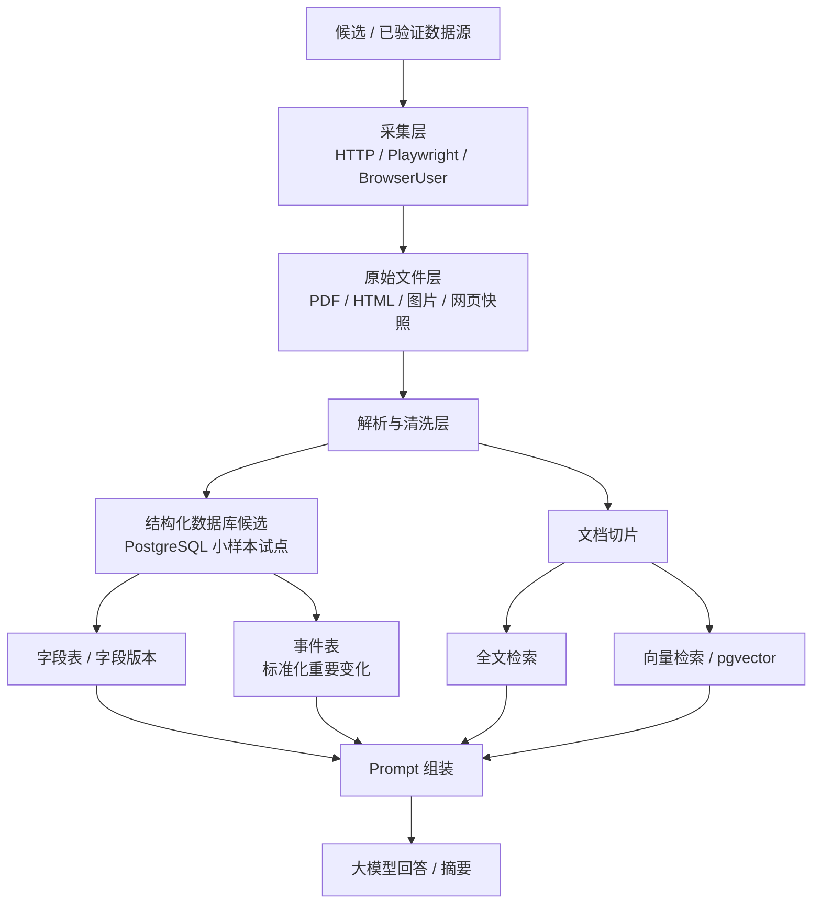
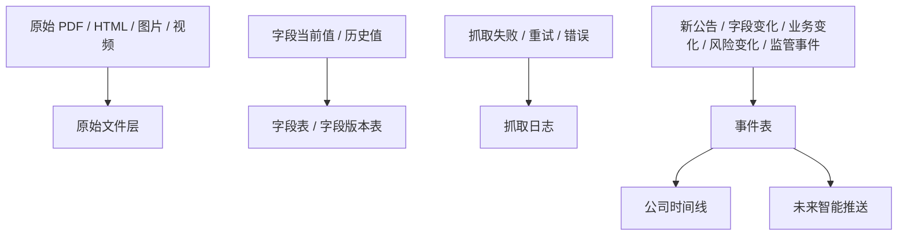
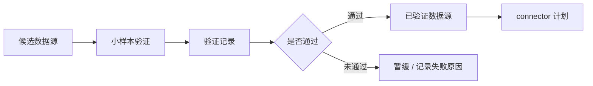

# 动态数据平台计划（当前阶段）

_最后更新：2026-06-29_

> 本文件是当前阶段的总体计划。它**不是**已经做出来的功能，而是架构方向 + 小范围试点准备。当前阶段**只更新文档与规划，不改代码、不跑数据、不动数据库**。

---

## 一句话

把现有的「2024 年报静态数据库」逐步升级为「动态上市公司数据平台」。本阶段先把架构方向想清楚，再做小范围试点，**不直接全量开发、不直接全量迁移**。

---

## 1. 为什么要从静态数据库升级到动态平台

- 年报是**一年一次的静态快照**，无法回答「最近发生了什么」。
- 真实使用场景需要：动态更新、事件时间线、证据追溯、智能问答。
- 所以方向是：在现有数据底座之上，补充**动态采集 + 事件组织 + 智能检索**能力。

---

## 2. 当前已有基础

| 项目 | 现状 |
|---|---|
| 数据来源 | 主要为 CNINFO 公开年报 PDF |
| 数据集 | `full_market_2024`：6124 家全集，5707 家成功，0 错误 |
| 入库 | `SQLite` 约 62,890 条字段级记录 |
| 字段 | 主营业务、行业讨论、管理层讨论、`rnd_investment`、`revenue_by_region`、`revenue_by_segment`、风险因素、主要子公司等 |
| 证据 | 尽量保留来源 PDF、页码、证据句、URL |
| 质量审计 | 自动合理性分数 + 严格质量审计；非金融核心指标 `usable` 9.43/11 |

这是一个可靠的起点：结构化、有证据、有质量标签。

---

## 3. 当前真正的问题

1. 数据库用什么？`SQLite` 适合原型，但产品化的动态系统需要更强的能力。
2. 怎么组织「变化」？需要一个事件表，但边界必须清楚。
3. 新数据源怎么接？不能假设没测过的源就能用。
4. 怎么采集？不同网站难度不同，需要分层策略。

---

## 4. 数据库路线判断

### 推荐方向：混合架构，但先小范围试点

不追求「一个数据库解决所有问题」，而是**分工协作**：

| 组件 | 负责 |
|---|---|
| SQL 数据库（核心结构化） | 公司、字段值、版本、事件表 |
| 向量库 / `pgvector` | 语义检索（智能问答的底层） |
| 全文检索 | 关键词检索、证据句定位 |
| 事件表 | 标准化重要变化，供时间线与推送 |
| 原始文件层 | PDF / HTML / 图片 / 网页快照等原始物 |

推荐方向不是单一数据库，而是各层分工的混合架构：



### `PostgreSQL` 的角色（措辞要谨慎）

- `PostgreSQL` 是**未来结构化核心数据库的候选**，不是已经决定、也不是已经完成的迁移。
- 它仍然是 SQL，但比 `SQLite` 更适合产品化的动态系统。
- 它可以通过 `pgvector` 在一套系统里支持结构化数据、版本、事件表、全文检索和向量检索。
- **但实际性能与适配性必须用小样本试点验证。**
- 不建议立即从 `SQLite` 全量迁移到 `PostgreSQL`；建议先做**目标 schema 设计 + 小样本试点**。

> 正确措辞示例：「`PostgreSQL` 具备支持智能检索原型的技术基础，但具体效果需要通过小样本测试验证。」
> 避免措辞示例：「`PostgreSQL` 可以解决智能访问问题。」

---

## 5. PostgreSQL 小样本试点思路

1. 设计目标 schema：公司表、字段值表（带版本）、事件表、证据表。
2. 从 2024 底座中导出**一个小样本**（如单板块或数百家）灌入 `PostgreSQL`。
3. 测试三件事：结构化查询、全文检索、`pgvector` 向量检索。
4. 记录性能、易用性、迁移成本，形成判断，再决定是否扩大。

---

## 6. 事件表模式和边界

### 事件表记录什么

只记录**标准化的重要变化**，例如：

- 新文档发布
- 字段值变化
- 业务更新
- 风险更新
- 监管事件
- 重大公告
- 管理层变动

### 事件表不记录什么（边界）

| 内容 | 应该放在 |
|---|---|
| 原始 PDF / HTML / 图片 / 视频 / 网页快照 | 原始文件层 |
| 字段当前值 | 字段表 |
| 抓取失败、重试记录 | 抓取日志 |

> 正确措辞：「事件表可以记录所有公司的标准化重要变化，但不能替代原始文件层、字段表和抓取日志。」

事件表服务于**公司时间线和智能推送**，不是所有数据的总表。

事件表只记录标准化重要变化，其他内容应进入对应的数据层：



---

## 7. 数据源验证机制

不能把没测过的数据源当成「已可用」。采用统一流程：

```
候选数据源 → 小样本验证 → 验证记录 → 已验证数据源 → connector 计划
```

### 每个数据源验证时记录

- 测试日期
- 测试公司 / 样本量
- 访问方式：`HTTP` / `Playwright` / `BrowserUser` / 人工
- 成功率
- 实际获取到的数据
- 未获取到的数据
- 失败原因
- 可复现性
- 合规风险
- 推荐优先级

### 措辞规范

- 测试前：用「候选数据源」「待验证数据源」「优先测试对象」。
- 测试后：用「本次样本验证可获取……」「本次测试成功获取……」「本次测试失败原因为……」。
- 在没有长期重复证据前，**不写**「该数据源长期稳定可用」。

数据源不能直接承诺可用，需要先经过小样本验证：



---

## 8. RPA / HTTP / Playwright / BrowserUser 分层采集策略

不是「用 RPA 抓所有数据」，而是**分层采集框架**：

| 层级 | 适用场景 |
|---|---|
| `HTTP` 直连 | 能直接请求到结构化接口或文件的，优先用 `HTTP` |
| `Playwright` | 需要浏览器交互、渲染才能拿到内容的页面 |
| `BrowserUser` / LLM 浏览器智能体 | 结构不统一、路径不确定的**小样本复杂页面**才考虑 |

### RPA 为什么不是万能方案

- RPA / `BrowserUser` **不是主数据库**，只是数据采集层。
- 单一通用 RPA 很难可靠覆盖所有网站。
- 更现实的做法：**统一的浏览器自动化框架 + 针对各数据源的 connector**。
- 必须遵守法律授权与平台规则。
- **不假设**绕过登录、付费、验证码、权限或反爬保护。

---

## 9. 下一步计划（小范围试点）

| 步骤 | 内容 |
|---|---|
| 1 | 确认动态平台架构方案（数据库、事件表、采集分层） |
| 2 | 设计 `PostgreSQL` 目标 schema + 小样本试点 |
| 3 | 选 1–2 个候选数据源做小样本验证，形成验证记录 |
| 4 | 在年报底座上跑通一个事件表最小示例 |

---

## 10. 不建议现在做什么

- **不**直接做 `SQLite` 到 `PostgreSQL` 的全量迁移。
- **不**直接开发完整 `RAG` 产品。
- **不**直接开发完整 `LLM Wiki` 产品。
- **不**对大量网站做大规模 RPA 抓取。
- **不**在事件表里堆原始文件、所有字段值或抓取日志。
- **不**声称未验证的数据源已可用。

---

## 11. 需要老师确认的问题

1. 是否认可「先架构设计 + 小范围试点，不直接全量开发」的节奏？
2. 数据库是否按「`SQLite` 原型 → `PostgreSQL` 小样本试点 → 再决定迁移」推进？
3. 优先验证哪些候选数据源？合规边界如何把握？
4. 动态更新优先做哪类事件（公告 / 业务 / 风险 / 管理层变动）？
5. 智能问答 / 知识页原型放在第几阶段启动？
