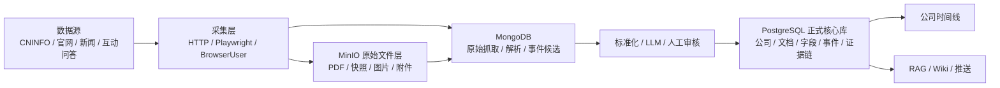
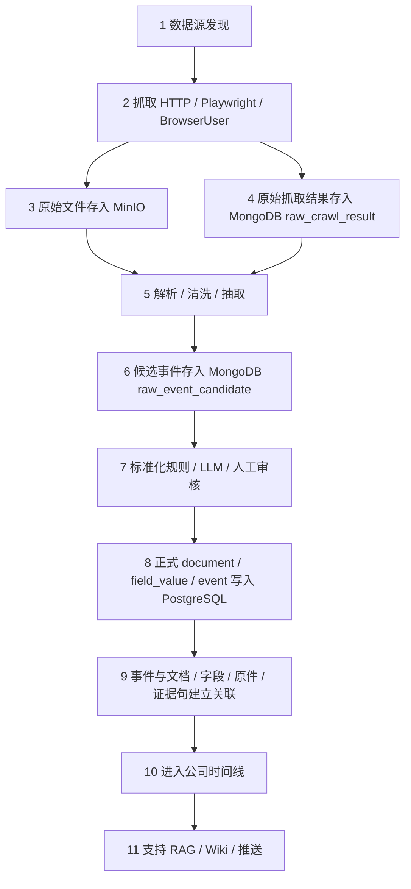
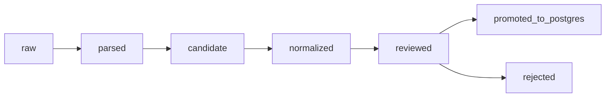

# 动态数据平台存储结构设计：MinIO + MongoDB + PostgreSQL

_最后更新：2026-06-30_

> 本文件是**当前阶段的存储结构设计方案**，属于架构规划，不是已经做出来的系统。当前阶段**只做需求梳理、schema/collection 设计与小样本试点准备，不做全量迁移、不部署生产数据库、不改现有代码与数据**。

---

## 老师可读版（只看这一段也能懂）

我们现在有一份高质量的 2024 年报静态数据库。要升级成**动态上市公司数据平台**（持续更新、事件时间线、智能问答、智能推送、证据追溯），需要想清楚「文件、不规则数据、正式结构化数据」分别放在哪。

本方案的判断是用**三层存储分工**：

| 层 | 角色 | 一句话 | 本阶段动作 |
|---|---|---|---|
| `MinIO`（对象存储） | 原始文件层 | 存 PDF / 网页快照 / 图片 / 附件本体 | 设计 + 小样本迁移试点 |
| `MongoDB` | 采集层 / 原始解析层 / 事件候选层 | 先接住结构不稳定的多源数据，避免丢信息 | 设计 collection + 待新数据源时再部署 |
| `PostgreSQL` | 正式核心数据库 | 公司、文档、字段、字段版本、正式事件、证据链、推送 | **当前最优先验证**的核心方向，设计 schema + 小样本试点 |

三句话结论：

1. **`PostgreSQL` 是当前最优先验证的核心数据库方向**，但不是立即全量迁移；先设计目标 schema + 小样本试点，再决定迁移节奏。
2. **`MongoDB` 必须纳入三层设计**，但不一定第一阶段部署；它的重点是**采集层、原始解析层、事件候选层**，用来接住官网 / 新闻 / 互动问答等结构不稳定的新数据。
3. **`MinIO` 是原始文件层方向**；现有按 `sha256` 缓存的本地文件可平滑迁移，先做小样本验证。

下面是工程可落地部分：需求能力、数据流、三层各自的表 / collection 字段、连接与状态流转、动态时间线判断、四个小样本试点、推荐结论。

---

## 三层分工总览图

下图概括三层各自负责什么、数据怎么从左到右收敛为正式时间线：



---

## 一、独立判断：这个平台到底需要哪些存储能力

在写表之前，先判断问题本质：**「动态」有两种**，必须分开处理。

- **结构动态**：新数据源、新字段、不规则 JSON 不断出现。这类「形状不固定」的数据，强行先建严格关系表会反复改表、容易丢信息，更适合先用 `MongoDB` 接住。
- **事件动态**：正式事件按时间不断追加，并要和公司、文档、字段、证据、推送建立稳定关系。这类「关系密集、要长期可信」的数据，更适合 `PostgreSQL` 的事件表管理。

因此结论不是「谁取代谁」，而是 `MongoDB` 负责**前端接住**，`PostgreSQL` 负责**后端沉淀**，`MinIO` 负责**原件留存**。

### 存储能力需求表

| 需求 | 为什么需要 | 更适合哪层 | 原因 |
|---|---|---|---|
| 1. 原始文件保存 | 证据追溯要能回到原件 | `MinIO` | 文件本体大、二进制，不应进数据库行 |
| 2. 原始采集结果保存 | 多源抓取 JSON 结构不稳定 | `MongoDB` | 固定核心字段 + `extra` 动态字段，先接住不丢信息 |
| 3. 多来源数据验证 | 未验证的源不能当可用 | `MongoDB`（结果）+ `PostgreSQL`（结论登记） | 验证明细易变放 Mongo，最终结论登记进 PG `data_source` |
| 4. 文档元数据管理 | 公告 / 年报 / 新闻要可检索可关联 | `PostgreSQL` | 关系明确、需稳定主键与外键 |
| 5. 字段抽取结果管理 | 字段值要可查询、可审计 | `PostgreSQL` | 已有 SQLite `extracted_field` 可平滑映射 |
| 6. 字段版本管理 | 要记录字段随时间变化 | `PostgreSQL` | 版本/变更属于关系数据，需可追溯 |
| 7. 质量审计管理 | 已有 `usable`/`partial`/`wrong` 体系 | `PostgreSQL` | 审计结果要与字段/文档稳定关联 |
| 8. 事件时间线管理 | 正式公司时间线 | `PostgreSQL` | 事件追加 + 关系密集，PG `event` 表最合适 |
| 9. 事件与证据关联 | 事件要能追到文档/原件/证据句 | `PostgreSQL` | 多对多关联表（`event_document_link` 等） |
| 10. 用户关注与推送记录 | 智能推送要知道推给谁、推过什么 | `PostgreSQL` | 用户/通知是事务型关系数据 |
| 11. RAG 检索与引用记录 | 问答要可复现、可追溯引用 | `PostgreSQL`（日志）+ `MinIO`/向量库（内容） | 检索日志结构稳定；向量与切片另设 |
| 12. connector 配置与运行日志 | 多源采集要可调度、可排障 | `PostgreSQL`（配置/任务）+ `MongoDB`（原始运行明细） | 配置稳定进 PG；冗长原始日志可留 Mongo |

> 说明：第 3、11、12 项是**跨层协作**，不是非此即彼。原则是「形状不稳定 → Mongo，关系稳定 → PG，文件本体 → MinIO」。

---

## 二、总体数据流：从采集到正式时间线

下图是端到端流程，强调数据如何从「不规则」一步步收敛为「正式可信」：



### 每一步的输入 / 输出 / 失败 / 重试与人工审核

| 步骤 | 输入 | 输出 | 失败情况 | 重试 / 人工审核 |
|---|---|---|---|---|
| 1 数据源发现 | connector 配置、关注列表 | 待抓取任务 `crawl_task` | 源不可达 / 改版 | 自动重排；连续失败转人工 |
| 2 抓取 | 任务 URL、访问方式 | 原始响应 + 文件 | 超时 / 反爬 / 验证码 | 退避重试；复杂页转人工或降级方式 |
| 3 存 MinIO | 文件本体、`content_hash` | `object_key` + `raw_file` 元数据 | 上传失败 / 重复文件 | 重传；`content_hash` 命中则跳过 |
| 4 存 MongoDB | 抓取 JSON | `raw_crawl_result` 文档 | 字段缺失 | 进 `extra` 保留，标 `parse_status` |
| 5 解析抽取 | 原件 + 原始结果 | 文本块 / 表格 / 字段候选 | 解析器不支持格式 | 换解析器；记录 `error_message` |
| 6 候选事件 | 解析结果 | `raw_event_candidate` | 置信度低 | 低分进待审池，不直接晋升 |
| 7 标准化审核 | 候选事件 | 规范化事件 + 审核状态 | 规则冲突 / 误判 | LLM 初判 + 人工复核 |
| 8 写 PostgreSQL | 已审核数据 | `document` / `field_value` / `event` 行 | 主键冲突 / 去重命中 | 按 `dedupe_key` 合并而非重复插入 |
| 9 建立关联 | PG 行 + 来源 id | 关联表行 | 悬空外键 | 校验外键；缺失则回退到候选 |
| 10 进入时间线 | 正式 event | 公司时间线视图 | 时间字段缺失 | 用 `detected_time` 兜底并标注 |
| 11 支持应用 | 时间线 + 字段 + 证据 | RAG 答案 / Wiki / 推送 | 证据缺失 | 无证据不外推；标注 `not_found` |

> 全流程遵守：**未验证数据源不写「长期稳定可用」**；抓取必须遵守法律授权与平台规则，不假设绕过登录、付费、验证码、权限或反爬。

---

## 三、用两个例子理解完整流程

上面的流程图说明了系统分层。为了更容易理解，下面用两份数据从进入系统到形成时间线的全过程来说明：例子 A 是结构相对稳定的 CNINFO 年报 PDF，例子 B 是结构不稳定的官网新闻 / 互动问答。

> 提醒：下面是**设计方案的预期流程**，不是已经上线的系统。当前阶段只做设计与小样本试点，尚未部署 `MinIO` / `MongoDB` / `PostgreSQL`。示例中的公司、数值与 ID 均为说明用的虚构值。

### 例子 A：CNINFO 年报 PDF 如何进入正式数据库

这个例子代表**结构相对稳定的数据源**。CNINFO 年报通常是 PDF，字段结构比较明确，所以可以从原始文件逐步进入正式数据库。

#### Step 1：发现公告

系统在 CNINFO 发现某家公司 2024 年年度报告，例如：

```text
company_code = 600519
company_name = 贵州茅台
document_type = annual_report
report_year = 2024
source_url = https://...
```

这一步只是发现「有一份年报」。

#### Step 2：下载 PDF

采集层通过 HTTP 或已有 CNINFO 流程下载 PDF，得到一个本地文件，例如：

```text
local_path = /data/raw/cninfo/2024/600519/annual_report.pdf
```

当前阶段可以先存在本地文件系统，因为方便测试和跑流程。

#### Step 3：计算 `sha256`

系统对 PDF 文件计算 `sha256`，得到文件指纹：

```text
content_hash = abc123...
```

这个 hash 用来判断：这个 PDF 是否已经存过、是否和数据库记录一致、迁移到 MinIO 后能否校验完整性。

#### Step 4：生成 MinIO 的 `object_key`

系统根据规则生成 MinIO 文件路径：

```text
bucket = listed-company-raw
object_key = cninfo/2024/600519/annual/abc123.pdf
```

这里的路径包含：

| 部分 | 含义 |
|---|---|
| `cninfo` | 数据源 |
| `2024` | 年份 |
| `600519` | 公司代码 |
| `annual` | 文档类型 |
| `abc123.pdf` | 文件 hash + 后缀 |

#### Step 5：原始 PDF 存入 MinIO

PDF 本体进入 MinIO（`bucket = listed-company-raw`，`object_key = cninfo/2024/600519/annual/abc123.pdf`），数据库不直接存 PDF 文件本体。这样做的好处是：

- 大文件不塞进数据库；
- 多个服务都能通过 object_key 访问；
- 未来可以从本地文件系统平滑迁移到 MinIO；
- 可以通过 hash 去重。

#### Step 6：写入 PostgreSQL 的 `raw_file` 表

PostgreSQL 的 `raw_file` 表记录文件元数据。示例：

| 字段 | 示例值 |
|---|---|
| `raw_file_id` | 9001 |
| `storage_backend` | minio |
| `bucket` | listed-company-raw |
| `object_key` | cninfo/2024/600519/annual/abc123.pdf |
| `local_path` | /data/raw/cninfo/2024/600519/annual_report.pdf |
| `source_url` | CNINFO PDF URL |
| `content_hash` | abc123... |
| `file_size` | 5.2MB |
| `mime_type` | application/pdf |
| `download_time` | 2026-06-30 |
| `parse_status` | pending |

这条记录的作用是：告诉系统这个原始 PDF 在哪里、来自哪里、hash 是什么、解析状态如何。

#### Step 7：写入 PostgreSQL 的 `document` 表

`document` 表记录「这是一份什么文档」。示例：

| 字段 | 示例值 |
|---|---|
| `document_id` | 101 |
| `company_id` | 1 |
| `source_id` | cninfo |
| `document_type` | annual_report |
| `title` | 贵州茅台 2024 年年度报告 |
| `publish_time` | 2025-04-28 |
| `report_year` | 2024 |
| `source_url` | CNINFO URL |
| `raw_file_id` | 9001 |
| `content_hash` | abc123... |
| `parse_status` | pending |

这里最重要的连接是 `document.raw_file_id = raw_file.raw_file_id`，意思是：这份文档对应哪一个原始 PDF 文件。

#### Step 8：解析 PDF

解析器读取 MinIO 或本地文件系统里的 PDF，抽出文本、表格、页码、证据句、字段候选。例如抽到：

```text
第 88 页：公司 2024 年研发投入为 2.3 亿元。
```

#### Step 9：写入 PostgreSQL 的 `field_value` 表

字段抽取结果进入 `field_value` 表。示例：

| 字段 | 示例值 |
|---|---|
| `field_value_id` | 5001 |
| `company_id` | 1 |
| `document_id` | 101 |
| `field_key` | rnd_investment |
| `field_label` | 研发投入 |
| `value_raw` | 2.3 亿元 |
| `value_normalized` | 230000000 |
| `unit` | 元 |
| `report_year` | 2024 |
| `report_period` | FY |
| `source_page` | 88 |
| `evidence_text` | 公司 2024 年研发投入为 2.3 亿元。 |
| `quality_status` | pending |

这一步就是把 PDF 里的文字变成结构化字段。

#### Step 10：写入 PostgreSQL 的 `quality_audit` 表

字段抽出来后，还要经过质量审计。例如：

| 字段 | 示例值 |
|---|---|
| `audit_id` | 7001 |
| `target_type` | field_value |
| `target_id` | 5001 |
| `audit_method` | strict_audit |
| `strict_label` | usable |
| `proxy_plausible_score` | 0.96 |
| `evidence` | 字段值与证据句一致 |
| `created_at` | 2026-06-30 |

这样以后系统可以知道：这个字段不是随便抽出来的，它有证据，也有质量标签。

#### Step 11：生成正式事件 `event`

发布年报本身可以成为一条事件：

| 字段 | 示例值 |
|---|---|
| `event_id` | 8001 |
| `company_id` | 1 |
| `event_type` | document_published |
| `event_time` | 2025-04-28 |
| `detected_time` | 2026-06-30 |
| `title` | 公司发布 2024 年年度报告 |
| `summary` | 公司披露 2024 年年度报告，包含研发投入、收入结构、风险因素等信息。 |
| `primary_document_id` | 101 |
| `primary_raw_file_id` | 9001 |
| `source_url` | CNINFO URL |
| `dedupe_key` | 600519_document_published_20250428_abc123 |
| `review_status` | reviewed |

> 时间线动态增加，不是一直增加字段，而是 `event` 表不断新增事件行。

#### Step 12：建立事件与文档 / 字段的关联

事件不是孤立的，它要能追溯来源。

`event_document_link`：

| event_id | document_id |
|---|---|
| 8001 | 101 |

含义：`event_id = 8001` 这条事件来自 `document_id = 101` 这份文档。

`event_field_link`：

| event_id | field_value_id |
|---|---|
| 8001 | 5001 |

含义：这条事件也关联到研发投入这个字段。

#### Step 13：进入公司时间线

最后，用户查看贵州茅台时间线时，可以查询：

```sql
SELECT *
FROM event
WHERE company_id = 1
ORDER BY event_time DESC;
```

系统就能显示「2025-04-28：公司发布 2024 年年度报告」。点开这条事件，可以继续追溯：

```text
事件 → 文档 → 原始 PDF → 页码 → 证据句 → 字段值 → 审计结果
```

这就是正式时间线和证据链。

### 例子 B：官网新闻 / 互动问答如何进入时间线

这个例子代表**结构不稳定的数据源**。官网新闻、投资者互动问答、新闻媒体、RPA 页面，字段往往不统一，所以更适合先进入 MongoDB。

#### Step 1：采集页面

系统通过 Playwright 或 BrowserUser 打开公司官网投资者关系页面，抓到标题、发布时间、正文、附件链接、图片链接、页面区块等。不同网站字段可能不同，例如：

```text
官网新闻页面可能有：title / publish_time / html_body / attachments / image_urls
互动问答可能有：question / answer / question_time / reply_time
```

#### Step 2：写入 MongoDB 的 `raw_crawl_result`

原始抓取结果先进入 MongoDB。示例：

```json
{
  "source_id": "company_ir",
  "source_type": "website",
  "connector_name": "company_ir_connector",
  "company_code": "300750",
  "company_name": "宁德时代",
  "title": "投资者关系活动记录表",
  "publish_time": "2025-06-20",
  "crawl_time": "2026-06-30T10:00:00",
  "source_url": "https://...",
  "content_hash": "def456...",
  "raw_file_id": "9002",
  "content_type": "html",
  "parse_status": "parsed",
  "quality_status": "pending",
  "extra": {
    "attachments": ["record.pdf"],
    "page_blocks": ["公司介绍", "问答记录"],
    "image_urls": ["https://.../image.png"]
  }
}
```

这里固定字段用于关联、去重、查询，`extra` 用于保存不同网站自己的特殊字段。这就是 MongoDB 的价值：先接住字段不统一的数据，不因为 PostgreSQL 表还没设计好就丢信息。

#### Step 3：生成 `raw_event_candidate`

系统从页面内容里判断「这可能是一条业务变化事件」，于是写入 MongoDB 的 `raw_event_candidate`：

```json
{
  "company_code": "300750",
  "source_id": "company_ir",
  "source_type": "website",
  "candidate_type": "business_update",
  "candidate_time": "2025-06-20",
  "title": "公司提到海外业务推进",
  "summary": "公司在投资者交流中提到继续推进海外业务布局。",
  "source_url": "https://...",
  "raw_file_id": "9002",
  "evidence_text": "公司将继续推进全球化布局。",
  "confidence_score": 0.78,
  "normalize_status": "candidate",
  "extra": {
    "question": "公司海外业务进展如何？",
    "answer": "公司将继续推进全球化布局。",
    "reply_time": "2025-06-20"
  }
}
```

它现在还不是正式事件，只是候选事件。

#### Step 4：标准化 / LLM / 人工审核

系统检查这个候选事件重要吗、事件类型对吗、时间是否可靠、证据是否足够、是否和已有事件重复。状态流转为 `candidate → normalized → reviewed`。如果通过审核，就可以晋升到 PostgreSQL；如果不通过，就留在 MongoDB，不进入正式时间线。

#### Step 5：晋升到 PostgreSQL 的 `event` 表

审核通过后，写入 PostgreSQL 的正式事件表：

| 字段 | 示例值 |
|---|---|
| `event_id` | 8002 |
| `company_id` | 2 |
| `event_type` | business_update |
| `event_time` | 2025-06-20 |
| `detected_time` | 2026-06-30 |
| `title` | 公司提到海外业务推进 |
| `summary` | 公司在投资者交流中表示将继续推进海外业务布局。 |
| `source_url` | 官网 URL |
| `primary_raw_file_id` | 9002 |
| `evidence_text` | 公司将继续推进全球化布局。 |
| `dedupe_key` | 300750_business_update_20250620_def456 |
| `review_status` | reviewed |
| `extra_json` | {"question": "...", "answer": "..."} |

#### Step 6：回写 MongoDB，保留 lineage

PostgreSQL 生成正式 `event_id = 8002` 后，系统回写 MongoDB：

```json
{
  "_id": "...",
  "normalize_status": "promoted_to_postgres",
  "event_id": 8002
}
```

这样以后可以追溯：

```text
正式事件 event_id = 8002
  ↓ 来自 MongoDB 哪条 raw_event_candidate
  ↓ 来自哪次 raw_crawl_result
  ↓ 来自哪个 MinIO 原始文件
  ↓ 来自哪个 source_url
```

这叫 lineage，也就是数据血缘。

#### Step 7：进入公司时间线

现在用户查看宁德时代时间线时，可以看到「2025-06-20：公司提到海外业务推进」。点开事件，可以追到官网页面 / 互动问答原文、MongoDB 原始抓取记录、MinIO 页面快照、PostgreSQL 正式 event、证据句。

---

## 四、MinIO 原始文件层设计

### 1. bucket 设计

| bucket | 存什么 | 不存什么 |
|---|---|---|
| `listed-company-raw` | 年报 / 季报 / 半年报 / 临时公告等正式文档原件（PDF 为主） | 解析中间结果、字段值 |
| `listed-company-snapshots` | 官网页面快照、新闻页快照、互动问答页 HTML / 截图 | 正式结构化数据 |
| `listed-company-attachments` | 附件、图片、OCR 原图、RPA 下载文件、视频 | 大体量不必要的临时缓存 |

> 用途分桶而非按公司分桶，便于权限、生命周期策略与扩展；公司维度通过 `object_key` 与 `raw_file` 元数据体现。

### 2. object_key 命名规则

核心原则：**可读前缀（人能看懂归属）+ `content_hash`（保证唯一与去重）**。

```
# 正式文档
cninfo/{report_year}/{company_code}/{document_type}/{content_hash}.pdf
# 官网 / 新闻快照
snapshot/{source_type}/{company_code}/{yyyymmdd}/{content_hash}.html
# 图片 / 附件 / RPA 截图
attachment/{company_code}/{source_type}/{content_hash}.{ext}
```

说明：

- `content_hash` 用 `sha256`，与现有 PDF 缓存（`{sha256}.pages.json`）一致，天然支持去重。
- `document_type` 例：`annual` / `quarterly` / `interim` / `announcement`。
- 用 `content_hash` 而非原始文件名，避免重名与中文路径问题；可读性由前缀保证。

### 3. `raw_file` 元数据表（存在 PostgreSQL，文件本体在 MinIO）

| 字段 | 用途 |
|---|---|
| `raw_file_id` | 主键，内部稳定标识 |
| `storage_backend` | `minio` / `local`，迁移期并存 |
| `bucket` | MinIO bucket 名 |
| `object_key` | MinIO 对象键 |
| `local_path` | 本地路径（迁移前/回退用） |
| `source_url` | 文件来源 URL，证据追溯 |
| `content_hash` | `sha256`，去重与一致性校验 |
| `file_size` | 字节数，校验完整性 |
| `mime_type` | 类型，决定解析器 |
| `download_time` | 下载/采集时间 |
| `crawl_task_id` | 关联抓取任务，血缘 |
| `parse_status` | `pending` / `parsed` / `failed` |
| `error_message` | 失败原因 |

### 4. 本地文件系统 → MinIO 迁移思路

| 步骤 | 做法 |
|---|---|
| 扫描本地文件 | 遍历缓存目录，列出 PDF / 快照 / 图片清单 |
| 计算 `content_hash` | 复用现有 `sha256_of`，与缓存命名一致 |
| 生成 `object_key` | 按上面的命名规则拼接前缀 + hash |
| 上传 MinIO | 幂等上传；已存在同 hash 对象则跳过 |
| 写 / 更新 `raw_file` | 记录 `bucket`/`object_key`，`storage_backend` 置 `minio` |
| 去重 | 以 `content_hash` 为唯一约束，重复文件只留一份对象、多条来源映射 |
| 回滚 | 保留 `local_path`；迁移失败时 `storage_backend` 回退 `local`，不删除本地原件 |
| 小样本试点 | 先迁 50–100 个文件验证「能上传、能读回、hash 一致、raw_file 正确」，再扩大 |

---

## 五、MongoDB 采集层 / 原始解析层 / 事件候选层设计

> 定位：`MongoDB` 负责**先接住**结构不稳定的数据，**不**负责正式时间线。固定核心字段保证可关联，`extra` 容纳各源差异。

### 1. `raw_crawl_result`（一次抓取的原始结果）

| 字段 | 固定/extra | 用途 |
|---|---|---|
| `_id` | 固定 | Mongo 主键 |
| `source_id` | 固定 | 数据源标识，关联 PG `data_source` |
| `source_type` | 固定 | `cninfo` / `website` / `news` / `interactive_qa` 等 |
| `connector_name` | 固定 | 采集器名 |
| `crawl_task_id` | 固定 | 关联抓取任务，血缘 |
| `company_code` | 固定 | 公司代码（可空，发现阶段可能未知） |
| `company_name` | 固定 | 公司名 |
| `title` | 固定 | 标题 |
| `publish_time` | 固定 | 发布时间 |
| `crawl_time` | 固定 | 抓取时间 |
| `source_url` | 固定 | 来源 URL |
| `content_hash` | 固定 | 去重键 |
| `raw_file_id` | 固定 | 关联 MinIO 原件元数据 |
| `raw_file_object_key` | 固定 | 冗余存 object_key，便于直读 |
| `content_type` | 固定 | 内容类型 |
| `extracted_text` | 固定 | 抽取出的纯文本（可空） |
| `parse_status` | 固定 | 解析状态 |
| `quality_status` | 固定 | 质量标签 |
| `extra` | extra | 各源特殊字段：`announcement_type`/`report_period`/`tags` 等 |
| `created_at` / `updated_at` | 固定 | 时间戳 |

### 2. `raw_parse_result`（解析中间结果）

固定：`_id`、`raw_file_id`、`source_id`、`parser_name`、`parser_version`、`content_type`、`parse_status`、`error_message`、`created_at`。
进 `extra`：`text_blocks`、`tables`、`images`、`attachments`、`page_blocks`、`ocr_result`、`asr_result` 等随格式变化的结构。

### 3. `raw_event_candidate`（未标准化的事件候选）

固定：`_id`、`company_code`、`source_id`、`source_type`、`candidate_type`、`candidate_time`、`title`、`source_url`、`raw_file_id`、`confidence_score`、`normalize_status`、`created_at`。
进 `extra`：`summary`、`evidence_text` 及各类型差异字段。
`normalize_status` 取值与状态流转表一致（`candidate` → `normalized` → `reviewed` → `promoted_to_postgres` / `rejected`）。

### 4. `source_validation_result`（数据源验证结果）

固定：`_id`、`source_name`、`source_type`、`test_date`、`sample_size`、`access_method`、`success_count`、`failure_count`、`success_rate`、`reproducibility`、`compliance_risk`、`recommended_priority`、`conclusion`。
进 `extra`：`tested_companies`、`data_obtained`、`data_missing`、`failure_reasons` 等明细列表。

### MongoDB 关键规则

| 问题 | 做法 |
|---|---|
| 哪些字段必须固定 | 用于**关联与去重**的字段（id 类、`company_code`、`content_hash`、时间、状态）必须固定 |
| 哪些进 `extra` | 各源差异、随时间易变、列表型明细进 `extra` |
| 如何去重 | 以 `content_hash` 为去重键；同 hash 视为同一原件，多来源做映射不重复存原件 |
| 如何与 MinIO 关联 | 通过 `raw_file_id` / `object_key` 指向 MinIO 原件 |
| 如何与 PostgreSQL 关联 | 晋升后在 PG 行记录来源 `mongo_id`；Mongo 文档记回 `document_id` / `event_id`（见「MongoDB 与 PostgreSQL 如何连接」一节） |
| 何时进 PostgreSQL | 经标准化 + 审核（`reviewed`）后才晋升为正式 `document` / `event` |
| 哪些不进 PostgreSQL | 冗长原始 JSON、解析中间块、低置信度未审候选、验证明细——留在 Mongo，PG 只存正式结论与必要引用 |

---

## 六、PostgreSQL 核心数据库层设计

> 定位：**当前最优先验证的核心数据库方向**，负责正式、关系密集、需长期可信的数据。不是立即全量迁移，而是先设计目标 schema + 小样本试点。

### 表总览

| 表名 | 作用 | 主键 | 关键字段 | 关联关系 | 第一阶段必须 |
|---|---|---|---|---|---|
| `company` | 公司基础信息 | `company_id` | `company_code`、`is_financial`、`financial_subtype` | 被多数表引用 | 是 |
| `data_source` | 数据源信息 | `source_id` | `access_method`、`validation_status`、`priority` | ← `document` | 是 |
| `document` | 文档元数据 | `document_id` | `document_type`、`publish_time`、`report_year`、`raw_file_id` | → `company`/`data_source`/`raw_file` | 是 |
| `raw_file` | 原件元数据 | `raw_file_id` | `bucket`、`object_key`、`content_hash` | ← `document`/`event` | 是 |
| `field_value` | 字段值 | `field_value_id` | `field_key`、`value_normalized`、`source_page`、`evidence_text`、`quality_status` | → `company`/`document` | 是 |
| `field_version` | 字段版本 | `field_version_id` | `previous_value`、`current_value`、`change_type`、`effective_time` | → `field_value` | 否（第二阶段） |
| `quality_audit` | 质量审计 | `audit_id` | `strict_label`、`proxy_plausible_score`、`issue_type` | → 字段/文档（`target_type`+`target_id`） | 是 |
| `event` | 正式事件 | `event_id` | `event_type`、`event_time`、`dedupe_key`、`importance_level`、`extra_json` | → `company` | 否（第二阶段核心） |
| `event_document_link` | 事件↔文档 | (`event_id`,`document_id`) | — | 多对多 | 否 |
| `event_field_link` | 事件↔字段变化 | (`event_id`,`field_version_id`) | — | 多对多 | 否 |
| `user_watchlist` | 用户关注 | `watch_id` | `user_id`、`target_type`、`target_value` | → `company`（可选） | 否（推送阶段） |
| `notification` | 推送记录 | `notification_id` | `user_id`、`event_id`、`status` | → `event`/`user` | 否（推送阶段） |
| `retrieval_log` | RAG 检索日志 | `retrieval_id` | `query`、`retrieved_refs`、`answer_ref` | → `document`/`event` | 否（RAG 阶段） |
| `connector_config` | 采集器配置 | `connector_id` | `source_id`、`schedule`、`enabled` | → `data_source` | 否 |
| `crawl_task` | 抓取任务 | `crawl_task_id` | `source_id`、`status`、`scheduled_time` | → `data_source` | 否 |
| `crawl_result` | 抓取结果摘要 | `crawl_result_id` | `crawl_task_id`、`success`、`raw_file_id` | → `crawl_task` | 否 |

### 设计说明

- **为何适合 PostgreSQL**：这些表关系密集（公司↔文档↔字段↔事件↔证据↔用户），需要外键约束、事务一致性、稳定主键和按时间追加——正是关系库强项。
- **第一阶段先做**：`company`、`data_source`、`document`、`raw_file`、`field_value`、`quality_audit`。这组直接对应现有 SQLite 内容，可平滑映射、立即验证。
- **可缓做**：`event` 及其关联表、`user_watchlist`、`notification`、`retrieval_log`、`connector`/`crawl` 系列，随动态更新与应用层逐步引入。
- **必备字段**：每张表都要有稳定主键、`company_id`（如适用）、时间戳、来源引用（`raw_file_id` / `document_id`）。
- **何时用 `extra_json`**：少量、低频、非检索关键的扩展字段（如 `event.extra_json`）用 JSONB；**高频查询或需要外键的字段不要塞 JSON**。
- **如何防过度设计**：第一阶段只落 6 张核心表；关联表、推送、RAG、connector 等按需启用，避免一次建满十几张空表。

### 现状映射（从 SQLite 平滑迁移）

| 现有 SQLite | 映射到 PostgreSQL |
|---|---|
| `company_basic` | `company` |
| `report_source`（`source_url`/`pdf_sha256`/`download_status`/`parse_status`） | `document` + `raw_file` |
| `extracted_field`（`page`/`evidence_sentence`/`source_url`/`status`） | `field_value` |
| `evaluation_result`（`proxy_plausible`/`strict_audit_result`） | `quality_audit` |

> 现有非金融核心指标 `usable` 9.43/11、自动合理性分数 10.67/11、`rnd_investment` 找到率 94.2% 等**结论不变**，迁移只是换存储载体，不重算指标。

---

## 七、MongoDB 与 PostgreSQL 如何连接

| 问题 | 结论 |
|---|---|
| 1. Mongo `_id` 是否进 PG | 进，但仅作**来源溯源字段**（如 `document.source_mongo_id`），不作 PG 主键 |
| 2. PG `document_id`/`event_id` 是否回写 Mongo | 回写。晋升成功后在对应 Mongo 文档写回 `document_id`/`event_id`，形成双向血缘 |
| 3. 如何从 `raw_crawl_result` 生成 `document` | 经解析 + 去重 + 审核后，把固定字段映射为 `document` 行，原件指向 `raw_file` |
| 4. 如何从 `raw_event_candidate` 生成 `event` | 标准化（类型/时间/标题归一）→ 审核 → 按 `dedupe_key` 去重 → 写入 `event` 并建立关联 |
| 5. 如何保留 lineage | PG 行存 `source_mongo_id` + `raw_file_id`；Mongo 文档存 `document_id`/`event_id`；MinIO 存原件 |
| 6. 如何避免重复事件 | `event.dedupe_key`（公司 + 类型 + 时间窗 + 关键摘要 hash）唯一约束，命中则合并 |
| 7. 未标准化数据如何处理 | 留在 Mongo 候选层，标 `normalize_status`，不进 PG，不进时间线 |

### 状态流转表

| 状态 | 含义 | 所在层 | 下一步 |
|---|---|---|---|
| `raw` | 刚抓取，未解析 | MongoDB | → `parsed` |
| `parsed` | 已解析出文本/表格 | MongoDB | → `candidate` |
| `candidate` | 形成事件候选 | MongoDB | → `normalized` |
| `normalized` | 已按规则标准化 | MongoDB | → `reviewed` |
| `reviewed` | 通过 LLM/人工审核 | MongoDB | → `promoted_to_postgres` / `rejected` |
| `promoted_to_postgres` | 已晋升为正式数据 | PostgreSQL | 进入时间线/应用 |
| `rejected` | 审核未通过 | MongoDB | 归档，记录原因 |



---

## 八、正式时间线如何动态增加（重点问题）

问题：**「主要是考虑时间线的动态增加，而 MongoDB 可以动态增加字段，这个能力对这个有没有用？」**

明确回答：

1. **MongoDB 动态字段能力有用吗？** 有用。
2. **有用在哪里？** 用在**采集层、原始解析层、事件候选层**：新数据源、新字段、不规则 JSON 先用 `MongoDB` 的 `固定字段 + extra` 接住，避免一开始就被迫改关系表、避免丢信息。
3. **为什么正式时间线不能只看动态字段？** 因为正式时间线的难点**不是「加字段」，而是「管关系」**：事件要和公司、文档、原件、字段变化、证据、去重、推送状态稳定关联，并要求事务一致与可信去重。纯动态字段缺约束，长期会出现重复事件、悬空引用、口径漂移。
4. **PostgreSQL 如何实现动态时间线？** 时间线的「动态」是**行的不断追加**，不是列的不断变化：`event` 表持续 `INSERT` 新事件行即可动态增长；少量扩展字段用 `extra_json`（JSONB）兜底；关联表承载关系。
5. **两者如何分工？**

| 动态类型 | 含义 | 归谁 |
|---|---|---|
| 结构动态 | 数据源/字段结构不断变化 | `MongoDB` 接住（`extra` 动态字段） |
| 事件动态 | 正式事件按时间不断追加 | `PostgreSQL` `event` 表管理 |

> 一句话：不是 `MongoDB` 无用，而是 `MongoDB` 应放在**正式时间线之前或作为补充层**；正式时间线由 `PostgreSQL` 沉淀。

---

## 九、小样本试点路线

> 原则：先小样本验证，不直接建全量生产系统。每个试点都给「阶段 / 任务 / 产物 / 验证标准 / 风险」。

### 试点 1：MinIO 文件迁移

| 项 | 内容 |
|---|---|
| 任务 | 选 50–100 个文件（PDF + 若干快照/图片），算 hash、生成 object_key、上传、写 `raw_file` |
| 产物 | MinIO 对象 + `raw_file` 记录 + 迁移脚本说明 |
| 验证标准 | 能读回、`content_hash` 一致、重复文件被跳过、`raw_file` 字段正确 |
| 风险 | 路径/编码问题、重复文件；用 hash 去重 + 保留本地原件可回滚 |

### 试点 2：MongoDB 采集层

| 项 | 内容 |
|---|---|
| 任务 | 选 1–2 个候选数据源（如公司官网或互动问答）、20–50 家公司，存 `raw_crawl_result` |
| 产物 | Mongo collection 样本 + `extra` 字段示例 + `source_validation_result` |
| 验证标准 | 不规则数据能完整接住、`extra` 覆盖差异、`content_hash` 去重有效 |
| 风险 | 源改版/反爬；遵守平台规则，失败记 `failure_reasons`，不夸大可用性 |

### 试点 3：PostgreSQL 时间线

| 项 | 内容 |
|---|---|
| 任务 | 选 20–50 家公司，从现有字段/文档生成 `event`，建立 `event_document_link` |
| 产物 | PG 6 核心表 + `event` 样本 + 「按公司查时间线」示例查询 |
| 验证标准 | 能按公司时间排序、事件能追到文档/原件/证据句、去重生效 |
| 风险 | 时间字段缺失；用 `detected_time` 兜底并标注 |

### 试点 4：MongoDB → PostgreSQL 标准化

| 项 | 内容 |
|---|---|
| 任务 | 从 `raw_event_candidate` 选一批候选，标准化→审核→晋升为 `event`，记录 lineage |
| 产物 | 状态流转记录 + 双向血缘（`source_mongo_id` ↔ `event_id`） |
| 验证标准 | 重复候选不产生重复事件、晋升可追溯、被拒候选有原因 |
| 风险 | 误晋升/漏去重；先 LLM 初判 + 人工复核，`dedupe_key` 唯一约束 |

---

## 推荐结论

| 问题 | 结论 |
|---|---|
| 是否同时设计 MinIO + MongoDB + PostgreSQL | 是，三层都纳入**设计** |
| 是否都立即实现 | 否，分阶段；当前只做设计 + 小样本试点 |
| 当前先实现哪些 | `PostgreSQL` 6 张核心表 + `MinIO` 文件迁移试点 |
| 哪些只做 schema / plan | `MongoDB` 采集层、`event` 及关联表、推送、RAG、connector 系列 |
| MongoDB 是否必须第一阶段上线 | **否**；重点是采集层/解析层/事件候选层，待接入不规则新数据源时再部署 |
| PostgreSQL 是否仍为核心方向 | **是，且是当前最优先验证的核心数据库方向**（非立即全量迁移） |
| MinIO 是否为原件层方向 | 是 |
| 如何避免架构过重 | 第一阶段只落核心表与一个迁移试点；其余按需启用，先 schema 后部署 |

---

## 收尾

### 最终架构总结

**`MinIO` 存原件、`MongoDB` 接不规则数据、`PostgreSQL` 沉淀正式事件与证据链；当前阶段以 `PostgreSQL` 为最优先验证的核心方向，先设计 schema 并做小样本试点，不做全量迁移、不部署生产系统。**

### 推荐文档文件名

- 本文件：`plans/storage_schema_design_plan.md`

### GitHub issue 拆分建议

| 待创建 Issue | 内容 |
|---|---|
| 待创建 Issue A | PostgreSQL 目标 schema 设计（6 张核心表）+ 从 SQLite 映射方案 |
| 待创建 Issue B | MinIO bucket / object_key / `raw_file` 设计 + 小样本迁移试点 |
| 待创建 Issue C | MongoDB 采集层 4 个 collection 设计（仅 schema，暂不部署） |
| 待创建 Issue D | `event` 表与时间线试点（20–50 家） |
| 待创建 Issue E | MongoDB→PostgreSQL 标准化与 lineage 试点 |
| 待创建 Issue F | 数据源验证机制落地（`source_validation_result` + 结论登记 PG） |

具体编号以 GitHub 实际创建为准。

### 下一步最应该做的 5 件事

1. 评审本方案，确认三层分工与「PG 优先验证、不立即迁移」的节奏。
2. 设计 `PostgreSQL` 6 张核心表 DDL，并把现有 SQLite 内容映射导入小样本。
3. 做 MinIO 文件迁移试点（50–100 个文件），验证读回与去重。
4. 跑通 `event` 表时间线试点（20–50 家），验证证据追溯与去重。
5. 选 1–2 个候选数据源做 `MongoDB` 采集层 + 验证记录试点。

### 需要继续问老师确认的问题

1. 是否认可「`PostgreSQL` 优先、小样本试点、暂不全量迁移」的节奏？
2. `MongoDB` 是否同意第一阶段只做 schema 设计、暂不部署？
3. `MinIO` 是否作为原件层正式方向，并启动小样本迁移？
4. 优先验证哪些候选数据源？合规边界如何把握？
5. `event` 时间线优先覆盖哪些事件类型（公告 / 业务 / 风险 / 管理层变动）？
6. RAG / Wiki / 推送原型放在第几阶段启动？
